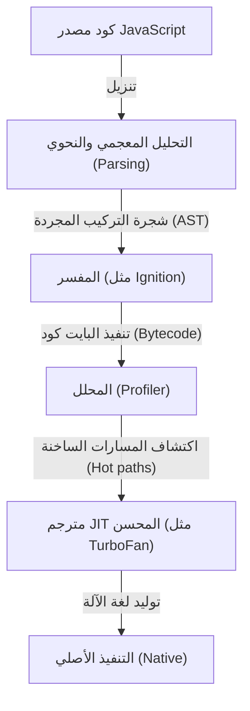
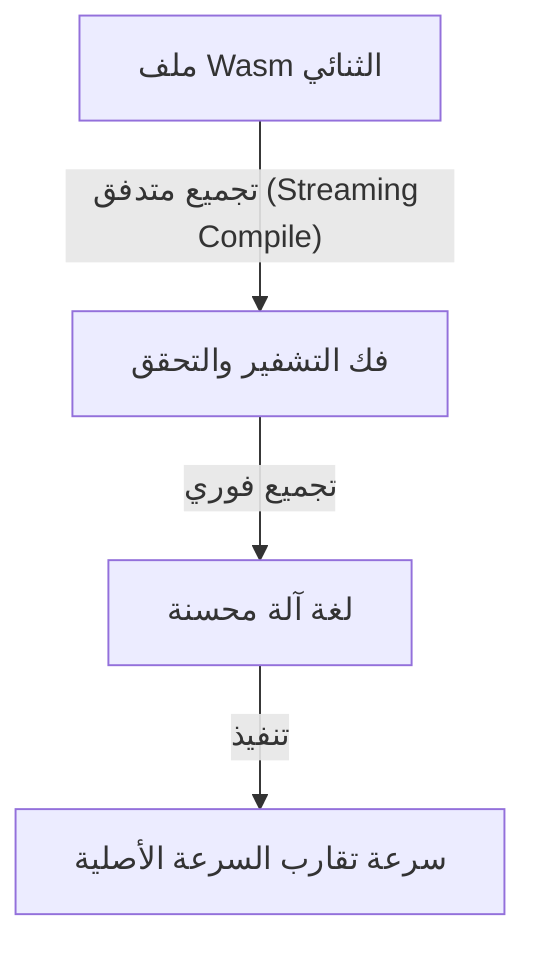
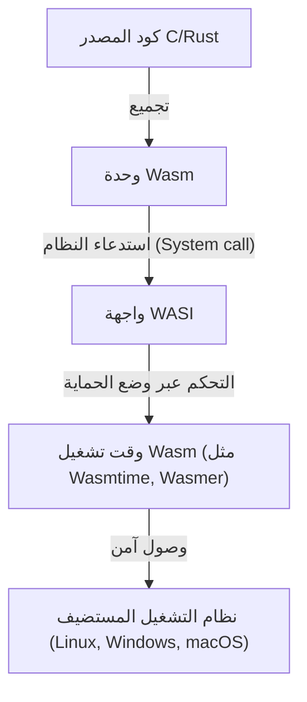

منذ ظهور متصفحات الويب، كانت لغة JavaScript هي المهيمنة على برمجة المتصفحات لفترة طويلة. ولكن مع زيادة تعقيد تطبيقات الويب وتطلبها لأداء يضاهي تطبيقات سطح المكتب، بدأت تظهر حدود لا يمكن لـ JavaScript وحدها تخطيها. من هنا ظهرت WebAssembly (Wasm) لكسر هذا الحاجز.

في هذا المقال، سنتعمق في استكشاف الصورة الكاملة لـ WebAssembly، بدءاً من نموذج تنفيذ JavaScript وحدوده، وتطور asm.js إلى WebAssembly، بالإضافة إلى البنية التقنية لـ Wasm (التنسيق الثنائي وآلة المكدس - Stack Machine)، وعملية التجميع من لغات C/C++/Rust، وصولاً إلى توسعها خارج المتصفح بفضل WASI.

## 1. نموذج تنفيذ JavaScript وحدود تجميع JIT

لكي نفهم القيمة الحقيقية لـ WebAssembly، يجب علينا أولاً أن نعرف كيف يتم تنفيذ JavaScript في المتصفح والقيود التي تعاني منها.

### 1.1 تكلفة التحليل (Parsing) والتجميع (Compiling)

تعتبر JavaScript لغة نصية ذات كتابة ديناميكية. عندما يتلقى المتصفح كود JavaScript، فإنه يمر بالخطوات التالية قبل تنفيذه:



العقبة الأولى هي "التحليل" (Parsing). عند تحميل ملفات JavaScript ضخمة، يحتاج المتصفح إلى تحليل النص وبناء شجرة التركيب المجردة (AST). هذه العملية تضع عبئاً كبيراً على وحدة المعالجة المركزية (CPU)، خاصة في الأجهزة المحمولة، مما يشكل عاملاً كبيراً في تأخير وقت التحميل الأولي للصفحة (TTI: Time to Interactive).

### 1.2 معضلة مترجم JIT واستنتاج الأنواع

حققت محركات JavaScript الحديثة (مثل V8، SpiderMonkey، وJavaScriptCore) قفزات هائلة في السرعة من خلال دمج مترجم JIT (Just-In-Time). يقوم مترجم JIT باكتشاف الأجزاء التي يتم استدعاؤها بشكل متكرر (المسارات الساخنة) أثناء تنفيذ الكود، ويستنتج أنواعها، ثم يولد لغة آلة محسنة لها.

ومع ذلك، بما أن JavaScript لغة ذات كتابة ديناميكية، فإن أنواع المتغيرات يمكن أن تتغير أثناء وقت التنفيذ (Runtime). يقوم مترجم JIT بإجراء تحسينات بناءً على افتراضات (مثل: "هذا المتغير سيكون دائماً رقماً").

### 1.3 إلغاء التحسين المخيف (Deoptimization)

إذا انهارت هذه الافتراضات أثناء التنفيذ (على سبيل المثال: تمرير سلسلة نصية فجأة إلى دالة كانت تتلقى أرقاماً في السابق)، يضطر مترجم JIT إلى التخلص من لغة الآلة المحسنة والعودة إلى تنفيذ المفسر البطيء. يُعرف هذا باسم "إلغاء التحسين" (Deoptimization) أو "Bailout".

عندما يحدث إلغاء التحسين، ينخفض الأداء بشكل حاد. في التطبيقات التي تتطلب حسابات معقدة (مثل ألعاب 3D، تحرير الفيديو، وحسابات الفيزياء)، يعتبر هذا التذبذب غير المتوقع في الأداء أمراً قاتلاً. وهذا ما أجبر المطورين على كتابة أكواد "صديقة لـ JIT"، مما أدى إلى وضع معاكس حيث أصبح المطورون يهتمون بالتحسينات الخاصة بالمحرك أكثر من الكود نفسه.

## 2. ولادة asm.js: التعطش للكتابة الثابتة (Static Typing)

في عام 2013، أعلن مطورو Mozilla الذين شعروا بحدود أداء JavaScript عن مجموعة فرعية تُدعى "asm.js".

### 2.1 نهج asm.js

لا تعتبر asm.js لغة جديدة، بل هي مجموعة فرعية صارمة من JavaScript. من خلال استخدام أنماط تشفير معينة (مثل التعليقات التوضيحية للأنواع باستخدام العمليات على مستوى البت - Bitwise)، يمكنها تحديد أنواع المتغيرات بشكل ثابت.

على سبيل المثال، بكتابة الكود التالي، يتم إخبار المحرك بأن `x` و `y` عبارة عن أعداد صحيحة بحجم 32 بت:

```javascript
function add(x, y) {
    x = x | 0; // توضيح أنه عدد صحيح 32-بت
    y = y | 0;
    return (x + y) | 0;
}
```

### 2.2 إنجازات وحدود asm.js

عندما تكتشف المتصفحات التي تدعم asm.js هذا النمط المعين، يمكنها توليد كود أصلي (Native code) مباشرة دون التعرض لخطر إلغاء التحسين (بشكل مشابه للتجميع المسبق AOT). بفضل هذا، تم تحقيق إنجازات كبيرة مثل تشغيل ألعاب 3D في المتصفح عن طريق تحويل أكواد C/C++ إلى asm.js عبر Emscripten.

ومع ذلك، واجهت asm.js المشاكل التالية:
- **تضخم حجم الملف**: بسبب الإسهاب النصي الناتج عن التعليقات التوضيحية للأنواع.
- **تكلفة التحليل**: لا يزال يتطلب تحليل ملفات نصية ضخمة.
- **حدود التعبير**: نظراً لارتباطها بقواعد JavaScript النحوية، كان من الصعب دعم الميزات المتقدمة مثل الأعداد الصحيحة بحجم 64 بت.

لحل هذه القيود من جذورها، اجتمعت شركات تطوير المتصفحات لتصميم "WebAssembly".

## 3. بنية WebAssembly (Wasm)

إن WebAssembly (Wasm) هو تنسيق ثنائي (Binary Format) مدمج يمكن تنفيذه في المتصفح بسرعات تقارب الكود الأصلي. في عام 2019، أصبح معياراً في W3C، ليثبت مكانته كـ "لغة الويب الرابعة" بعد HTML وCSS وJavaScript.

### 3.1 تسريع الأداء من خلال التنسيق الثنائي

أهم ما يميز Wasm هو أنه يعتمد على "تنسيق ثنائي" (.wasm) بدلاً من النص.



يبدأ المتصفح في فك التشفير والتجميع بشكل متدفق بمجرد بدء تنزيل ملف Wasm من الشبكة. نظراً لأنه لا يتطلب عملية التحليل الثقيلة لبناء AST، فإن وقت البدء يكون أسرع بكثير مقارنة بـ JavaScript.

### 3.2 نموذج آلة المكدس (Stack Machine)

تم تصميم Wasm ليتم تنفيذه على "آلة مكدس" (Stack Machine) افتراضية. على عكس آلات السجلات (Register Machines) مثل x86 وARM، تعتمد آلة المكدس على نموذج بسيط يتم فيه دفع المعاملات (Operands) إلى المكدس (Push)، ثم استخراج القيم منه بواسطة تعليمات التشغيل (Pop) لحسابها، وأخيراً إرجاع النتيجة إلى المكدس (Push).

على سبيل المثال، الحساب `1 + 2` يتم نظرياً كالتالي:

1. `i32.const 1` (دفع 1 إلى المكدس)
2. `i32.const 2` (دفع 2 إلى المكدس)
3. `i32.add` (استخراج القيمتين من المكدس، وجمعهما، ثم دفع النتيجة إلى المكدس)

بفضل هذا النموذج البسيط والمجرد، يمكن تحويل Wasm بسهولة وبسرعة إلى لغة الآلة للأجهزة المادية المختلفة (x86، ARM، MIPS، وغيرها) من خلال (تجميع JIT/AOT).

### 3.3 الذاكرة الخطية (Linear Memory)

تحتوي وحدات Wasm على مساحة ذاكرة مستمرة خاصة بها (الذاكرة الخطية)، وهي منفصلة عن نظام جمع القمامة (Garbage Collection) في JavaScript. تبدو هذه الذاكرة من جانب JavaScript كمجرد `ArrayBuffer`.

اللغات مثل C/C++ وRust تقوم بإدارة الذاكرة يدوياً عبر التحكم في المؤشرات (Pointers) داخل هذه الذاكرة الخطية. يمنع هذا انخفاض معدل الإطارات (Frame drops) الناتج عن أوقات التوقف (Pause times) في أنظمة جمع القمامة (GC)، مما يجعلها مثالية للتطبيقات التي تتطلب العمل في الوقت الفعلي (Real-time).

### 3.4 الأمان القوي ووضع الحماية (Sandbox)

تم وضع الأمان كأولوية قصوى في تصميم WebAssembly منذ البداية. يتم تنفيذ وحدات Wasm داخل بيئة حماية قوية في المتصفح. يتم فحص الحدود بدقة عند الوصول إلى الذاكرة الخطية لمنع هجمات تجاوز سعة التخزين المؤقت (Buffer Overflow). علاوة على ذلك، لا تملك Wasm وحدها صلاحية الوصول المباشر إلى DOM أو الشبكة أو نظام الملفات، بل تعتمد على استدعاء وظائف توفرها JavaScript (أو بيئة الاستضافة) من خلال استيرادها.

## 4. نظام التجميع البيئي من اللغات الأخرى إلى Wasm

لم يُصمم WebAssembly لكي يقوم المطورون بكتابة تمثيله النصي (WAT) يدوياً. بل يعمل كهدف للترجمة من لغات مثل C/C++، Rust، وGo.

### 4.1 Emscripten و C/C++

يُعتبر Emscripten سلسلة أدوات تجميع (Compiler Toolchain) لـ Wasm مبنية على LLVM. تم تطويره في الأصل لـ asm.js، لكنه أصبح المعيار الفعلي لتوليد Wasm اليوم.

نقطة قوة Emscripten تكمن في قدرته على توليد أكواد غراء (Glue code) من JavaScript تلقائياً لمحاكاة مكتبة C القياسية (libc)، ونظام الملفات (نظام ملفات افتراضي يستخدم IndexedDB في المتصفح)، وOpenGL (التحويل إلى WebGL). بفضل هذا، يمكن نقل قواعد أكواد C/C++ الضخمة الحالية (مثل محركات الألعاب ومكتبات معالجة الصور) إلى الويب بسهولة نسبية.

### 4.2 Rust: لغة من الدرجة الأولى في عصر Wasm

تُعد Rust لغة برمجة أنظمة حديثة تجمع بين أمان الذاكرة عبر نموذج الملكية (Ownership) وسرعة التنفيذ العالية، وتُعرف بتوافقها الاستثنائي مع WebAssembly.

تدعم سلسلة أدوات Rust هدف Wasm (`wasm32-unknown-unknown`) بشكل افتراضي، وبفضل المكتبة القوية `wasm-bindgen`، يمكن تحقيق واجهة اتصال سلسة مع JavaScript (للتحكم في DOM وتبادل الفئات). بما أن Rust لا تحتوي على جامع قمامة (Garbage Collection)، يمكنها تقليل حجم ملفات Wasm بشكل كبير. لذلك، فإن نهج "كتابة العمليات الثقيلة فقط باستخدام Rust/Wasm" يزداد شيوعاً بشكل سريع في تطوير واجهات الويب الأمامية.

### 4.3 لغات جمع القمامة (Go, C#, Kotlin)

في السنوات الأخيرة، كان هناك تحرك لدمج مقترح "Wasm GC" (جمع القمامة) ضمن معايير Wasm. في السابق، عند تجميع لغات مثل Go أو C# (Blazor) إلى Wasm، كان يجب إرفاق جامع قمامة ضخم خاص باللغة داخل الوحدة، مما أدى إلى تضخم حجم الملف الثنائي.

مع تطبيق Wasm GC محلياً في المتصفحات، أصبح من الممكن استخدام جامع القمامة عالي الأداء الخاص بالمستضيف (مثل محرك V8 في JavaScript) بشكل مباشر. وقد أدى ذلك إلى تطور هائل في دعم WebAssembly للغات التي تستخدم إدارة الذاكرة الديناميكية مثل Java، Kotlin، وDart (Flutter).

## 5. واجهة نظام WebAssembly (WASI): خارج المتصفح

تقنية WebAssembly لا تقتصر على المتصفح فقط. فهي تسعى لتحقيق حلم Java "اكتب مرة واحدة، وشغل في أي مكان" ولكن بطريقة أخف وأكثر أماناً. المحرك الرئيسي لهذا التوسع هو **WASI (WebAssembly System Interface)**.

### 5.1 ما هو WASI؟

كما ذُكر سابقاً، لا تستطيع Wasm الوصول إلى ميزات نظام التشغيل (مثل إدخال/إخراج الملفات، الشبكة، وساعة النظام) افتراضياً. داخل المتصفح، تلعب JavaScript دور الجسر لهذا الغرض. ولكن عند تشغيل Wasm في بيئات الخوادم خارج المتصفح، أصبحت هناك حاجة إلى واجهة مشتركة.

WASI هو واجهة نظام قياسية لـ WebAssembly. يوفر واجهة برمجة تطبيقات (API) شبيهة بـ POSIX، مما يسمح لوحدات Wasm بالوصول الآمن إلى موارد نظام التشغيل.



### 5.2 بيئة تنفيذ خفيفة الوزن كبديل للحاويات (Containers)

مع ظهور WASI، يتجه اهتمام العالم نحو WebAssembly كـ "حاويات نانوية" (Nano-containers) بديلة لحاويات Docker. تتمتع Wasm بالمزايا التالية مقارنة بـ Docker:

1. **سرعة بدء تشغيل هائلة**: تعمل أوقات تشغيل Wasm في غضون أجزاء من الألف إلى المليون من الثانية. هذا أسرع بمئات المرات من الحاويات.
2. **استقلالية عن المنصات**: ملفات Wasm الثنائية تعمل بنفس الطريقة على أنظمة ARM و x86، وعلى Linux و Windows.
3. **أمان قوي**: معزولة تماماً بشكل افتراضي، ولا يمكنها الوصول إلا إلى المجلدات أو المنافذ المسموح بها صراحةً من خلال WASI.

### 5.3 التطبيق في حوسبة الحافة (Edge Computing)

تتجلى فائدة هذه الخصائص بشكل أوضح في خوادم الحافة التابعة لـ CDN ووظائف بدون خوادم (Serverless Functions). تعتمد تقنيات مثل Compute@Edge من Fastly و Cloudflare Workers داخلياً على V8 Isolate أو أوقات تشغيل مخصصة لـ Wasm، مما يوفر قدرة على التوسع والتنفيذ في غضون أجزاء من الألف من الثانية عبر خوادم الحافة حول العالم.

## 6. الخلاصة والتطلعات المستقبلية

إن WebAssembly لم يأتِ ليستبدل JavaScript. فـ JavaScript تمتلك مرونة لا تضاهى ونظاماً بيئياً هائلاً للتحكم في واجهة المستخدم (UI) وتعديل DOM. إنما Wasm هو الشريك المثالي لتعويض نقاط ضعف JavaScript، مثل "العمليات الحسابية الثقيلة"، "الاستفادة من الأكواد القديمة المكتوبة بـ C/C++/Rust"، و"ضمان الأداء الصارم".

تتوسع استخدامات Wasm يوماً بعد يوم، لتشمل مجالات مثل تشفير الفيديو والصوت، وبرامج CAD، وتصور البيانات المعقدة (Data Visualization)، وعمليات التشفير (Cryptography)، وحتى الاستدلال بالذكاء الاصطناعي داخل المتصفح (مثل نهاية Wasm الخلفية لـ TensorFlow.js).

بالإضافة إلى ذلك، فإن التطور الهائل في مجالات الحوسبة السحابية الأصلية وحوسبة الحافة بفضل WASI، يُحدث ثورة في بنية الأنظمة الخلفية (Backend). إن WebAssembly، الذي وُلد لكسر حدود المتصفحات، قد تجاوز الآن إطار الويب، وبدأ يشق طريقه ليكون "التنسيق الثنائي العالمي" لتنفيذ الأكواد بأمان وسرعة في كل مكان.
