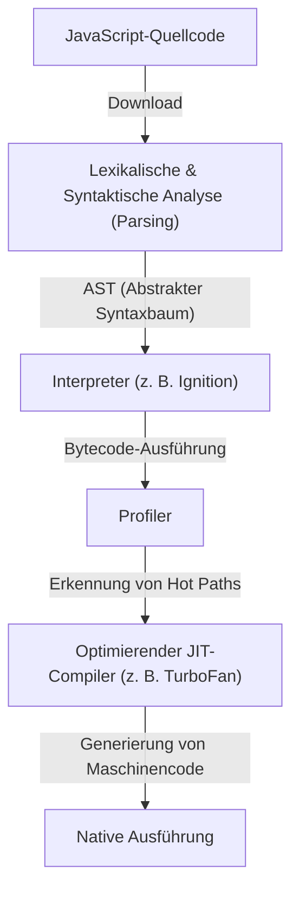
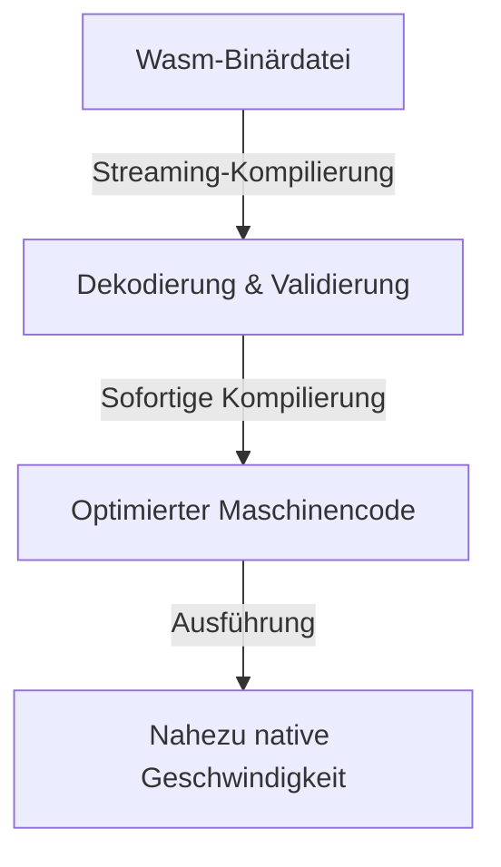
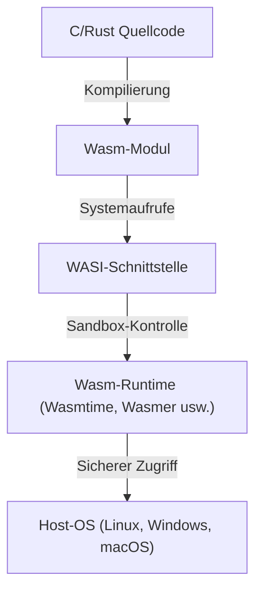

Seit der Entstehung des Webbrowsers war JavaScript lange Zeit unangefochten die einzige Programmiersprache, die im Browser lief. Da Webanwendungen jedoch immer komplexer wurden und eine Leistung forderten, die mit Desktop-Anwendungen vergleichbar ist, stieß JavaScript allein an seine Grenzen. Um diese Barriere zu durchbrechen, wurde WebAssembly (Wasm) eingeführt.

In diesem Artikel werden wir tief in das Gesamtbild von WebAssembly eintauchen und das Ausführungsmodell von JavaScript und seine Grenzen, die Entwicklung von asm.js zu WebAssembly, die technische Architektur von Wasm (Binärformat und Stack-Maschine), den Kompilierungsprozess von C/C++/Rust sowie die Expansion über den Browser hinaus mittels WASI im Detail erläutern.

## 1. Das JavaScript-Ausführungsmodell und die Grenzen der JIT-Kompilierung

Um den wahren Wert von WebAssembly zu verstehen, müssen wir zunächst wissen, wie JavaScript im Browser ausgeführt wird und welche Grenzen es hat.

### 1.1 Parsing- und Kompilierungskosten

JavaScript ist eine textbasierte, dynamisch typisierte Sprache. Wenn der Browser JavaScript-Code empfängt, wird dieser in den folgenden Schritten ausgeführt:



Die erste Hürde ist das "Parsing". Beim Laden riesiger JavaScript-Dateien muss der Browser den Text parsen und einen abstrakten Syntaxbaum (AST) aufbauen. Dieser Prozess belastet die CPU stark und ist insbesondere auf mobilen Geräten ein Hauptgrund für die Verzögerung der initialen Ladezeit der Seite (TTI: Time to Interactive).

### 1.2 Das Dilemma von JIT-Compilern und Typinferenz

Moderne JavaScript-Engines (V8, SpiderMonkey, JavaScriptCore usw.) haben durch die Integration von JIT-Compilern (Just-In-Time) dramatische Geschwindigkeitssteigerungen erzielt. Der JIT-Compiler erkennt während der Codeausführung häufig aufgerufene Teile (Hot Paths), leitet deren Typen ab und generiert optimierten Maschinencode.

Da JavaScript jedoch eine dynamisch typisierte Sprache ist, kann sich der Typ einer Variablen zur Laufzeit ändern. Der JIT-Compiler optimiert basierend auf der Annahme, dass "diese Variable immer eine Zahl ist".

### 1.3 Die gefürchtete Deoptimierung

Wenn diese Annahme während der Ausführung nicht mehr zutrifft (z. B. wenn plötzlich ein String an eine Funktion übergeben wird, die zuvor nur Zahlen erhielt), muss der JIT-Compiler den optimierten Maschinencode verwerfen und zur langsameren Interpreter-Ausführung zurückkehren. Dies wird als "Deoptimization" (Deoptimierung) oder "Bailout" bezeichnet.

Wenn eine Deoptimierung auftritt, sinkt die Leistung rapide ab. In Anwendungen, die komplexe Berechnungen durchführen (3D-Spiele, Videobearbeitung, Physiksimulationen usw.), sind diese unvorhersehbaren Leistungsschwankungen fatal. Entwickler waren gezwungen, ständig "JIT-freundlichen" Code zu schreiben, was zu der paradoxen Situation führte, engine-spezifische Optimierungen berücksichtigen zu müssen.

## 2. Die Geburt von asm.js: Die Sehnsucht nach statischer Typisierung

Entwickler bei Mozilla, die die Leistungsgrenzen von JavaScript spürten, veröffentlichten 2013 eine Teilmenge namens "asm.js".

### 2.1 Der asm.js-Ansatz

asm.js ist keine neue Sprache, sondern eine strikte Teilmenge von JavaScript. Durch die Verwendung spezifischer Codierungsmuster (Typannotationen mithilfe von bitweisen Operationen) werden die Typen der Variablen statisch festgelegt.

Indem man beispielsweise wie folgt schreibt, teilt man der Engine mit, dass `x` und `y` 32-Bit-Ganzzahlen sind:

```javascript
function add(x, y) {
    x = x | 0; // Deklariert explizit als 32-Bit-Ganzzahl
    y = y | 0;
    return (x + y) | 0;
}
```

### 2.2 Erfolge und Grenzen von asm.js

asm.js-kompatible Browser konnten, wenn sie dieses spezifische Muster erkannten, nativen Code direkt (ähnlich der Ahead-Of-Time-Kompilierung) generieren, ohne das Risiko einer Deoptimierung. Dies ermöglichte beeindruckende Leistungen, wie etwa die Ausführung von 3D-Spielen im Browser, indem C/C++-Code über Emscripten in asm.js konvertiert wurde.

Jedoch hatte asm.js folgende Probleme:
- **Aufblähung der Dateigröße**: Textredundanz durch Typannotationen.
- **Parsing-Kosten**: Nach wie vor war das Parsen riesiger Textdateien erforderlich.
- **Eingeschränkte Ausdruckskraft**: An die JavaScript-Syntax gebunden, war die Unterstützung für erweiterte Funktionen wie 64-Bit-Ganzzahlen schwierig.

Um diese Einschränkungen grundlegend zu lösen, schlossen sich Browser-Anbieter zusammen und entwarfen "WebAssembly".

## 3. Die Architektur von WebAssembly (Wasm)

WebAssembly (Wasm) ist ein kompaktes Binärformat, das im Browser mit nahezu nativer Geschwindigkeit ausgeführt werden kann. Im Jahr 2019 wurde es zu einem W3C-Standard und etablierte sich neben HTML, CSS und JavaScript als die "vierte Sprache des Webs".

### 3.1 Beschleunigung durch Binärformat

Das wichtigste Merkmal von Wasm ist, dass es kein Text, sondern ein "Binärformat (.wasm)" ist.



Sobald der Browser beginnt, die Wasm-Binärdatei aus dem Netzwerk herunterzuladen, startet er sofort mit dem Streaming-Dekodieren und Kompilieren. Da der schwere Parsing-Prozess zum Aufbau des AST entfällt, ist die Startzeit im Vergleich zu JavaScript drastisch schneller.

### 3.2 Stack-Maschinen-Modell

Wasm ist so konzipiert, dass es auf einer virtuellen "Stack-Maschine" ausgeführt wird. Im Gegensatz zu Registermaschinen (wie x86 oder ARM) ist eine Stack-Maschine ein einfaches Modell, bei dem Operanden auf einen Stack geschoben werden (Push), Rechenbefehle die Werte vom Stack nehmen, berechnen und das Ergebnis wieder auf den Stack legen (Pop/Push).

Die Berechnung von `1 + 2` sieht konzeptionell beispielsweise so aus:

1. `i32.const 1` (Schiebt 1 auf den Stack)
2. `i32.const 2` (Schiebt 2 auf den Stack)
3. `i32.add` (Nimmt zwei Werte vom Stack, addiert sie und schiebt das Ergebnis auf den Stack)

Dieses einfache und abstrahierte Modell ermöglicht es Wasm, einfach und schnell in den Maschinencode verschiedener physischer Hardware wie x86, ARM und MIPS konvertiert zu werden (JIT/AOT-Kompilierung).

### 3.3 Linearer Speicher (Linear Memory)

Wasm-Module verfügen über einen eigenen kontinuierlichen Speicherbereich (linearen Speicher), der von der JavaScript-Garbage-Collection (GC) getrennt ist. Dieser wird auf der JavaScript-Seite lediglich als `ArrayBuffer` betrachtet.

Sprachen wie C/C++ oder Rust nutzen Pointer in diesem linearen Speicher zur manuellen Speicherverwaltung. Dies verhindert Frame-Drops, die durch Pausenzeiten der GC verursacht werden, und eignet sich ideal für Anwendungen, die Echtzeitleistung erfordern.

### 3.4 Starke Sicherheit und Sandbox

Sicherheit stand bei WebAssembly von Anfang an im Mittelpunkt. Wasm-Module werden in einer stark isolierten Sandbox-Umgebung des Browsers ausgeführt.
Der Zugriff auf den linearen Speicher unterliegt strengen Grenzkontrollen, um Buffer-Overflow-Angriffe zu verhindern. Darüber hinaus hat Wasm allein keine direkte Berechtigung für den Zugriff auf das DOM (Document Object Model), das Netzwerk oder das Dateisystem. Alle erforderlichen Operationen werden durchgeführt, indem vom JavaScript (oder der Host-Umgebung) bereitgestellte Funktionen importiert und aufgerufen werden.

## 4. Das Kompilierungs-Ökosystem von anderen Sprachen zu Wasm

WebAssembly ist nicht dafür gedacht, dass Entwickler die Wasm-Textdarstellung (WAT) direkt von Hand schreiben. Es fungiert als Kompilierungsziel für Sprachen wie C/C++, Rust und Go.

### 4.1 Emscripten und C/C++

Emscripten ist eine LLVM-basierte Wasm-Compiler-Toolchain. Ursprünglich für asm.js entwickelt, ist es heute der De-facto-Standard für die Wasm-Generierung.

Die Stärke von Emscripten liegt darin, dass es automatisch JavaScript-Glue-Code generiert, der die Standard-C-Bibliothek (libc), das Dateisystem (ein virtuelles Dateisystem, das die IndexedDB des Browsers nutzt), OpenGL (Konvertierung zu WebGL) und mehr emuliert. Dies macht es relativ einfach, große bestehende C/C++-Codebasen (wie Spiel-Engines und Bildverarbeitungsbibliotheken) ins Web zu portieren.

### 4.2 Rust: Eine First-Class-Sprache im Wasm-Zeitalter

Rust ist eine moderne Systemprogrammiersprache, die die Speichersicherheit durch ihr Ownership-Modell mit hoher Ausführungsgeschwindigkeit kombiniert und für ihre hervorragende Kompatibilität mit WebAssembly bekannt ist.

Die Rust-Toolchain unterstützt standardmäßig das Wasm-Ziel (`wasm32-unknown-unknown`), und durch die Verwendung der leistungsstarken Bibliothek `wasm-bindgen` lassen sich Schnittstellen zu JavaScript (DOM-Manipulation und Interaktion mit JavaScript-Klassen) nahtlos gestalten. Da Rust keine Garbage-Collection besitzt, kann die Größe der generierten Wasm-Binärdatei extrem klein gehalten werden. Dieser Ansatz, "nur rechenintensive Aufgaben in Rust/Wasm zu schreiben", wird in der Web-Frontend-Entwicklung immer beliebter.

### 4.3 Garbage-Collected Sprachen (Go, C#, Kotlin)

In den letzten Jahren wurden Bemühungen vorangetrieben, "Wasm GC (Garbage Collection)" in den Wasm-Standard aufzunehmen. Zuvor erforderte das Kompilieren von Go oder C# (Blazor) zu Wasm die Bündelung eines großen sprachspezifischen Garbage-Collectors in das Modul, was zu aufgeblähten Binärgrößen führte.

Da Wasm GC nun nativ im Browser implementiert wird, können Sprachen direkt auf den leistungsstarken Garbage-Collector des Hosts (wie die V8 JavaScript-Engine) zugreifen. Dies beschleunigt die WebAssembly-Unterstützung für Sprachen mit dynamischer Speicherverwaltung wie Java, Kotlin und Dart (Flutter) enorm.

## 5. WebAssembly System Interface (WASI): Über den Browser hinaus

WebAssembly ist keine Technologie, die nur auf den Browser beschränkt ist. Es zielt darauf ab, den Traum von "Write Once, Run Anywhere", der einst von Java formuliert wurde, in einer leichteren und sichereren Form zu verwirklichen. Dies wird durch das **WASI (WebAssembly System Interface)** vorangetrieben.

### 5.1 Was ist WASI?

Wie bereits erwähnt, hat Wasm standardmäßig keinen Zugriff auf Betriebssystemfunktionen (Datei-I/O, Netzwerk, Systemuhr usw.). Innerhalb des Browsers überbrückt JavaScript dies, aber um Wasm in einer Serverumgebung außerhalb des Browsers auszuführen, ist eine gemeinsame Schnittstelle erforderlich.

WASI ist eine standardisierte Systemschnittstelle für WebAssembly. Es stellt eine POSIX-ähnliche API bereit, die es Wasm-Modulen ermöglicht, sicher auf Betriebssystemressourcen zuzugreifen.



### 5.2 Eine leichtgewichtige Ausführungsumgebung der nächsten Generation als Alternative zu Containern

Mit dem Aufkommen von WASI blickt die Welt auf WebAssembly als "Nano-Container", der Docker-Container ersetzen könnte. Wasm bietet gegenüber Docker-Containern folgende Vorteile:

1. **Überragende Startgeschwindigkeit**: Wasm-Runtimes starten in Millisekunden bis Mikrosekunden. Das ist hundertmal schneller als bei Containern.
2. **Plattformunabhängigkeit**: Dieselbe Wasm-Binärdatei läuft auf ARM oder x86, Linux oder Windows.
3. **Starke Sicherheit**: Standardmäßig vollständig isoliert, kann es nur auf Verzeichnisse und Ports zugreifen, die über WASI explizit erlaubt wurden.

### 5.3 Einsatz im Edge-Computing

Diese Eigenschaften kommen am besten im Bereich von CDN-Edge-Workern und Serverless Functions (FaaS) zur Geltung. Dienste wie Compute@Edge von Fastly und Cloudflare Workers nutzen intern V8 Isolates oder dedizierte Wasm-Runtimes, um Skalierung und Ausführung auf Edge-Servern weltweit in Millisekunden zu erreichen.

## 6. Zusammenfassung und Zukunftsausblick

WebAssembly soll JavaScript nicht ersetzen. JavaScript verfügt über eine beispiellose Flexibilität und ein Ökosystem für die UI-Steuerung und DOM-Manipulation. Wasm ist der perfekte Partner, um Bereiche zu ergänzen, in denen JavaScript schwächelt: "rechenintensive Aufgaben", "Nutzung vorhandener C/C++/Rust-Ressourcen" und "strikte Leistungsgarantien".

Von Video- und Audio-Encodern über CAD-Software, erweiterte Datenvisualisierung, kryptografische Verarbeitung bis hin zu KI-Inferenz im Browser (wie das Wasm-Backend von TensorFlow.js) erweitern sich die Anwendungsfälle für Wasm täglich.

Darüber hinaus revolutionieren die Fortschritte im Bereich Cloud-Native und Edge-Computing durch WASI die Backend-Architektur. Entstanden, um die Grenzen des Browsers zu durchbrechen, ist WebAssembly nun auf dem Weg, ein "universelles Binärformat" für die sichere und schnelle Codeausführung an jedem beliebigen Ort zu werden, weit über die Grenzen des Webs hinaus.
