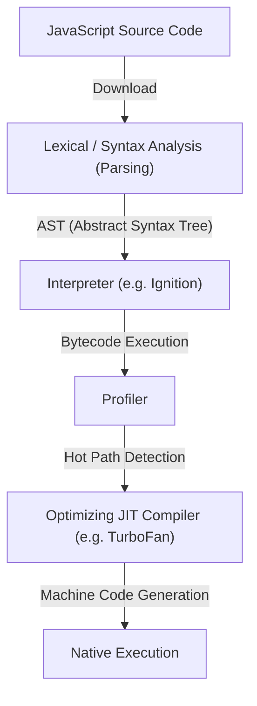
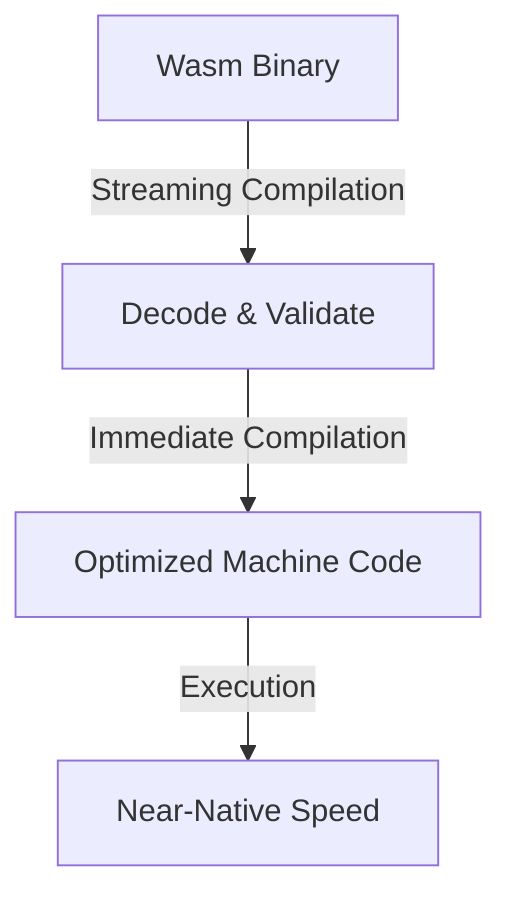
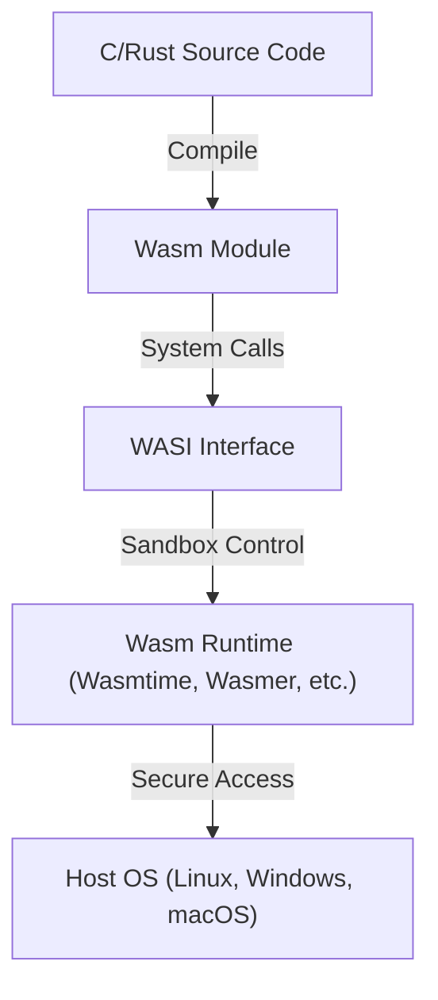

Ever since the birth of the web browser, JavaScript has long held a monopoly as the programming language running on browsers. However, as web applications have become more complex and require performance comparable to desktop applications, the limitations of JavaScript alone have become apparent. WebAssembly (Wasm) emerged to break through that wall.

In this article, we will delve deep into the entire picture of WebAssembly, explaining JavaScript's execution model and its limits, the evolution from asm.js to WebAssembly, the technical architecture of Wasm (binary format and stack machine), the compilation process from C/C++/Rust, and its expansion outside the browser through WASI.

## 1. JavaScript's Execution Model and the Limits of JIT Compilation

To understand the true value of WebAssembly, we first need to know how JavaScript is executed on the browser and the limitations it faces.

### 1.1 The Cost of Parsing and Compilation

JavaScript is a text-based, dynamically typed language. When a browser receives JavaScript code, it is executed through the following steps.



The first hurdle is "Parsing". When loading a huge JavaScript file, the browser must parse the text to build an Abstract Syntax Tree (AST). This process places a heavy load on the CPU, and especially on mobile devices, it is a major factor delaying the page's initial load time (TTI: Time to Interactive).

### 1.2 The Dilemma of JIT Compilers and Type Inference

Modern JavaScript engines (V8, SpiderMonkey, JavaScriptCore, etc.) have achieved dramatic speed improvements by adopting JIT (Just-In-Time) compilers. A JIT compiler detects frequently called parts (hot paths) during code execution, infers the types for those parts, and generates optimized machine code.

However, since JavaScript is a dynamically typed language, variable types can change at runtime. The JIT compiler performs optimizations based on the assumption that "this variable is always a number."

### 1.3 The Dreaded Deoptimization

If this assumption breaks down during execution (e.g., passing a string suddenly to a function that had only received numbers before), the JIT compiler must discard the optimized machine code and revert to slow interpreter execution. This is called "Deoptimization" or "Bailout."

When Deoptimization occurs, performance drops sharply. In applications that perform complex calculations (3D games, video editing, physics simulations, etc.), this unpredictable performance fluctuation is fatal. Developers were forced to write "JIT-friendly" code, leading to the backward situation of having to constantly be aware of engine-specific optimizations.

## 2. The Birth of asm.js: The Thirst for Static Typing

Feeling the performance limits of JavaScript, Mozilla developers announced a subset called "asm.js" in 2013.

### 2.1 The asm.js Approach

asm.js is not a new language, but a strict subset of JavaScript. By using specific coding patterns (type annotations using bitwise operations), it statically determines the types of variables.

For example, writing the following tells the engine that `x` and `y` are 32-bit integers.

```javascript
function add(x, y) {
    x = x | 0; // Explicitly indicates a 32-bit integer
    y = y | 0;
    return (x + y) | 0;
}
```

### 2.2 Achievements and Limitations of asm.js

Browsers supporting asm.js could directly generate native code with no risk of Deoptimization (in a way similar to Ahead-Of-Time compilation) when they detected these specific patterns. This led to great achievements, such as converting C/C++ code to asm.js via Emscripten and running 3D games in the browser.

However, asm.js had the following problems:
- **File size bloat**: Text redundancy due to type annotations.
- **Parsing cost**: Still required parsing huge text files.
- **Limited expressiveness**: Bound by JavaScript syntax, making it difficult to support advanced features like 64-bit integers.

To fundamentally solve these limitations, browser vendors united to design "WebAssembly".

## 3. WebAssembly (Wasm) Architecture

WebAssembly (Wasm) is a compact binary format that can run at near-native speeds in the browser. It became a W3C standard in 2019, establishing its position as the "fourth language of the Web," following HTML, CSS, and JavaScript.

### 3.1 Speeding Up with a Binary Format

The most prominent feature of Wasm is that it is a "binary format (.wasm)" rather than text.



The browser starts decoding and compiling via streaming as soon as it begins downloading the Wasm binary from the network. Since the heavy parsing process of AST construction is unnecessary, the startup time is overwhelmingly faster than JavaScript.

### 3.2 Stack Machine Model

Wasm is designed to run on a virtual "stack machine." Unlike a register machine (such as x86 or ARM), a stack machine operates on a simple model: operands are pushed onto a stack (Push), operations pop values from the stack to compute, and the result is pushed back onto the stack (Pop/Push).

For example, conceptually computing `1 + 2` looks like this:

1. `i32.const 1` (Push 1 onto the stack)
2. `i32.const 2` (Push 2 onto the stack)
3. `i32.add` (Pop 2 values from the stack, add them, and push the result)

Because of this simple, abstracted model, Wasm can be easily and quickly compiled (JIT/AOT compiled) into machine code for various physical hardware, such as x86, ARM, and MIPS.

### 3.3 Linear Memory

Wasm modules have their own continuous memory region (linear memory) separated from JavaScript's Garbage Collection (GC). This is seen from the JavaScript side simply as an `ArrayBuffer`.

Languages like C/C++ and Rust manually manage memory by manipulating pointers on this linear memory. This prevents dropped frames caused by GC pause times, making it ideal for applications demanding real-time performance.

### 3.4 Robust Security and Sandboxing

Security has been a top priority for WebAssembly since its initial design. Wasm modules execute within the browser's powerful sandbox environment.
Access to linear memory undergoes strict boundary checks to prevent buffer overflow attacks and the like. Furthermore, Wasm itself does not have direct access to the DOM (Document Object Model), network, or file system; all necessary processing is done by importing and calling functions provided by JavaScript (or the host environment).

## 4. Compilation Ecosystem from Other Languages to Wasm

WebAssembly does not expect developers to handwrite its text representation (WAT) directly. It functions as a target to be compiled from languages like C/C++, Rust, and Go.

### 4.1 Emscripten and C/C++

Emscripten is an LLVM-based Wasm compiler toolchain. Originally developed for asm.js, it is now the de facto standard for Wasm generation.

The power of Emscripten lies in automatically generating JavaScript glue code that emulates the standard C library (libc), file system (a virtual file system using the browser's IndexedDB), OpenGL (conversion to WebGL), and more. This makes it relatively easy to port massive existing C/C++ codebases (e.g., game engines and image processing libraries) to the Web.

### 4.2 Rust: A First-Class Language in the Wasm Era

Rust is a modern systems programming language that combines memory safety via its ownership model with fast execution speed, and it is known for its excellent compatibility with WebAssembly.

The Rust toolchain natively supports the Wasm target (`wasm32-unknown-unknown`), and using the powerful `wasm-bindgen` library, seamless interfacing with JavaScript (DOM manipulation and interacting with JavaScript classes) is possible. Since Rust does not have garbage collection, the generated Wasm binary size can be kept to an absolute minimum, leading to a surge in the approach of "writing only the heavy processing in Rust/Wasm" in web frontend development.

### 4.3 Garbage-Collected Languages (Go, C#, Kotlin)

Recently, there has been progress in incorporating the "Wasm GC (Garbage Collection)" proposal into the Wasm standard. Until now, compiling Go or C# (Blazor) to Wasm meant bundling a huge language-specific garbage collector within the module, causing the binary size to bloat.

With Wasm GC being natively implemented in browsers, the host's (like V8's) high-performance garbage collector can be used directly. This is sparking an explosive evolution in WebAssembly support for dynamically memory-managed languages such as Java, Kotlin, and Dart (Flutter).

## 5. WebAssembly System Interface (WASI): Outside the Browser

WebAssembly is not a technology destined to remain only within the browser. It aims to realize the dream of "Write Once, Run Anywhere," championed by Java, in a more lightweight and secure form. The driving force behind this is **WASI (WebAssembly System Interface)**.

### 5.1 What is WASI?

As mentioned earlier, Wasm cannot access OS features (file I/O, network, system clock, etc.) by default. Within the browser, JavaScript bridged this gap, but running Wasm in server environments outside the browser requires a common interface.

WASI is a standardized system interface for WebAssembly. It provides a POSIX-like API, enabling Wasm modules to safely access OS resources.



### 5.2 The Next-Generation Lightweight Execution Environment Replacing Containers

With the advent of WASI, the world is turning its attention to WebAssembly as a "nanocontainer" alternative to Docker containers. Wasm has the following advantages over Docker containers:

1. **Overwhelming startup speed**: Wasm runtimes launch in milliseconds to microseconds. This is hundreds of times faster than containers.
2. **Platform independence**: The same Wasm binary runs on ARM or x86, Linux or Windows.
3. **Robust security**: Fully isolated by default, it can only access directories and ports explicitly allowed through WASI.

### 5.3 Utilization in Edge Computing

These characteristics shine brightest in the realm of CDN edge workers and serverless functions (FaaS). Fastly's Compute@Edge and Cloudflare Workers internally use V8 Isolates and dedicated Wasm runtimes to achieve millisecond-level scaling and execution on edge servers worldwide.

## 6. Conclusion and Future Prospects

WebAssembly is not here to replace JavaScript. JavaScript has unparalleled flexibility and an ecosystem for UI control and DOM manipulation. Wasm is the perfect partner to complement the areas where JavaScript struggles, such as "heavy computational processing," "leveraging existing C/C++/Rust assets," and "strict performance guarantees."

From video/audio encoders, CAD software, advanced data visualization, and cryptographic processing, to in-browser AI inference (such as TensorFlow.js's Wasm backend), the use cases for Wasm are expanding every day.

Furthermore, the leap in cloud-native and edge computing through WASI is revolutionizing backend architectures. Born to break the browser's limits, WebAssembly is now stepping beyond the Web to become a "universal binary format" for executing code safely and rapidly everywhere.
