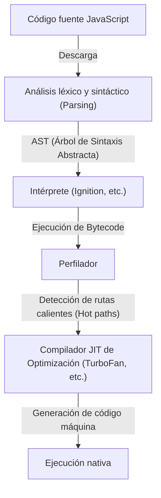
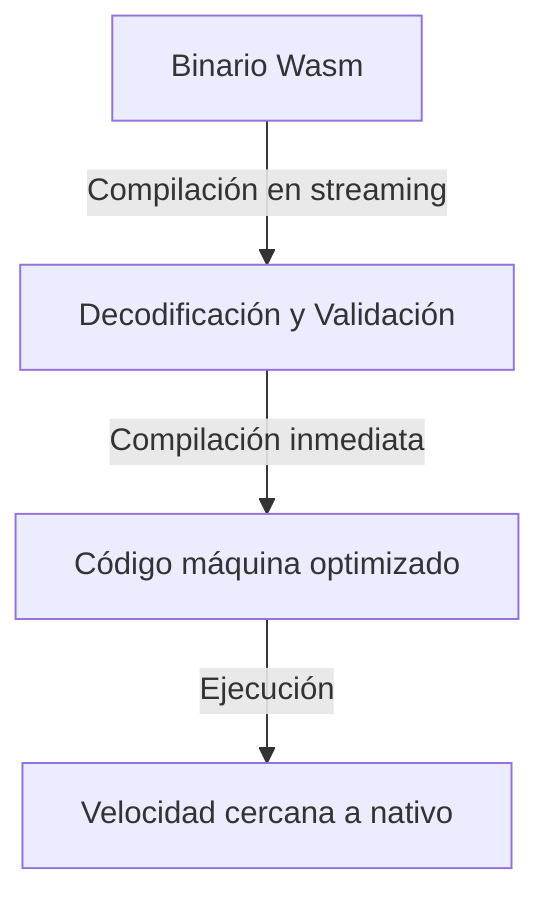
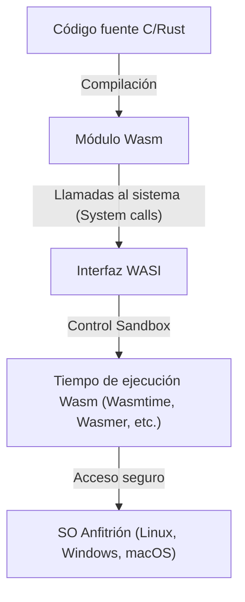

Desde el nacimiento del navegador web, los lenguajes de programación que se ejecutaban en él han sido dominados durante mucho tiempo en exclusiva por JavaScript. Sin embargo, a medida que las aplicaciones web se han vuelto más complejas y exigen un rendimiento comparable al de las aplicaciones de escritorio, se ha hecho evidente un muro que JavaScript no puede superar por sí solo. WebAssembly (Wasm) apareció para romper ese muro.

En este artículo, profundizaremos en el panorama completo de WebAssembly, desde el modelo de ejecución de JavaScript y sus limitaciones, el nacimiento de asm.js y su evolución a WebAssembly, la arquitectura técnica de Wasm (formato binario y máquina de pila), el proceso de compilación desde C/C++/Rust, hasta su expansión fuera del navegador a través de WASI.

## 1. El Modelo de Ejecución de JavaScript y los Límites de la Compilación JIT

Para comprender el verdadero valor de WebAssembly, primero debemos entender cómo se ejecuta JavaScript en el navegador y qué limitaciones tiene.

### 1.1 El Coste del Parseo y la Compilación

JavaScript es un lenguaje de tipado dinámico basado en texto. Cuando el navegador recibe código JavaScript, se ejecuta a través de los siguientes pasos:



El primer obstáculo es el "Análisis (Parsing)". Al cargar archivos JavaScript enormes, el navegador debe analizar el texto y construir un Árbol de Sintaxis Abstracta (AST). Este proceso supone una gran carga para la CPU, y es un factor importante para retrasar el tiempo de carga inicial de la página (TTI: Time to Interactive), especialmente en dispositivos móviles.

### 1.2 El Dilema del Compilador JIT y la Inferencia de Tipos

Los motores de JavaScript modernos (V8, SpiderMonkey, JavaScriptCore, etc.) han logrado mejoras dramáticas de velocidad al incorporar compiladores JIT (Just-In-Time). El compilador JIT detecta las partes que se llaman con frecuencia durante la ejecución del código (rutas calientes), infiere los tipos de esas partes y genera código máquina optimizado.

Sin embargo, dado que JavaScript es un lenguaje de tipado dinámico, los tipos de las variables pueden cambiar en tiempo de ejecución. El compilador JIT realiza la optimización basándose en la suposición (assumption) de que "esta variable es siempre un número".

### 1.3 La Temida Desoptimización (Deoptimization)

Si la suposición se rompe durante la ejecución (por ejemplo, si de repente pasamos una cadena a una función que hasta ahora solo había recibido números), el compilador JIT debe descartar el código máquina optimizado y volver a la ejecución más lenta del intérprete. A esto se le llama "Desoptimización (Deoptimization)" o "Bailout".

Cuando ocurre una desoptimización, el rendimiento cae drásticamente. En aplicaciones que realizan cálculos avanzados (juegos 3D, edición de video, física, etc.), esta fluctuación de rendimiento impredecible es fatal. Los desarrolladores a menudo se ven obligados a escribir código "amigable para el JIT", creando una situación paradójica en la que tienen que ser conscientes de las optimizaciones específicas de un motor en particular.

## 2. El Nacimiento de asm.js: La Sed de Tipado Estático

Sintiendo los límites de rendimiento de JavaScript, los desarrolladores de Mozilla anunciaron un subconjunto llamado "asm.js" en 2013.

### 2.1 El Enfoque de asm.js

asm.js no es un lenguaje nuevo, sino un subconjunto estricto de JavaScript. Al utilizar patrones de codificación específicos (anotaciones de tipo mediante operaciones bit a bit), fija estáticamente los tipos de las variables.

Por ejemplo, escribiendo lo siguiente, le decimos al motor que `x` e `y` son enteros de 32 bits.

```javascript
function add(x, y) {
    x = x | 0; // Se especifica que es un entero de 32 bits
    y = y | 0;
    return (x + y) | 0;
}
```

### 2.2 Logros y Limitaciones de asm.js

Al detectar este patrón específico, los navegadores compatibles con asm.js podían generar código nativo directamente sin el riesgo de desoptimización (en un formato similar a la compilación Ahead-Of-Time). Esto permitió grandes logros, como convertir código C/C++ a asm.js mediante Emscripten y ejecutar juegos 3D en el navegador.

Sin embargo, asm.js tenía los siguientes problemas:
- **Aumento del tamaño del archivo**: Redundancia de texto debido a las anotaciones de tipo.
- **Coste de parseo**: Aún requería el parseo de archivos de texto enormes.
- **Límites de expresividad**: Al estar ligado a la sintaxis de JavaScript, era difícil soportar características avanzadas como los enteros de 64 bits.

Para resolver estas limitaciones de raíz, los proveedores de navegadores se unieron para diseñar "WebAssembly".

## 3. Arquitectura de WebAssembly (Wasm)

WebAssembly (Wasm) es un formato binario compacto que puede ejecutarse a una velocidad cercana a la del código nativo en el navegador. Se convirtió en un estándar del W3C en 2019, estableciéndose como el "Cuarto Lenguaje de la Web" después de HTML, CSS y JavaScript.

### 3.1 Aceleración a través del Formato Binario

La característica más importante de Wasm es que es un "formato binario (.wasm)" en lugar de texto.



Tan pronto como el navegador comienza a descargar el binario Wasm de la red, comienza a decodificar y compilar en streaming. Dado que no requiere el pesado proceso de parseo para construir un AST, el tiempo de inicio es abrumadoramente más rápido que el de JavaScript.

### 3.2 Modelo de Máquina de Pila (Stack Machine)

Wasm está diseñado para ejecutarse en una "máquina de pila" virtual. A diferencia de las máquinas de registro (como x86 o ARM), una máquina de pila es un modelo simple donde los operandos se apilan (Push), las instrucciones de operación sacan valores de la pila para calcularlos, y el resultado se apila de nuevo (Pop/Push).

Por ejemplo, el cálculo de `1 + 2` sería conceptualmente de la siguiente manera:

1. `i32.const 1` (Apila 1 en la pila)
2. `i32.const 2` (Apila 2 en la pila)
3. `i32.add` (Saca dos valores de la pila, los suma y apila el resultado)

Debido a este modelo abstracto y simple, Wasm puede convertirse (compilación JIT/AOT) fácilmente y de forma rápida en código máquina de varios hardwares físicos como x86, ARM, MIPS, etc.

### 3.3 Memoria Lineal (Linear Memory)

Los módulos Wasm tienen su propia área de memoria contigua (memoria lineal) que está separada de la recolección de basura (GC) de JavaScript. Desde el lado de JavaScript, esto se ve simplemente como un `ArrayBuffer`.

Los lenguajes como C/C++ y Rust realizan la gestión manual de la memoria operando con punteros en esta memoria lineal. Esto evita la caída de fotogramas (frame drops) causadas por el tiempo de pausa (pause time) de la GC, lo que lo hace ideal para aplicaciones que requieren rendimiento en tiempo real.

### 3.4 Seguridad Robusta y Sandbox

WebAssembly ha tenido la seguridad como una prioridad principal desde su diseño inicial. Los módulos Wasm se ejecutan dentro del potente entorno sandbox del navegador.
El acceso a la memoria lineal tiene estrictos controles de límites para prevenir ataques de desbordamiento de búfer (buffer overflow). Además, Wasm por sí solo no tiene permisos para acceder directamente al DOM (Document Object Model), a la red o al sistema de archivos; requiere llamar a funciones importadas proporcionadas por JavaScript (o el entorno anfitrión) para todas las operaciones necesarias.

## 4. Ecosistema de Compilación desde Otros Lenguajes a Wasm

WebAssembly no está diseñado para que los desarrolladores escriban a mano directamente su representación textual (WAT). Funciona como un objetivo de compilación desde lenguajes como C/C++, Rust, Go, etc.

### 4.1 Emscripten y C/C++

Emscripten es una cadena de herramientas (toolchain) de compilador Wasm basada en LLVM. Originalmente se desarrolló para asm.js, pero ahora es el estándar de facto para la generación de Wasm.

El punto fuerte de Emscripten es que genera automáticamente código "pegamento" (glue code) de JavaScript que emula la biblioteca estándar C (libc), el sistema de archivos (un sistema de archivos virtual usando IndexedDB del navegador), OpenGL (conversión a WebGL), etc. Esto hace que sea relativamente fácil portar bases de código masivas existentes en C/C++ (por ejemplo, motores de juegos o bibliotecas de procesamiento de imágenes) a la Web.

### 4.2 Rust: El Lenguaje de Primera Clase en la Era Wasm

Rust es un lenguaje de programación de sistemas moderno que combina seguridad de memoria a través de su modelo de propiedad (ownership model) y una rápida velocidad de ejecución, y es conocido por su excelente compatibilidad con WebAssembly.

La cadena de herramientas de Rust admite el objetivo Wasm (`wasm32-unknown-unknown`) de forma predeterminada, y utilizando una potente biblioteca llamada `wasm-bindgen`, puedes hacer una interfaz perfecta con JavaScript (manipulación del DOM e interacción con clases de JavaScript). Debido a que Rust no tiene recolección de basura, el tamaño de los binarios Wasm generados puede mantenerse al mínimo, lo que ha provocado un rápido aumento del enfoque de "escribir solo el procesamiento pesado en Rust/Wasm" en el desarrollo frontend web.

### 4.3 Lenguajes con Recolección de Basura (Go, C#, Kotlin)

Recientemente, ha habido un movimiento creciente para integrar la propuesta de "Wasm GC (Garbage Collection)" en el estándar Wasm. Hasta ahora, cuando se compilaba Go o C# (Blazor) a Wasm, era necesario incluir un enorme recolector de basura específico del lenguaje dentro del módulo, lo que causaba el problema de que el tamaño del binario aumentara excesivamente.

A medida que Wasm GC se implementa de forma nativa en los navegadores, se hace posible utilizar directamente los recolectores de basura de alto rendimiento del host (motores de JavaScript como V8), y el soporte de WebAssembly para lenguajes con gestión dinámica de memoria, como Java, Kotlin y Dart (Flutter), está evolucionando explosivamente.

## 5. WebAssembly System Interface (WASI): Más Allá del Navegador

WebAssembly no es una tecnología que termine solo dentro del navegador. Está tratando de lograr el sueño propuesto por Java de "Write Once, Run Anywhere" (Escríbelo una vez, ejecútalo en cualquier lugar) de una manera mucho más ligera y segura. Lo que impulsa esto es **WASI (WebAssembly System Interface)**.

### 5.1 ¿Qué es WASI?

Como se mencionó anteriormente, Wasm, de forma predeterminada, no puede acceder a las funciones del sistema operativo (E/S de archivos, red, reloj del sistema, etc.). Dentro del navegador, JavaScript actuaba como puente, pero si ejecutas Wasm en un entorno de servidor fuera del navegador, necesitas una interfaz común.

WASI es una interfaz de sistema estandarizada para WebAssembly. Proporciona una API similar a POSIX, lo que permite a los módulos Wasm acceder de forma segura a los recursos del sistema operativo.



### 5.2 El Entorno de Ejecución Ligero de Próxima Generación que Reemplaza a los Contenedores

Con la llegada de WASI, el mundo está prestando atención a WebAssembly como un "nanocontenedor" para reemplazar a los contenedores Docker. Wasm tiene las siguientes ventajas sobre los contenedores Docker:

1. **Velocidad de inicio abrumadora**: Los tiempos de ejecución de Wasm (Wasm runtimes) arrancan en milisegundos o microsegundos. Esto es cientos de veces más rápido que un contenedor.
2. **Independencia de la plataforma**: El mismo binario Wasm se ejecuta en ARM o x86, Linux o Windows.
3. **Seguridad fuerte**: Está completamente aislado de forma predeterminada, y solo puede acceder a directorios y puertos que estén explícitamente permitidos a través de WASI.

### 5.3 Aplicación en Edge Computing

Donde esta característica brilla más es en el área de trabajadores perimetrales de CDN (Edge workers) y funciones sin servidor (FaaS). Compute@Edge de Fastly y Cloudflare Workers utilizan internamente Isolate de V8 o tiempos de ejecución de Wasm dedicados, lo que permite un escalado y ejecución en milisegundos en servidores perimetrales de todo el mundo.

## 6. Conclusión y Perspectivas Futuras

WebAssembly no es un reemplazo de JavaScript. JavaScript tiene una flexibilidad y un ecosistema inigualables para el control de la interfaz de usuario y la manipulación del DOM. Wasm es el mejor compañero para complementar las áreas en las que JavaScript es débil, como "procesamiento computacional pesado", "utilización de activos C/C++/Rust existentes" y "garantía de un rendimiento estricto".

Desde codificadores de vídeo y audio, software CAD, visualización de datos avanzada, procesamiento criptográfico, e incluso inferencia de IA dentro del navegador (como el backend Wasm de TensorFlow.js), los casos de uso de Wasm se están expandiendo día a día.

Además, los avances en las áreas de computación nativa de la nube y edge computing a través de WASI están revolucionando las arquitecturas de backend. Creado para romper los límites de los navegadores, WebAssembly ahora ha saltado más allá de la web, y está comenzando a trazar su camino como un "formato binario universal" para ejecutar código de manera segura y rápida en cualquier lugar.
