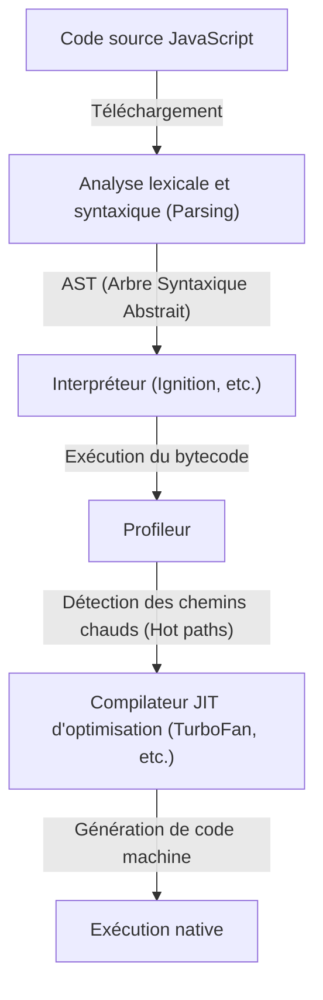
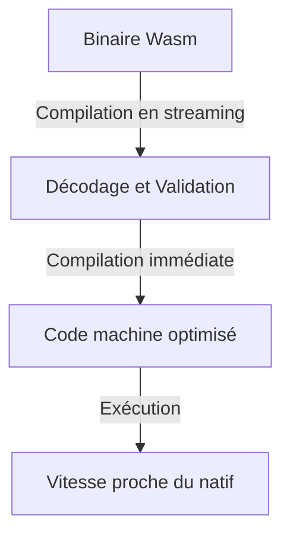
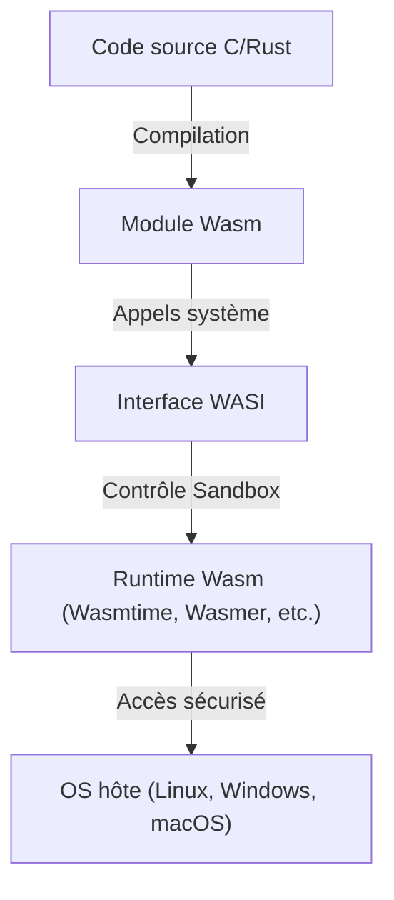

Depuis l'apparition des navigateurs web, JavaScript a longtemps régné en maître en tant que langage de programmation s'exécutant sur ces derniers. Cependant, à mesure que les applications web se sont complexifiées et qu'il est devenu nécessaire d'atteindre des performances comparables à celles des applications de bureau, des limites impossibles à franchir avec JavaScript seul sont apparues. WebAssembly (Wasm) a fait son apparition pour surmonter cet obstacle.

Dans cet article, nous explorerons en profondeur l'ensemble de WebAssembly, du modèle d'exécution de JavaScript et ses limites, en passant par la naissance d'asm.js et son évolution vers WebAssembly, jusqu'à l'architecture technique de Wasm (format binaire et machine à pile), le processus de compilation à partir de C/C++/Rust, et son déploiement au-delà du navigateur grâce à WASI.

## 1. Modèle d'exécution de JavaScript et limites de la compilation JIT

Pour comprendre la véritable valeur de WebAssembly, il faut d'abord savoir comment JavaScript est exécuté dans le navigateur et quelles limites il rencontre.

### 1.1 Le coût de l'analyse et de la compilation

JavaScript est un langage à typage dynamique basé sur du texte. Lorsque le navigateur reçoit du code JavaScript, il est exécuté à travers les étapes suivantes.



Le premier obstacle est l'« analyse » (Parsing). Lors du chargement d'un gros fichier JavaScript, le navigateur doit analyser le texte et construire un arbre syntaxique abstrait (AST). Ce processus impose une lourde charge au processeur, ce qui, en particulier sur les appareils mobiles, est un facteur majeur de retard du temps de chargement initial (TTI : Time to Interactive).

### 1.2 Le dilemme du compilateur JIT et de l'inférence de type

Les moteurs JavaScript modernes (V8, SpiderMonkey, JavaScriptCore, etc.) ont réalisé d'énormes gains de vitesse en intégrant des compilateurs JIT (Just-In-Time). Le compilateur JIT détecte les parties fréquemment appelées pendant l'exécution du code (hot paths), déduit le type de ces parties et génère un code machine optimisé.

Cependant, JavaScript étant un langage à typage dynamique, le type d'une variable peut changer au moment de l'exécution. Le compilateur JIT effectue des optimisations basées sur l'hypothèse (assumption) que « cette variable est toujours un nombre ».

### 1.3 La redoutable désoptimisation (Deoptimization)

Si l'hypothèse s'effondre pendant l'exécution (par exemple, passer soudainement une chaîne de caractères à une fonction à laquelle on passait des nombres), le compilateur JIT doit abandonner le code machine optimisé et revenir à l'exécution plus lente de l'interpréteur. C'est ce qu'on appelle la « désoptimisation » (Deoptimization) ou « Bailout ».

Lorsque la désoptimisation se produit, les performances chutent de manière spectaculaire. Dans les applications qui effectuent des calculs avancés (jeux 3D, montage vidéo, calculs physiques, etc.), cette fluctuation imprévisible des performances est fatale. Les développeurs étaient constamment contraints d'écrire du code « compatible avec le JIT », créant une situation absurde où ils devaient se soucier des optimisations spécifiques au moteur.

## 2. La naissance d'asm.js : Le désir de typage statique

Ressentant les limites de performance de JavaScript, les développeurs de Mozilla ont annoncé en 2013 un sous-ensemble appelé « asm.js ».

### 2.1 L'approche d'asm.js

asm.js n'est pas un nouveau langage, mais un sous-ensemble strict de JavaScript. En utilisant des modèles de codage spécifiques (annotations de type utilisant des opérations bit à bit), le type des variables est déterminé de manière statique.

Par exemple, en écrivant comme suit, on indique au moteur que `x` et `y` sont des entiers de 32 bits.

```javascript
function add(x, y) {
    x = x | 0; // Indique explicitement un entier de 32 bits
    y = y | 0;
    return (x + y) | 0;
}
```

### 2.2 Succès et limites d'asm.js

Les navigateurs supportant asm.js, lorsqu'ils détectaient ce modèle spécifique, pouvaient générer directement du code natif sans risque de désoptimisation (d'une manière proche de la compilation Ahead-Of-Time). Ainsi, un exploit tel que la conversion de code C/C++ en asm.js via Emscripten pour faire tourner des jeux 3D dans le navigateur a été réalisé.

Cependant, asm.js présentait les problèmes suivants :
- **Gonflement de la taille du fichier** : Redondance du texte due aux annotations de type.
- **Coût d'analyse** : Nécessite toujours l'analyse de fichiers texte massifs.
- **Limites d'expressivité** : Étant lié à la syntaxe JavaScript, la prise en charge de fonctionnalités avancées comme les entiers 64 bits est difficile.

Pour résoudre fondamentalement ces limites, les concepteurs de navigateurs se sont unis pour concevoir « WebAssembly ».

## 3. Architecture de WebAssembly (Wasm)

WebAssembly (Wasm) est un format binaire compact qui peut être exécuté dans le navigateur à une vitesse proche du code natif. En 2019, il est devenu un standard du W3C, établissant sa position en tant que « 4ème langage du Web » après HTML, CSS et JavaScript.

### 3.1 Accélération grâce au format binaire

La caractéristique principale de Wasm est qu'il s'agit d'un « format binaire (.wasm) » et non de texte.



Dès que le navigateur télécharge le binaire Wasm depuis le réseau, il commence le décodage et la compilation en streaming. Étant donné que le lourd processus d'analyse pour construire l'AST n'est pas nécessaire, le temps de démarrage est massivement plus rapide par rapport à JavaScript.

### 3.2 Modèle de machine à pile

Wasm est conçu pour être exécuté sur une « machine à pile » (stack machine) virtuelle. Contrairement à une machine à registres (comme x86 ou ARM), une machine à pile est un modèle simple où les opérandes sont empilés (Push), et les instructions arithmétiques retirent les valeurs de la pile pour calculer, puis empilent à nouveau le résultat (Pop/Push).

Par exemple, le calcul de `1 + 2` se fait conceptuellement comme suit :

1. `i32.const 1` (Empile 1)
2. `i32.const 2` (Empile 2)
3. `i32.add` (Retire deux valeurs de la pile, les additionne et empile le résultat)

Grâce à ce modèle simple et abstrait, Wasm peut être converti facilement et rapidement (compilation JIT/AOT) en code machine pour divers matériels physiques, tels que x86, ARM, MIPS, etc.

### 3.3 Mémoire linéaire (Linear Memory)

Les modules Wasm possèdent leur propre zone mémoire contiguë (mémoire linéaire), séparée de la collecte des déchets (GC) de JavaScript. Du côté de JavaScript, cela apparaît simplement comme un `ArrayBuffer`.

Des langages comme C/C++ ou Rust gèrent manuellement la mémoire en manipulant des pointeurs sur cette mémoire linéaire. Cela permet d'éviter les chutes de fréquence d'images causées par les temps de pause du GC, ce qui le rend idéal pour les applications nécessitant du temps réel.

### 3.4 Sécurité robuste et bac à sable (Sandbox)

WebAssembly fait de la sécurité une priorité absolue depuis sa conception. Les modules Wasm sont exécutés dans le solide environnement bac à sable du navigateur.
L'accès à la mémoire linéaire fait l'objet de vérifications strictes des limites, empêchant les attaques telles que le débordement de tampon. De plus, Wasm lui-même n'a pas l'autorisation d'accéder directement au DOM (Document Object Model), au réseau ou au système de fichiers, et tout traitement nécessaire est appelé en importatnt les fonctions fournies par JavaScript (ou l'environnement hôte).

## 4. Écosystème de compilation d'autres langages vers Wasm

WebAssembly n'est pas prévu pour que les développeurs écrivent directement sa représentation textuelle (WAT) à la main. Il sert de cible de compilation pour des langages comme C/C++, Rust, Go, etc.

### 4.1 Emscripten et C/C++

Emscripten est une chaîne d'outils de compilation Wasm basée sur LLVM. À l'origine développée pour asm.js, elle est désormais devenue le standard de facto pour la génération de Wasm.

La force d'Emscripten réside dans sa capacité à générer automatiquement le code de liaison (glue code) JavaScript qui émule la bibliothèque C standard (libc), le système de fichiers (système de fichiers virtuel utilisant l'IndexedDB du navigateur), OpenGL (conversion vers WebGL), etc. Cela permet de porter relativement facilement de vastes bases de code C/C++ existantes (par exemple, des moteurs de jeu ou des bibliothèques de traitement d'images) sur le Web.

### 4.2 Rust : Le langage de première classe de l'ère Wasm

Rust est un langage de programmation système moderne qui combine la sécurité de la mémoire grâce à son modèle de propriété et une vitesse d'exécution rapide, et est connu pour son excellente compatibilité avec WebAssembly.

La chaîne d'outils Rust prend en charge nativement la cible Wasm (`wasm32-unknown-unknown`), et l'utilisation de la puissante bibliothèque `wasm-bindgen` permet une interface transparente avec JavaScript (manipulation du DOM et échange de classes JavaScript). Rust, n'ayant pas de garbage collection, permet de maintenir la taille du binaire Wasm généré au minimum, ce qui explique l'essor rapide de l'approche consistant à « écrire uniquement les traitements lourds en Rust/Wasm » dans le développement front-end Web.

### 4.3 Langages avec Garbage Collection (Go, C#, Kotlin)

Récemment, des propositions pour intégrer le « Wasm GC » (Garbage Collection) à la norme Wasm ont progressé. Auparavant, lors de la compilation de Go ou C# (Blazor) en Wasm, il était nécessaire d'inclure le gigantesque ramasse-miettes spécifique au langage dans le module, ce qui entraînait un problème d'enflure de la taille du binaire.

Avec l'implémentation native de Wasm GC dans les navigateurs, il sera possible d'utiliser directement le garbage collector performant de l'hôte (comme le moteur JavaScript V8), faisant évoluer de manière explosive la prise en charge par WebAssembly des langages gérant la mémoire dynamiquement, tels que Java, Kotlin et Dart (Flutter).

## 5. WebAssembly System Interface (WASI) : Au-delà du navigateur

WebAssembly n'est pas une technologie qui s'arrête au navigateur. Il vise à réaliser le rêve « Write Once, Run Anywhere » (Écrire une fois, exécuter partout) promu par Java, d'une manière plus légère et plus sûre. Ce qui propulse cela, c'est **WASI (WebAssembly System Interface)**.

### 5.1 Qu'est-ce que WASI ?

Comme mentionné précédemment, Wasm ne peut pas accéder aux fonctionnalités du système d'exploitation (E/S de fichiers, réseau, horloge système, etc.) par défaut. Dans le navigateur, JavaScript servait de pont pour cela, mais si vous souhaitez exécuter Wasm dans un environnement de serveur hors navigateur, une interface commune est nécessaire.

WASI est l'interface système standardisée pour WebAssembly. Elle fournit une API de type POSIX, permettant aux modules Wasm d'accéder en toute sécurité aux ressources du système d'exploitation.



### 5.2 Un environnement d'exécution léger de nouvelle génération pour remplacer les conteneurs

Avec l'avènement de WASI, le monde entier s'intéresse à WebAssembly en tant que « nano-conteneur » pour remplacer les conteneurs Docker. Wasm présente les avantages suivants par rapport aux conteneurs Docker :

1. **Vitesse de démarrage écrasante** : Le runtime Wasm démarre en quelques millisecondes à microsecondes. C'est des centaines de fois plus rapide que les conteneurs.
2. **Indépendant de la plateforme** : Le même binaire Wasm fonctionne sur ARM ou x86, Linux ou Windows.
3. **Sécurité robuste** : Il est complètement isolé par défaut et ne peut accéder qu'aux répertoires et ports explicitement autorisés via WASI.

### 5.3 Utilisation dans l'Edge Computing

Ces caractéristiques brillent le plus dans le domaine des edge workers des CDN et des fonctions sans serveur (FaaS). Fastly's Compute@Edge et Cloudflare Workers utilisent en interne des Isolate V8 ou des runtimes Wasm dédiés, réalisant une mise à l'échelle et une exécution à la milliseconde sur les serveurs edge du monde entier.

## 6. Conclusion et perspectives d'avenir

WebAssembly ne vise pas à remplacer JavaScript. JavaScript possède une flexibilité et un écosystème inégalés pour le contrôle de l'interface utilisateur et la manipulation du DOM. Wasm est le partenaire idéal pour compléter les domaines où JavaScript excelle moins, tels que « les traitements de calcul lourds », « l'utilisation des actifs C/C++/Rust existants » et « la garantie stricte de performances ».

Des encodeurs vidéo/audio, des logiciels de CAO, de la visualisation avancée de données, au traitement de chiffrement, en passant par l'inférence d'IA dans le navigateur (comme le backend Wasm de TensorFlow.js), les cas d'utilisation de Wasm s'étendent de jour en jour.

De plus, l'avancée de Wasm dans les domaines du cloud-native et de l'edge computing via WASI est en train de révolutionner l'architecture backend. Né pour repousser les limites du navigateur, WebAssembly franchit désormais les frontières du Web et a commencé son parcours en tant que « format binaire universel » pour exécuter du code de manière sûre et rapide partout.
