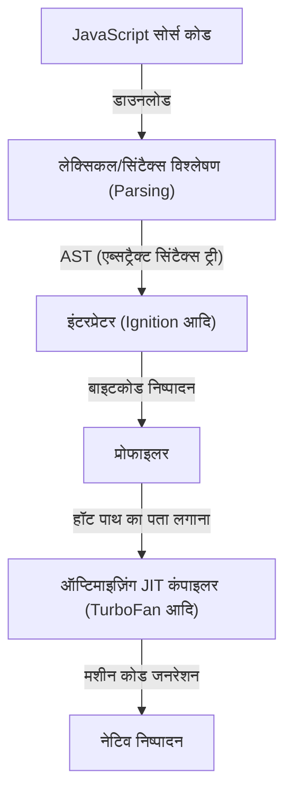
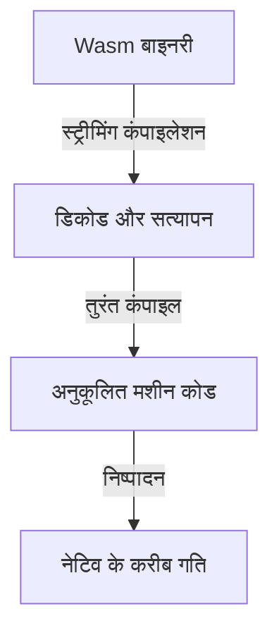
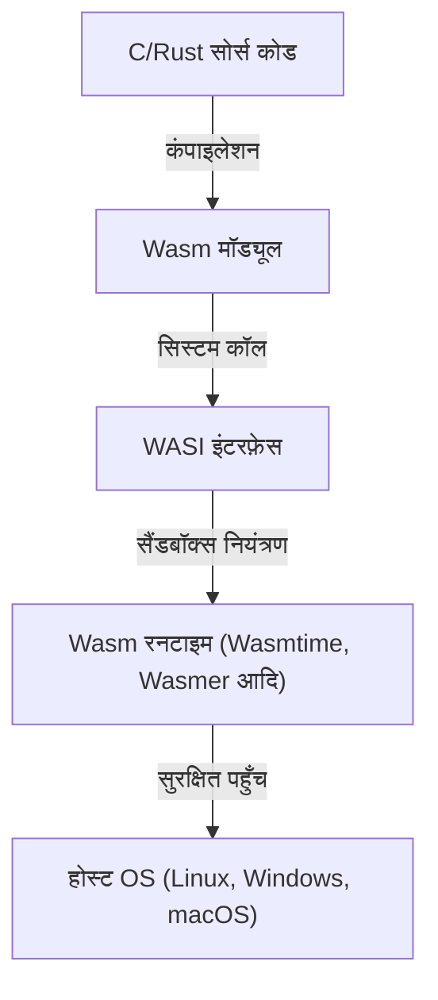

वेब ब्राउज़र के जन्म के बाद से, लंबे समय तक ब्राउज़र पर चलने वाली प्रोग्रामिंग भाषाओं में JavaScript का एकाधिकार रहा है। हालाँकि, जैसे-जैसे वेब एप्लिकेशन अधिक जटिल होते गए और डेस्कटॉप एप्लिकेशन के बराबर प्रदर्शन की मांग होने लगी, यह स्पष्ट हो गया कि केवल JavaScript उन बाधाओं को पार नहीं कर सकती। उन बाधाओं को तोड़ने के लिए WebAssembly (Wasm) का उदय हुआ।

इस लेख में, हम WebAssembly की पूरी तस्वीर को गहराई से समझेंगे - JavaScript के निष्पादन मॉडल और उसकी सीमाओं से लेकर, asm.js के जन्म और WebAssembly में इसके विकास, Wasm के तकनीकी आर्किटेक्चर (बाइनरी फॉर्मेट और स्टैक मशीन), C/C++/Rust से कंपाइलेशन प्रक्रिया, और WASI के माध्यम से ब्राउज़र के बाहर इसके विस्तार तक।

## 1. JavaScript का निष्पादन मॉडल और JIT कंपाइलेशन की सीमाएँ

WebAssembly के वास्तविक मूल्य को समझने के लिए, हमें पहले यह जानना होगा कि JavaScript ब्राउज़र पर कैसे निष्पादित होती है और इसकी सीमाएँ क्या हैं।

### 1.1 पार्सिंग और कंपाइलेशन की लागत

JavaScript एक टेक्स्ट-आधारित, डायनामिक रूप से टाइप की जाने वाली भाषा है। जब कोई ब्राउज़र JavaScript कोड प्राप्त करता है, तो यह निम्नलिखित चरणों से गुजरता है:



पहली बाधा "पार्सिंग (Parsing)" है। एक विशाल JavaScript फ़ाइल को लोड करते समय, ब्राउज़र को टेक्स्ट को पार्स करना होता है और एक एब्सट्रैक्ट सिंटैक्स ट्री (AST) बनाना होता है। यह प्रक्रिया CPU पर भारी भार डालती है, विशेष रूप से मोबाइल उपकरणों पर पृष्ठ के प्रारंभिक लोड समय (TTI: Time to Interactive) में देरी का एक प्रमुख कारण बनती है।

### 1.2 JIT कंपाइलर और टाइप इन्फेरेंस की दुविधा

आधुनिक JavaScript इंजनों (V8, SpiderMonkey, JavaScriptCore, आदि) ने JIT (Just-In-Time) कंपाइलर शामिल करके गति में नाटकीय रूप से सुधार किया है। JIT कंपाइलर कोड निष्पादन के दौरान बार-बार कॉल किए जाने वाले भागों (हॉट पाथ) का पता लगाता है, उनके प्रकारों का अनुमान लगाता है, और अनुकूलित मशीन कोड उत्पन्न करता है।

हालाँकि, क्योंकि JavaScript एक डायनामिक रूप से टाइप की जाने वाली भाषा है, वेरिएबल के प्रकार रनटाइम के दौरान बदल सकते हैं। JIT कंपाइलर इस धारणा (assumption) के आधार पर अनुकूलन करता है कि "यह वेरिएबल हमेशा एक संख्या है"।

### 1.3 खौफनाक Deoptimization (डीऑप्टिमाइजेशन)

यदि निष्पादन के दौरान कोई धारणा गलत साबित होती है (उदाहरण के लिए, किसी ऐसे फ़ंक्शन में अचानक एक स्ट्रिंग पास करना जिसे पहले केवल संख्याएँ दी जा रही थीं), तो JIT कंपाइलर को अनुकूलित मशीन कोड को त्यागना पड़ता है और धीमे इंटरप्रेटर निष्पादन पर वापस जाना पड़ता है। इसे "Deoptimization" या "Bailout" कहा जाता है।

जब Deoptimization होता है, तो प्रदर्शन में भारी गिरावट आती है। उन्नत गणनाओं (3D गेम्स, वीडियो संपादन, भौतिकी सिमुलेशन, आदि) को करने वाले एप्लिकेशनों में, प्रदर्शन में यह अप्रत्याशित उतार-चढ़ाव घातक है। डेवलपर्स को हमेशा "JIT-फ्रेंडली" कोड लिखने के लिए मजबूर होना पड़ता था, जिससे एक ऐसी स्थिति पैदा हुई जहाँ वे इंजन-विशिष्ट अनुकूलन के प्रति सचेत रहने लगे - जो कि मूल उद्देश्य के विपरीत है।

## 2. asm.js का जन्म: स्टैटिक टाइपिंग की चाहत

JavaScript के प्रदर्शन की सीमाओं को महसूस करते हुए, 2013 में Mozilla के डेवलपर्स ने "asm.js" नामक एक सबसेट की घोषणा की।

### 2.1 asm.js का दृष्टिकोण

asm.js कोई नई भाषा नहीं है, बल्कि JavaScript का एक सख्त सबसेट है। विशिष्ट कोडिंग पैटर्न (बिटवाइज़ ऑपरेशंस का उपयोग करके टाइप एनोटेशन) का उपयोग करके, वेरिएबल्स के प्रकारों को सांख्यिक रूप से (statically) निर्धारित किया जाता है।

उदाहरण के लिए, निम्नलिखित तरीके से लिखकर, हम इंजन को बताते हैं कि `x` और `y` 32-बिट पूर्णांक हैं:

```javascript
function add(x, y) {
    x = x | 0; // स्पष्ट रूप से 32-बिट पूर्णांक घोषित करें
    y = y | 0;
    return (x + y) | 0;
}
```

### 2.2 asm.js की उपलब्धियां और सीमाएं

जब asm.js-संगत ब्राउज़रों ने इस विशिष्ट पैटर्न का पता लगाया, तो वे सीधे नेटिव कोड (Ahead-Of-Time कंपाइलेशन के समान) उत्पन्न कर सकते थे जिसमें Deoptimization का कोई जोखिम नहीं था। इसने Emscripten के माध्यम से C/C++ कोड को asm.js में परिवर्तित करने और ब्राउज़र में 3D गेम चलाने जैसे महान कारनामे हासिल किए।

हालाँकि, asm.js में निम्नलिखित समस्याएँ थीं:
- **फ़ाइल आकार में वृद्धि**: टाइप एनोटेशन के कारण टेक्स्ट का अनावश्यक विस्तार।
- **पार्सिंग लागत**: अभी भी विशाल टेक्स्ट फ़ाइलों को पार्स करने की आवश्यकता है।
- **अभिव्यक्ति की सीमाएँ**: JavaScript के सिंटैक्स से बंधे होने के कारण, 64-बिट पूर्णांक जैसी उन्नत सुविधाओं का समर्थन करना मुश्किल था।

इन सीमाओं को मौलिक रूप से हल करने के लिए, ब्राउज़र वेंडरों ने एकजुट होकर "WebAssembly" को डिज़ाइन किया।

## 3. WebAssembly (Wasm) का आर्किटेक्चर

WebAssembly (Wasm) एक कॉम्पैक्ट बाइनरी फॉर्मेट है जो ब्राउज़र में नेटिव कोड के करीब गति से चल सकता है। 2019 में, यह एक W3C मानक बन गया, जिसने HTML, CSS और JavaScript के बाद "वेब की चौथी भाषा" के रूप में अपनी स्थिति स्थापित की।

### 3.1 बाइनरी फॉर्मेट के माध्यम से त्वरण

Wasm की सबसे बड़ी विशेषता यह है कि यह टेक्स्ट नहीं बल्कि एक "बाइनरी फॉर्मेट (.wasm)" है।



जैसे ही ब्राउज़र नेटवर्क से Wasm बाइनरी डाउनलोड करता है, यह स्ट्रीमिंग के माध्यम से डिकोडिंग और कंपाइलिंग शुरू कर देता है। चूंकि AST निर्माण जैसी भारी पार्सिंग प्रक्रिया की आवश्यकता नहीं होती है, इसलिए JavaScript की तुलना में स्टार्टअप का समय बहुत तेज होता है।

### 3.2 स्टैक मशीन मॉडल

Wasm को एक वर्चुअल "स्टैक मशीन" पर चलाने के लिए डिज़ाइन किया गया है। रजिस्टर मशीनों (जैसे x86 और ARM) के विपरीत, स्टैक मशीन ऑपरेंड को स्टैक (Push) पर धकेलती है, स्टैक से मानों को निकालने और गणना करने के लिए अंकगणितीय निर्देशों का उपयोग करती है, और परिणाम को वापस स्टैक (Pop/Push) पर रख देती है। यह एक बहुत ही सरल मॉडल है।

उदाहरण के लिए, `1 + 2` की गणना वैचारिक रूप से इस प्रकार है:

1. `i32.const 1` (1 को स्टैक पर धकेलें)
2. `i32.const 2` (2 को स्टैक पर धकेलें)
3. `i32.add` (स्टैक से दो मान निकालें, उन्हें जोड़ें और परिणाम को स्टैक पर धकेलें)

इस सरल और अमूर्त मॉडल के कारण, Wasm को x86, ARM और MIPS जैसे विभिन्न भौतिक हार्डवेयर के मशीन कोड (JIT/AOT कंपाइलेशन) में आसानी से और तेज़ी से परिवर्तित किया जा सकता है।

### 3.3 लीनियर मेमोरी (Linear Memory)

Wasm मॉड्यूल में JavaScript के गार्बेज कलेक्शन (GC) से अलग अपना निरंतर मेमोरी क्षेत्र (लीनियर मेमोरी) होता है। यह JavaScript पक्ष से एक साधारण `ArrayBuffer` के रूप में दिखाई देता है।

C/C++ और Rust जैसी भाषाएँ इस लीनियर मेमोरी पर पॉइंटर्स में हेरफेर करके मैन्युअल रूप से मेमोरी का प्रबंधन करती हैं। यह GC के ठहराव समय (पॉज़ टाइम) के कारण होने वाले फ्रेम ड्रॉप्स को रोकता है, जिससे यह वास्तविक समय के एप्लिकेशनों के लिए आदर्श बन जाता है।

### 3.4 मजबूत सुरक्षा और सैंडबॉक्स

WebAssembly शुरू से ही सुरक्षा को अपनी सर्वोच्च प्राथमिकता मानता है। Wasm मॉड्यूल ब्राउज़र के शक्तिशाली सैंडबॉक्स वातावरण के भीतर निष्पादित होते हैं।
लीनियर मेमोरी तक पहुंच की सख्ती से सीमा-जांच (bounds-checked) की जाती है, जो बफर ओवरफ्लो हमलों को रोकता है। इसके अतिरिक्त, Wasm के पास स्वयं DOM (डॉक्यूमेंट ऑब्जेक्ट मॉडल), नेटवर्क या फाइल सिस्टम तक सीधे पहुंचने का अधिकार नहीं है; सभी आवश्यक प्रक्रियाएं JavaScript (या होस्ट वातावरण) द्वारा प्रदान किए गए कार्यों को आयात (import) और कॉल करके की जाती हैं।

## 4. अन्य भाषाओं से Wasm तक कंपाइलेशन इकोसिस्टम

WebAssembly से यह उम्मीद नहीं की जाती है कि डेवलपर्स सीधे इसके टेक्स्ट फॉर्मेट (WAT) को हाथ से लिखेंगे। यह C/C++, Rust और Go जैसी भाषाओं से संकलित लक्ष्य (compilation target) के रूप में कार्य करता है।

### 4.1 Emscripten और C/C++

Emscripten एक LLVM-आधारित Wasm कंपाइलर टूलचेन है। मूल रूप से asm.js के लिए विकसित किया गया था, अब यह Wasm पीढ़ी के लिए वास्तविक मानक है।

Emscripten की ताकत यह है कि यह स्वचालित रूप से JavaScript ग्लू कोड उत्पन्न करता है जो मानक C लाइब्रेरी (libc), फ़ाइल सिस्टम (ब्राउज़र के IndexedDB का उपयोग करके वर्चुअल फ़ाइल सिस्टम), और OpenGL (WebGL में रूपांतरण) का अनुकरण (emulate) करता है। इससे मौजूदा विशाल C/C++ कोडबेस (जैसे गेम इंजन और इमेज प्रोसेसिंग लाइब्रेरी) को अपेक्षाकृत आसानी से वेब पर पोर्ट किया जा सकता है।

### 4.2 Rust: Wasm युग की प्रथम श्रेणी की भाषा

Rust एक आधुनिक सिस्टम प्रोग्रामिंग भाषा है जो स्वामित्व मॉडल (ownership model) के माध्यम से मेमोरी सुरक्षा और तेज़ निष्पादन गति को जोड़ती है, और WebAssembly के साथ अपनी उत्कृष्ट अनुकूलता के लिए जानी जाती है।

Rust टूलचेन डिफ़ॉल्ट रूप से Wasm लक्ष्य (`wasm32-unknown-unknown`) का समर्थन करता है, और `wasm-bindgen` नामक एक शक्तिशाली लाइब्रेरी का उपयोग करके, आप JavaScript (DOM हेरफेर और JavaScript क्लास इंटरेक्शन) के साथ मूल रूप से इंटरफ़ेस कर सकते हैं। चूंकि Rust में गार्बेज कलेक्शन नहीं है, उत्पन्न Wasm बाइनरी का आकार बहुत छोटा रखा जा सकता है, जिसके कारण वेब फ्रंटएंड डेवलपमेंट में "केवल भारी प्रक्रियाओं को Rust/Wasm में लिखना" दृष्टिकोण तेजी से बढ़ रहा है।

### 4.3 गार्बेज कलेक्शन वाली भाषाएं (Go, C#, Kotlin)

हाल के वर्षों में, Wasm मानक में "Wasm GC (गार्बेज कलेक्शन)" प्रस्ताव को शामिल करने का आंदोलन आगे बढ़ रहा है। अब तक, Go या C# (Blazor) को Wasm में कंपाइल करते समय, मॉड्यूल के भीतर भाषा-विशिष्ट विशाल गार्बेज कलेक्टर को शामिल करना आवश्यक था, जिससे बाइनरी का आकार बढ़ने की समस्या थी।

Wasm GC को ब्राउज़र में मूल (natively) रूप से लागू किए जाने के साथ, होस्ट (जैसे V8 JavaScript इंजन) के उच्च-प्रदर्शन गार्बेज कलेक्टर का सीधे उपयोग करना संभव हो जाएगा, और Java, Kotlin और Dart (Flutter) जैसी गतिशील मेमोरी प्रबंधन करने वाली भाषाओं के लिए WebAssembly समर्थन का विस्फोटक विकास हो रहा है।

## 5. WebAssembly System Interface (WASI): ब्राउज़र के बाहर

WebAssembly कोई ऐसी तकनीक नहीं है जो केवल ब्राउज़र में समाप्त हो जाती है। यह जावा के "एक बार लिखें, कहीं भी चलाएं" के सपने को अधिक हल्के और सुरक्षित तरीके से साकार करने की कोशिश कर रहा है। इसे **WASI (WebAssembly System Interface)** द्वारा संचालित किया जा रहा है।

### 5.1 WASI क्या है?

जैसा कि ऊपर बताया गया है, डिफ़ॉल्ट रूप से Wasm OS सुविधाओं (फ़ाइल I/O, नेटवर्क, सिस्टम क्लॉक, आदि) तक नहीं पहुंच सकता है। ब्राउज़र के भीतर, JavaScript उस अंतर को पाटता है, लेकिन ब्राउज़र के बाहर सर्वर वातावरण में Wasm चलाते समय एक सामान्य इंटरफ़ेस की आवश्यकता होती है।

WASI WebAssembly के लिए एक मानकीकृत सिस्टम इंटरफ़ेस है। यह POSIX जैसा API प्रदान करता है जो Wasm मॉड्यूल को सुरक्षित रूप से OS संसाधनों तक पहुंचने की अनुमति देता है।



### 5.2 कंटेनरों को बदलने के लिए अगली पीढ़ी का हल्का निष्पादन वातावरण

WASI के आगमन के साथ, दुनिया Docker कंटेनरों को बदलने के लिए एक "नैनो-कंटेनर" के रूप में WebAssembly पर ध्यान दे रही है। Docker कंटेनरों की तुलना में Wasm के निम्नलिखित फायदे हैं:

1. **अत्यधिक तेज़ स्टार्टअप गति**: Wasm रनटाइम को शुरू होने में कुछ मिलीसेकंड से लेकर कुछ माइक्रोसेकंड तक का समय लगता है। यह कंटेनरों की तुलना में सैकड़ों गुना तेज है।
2. **प्लेटफ़ॉर्म-स्वतंत्र**: वही Wasm बाइनरी ARM और x86, Linux और Windows पर समान रूप से चलेगी।
3. **मजबूत सुरक्षा**: यह डिफ़ॉल्ट रूप से पूरी तरह से अलग-थलग (isolated) है और केवल उन निर्देशिकाओं और पोर्ट्स तक पहुंच सकता है जिन्हें WASI के माध्यम से स्पष्ट रूप से अनुमति दी गई है।

### 5.3 एज कंप्यूटिंग में उपयोग

यह विशेषता CDN एज वर्कर्स और सर्वरलेस फ़ंक्शंस (FaaS) के क्षेत्र में सबसे अच्छी तरह से उपयोग की जाती है। Fastly का Compute@Edge और Cloudflare Workers आंतरिक रूप से V8 Isolates और समर्पित Wasm रनटाइम का उपयोग करते हैं ताकि दुनिया भर के एज सर्वरों पर मिलीसेकंड-स्केल स्केलिंग और निष्पादन प्राप्त किया जा सके।

## 6. निष्कर्ष और भविष्य की संभावनाएं

WebAssembly JavaScript को बदलने के लिए नहीं है। UI नियंत्रण और DOM हेरफेर में JavaScript के पास बेजोड़ लचीलापन और इकोसिस्टम है। Wasm उन क्षेत्रों के पूरक के लिए एक आदर्श भागीदार है जिनमें JavaScript संघर्ष करता है, जैसे "भारी गणना", "मौजूदा C/C++/Rust संपत्तियों का उपयोग", और "सख्त प्रदर्शन की गारंटी"।

वीडियो/ऑडियो एन्कोडर्स, CAD सॉफ्टवेयर, उन्नत डेटा विज़ुअलाइज़ेशन, क्रिप्टोग्राफ़िक प्रसंस्करण, और यहां तक कि ब्राउज़र-इन-AI अनुमान (जैसे TensorFlow.js का Wasm बैकएंड) से लेकर, Wasm के उपयोग के मामले हर दिन बढ़ रहे हैं।

इसके अलावा, WASI के माध्यम से क्लाउड-नेटिव और एज कंप्यूटिंग डोमेन में तेजी से प्रगति बैकएंड आर्किटेक्चर में क्रांति ला रही है। ब्राउज़र की सीमाओं को पार करने के लिए पैदा हुआ WebAssembly अब वेब की सीमाओं को भी पार कर रहा है, और हर जगह सुरक्षित रूप से और तेज़ी से कोड निष्पादित करने के लिए "यूनिवर्सल बाइनरी फॉर्मेट" के रूप में अपना मार्ग प्रशस्त कर रहा है।
