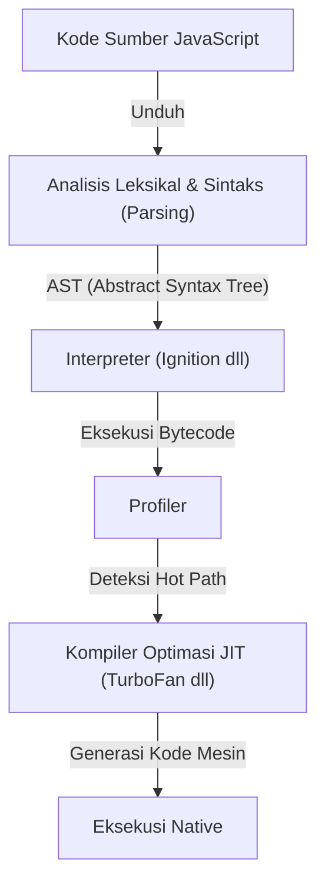
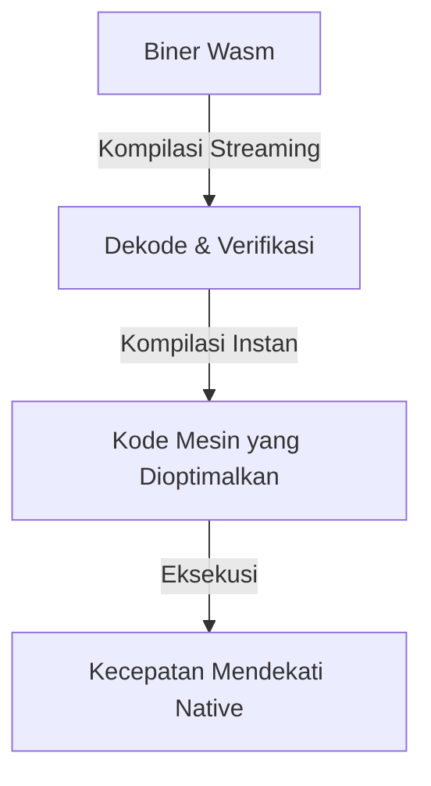
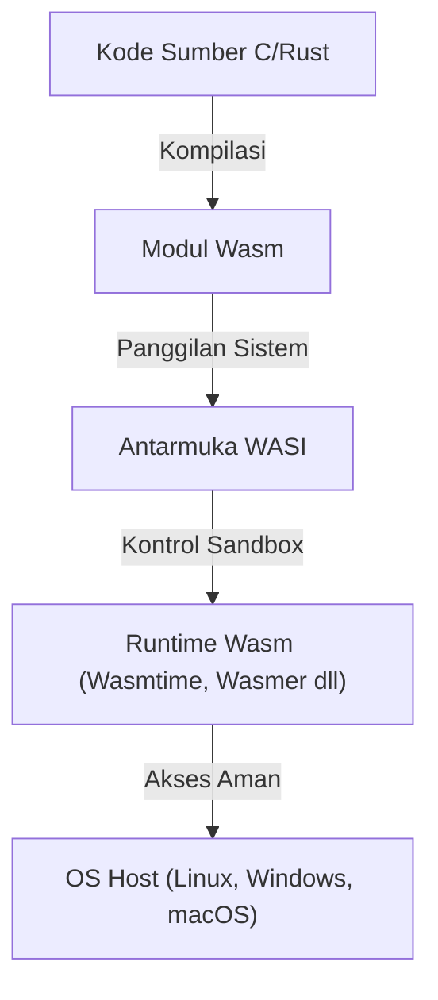

Sejak browser web lahir, bahasa pemrograman yang berjalan di browser telah lama didominasi oleh JavaScript. Namun, seiring dengan aplikasi web yang semakin kompleks dan menuntut performa setara dengan aplikasi desktop, batas-batas yang tidak dapat diatasi oleh JavaScript saja mulai terlihat. WebAssembly (Wasm) muncul untuk mendobrak batas tersebut.

Dalam artikel ini, kita akan membahas secara mendalam keseluruhan gambaran WebAssembly, mulai dari model eksekusi JavaScript dan batasannya, lahirnya asm.js hingga evolusi ke WebAssembly, arsitektur teknis Wasm (format biner dan stack machine), proses kompilasi dari C/C++/Rust, dan perluasannya ke luar browser melalui WASI.

## 1. Model Eksekusi JavaScript dan Batasan Kompilasi JIT

Untuk memahami nilai sebenarnya dari WebAssembly, pertama-tama kita harus mengetahui bagaimana JavaScript dieksekusi di browser dan batasan apa yang dimilikinya.

### 1.1 Biaya Parsing dan Kompilasi

JavaScript adalah bahasa berjenis pengetikan dinamis berbasis teks. Ketika browser menerima kode JavaScript, ia dieksekusi melalui langkah-langkah berikut.



Hambatan pertama adalah "Parsing". Saat memuat file JavaScript berukuran besar, browser perlu mem-parsing teks untuk membangun Abstract Syntax Tree (AST). Proses ini memberikan beban yang berat pada CPU, dan khususnya pada perangkat seluler, ini merupakan faktor utama yang menunda waktu muat awal halaman (TTI: Time to Interactive).

### 1.2 Dilema Kompiler JIT dan Inferensi Tipe

Mesin JavaScript modern (V8, SpiderMonkey, JavaScriptCore, dll.) telah mencapai peningkatan kecepatan yang dramatis dengan mengintegrasikan kompiler JIT (Just-In-Time). Kompiler JIT mendeteksi bagian yang sering dipanggil selama eksekusi kode (hot path), menyimpulkan tipe bagian tersebut, dan menghasilkan kode mesin yang dioptimalkan.

Namun, karena JavaScript adalah bahasa berjenis pengetikan dinamis, tipe variabel dapat berubah saat runtime. Kompiler JIT melakukan optimasi berdasarkan asumsi bahwa "variabel ini selalu berupa angka".

### 1.3 Deoptimization (Deoptimasi) yang Mengerikan

Jika asumsi ini rusak selama eksekusi (misalnya, tiba-tiba meneruskan string ke fungsi yang sebelumnya meneruskan angka), kompiler JIT terpaksa membuang kode mesin yang dioptimalkan dan kembali ke eksekusi interpreter yang lambat. Ini disebut "Deoptimization (Deoptimasi)" atau "Bailout".

Ketika Deoptimization terjadi, performa menurun secara drastis. Pada aplikasi yang melakukan perhitungan tingkat tinggi (game 3D, pengeditan video, komputasi fisika, dll.), fluktuasi performa yang tidak dapat diprediksi ini berakibat fatal. Pengembang selalu dipaksa untuk menulis kode yang "ramah JIT", yang mengarah pada situasi di mana mereka harus memikirkan optimasi khusus mesin, mengalahkan tujuan utamanya.

## 2. Kelahiran asm.js: Keinginan akan Pengetikan Statis

Pengembang Mozilla yang merasakan batas performa JavaScript merilis sebuah subset bernama "asm.js" pada tahun 2013.

### 2.1 Pendekatan asm.js

asm.js bukanlah bahasa baru, melainkan subset ketat dari JavaScript. Dengan menggunakan pola pengkodean tertentu (anotasi tipe menggunakan operasi bit), tipe variabel dapat ditentukan secara statis.

Misalnya, dengan menulis kode seperti di bawah ini, mesin JavaScript diberi tahu bahwa `x` dan `y` adalah bilangan bulat 32-bit.

```javascript
function add(x, y) {
    x = x | 0; // Menyatakan secara eksplisit bahwa ini adalah bilangan bulat 32-bit
    y = y | 0;
    return (x + y) | 0;
}
```

### 2.2 Prestasi dan Batasan asm.js

Browser yang mendukung asm.js dapat secara langsung menghasilkan kode native tanpa risiko Deoptimization ketika mendeteksi pola spesifik ini (dalam bentuk yang mirip dengan kompilasi Ahead-Of-Time). Hal ini menghasilkan pencapaian besar, seperti mengubah kode C/C++ ke asm.js melalui Emscripten untuk menjalankan game 3D di browser.

Namun, asm.js memiliki masalah berikut:
- **Ukuran file yang membengkak**: Redundansi teks karena anotasi tipe.
- **Biaya Parsing**: Masih membutuhkan parsing untuk file teks berukuran besar.
- **Keterbatasan ekspresi**: Karena terikat oleh sintaks JavaScript, dukungan untuk fitur tingkat lanjut seperti bilangan bulat 64-bit menjadi sulit.

Untuk menyelesaikan batasan ini dari akarnya, vendor browser bersatu untuk merancang "WebAssembly".

## 3. Arsitektur WebAssembly (Wasm)

WebAssembly (Wasm) adalah format biner ringkas yang dapat dieksekusi di browser dengan kecepatan mendekati kode native. Pada tahun 2019, ia menjadi standar W3C dan memantapkan posisinya sebagai "bahasa Web keempat" setelah HTML, CSS, dan JavaScript.

### 3.1 Peningkatan Kecepatan melalui Format Biner

Fitur terbesar Wasm adalah formatnya berupa "format biner (.wasm)" dan bukan teks.



Saat browser mengunduh biner Wasm dari jaringan, browser langsung memulai dekode dan kompilasi melalui streaming. Karena proses parsing berat untuk membangun AST tidak diperlukan, waktu mulai (startup time) sangat jauh lebih cepat dibandingkan JavaScript.

### 3.2 Model Stack Machine

Wasm dirancang untuk dieksekusi pada "stack machine" virtual. Berbeda dengan register machine (seperti x86 atau ARM), stack machine menggunakan model sederhana di mana operan didorong (Push) ke stack, instruksi operasi mengambil nilai dari stack untuk dihitung, dan hasilnya didorong kembali ke stack (Pop/Push).

Misalnya, perhitungan `1 + 2` secara konseptual adalah sebagai berikut:

1. `i32.const 1` (Mendorong 1 ke stack)
2. `i32.const 2` (Mendorong 2 ke stack)
3. `i32.add` (Mengambil dua nilai dari stack, menambahkan, dan mendorong hasilnya ke stack)

Berkat model yang sederhana dan diabstraksikan ini, Wasm dapat dikonversi dengan mudah dan cepat (kompilasi JIT/AOT) ke kode mesin dari berbagai perangkat keras fisik, seperti x86, ARM, dan MIPS.

### 3.3 Memori Linier (Linear Memory)

Modul Wasm memiliki area memori kontinu miliknya sendiri (memori linier) yang terpisah dari Garbage Collection (GC) JavaScript. Dari sisi JavaScript, ini terlihat seperti sekadar `ArrayBuffer`.

Bahasa seperti C/C++ dan Rust memanipulasi pointer secara manual pada memori linier ini untuk mengelola memori. Hal ini mencegah penurunan frame yang disebabkan oleh waktu jeda (pause time) GC, menjadikannya ideal untuk aplikasi yang membutuhkan respons real-time.

### 3.4 Keamanan yang Kuat dan Sandbox

WebAssembly menjadikan keamanan sebagai prioritas utama sejak awal perancangannya. Modul Wasm dieksekusi di dalam lingkungan sandbox browser yang kuat.
Akses ke memori linier diperiksa batasnya secara ketat untuk mencegah serangan seperti buffer overflow. Selain itu, Wasm tidak memiliki izin untuk mengakses Document Object Model (DOM), jaringan, atau sistem file secara langsung; semua operasi yang diperlukan dilakukan dengan mengimpor dan memanggil fungsi yang disediakan oleh JavaScript (atau lingkungan host).

## 4. Ekosistem Kompilasi dari Bahasa Lain ke Wasm

WebAssembly tidak dirancang agar pengembang langsung menulis representasi teksnya (WAT) dengan tangan. Ia berfungsi sebagai target kompilasi dari bahasa seperti C/C++, Rust, dan Go.

### 4.1 Emscripten dan C/C++

Emscripten adalah toolchain kompiler Wasm berbasis LLVM. Awalnya dikembangkan untuk asm.js, tetapi sekarang telah menjadi standar de facto untuk pembuatan Wasm.

Kelebihan Emscripten adalah secara otomatis menghasilkan kode lem (glue code) JavaScript yang mengemulasi pustaka C standar (libc), sistem file (sistem file virtual menggunakan IndexedDB browser), dan OpenGL (konversi ke WebGL). Dengan ini, basis kode C/C++ besar yang sudah ada (misalnya, mesin game dan pustaka pemrosesan gambar) dapat di-porting ke web dengan relatif mudah.

### 4.2 Rust: Bahasa Kelas Satu di Era Wasm

Rust adalah bahasa pemrograman sistem modern yang menggabungkan keamanan memori melalui model kepemilikan dan kecepatan eksekusi tinggi, dan dikenal sangat kompatibel dengan WebAssembly.

Toolchain Rust mendukung target Wasm (`wasm32-unknown-unknown`) secara standar, dan dengan menggunakan pustaka kuat seperti `wasm-bindgen`, antarmuka dengan JavaScript (seperti manipulasi DOM dan pertukaran kelas JavaScript) dapat dilakukan dengan lancar. Karena Rust tidak memiliki garbage collection, ukuran biner Wasm yang dihasilkan dapat dibuat sangat kecil, sehingga pendekatan "menulis hanya pemrosesan berat dengan Rust/Wasm" meningkat pesat dalam pengembangan frontend web.

### 4.3 Bahasa Garbage Collection (Go, C#, Kotlin)

Dalam beberapa tahun terakhir, ada pergerakan untuk memasukkan proposal "Wasm GC (Garbage Collection)" ke dalam standar Wasm. Sebelumnya, saat mengkompilasi Go atau C# (Blazor) ke Wasm, diperlukan untuk menyertakan garbage collector besar khusus bahasa di dalam modul, yang menyebabkan masalah pembengkakan ukuran biner.

Dengan diimplementasikannya Wasm GC secara native di browser, garbage collector berkinerja tinggi dari host (seperti mesin JavaScript V8) dapat digunakan secara langsung, sehingga dukungan WebAssembly untuk bahasa dengan manajemen memori dinamis seperti Java, Kotlin, dan Dart (Flutter) berkembang pesat.

## 5. WebAssembly System Interface (WASI): Melampaui Browser

WebAssembly bukanlah teknologi yang hanya terbatas di dalam browser. Ia mencoba mewujudkan impian Java yaitu "Write Once, Run Anywhere (Tulis Sekali, Jalankan Di Mana Saja)" dalam bentuk yang lebih ringan dan aman. Hal ini didorong oleh **WASI (WebAssembly System Interface)**.

### 5.1 Apa itu WASI?

Seperti yang disebutkan sebelumnya, Wasm secara default tidak dapat mengakses fungsi OS (seperti input/output file, jaringan, dan jam sistem). Di dalam browser, JavaScript bertindak sebagai jembatan, tetapi ketika menjalankan Wasm di lingkungan server di luar browser, antarmuka umum diperlukan.

WASI adalah antarmuka sistem standar untuk WebAssembly. Ia menyediakan API yang mirip dengan POSIX dan memungkinkan modul Wasm untuk mengakses sumber daya OS dengan aman.



### 5.2 Lingkungan Eksekusi Ringan Generasi Berikutnya sebagai Pengganti Kontainer

Dengan kemunculan WASI, dunia memberikan perhatian pada WebAssembly sebagai "nano-kontainer" yang dapat menggantikan kontainer Docker. Wasm memiliki keuntungan sebagai berikut dibandingkan kontainer Docker:

1. **Kecepatan Startup Ekstrim**: Runtime Wasm dapat dimulai dalam beberapa milidetik hingga mikrodetik. Ini ratusan kali lebih cepat daripada kontainer.
2. **Independen dari Platform**: Biner Wasm yang sama dapat berjalan di ARM, x86, Linux, maupun Windows.
3. **Keamanan Kuat**: Diisolasi secara penuh secara default dan hanya dapat mengakses direktori atau port yang diizinkan secara eksplisit melalui WASI.

### 5.3 Pemanfaatan dalam Edge Computing

Karakteristik ini paling baik digunakan di area edge worker CDN dan fungsi serverless (FaaS). Fastly Compute@Edge dan Cloudflare Workers menggunakan Isolate V8 atau runtime Wasm khusus di dalamnya, untuk mencapai penskalaan dan eksekusi dalam skala milidetik di server edge di seluruh dunia.

## 6. Kesimpulan dan Prospek Masa Depan

WebAssembly bukanlah pengganti JavaScript. JavaScript memiliki fleksibilitas dan ekosistem tak tertandingi untuk kontrol UI dan manipulasi DOM. Wasm adalah mitra terbaik untuk melengkapi area di mana JavaScript lemah, seperti "perhitungan beban berat", "pemanfaatan aset C/C++/Rust yang ada", dan "jaminan performa yang ketat".

Dari encoder video/audio, perangkat lunak CAD, visualisasi data tingkat lanjut, proses enkripsi, hingga inferensi AI dalam browser (seperti backend Wasm TensorFlow.js), penggunaan kasus Wasm berkembang setiap harinya.

Selain itu, kemajuan WASI dalam komputasi edge dan cloud-native sedang merevolusi arsitektur backend. WebAssembly, yang lahir untuk mendobrak batasan browser, kini telah melampaui batas web itu sendiri, mulai melangkah sebagai "format biner universal" untuk mengeksekusi kode secara aman dan cepat di mana saja.
