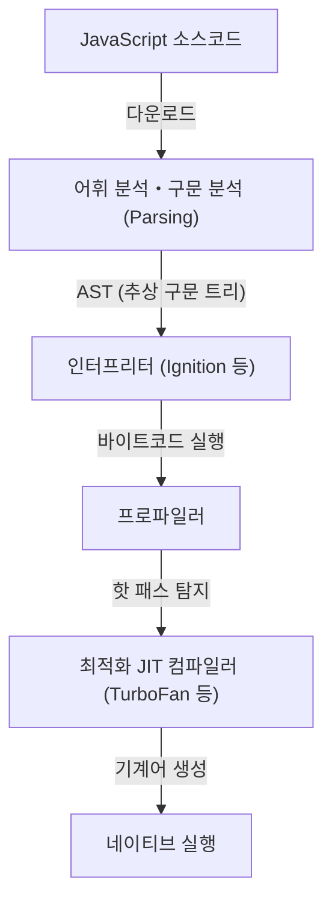
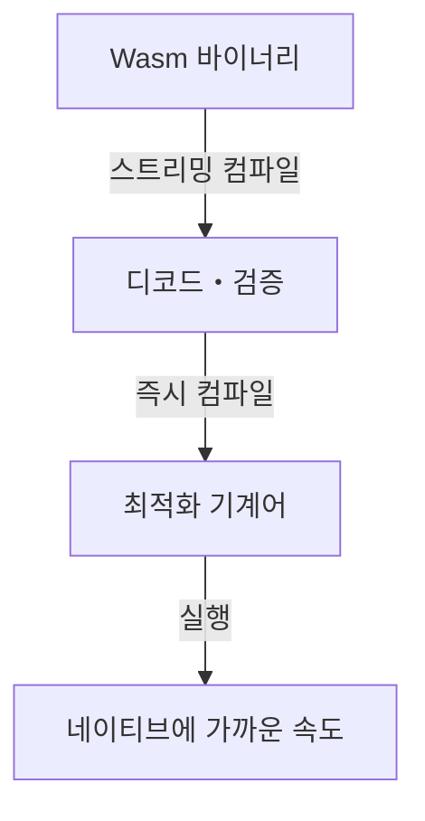
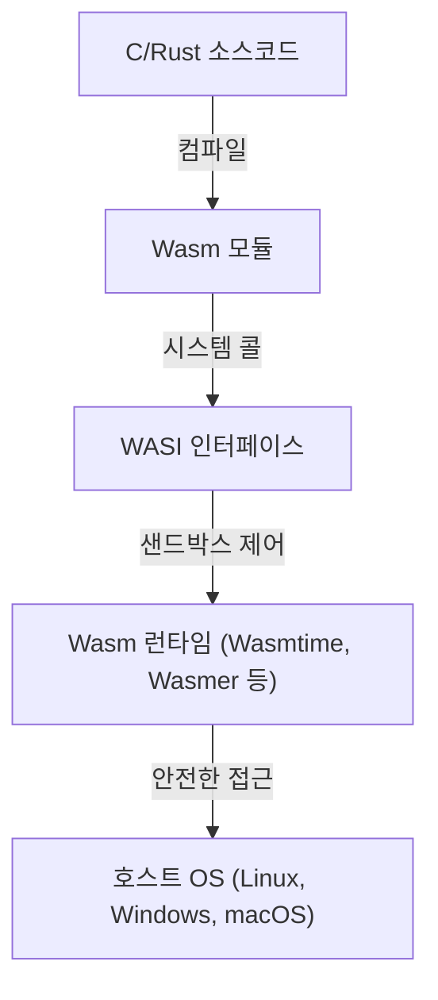

웹 브라우저가 탄생한 이래, 오랫동안 브라우저상에서 동작하는 프로그래밍 언어는 JavaScript의 독무대였습니다. 하지만 웹 애플리케이션이 복잡해지고 데스크톱 애플리케이션에 필적하는 퍼포먼스가 요구됨에 따라, JavaScript 단독으로는 넘을 수 없는 벽이 보이기 시작했습니다. 그 벽을 깨부수기 위해 등장한 것이 WebAssembly(Wasm)입니다.

본 기사에서는 JavaScript의 실행 모델과 그 한계, asm.js의 탄생에서 WebAssembly로의 진화, Wasm의 기술적인 아키텍처(바이너리 포맷이나 스택 머신), C/C++/Rust로부터의 컴파일 프로세스, 그리고 WASI에 의한 브라우저 외부로의 전개까지, WebAssembly의 전모를 깊이 파고들어 해설합니다.

## 1. JavaScript의 실행 모델과 JIT 컴파일의 한계

WebAssembly의 진가를 이해하기 위해서는 먼저 JavaScript가 브라우저상에서 어떻게 실행되고 어떤 한계를 안고 있는지 알아야 합니다.

### 1.1 파싱과 컴파일의 비용

JavaScript는 텍스트 기반의 동적 타입 언어입니다. 브라우저가 JavaScript 코드를 받으면 다음의 단계를 거쳐 실행됩니다.



첫 번째 관문은 '파싱(Parsing)'입니다. 거대한 JavaScript 파일을 로드할 때 브라우저는 텍스트를 구문 분석하여 추상 구문 트리(AST)를 구축해야 합니다. 이 처리는 CPU에 큰 부하를 주고, 특히 모바일 기기에서는 페이지 초기 로드 시간(TTI: Time to Interactive)을 지연시키는 큰 요인이 됩니다.

### 1.2 JIT 컴파일러와 타입 추론의 딜레마

현대의 JavaScript 엔진(V8, SpiderMonkey, JavaScriptCore 등)은 JIT(Just-In-Time) 컴파일러를 탑재하여 비약적인 속도 향상을 이루었습니다. JIT 컴파일러는 코드 실행 중 자주 호출되는 부분(핫 패스)을 감지하고, 그 부분의 타입을 추론하여 최적화된 기계어를 생성합니다.

하지만 JavaScript는 동적 타입 언어이기 때문에 변수의 타입은 실행 시점에 변할 수 있습니다. JIT 컴파일러는 '이 변수는 항상 숫자이다'라는 전제(가정)를 바탕으로 최적화를 진행합니다.

### 1.3 공포의 Deoptimization(탈최적화)

만약 실행 중 전제가 무너지면(예: 지금까지 숫자를 넘기던 함수에 갑자기 문자열을 넘기는 경우), JIT 컴파일러는 최적화된 기계어를 폐기하고 느린 인터프리터 실행으로 돌아갈 수밖에 없습니다. 이를 'Deoptimization(탈최적화)' 또는 'Bailout'이라고 부릅니다.

Deoptimization이 발생하면 퍼포먼스는 급격히 저하됩니다. 고도의 계산을 수행하는 애플리케이션(3D 게임, 동영상 편집, 물리 연산 등)에서 이러한 예측할 수 없는 퍼포먼스 변동은 치명적입니다. 개발자는 항상 'JIT 친화적인' 코드를 작성하도록 강요받고, 엔진 고유의 최적화를 의식해야 하는 주객전도 상황이 발생했습니다.

## 2. asm.js의 탄생: 정적 타입에 대한 갈망

JavaScript의 성능 한계를 느끼고 있던 Mozilla의 개발자들은 2013년에 'asm.js'라는 부분집합(서브셋)을 발표했습니다.

### 2.1 asm.js의 접근 방식

asm.js는 새로운 언어가 아니라 JavaScript의 엄격한 부분집합입니다. 특정 코딩 패턴(비트 연산을 이용한 타입 어노테이션)을 사용하여 변수의 타입을 정적으로 확정시킵니다.

예를 들어, 다음과 같이 작성함으로써 `x`와 `y`가 32비트 정수임을 엔진에 전달합니다.

```javascript
function add(x, y) {
    x = x | 0; // 32비트 정수임을 명시
    y = y | 0;
    return (x + y) | 0;
}
```

### 2.2 asm.js의 공적과 한계

asm.js를 지원하는 브라우저는 이 특정 패턴을 감지하면 (Ahead-Of-Time 컴파일에 가까운 형태로) Deoptimization의 위험이 없는 네이티브 코드를 직접 생성할 수 있었습니다. 이를 통해 C/C++ 코드를 Emscripten을 통해 asm.js로 변환하여 브라우저에서 3D 게임을 실행하는 등의 위업이 달성되었습니다.

하지만 asm.js에는 다음과 같은 문제가 있었습니다.
- **파일 크기 비대화**: 타입 어노테이션으로 인한 텍스트 낭비.
- **파싱 비용**: 여전히 거대한 텍스트 파일의 구문 분석이 필요함.
- **표현력의 한계**: JavaScript 문법에 얽매여 있어 64비트 정수 등 고급 기능 지원이 어려움.

이러한 한계를 근본적으로 해결하기 위해 브라우저 공급업체들이 단결하여 설계한 것이 'WebAssembly'입니다.

## 3. WebAssembly(Wasm)의 아키텍처

WebAssembly(Wasm)는 브라우저상에서 네이티브 코드에 가까운 속도로 실행될 수 있는 컴팩트한 바이너리 포맷입니다. 2019년에는 W3C의 표준이 되었고, HTML, CSS, JavaScript에 이은 '웹의 제4의 언어'로서의 지위를 확립했습니다.

### 3.1 바이너리 포맷에 의한 고속화

Wasm의 가장 큰 특징은 텍스트가 아닌 '바이너리 포맷(.wasm)'이라는 것입니다.



브라우저는 네트워크에서 Wasm 바이너리를 다운로드하는 즉시 스트리밍으로 디코드 및 컴파일을 시작합니다. AST 구축이라는 무거운 파싱 처리가 필요 없기 때문에 JavaScript에 비해 시작 시간이 압도적으로 빠릅니다.

### 3.2 스택 머신 모델

Wasm은 가상 '스택 머신' 위에서 실행되도록 설계되었습니다. 스택 머신은 레지스터 머신(x86이나 ARM 등)과 달리, 피연산자(Operand)를 스택에 쌓고(Push), 연산 명령으로 스택에서 값을 꺼내 계산한 후 결과를 다시 스택에 쌓는(Pop/Push) 단순한 모델입니다.

예를 들어, `1 + 2`의 계산은 개념적으로 다음과 같습니다.

1. `i32.const 1` (1을 스택에 쌓음)
2. `i32.const 2` (2를 스택에 쌓음)
3. `i32.add` (스택에서 두 값을 꺼내 더하고 결과를 스택에 쌓음)

이 단순하고 추상화된 모델 덕분에 Wasm은 x86, ARM, MIPS 등 다양한 물리 하드웨어의 기계어로 쉽고 빠르게 변환(JIT/AOT 컴파일)될 수 있습니다.

### 3.3 선형 메모리(Linear Memory)

Wasm 모듈은 JavaScript의 가비지 컬렉션(GC)과는 분리된, 고유의 연속된 메모리 영역(선형 메모리)을 가집니다. 이는 JavaScript 측에서는 단순한 `ArrayBuffer`로 보입니다.

C/C++나 Rust 같은 언어는 이 선형 메모리 위에서 포인터를 조작하여 수동으로 메모리를 관리합니다. 이를 통해 GC의 정지 시간(Pause time)으로 인한 프레임 드롭을 방지할 수 있어 실시간성이 요구되는 애플리케이션에 최적입니다.

### 3.4 강력한 보안과 샌드박스

WebAssembly는 설계 초기부터 보안을 최우선으로 두었습니다. Wasm 모듈은 브라우저의 강력한 샌드박스 환경 내에서 실행됩니다.
선형 메모리에 대한 접근은 엄격하게 경계 검사가 수행되어 버퍼 오버플로우 공격 등을 방지합니다. 또한, Wasm 단독으로는 DOM(문서 객체 모델)이나 네트워크, 파일 시스템에 직접 접근할 권한이 없으며, 필요한 처리는 모두 JavaScript(또는 호스트 환경)가 제공하는 함수를 임포트하여 호출하는 구조로 되어 있습니다.

## 4. 다른 언어에서 Wasm으로의 컴파일 생태계

WebAssembly는 개발자가 직접 Wasm의 텍스트 표현(WAT)을 손으로 작성하는 것을 가정하지 않습니다. C/C++나 Rust, Go 등의 언어에서 컴파일되는 타겟으로 기능합니다.

### 4.1 Emscripten과 C/C++

Emscripten은 LLVM을 기반으로 한 Wasm 컴파일러 툴체인입니다. 원래는 asm.js를 위해 개발되었지만, 현재는 Wasm 생성의 사실상 표준(De facto standard)이 되었습니다.

Emscripten의 강력한 점은 표준 C 라이브러리(libc)나 파일 시스템(브라우저의 IndexedDB를 이용한 가상 파일 시스템), OpenGL(WebGL로 변환) 등을 에뮬레이트하는 JavaScript 글루(Glue) 코드를 자동 생성해 준다는 것입니다. 이를 통해 기존의 방대한 C/C++ 코드베이스(예: 게임 엔진이나 이미지 처리 라이브러리)를 비교적 쉽게 웹으로 이식할 수 있습니다.

### 4.2 Rust: Wasm 시대의 1급 언어

Rust는 소유권 모델을 통한 메모리 안전성과 빠른 실행 속도를 겸비한 모던 시스템 프로그래밍 언어이며, WebAssembly와의 궁합이 아주 좋은 것으로 알려져 있습니다.

Rust 툴체인은 기본적으로 Wasm 타겟(`wasm32-unknown-unknown`)을 지원하며, `wasm-bindgen`이라는 강력한 라이브러리를 사용하면 JavaScript와의 인터페이스(DOM 조작이나 JavaScript 클래스와의 상호작용)를 원활하게 수행할 수 있습니다. 가비지 컬렉션이 없는 Rust는 생성되는 Wasm 바이너리 크기를 최소화할 수 있어, 웹 프론트엔드 개발에서 '무거운 처리만 Rust/Wasm으로 작성한다'는 접근 방식이 급증하고 있습니다.

### 4.3 가비지 컬렉션 언어(Go, C#, Kotlin)

최근 Wasm 표준에 'Wasm GC(가비지 컬렉션)' 제안이 통합되는 움직임이 진행되고 있습니다. 지금까지 Go나 C#(Blazor)를 Wasm으로 컴파일할 경우, 모듈 내에 언어 고유의 거대한 가비지 컬렉터를 함께 패키징해야 해서 바이너리 크기가 비대해지는 문제가 있었습니다.

Wasm GC가 브라우저에 네이티브로 구현됨으로써 호스트(V8 등의 JavaScript 엔진)의 고성능 가비지 컬렉터를 직접 이용할 수 있게 되어, Java, Kotlin, Dart(Flutter) 등 동적 메모리 관리를 수행하는 언어의 WebAssembly 지원이 폭발적으로 진화하고 있습니다.

## 5. WebAssembly System Interface (WASI): 브라우저 밖으로

WebAssembly는 브라우저 안에서만 끝나는 기술이 아닙니다. 'Write Once, Run Anywhere(한 번 작성하면 어디서든 실행된다)'라는 Java가 내걸었던 꿈을 더 가볍고 안전한 형태로 실현하려 하고 있습니다. 그것을 추진하고 있는 것이 **WASI(WebAssembly System Interface)**입니다.

### 5.1 WASI란 무엇인가?

Wasm은 앞서 언급했듯이 기본적으로 OS 기능(파일 입출력, 네트워크, 시스템 시계 등)에 접근할 수 없습니다. 브라우저 내에서는 JavaScript가 그 가교 역할을 했지만, 브라우저 외부의 서버 환경에서 Wasm을 실행하려면 공통 인터페이스가 필요합니다.

WASI는 WebAssembly를 위한 표준화된 시스템 인터페이스입니다. POSIX와 유사한 API를 제공하여 Wasm 모듈이 안전하게 OS 리소스에 접근할 수 있게 합니다.



### 5.2 컨테이너를 대체할 차세대 경량 실행 환경

WASI의 등장으로 Docker 컨테이너를 대체할 '나노 컨테이너'로서의 WebAssembly에 전 세계가 주목하고 있습니다. Wasm은 Docker 컨테이너와 비교해 다음과 같은 장점이 있습니다.

1. **압도적인 시작 속도**: Wasm 런타임은 수 밀리초에서 수 마이크로초 만에 시작됩니다. 이는 컨테이너보다 수백 배 빠른 속도입니다.
2. **플랫폼 독립성**: Wasm 바이너리는 ARM이든 x86이든, Linux든 Windows든 동일한 파일이 실행됩니다.
3. **강력한 보안**: 기본적으로 완전히 격리되어 있으며, WASI를 통해 명시적으로 허용된 디렉토리나 포트에만 접근할 수 있습니다.

### 5.3 엣지 컴퓨팅에서의 활용

이 특성이 가장 잘 살아나는 곳이 CDN의 엣지 워커나 서버리스 함수(FaaS) 영역입니다. Fastly의 Compute@Edge나 Cloudflare Workers는 내부에 V8의 Isolate나 전용 Wasm 런타임을 사용하여 전 세계의 엣지 서버에서 밀리초 단위의 스케일링과 실행을 구현하고 있습니다.

## 6. 요약과 미래 전망

WebAssembly는 JavaScript를 대체하는 것이 아닙니다. JavaScript는 UI 제어나 DOM 조작에 있어 비할 데 없는 유연성과 생태계를 가지고 있습니다. Wasm은 '무거운 계산 처리', '기존 C/C++/Rust 자산의 활용', '엄격한 성능 보장' 등 JavaScript가 취약한 영역을 보완하는 최고의 파트너입니다.

동영상・음성 인코더, CAD 소프트웨어, 고도화된 데이터 시각화, 암호화 처리, 그리고 AI의 브라우저 내 추론(TensorFlow.js의 Wasm 백엔드 등)에 이르기까지 Wasm의 활용 사례는 나날이 확대되고 있습니다.

나아가 WASI를 통한 클라우드 네이티브・엣지 컴퓨팅 영역에서의 약진은 백엔드 아키텍처에 혁명을 일으키고 있습니다. 브라우저의 한계를 돌파하기 위해 탄생한 WebAssembly는 이제 웹의 틀마저 뛰어넘어 모든 곳에서 코드를 안전하고 빠르게 실행하기 위한 '유니버설 바이너리 포맷'으로서의 길을 걷기 시작한 것입니다.
