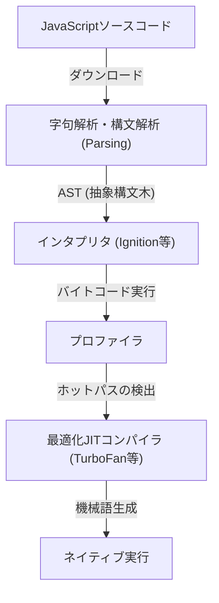
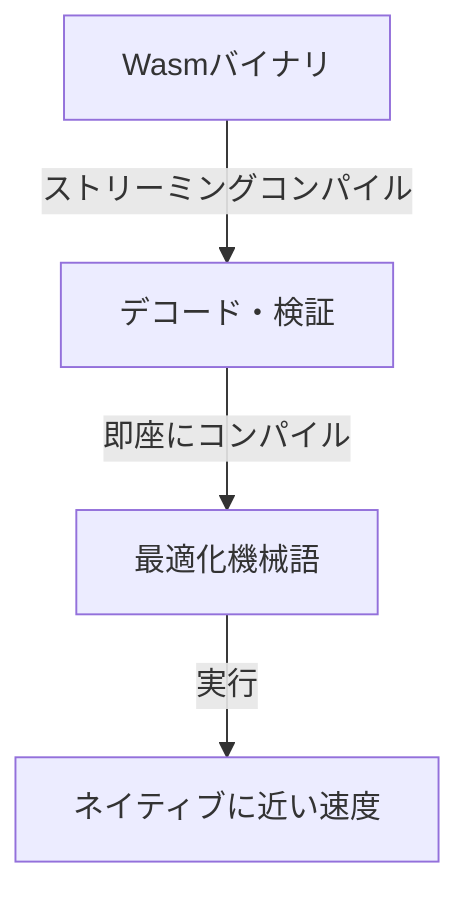
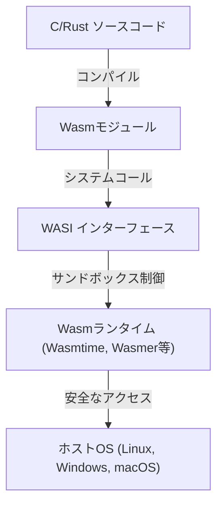

ウェブブラウザが誕生して以来、長らくブラウザ上で動作するプログラミング言語はJavaScriptの独壇場でした。しかし、ウェブアプリケーションが複雑化し、デスクトップアプリケーションに匹敵するパフォーマンスが求められるようになるにつれ、JavaScript単体では乗り越えられない壁が見えてきました。その壁を打ち破るべく登場したのが、WebAssembly（Wasm）です。

本記事では、JavaScriptの実行モデルとその限界、asm.jsの誕生からWebAssemblyへの進化、Wasmの技術的なアーキテクチャ（バイナリフォーマットやスタックマシン）、C/C++/Rustからのコンパイルプロセス、そしてWASIによるブラウザ外への展開まで、WebAssemblyの全貌を深く掘り下げて解説します。

## 1. JavaScriptの実行モデルとJITコンパイルの限界

WebAssemblyの真価を理解するためには、まずJavaScriptがブラウザ上でどのように実行され、どのような限界を抱えているかを知る必要があります。

### 1.1 パースとコンパイルのコスト

JavaScriptはテキストベースの動的型付け言語です。ブラウザがJavaScriptのコードを受け取ると、以下のステップを経て実行されます。



最初の関門は「パース（Parsing）」です。巨大なJavaScriptファイルを読み込む際、ブラウザはテキストをパースして抽象構文木（AST）を構築する必要があります。この処理はCPUに大きな負荷をかけ、特にモバイルデバイスではページの初期ロード時間（TTI: Time to Interactive）を遅延させる大きな要因となります。

### 1.2 JITコンパイラと型推論のジレンマ

現代のJavaScriptエンジン（V8、SpiderMonkey、JavaScriptCoreなど）は、JIT（Just-In-Time）コンパイラを搭載することで飛躍的な速度向上を遂げました。JITコンパイラは、コードの実行中に頻繁に呼び出される部分（ホットパス）を検出し、その部分の型を推論して最適化された機械語を生成します。

しかし、JavaScriptは動的型付け言語であるため、変数の型は実行時に変化する可能性があります。JITコンパイラは「この変数は常に数値である」という前提（アサンプション）に基づいて最適化を行います。

### 1.3 恐怖のDeoptimization（脱最適化）

もし実行中に前提が崩れた場合（例：これまで数値を渡していた関数に突然文字列を渡した）、JITコンパイラは最適化された機械語を破棄し、遅いインタプリタの実行に戻らざるを得ません。これを「Deoptimization（脱最適化）」または「Bailout」と呼びます。

Deoptimizationが発生すると、パフォーマンスは急激に低下します。高度な計算を行うアプリケーション（3Dゲーム、動画編集、物理演算など）において、この予測不能なパフォーマンスの変動は致命的です。開発者は常に「JITフレンドリー」なコードを書くことを強いられ、エンジン固有の最適化を意識するという本末転倒な状況が生じていました。

## 2. asm.jsの誕生：静的型付けへの渇望

JavaScriptのパフォーマンスの限界を感じていたMozillaの開発者たちは、2013年に「asm.js」というサブセットを発表しました。

### 2.1 asm.jsのアプローチ

asm.jsは新しい言語ではなく、JavaScriptの厳格なサブセットです。特定のコーディングパターン（ビット演算を用いた型アノテーション）を用いることで、変数の型を静的に確定させます。

例えば、以下のように記述することで、`x`と`y`が32ビット整数であることをエンジンに伝えます。

```javascript
function add(x, y) {
    x = x | 0; // 32ビット整数であることを明示
    y = y | 0;
    return (x + y) | 0;
}
```

### 2.2 asm.jsの功績と限界

asm.js対応のブラウザは、この特定のパターンを検知すると（Ahead-Of-Timeコンパイルに近い形で）Deoptimizationのリスクがないネイティブコードを直接生成できました。これにより、C/C++のコードをEmscripten経由でasm.jsに変換し、ブラウザ上で3Dゲームを動かすといった偉業が達成されました。

しかし、asm.jsには以下の問題がありました。
- **ファイルサイズの肥大化**: 型アノテーションによるテキストの冗長化。
- **パースコスト**: 依然として巨大なテキストファイルのパースが必要。
- **表現力の限界**: JavaScriptの文法に縛られているため、64ビット整数などの高度な機能のサポートが困難。

これらの限界を根本から解決するために、ブラウザベンダーが団結して設計したのが「WebAssembly」です。

## 3. WebAssembly（Wasm）のアーキテクチャ

WebAssembly（Wasm）は、ブラウザ上でネイティブコードに近い速度で実行できる、コンパクトなバイナリフォーマットです。2019年にはW3Cの標準となり、HTML、CSS、JavaScriptに次ぐ「Webの第4の言語」としての地位を確立しました。

### 3.1 バイナリフォーマットによる高速化

Wasmの最大の特徴は、テキストではなく「バイナリフォーマット（.wasm）」であることです。



ブラウザはネットワークからWasmバイナリをダウンロードする端から、ストリーミングでデコードとコンパイルを開始します。ASTの構築という重いパース処理が不要なため、JavaScriptに比べて起動時間が圧倒的に高速です。

### 3.2 スタックマシンモデル

Wasmは仮想的な「スタックマシン」上で実行されるように設計されています。スタックマシンはレジスタマシン（x86やARMなど）と異なり、オペランドをスタックに積み上げ（Push）、演算命令でスタックから値を取り出して計算し、結果を再びスタックに積む（Pop/Push）というシンプルなモデルです。

例えば、`1 + 2`の計算は概念的に以下のようになります。

1. `i32.const 1` (1をスタックに積む)
2. `i32.const 2` (2をスタックに積む)
3. `i32.add` (スタックから2つの値を取り出し、足して結果をスタックに積む)

このシンプルで抽象化されたモデルにより、Wasmはx86、ARM、MIPSなど、様々な物理ハードウェアの機械語へ容易かつ高速に変換（JIT/AOTコンパイル）することが可能です。

### 3.3 線形メモリ（Linear Memory）

Wasmモジュールは、JavaScriptのガベージコレクション（GC）とは切り離された、独自の連続したメモリ領域（線形メモリ）を持ちます。これはJavaScript側からは単なる `ArrayBuffer` として見えます。

C/C++やRustなどの言語は、この線形メモリ上でポインタを操作して手動でメモリ管理を行います。これにより、GCのポーズタイム（停止時間）によるフレーム落ちを防ぐことができ、リアルタイム性が要求されるアプリケーションに最適です。

### 3.4 強固なセキュリティとサンドボックス

WebAssemblyは設計当初からセキュリティを最優先事項としています。Wasmモジュールは、ブラウザの強力なサンドボックス環境内で実行されます。
線形メモリへのアクセスは厳密に境界チェックが行われ、バッファオーバーフロー攻撃などを防ぎます。また、Wasm単体ではDOM（Document Object Model）やネットワーク、ファイルシステムに直接アクセスする権限を持たず、必要な処理はすべてJavaScript（またはホスト環境）が提供する関数をインポートして呼び出す仕組みになっています。

## 4. 他言語からWasmへのコンパイルエコシステム

WebAssemblyは、開発者が直接Wasmのテキスト表現（WAT）を手書きすることを想定していません。C/C++やRust、Goなどの言語からコンパイルされるターゲットとして機能します。

### 4.1 EmscriptenとC/C++

Emscriptenは、LLVMをベースにしたWasmコンパイラツールチェーンです。元々はasm.js向けに開発されましたが、現在ではWasm生成のデファクトスタンダードとなっています。

Emscriptenの強力な点は、標準Cライブラリ（libc）やファイルシステム（ブラウザのIndexedDBを用いた仮想ファイルシステム）、OpenGL（WebGLへの変換）などをエミュレートするJavaScriptのグルー（糊）コードを自動生成してくれることです。これにより、既存の巨大なC/C++コードベース（例えばゲームエンジンや画像処理ライブラリ）を、比較的簡単にWebへ移植することができます。

### 4.2 Rust：Wasm時代のファーストクラス言語

Rustは、所有権モデルによるメモリ安全性と高速な実行速度を兼ね備えたモダンなシステムプログラミング言語であり、WebAssemblyとの相性が抜群に良いことで知られています。

Rustツールチェーンは標準でWasmターゲット（`wasm32-unknown-unknown`）をサポートしており、`wasm-bindgen` という強力なライブラリを使うことで、JavaScriptとのインターフェース（DOM操作やJavaScriptのクラスのやり取り）をシームレスに行うことができます。ガベージコレクションを持たないRustは、生成されるWasmバイナリのサイズを極小に抑えられるため、Webのフロントエンド開発において「重い処理だけをRust/Wasmで書く」というアプローチが急増しています。

### 4.3 ガベージコレクション言語（Go, C#, Kotlin）

近年、Wasm標準に「Wasm GC（Garbage Collection）」の提案が組み込まれる動きが進んでいます。これまでGoやC#（Blazor）をWasmにコンパイルする場合、モジュール内に言語固有の巨大なガベージコレクタを同梱する必要があり、バイナリサイズが肥大化する問題がありました。

Wasm GCがブラウザにネイティブ実装されることで、ホスト（V8などのJavaScriptエンジン）の高性能なガベージコレクタを直接利用できるようになり、Java、Kotlin、Dart（Flutter）などの動的メモリ管理を行う言語のWebAssembly対応が爆発的に進化しています。

## 5. WebAssembly System Interface (WASI): ブラウザの外へ

WebAssemblyはブラウザの中だけで終わる技術ではありません。「Write Once, Run Anywhere（一度書けば、どこでも動く）」というJavaが掲げた夢を、より軽量かつ安全な形で実現しようとしています。それを推進しているのが **WASI (WebAssembly System Interface)** です。

### 5.1 WASIとは何か？

Wasmは前述の通り、デフォルトではOSの機能（ファイル入出力、ネットワーク、システム時計など）にアクセスできません。ブラウザ内ではJavaScriptがその橋渡しをしていましたが、ブラウザ外のサーバー環境でWasmを動かす場合、共通のインターフェースが必要になります。

WASIは、WebAssemblyのための標準化されたシステムインターフェースです。POSIXに似たAPIを提供し、Wasmモジュールが安全にOSのリソースにアクセスできるようにします。



### 5.2 コンテナに代わる次世代の軽量実行環境

WASIの登場により、Dockerコンテナに代わる「ナノコンテナ」としてのWebAssemblyに世界中が注目しています。WasmはDockerコンテナに比べて以下の利点があります。

1. **圧倒的な起動速度**: Wasmランタイムは数ミリ秒〜数マイクロ秒で起動します。これはコンテナの数百倍の速さです。
2. **プラットフォーム非依存**: WasmバイナリはARMでもx86でも、LinuxでもWindowsでも同じものが動きます。
3. **強力なセキュリティ**: デフォルトで完全に隔離されており、WASIを通じて明示的に許可されたディレクトリやポートにしかアクセスできません。

### 5.3 エッジコンピューティングでの活用

この特性が最も活きるのが、CDNのエッジワーカーやサーバーレス関数（FaaS）の領域です。FastlyのCompute@EdgeやCloudflare Workersは、内部でV8のIsolateや専用のWasmランタイムを用いており、世界中のエッジサーバー上でミリ秒単位でのスケーリングと実行を実現しています。

## 6. まとめと未来への展望

WebAssemblyは、JavaScriptを置き換えるものではありません。JavaScriptはUIの制御やDOM操作において比類なき柔軟性とエコシステムを持っています。Wasmは「重い計算処理」「既存のC/C++/Rust資産の活用」「厳密なパフォーマンスの保証」といった、JavaScriptが苦手とする領域を補完する最高のパートナーです。

動画・音声エンコーダ、CADソフト、高度なデータビジュアライゼーション、暗号化処理、そしてAIのブラウザ内推論（TensorFlow.jsのWasmバックエンドなど）に至るまで、Wasmのユースケースは日々拡大しています。

さらに、WASIを通じたクラウドネイティブ・エッジコンピューティング領域での躍進は、バックエンドのアーキテクチャに革命を起こしつつあります。ブラウザの限界を突破するために生まれたWebAssemblyは、今やWebの枠すら飛び越え、あらゆる場所でコードを安全かつ高速に実行するための「ユニバーサル・バイナリフォーマット」としての道を歩み始めているのです。
