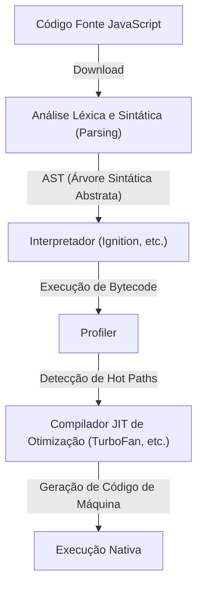
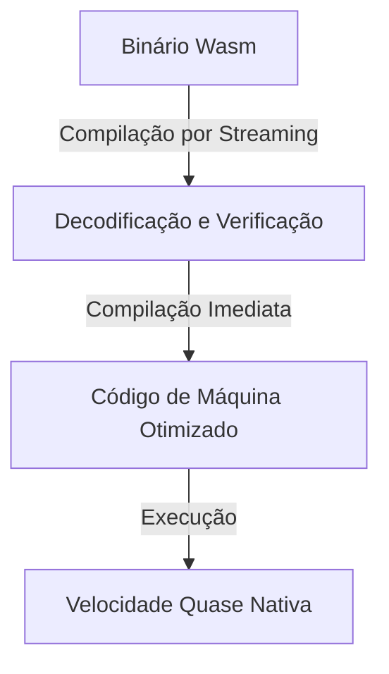
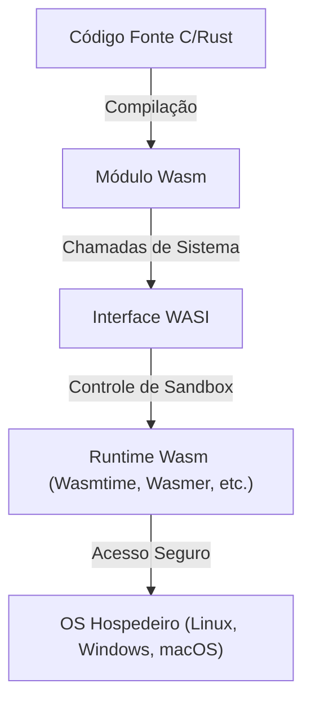

Desde o nascimento dos navegadores web, as linguagens de programação que rodam no navegador têm sido um monopólio do JavaScript. No entanto, à medida que os aplicativos web se tornam mais complexos e exigem desempenho comparável aos aplicativos de desktop, os limites do JavaScript sozinho tornaram-se aparentes. O WebAssembly (Wasm) surgiu para romper essa barreira.

Neste artigo, exploraremos a fundo todo o panorama do WebAssembly, desde o modelo de execução e as limitações do JavaScript, o nascimento do asm.js até a evolução para o WebAssembly, a arquitetura técnica do Wasm (formato binário e máquina de pilha), o processo de compilação a partir de C/C++/Rust e sua expansão além do navegador através da WASI.

## 1. O Modelo de Execução do JavaScript e as Limitações da Compilação JIT

Para entender o verdadeiro valor do WebAssembly, precisamos primeiro entender como o JavaScript é executado no navegador e quais limitações ele enfrenta.

### 1.1 O Custo de Análise e Compilação

O JavaScript é uma linguagem de tipagem dinâmica baseada em texto. Quando o navegador recebe o código JavaScript, ele passa pelas seguintes etapas antes de ser executado:



O primeiro obstáculo é a "Análise" (Parsing). Ao carregar grandes arquivos JavaScript, o navegador precisa analisar o texto e construir uma Árvore Sintática Abstrata (AST). Esse processo sobrecarrega a CPU, especialmente em dispositivos móveis, e é um fator importante no atraso do Tempo de Interação (TTI: Time to Interactive) inicial da página.

### 1.2 O Dilema do Compilador JIT e Inferência de Tipos

Os modernos motores de JavaScript (V8, SpiderMonkey, JavaScriptCore, etc.) alcançaram melhorias drásticas de velocidade ao incorporar compiladores JIT (Just-In-Time). O compilador JIT detecta as partes do código que são chamadas com frequência durante a execução (hot paths), infere seus tipos e gera código de máquina otimizado.

No entanto, como o JavaScript é uma linguagem de tipagem dinâmica, o tipo de uma variável pode mudar em tempo de execução. O compilador JIT otimiza com base na suposição de que "esta variável sempre será um número".

### 1.3 A Temida Desotimização (Deoptimization)

Se a suposição for quebrada durante a execução (por exemplo, passar subitamente uma string para uma função que anteriormente só recebia números), o compilador JIT é forçado a descartar o código de máquina otimizado e retornar à execução mais lenta do interpretador. Isso é chamado de "Desotimização" (Deoptimization) ou "Bailout".

Quando ocorre uma desotimização, o desempenho cai drasticamente. Para aplicativos que realizam cálculos intensos (jogos 3D, edição de vídeo, simulações físicas, etc.), essas flutuações imprevisíveis de desempenho são fatais. Isso forçava os desenvolvedores a escrever um código "JIT-friendly", preocupando-se constantemente com as otimizações específicas do motor – uma situação contraproducente.

## 2. O Nascimento do asm.js: O Desejo por Tipagem Estática

Sentindo os limites de desempenho do JavaScript, os desenvolvedores da Mozilla lançaram um subconjunto chamado "asm.js" em 2013.

### 2.1 A Abordagem do asm.js

O asm.js não é uma nova linguagem, mas um subconjunto estrito de JavaScript. Ao usar certos padrões de codificação (anotações de tipo usando operações bit a bit), ele permite a determinação estática dos tipos de variáveis.

Por exemplo, ao escrever o seguinte código, informamos ao motor que `x` e `y` são inteiros de 32 bits.

```javascript
function add(x, y) {
    x = x | 0; // Especifica explicitamente como um inteiro de 32 bits
    y = y | 0;
    return (x + y) | 0;
}
```

### 2.2 Conquistas e Limitações do asm.js

Navegadores que suportavam asm.js, ao detectar esse padrão específico, podiam gerar código nativo sem o risco de desotimização diretamente (de forma semelhante à compilação Ahead-Of-Time). Com isso, foi possível compilar código C/C++ para asm.js via Emscripten e rodar jogos 3D no navegador.

No entanto, o asm.js tinha os seguintes problemas:
- **Inchaço no tamanho do arquivo**: O texto ficava longo devido às anotações de tipo.
- **Custo de análise**: Ainda era necessário analisar arquivos de texto massivos.
- **Limites de expressividade**: Amarrado à sintaxe do JavaScript, dificultava o suporte a recursos avançados, como inteiros de 64 bits.

Para resolver essas limitações desde a raiz, os fornecedores de navegadores uniram forças para projetar o "WebAssembly".

## 3. A Arquitetura do WebAssembly (Wasm)

O WebAssembly (Wasm) é um formato binário compacto que pode ser executado em velocidades quase nativas no navegador. Tornou-se um padrão da W3C em 2019, estabelecendo sua posição como a "4ª Linguagem da Web" ao lado de HTML, CSS e JavaScript.

### 3.1 Aceleração com Formato Binário

A maior característica do Wasm é que ele não é texto, mas um "formato binário (.wasm)".



Enquanto o navegador baixa o binário Wasm da rede, ele inicia a decodificação e a compilação simultaneamente, através de streaming. Como a pesada tarefa de análise (construção da AST) é desnecessária, o tempo de inicialização é esmagadoramente mais rápido do que o do JavaScript.

### 3.2 Modelo de Máquina de Pilha

O Wasm é projetado para rodar numa "máquina de pilha" (stack machine) virtual. Diferente das máquinas de registradores (como x86 ou ARM), as máquinas de pilha empurram os operandos (Push) para uma pilha, retiram os valores com instruções de operação (Pop), calculam-nos e colocam o resultado de volta na pilha (Push). É um modelo muito simples.

Por exemplo, a conta de `1 + 2` conceitualmente funciona assim:

1. `i32.const 1` (Coloca 1 na pilha)
2. `i32.const 2` (Coloca 2 na pilha)
3. `i32.add` (Remove 2 valores da pilha, soma-os e coloca o resultado na pilha)

Com esse modelo simples e abstraído, o Wasm pode ser convertido de forma rápida e fácil (via compilação JIT/AOT) em código de máquina para diferentes hardwares físicos como x86, ARM e MIPS.

### 3.3 Memória Linear (Linear Memory)

Os módulos Wasm têm sua própria área contígua de memória (memória linear), separada do Garbage Collection (GC) do JavaScript. O lado do JavaScript apenas a enxerga como um mero `ArrayBuffer`.

Linguagens como C/C++ ou Rust operam os ponteiros dessa memória linear e cuidam da alocação/liberação de memória manualmente. Isso evita a queda de quadros devido aos tempos de pausa do GC, tornando o Wasm ideal para aplicações em tempo real.

### 3.4 Segurança Sólida e Sandbox

O WebAssembly, desde sua concepção, colocou a segurança como prioridade máxima. Os módulos Wasm operam dentro de um ambiente isolado (sandbox) bastante restrito no navegador.
O acesso à memória linear tem os limites estritamente verificados para impedir ataques como o transbordamento de buffer. Além disso, o Wasm sozinho não tem acesso direto ao DOM, à rede ou ao sistema de arquivos. Todas essas operações só ocorrem importando e chamando funções fornecidas pelo JavaScript (ou pelo ambiente hospedeiro).

## 4. O Ecossistema de Compilação de Outras Linguagens para Wasm

O WebAssembly não foi feito para que os desenvolvedores codifiquem à mão em seu formato de texto (WAT). Ele serve como um alvo de compilação para linguagens como C/C++, Rust, Go, etc.

### 4.1 Emscripten e C/C++

O Emscripten é uma toolchain para compilação Wasm baseada em LLVM. Originalmente desenvolvido para o asm.js, é hoje o padrão da indústria para a criação de Wasm.

O poder do Emscripten está em gerar automaticamente o código "cola" (glue code) em JavaScript que emula a biblioteca padrão C (libc), o sistema de arquivos (como um sistema de arquivos virtual usando o IndexedDB do navegador) e o OpenGL (convertido para WebGL). Isso possibilita portar para a Web bases de código gigantescas em C/C++ (motores de jogo ou bibliotecas de processamento de imagem, por exemplo) com relativa facilidade.

### 4.2 Rust: A Linguagem de Primeira Classe da Era Wasm

O Rust é uma linguagem de programação de sistemas moderna que combina a segurança de memória do seu modelo de "Ownership" com altas velocidades de execução. O Rust e o WebAssembly têm uma excelente sinergia.

A toolchain do Rust já possui suporte nativo ao alvo Wasm (`wasm32-unknown-unknown`), e com a poderosa biblioteca `wasm-bindgen`, fazer a ponte com o JavaScript (manipulação do DOM e classes do JavaScript) torna-se muito fluído. Como o Rust não possui Garbage Collector nativo de execução, o binário Wasm gerado pode ser extremamente pequeno. Por conta disso, na área de Frontend, uma abordagem onde apenas os "cálculos pesados" são passados para o Rust/Wasm está crescendo rapidamente.

### 4.3 Linguagens com Garbage Collection (Go, C#, Kotlin)

Nos últimos anos, está havendo um movimento progressivo para incorporar a proposta "Wasm GC (Garbage Collection)" no padrão Wasm. Antes, quando compilávamos Go ou C# (Blazor) para Wasm, tínhamos de incluir no módulo o coletor de lixo da respectiva linguagem, o que inchava demais o tamanho do binário.

Com a implementação nativa do Wasm GC pelos navegadores, tornou-se possível utilizar diretamente o GC de alto desempenho do hospedeiro (como o V8), fazendo com que o suporte ao Wasm para linguagens com gerenciamento dinâmico de memória (Java, Kotlin, Dart/Flutter) evoluísse de forma drástica.

## 5. WebAssembly System Interface (WASI): Além do Navegador

O WebAssembly não é uma tecnologia apenas para dentro do navegador. A promessa antiga do Java de "Write Once, Run Anywhere" (Escreva uma vez, execute em qualquer lugar) está sendo trazida de volta, porém de forma muito mais leve e segura, e a **WASI (WebAssembly System Interface)** é o que impulsiona isso.

### 5.1 O que é a WASI?

Como vimos, por padrão, o Wasm não tem acesso aos recursos do sistema operacional (arquivos, rede, relógio do sistema). Dentro do navegador, quem fazia a ponte era o JavaScript. Mas caso se queira rodar um Wasm fora do navegador, num servidor, é necessária uma interface comum.

A WASI é a interface de sistema padronizada para o WebAssembly. Ela provê uma API parecida com o POSIX para que os módulos Wasm consigam acessar, com segurança, os recursos do sistema operacional.



### 5.2 A Próxima Geração de Ambientes de Execução Leves como Alternativa a Contêineres

O mundo todo está de olho no WebAssembly como "nanocontêiner" substituto dos contêineres do Docker graças à WASI. Comparado ao Docker, o Wasm possui:

1. **Velocidade de inicialização esmagadora**: Um runtime Wasm inicializa entre milissegundos e microssegundos. É centenas de vezes mais rápido que contêineres.
2. **Independência de Plataforma**: O mesmo binário Wasm roda no ARM, no x86, no Linux ou no Windows sem modificações.
3. **Segurança Extrema**: Sendo perfeitamente isolado por padrão, só poderá acessar diretórios e portas através da WASI caso você lhe conceda essas permissões explicitamente.

### 5.3 Aplicações na Edge Computing

O lugar em que essas características mais brilham é nas arquiteturas de Edge Computing para CDNs e funções Serverless (FaaS). Serviços como o Fastly Compute@Edge e o Cloudflare Workers utilizam V8 Isolates ou runtimes Wasm dedicados e possibilitam a execução e a escalabilidade nos servidores da Edge do mundo todo na casa dos milissegundos.

## 6. Conclusão e Perspectivas para o Futuro

O WebAssembly não existe para substituir o JavaScript. Para a manipulação de UI e do DOM, o JavaScript tem ecossistema e flexibilidade inigualáveis. O WebAssembly é o "parceiro perfeito" que entra para cobrir o que o JavaScript não consegue entregar bem: "processamentos pesados", "reaproveitamento da base sólida do C/C++/Rust" e a "garantia firme de desempenho".

O WebAssembly expande cada vez mais as suas áreas de utilidade, que vão desde codificadores de áudio e vídeo, softwares CAD, processamentos densos de visualização de dados, processos de criptografia a até o próprio lado de inferência em IAs executadas no navegador (como o backend Wasm do TensorFlow.js).

Mais do que isso: pelo poder da WASI nas áreas nativas da nuvem e edge computing, ele está revolucionando a arquitetura Back-end. Criado originalmente só para derrubar os obstáculos de velocidade nos navegadores, o WebAssembly transbordou até das próprias fronteiras da web, trilhando seu caminho para se consagrar como o "formato binário universal" que permite rodar código de forma rápida e segura em qualquer dispositivo e ambiente de sistema do planeta.
