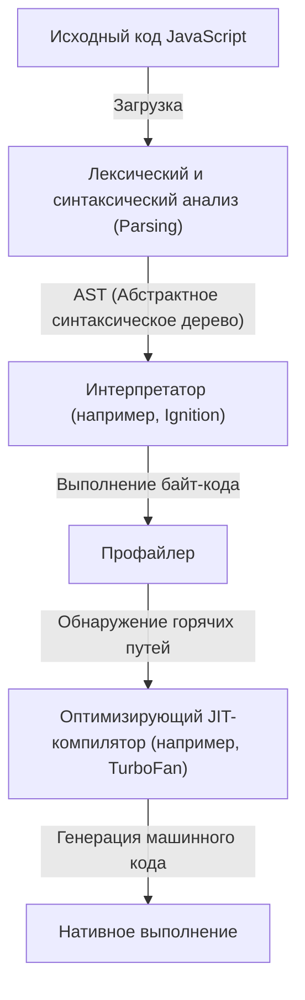
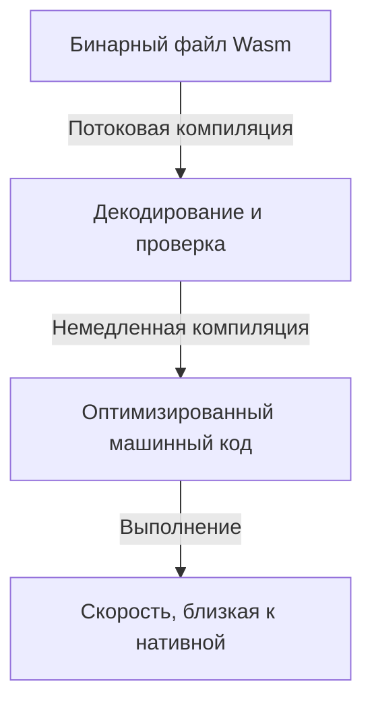
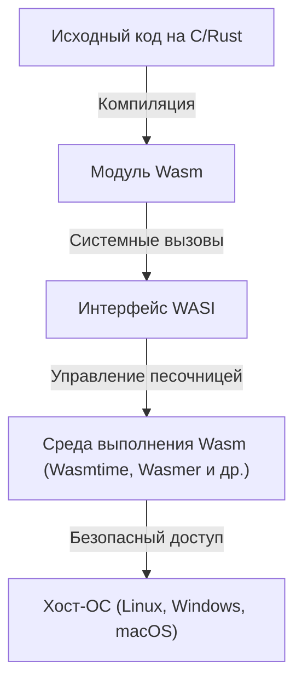

С момента появления веб-браузеров, программирование для них долгое время было монополией JavaScript. Однако, по мере того как веб-приложения становились всё сложнее и требовали производительности, сопоставимой с десктопными программами, стали очевидны ограничения JavaScript, которые он не мог преодолеть в одиночку. Чтобы разрушить этот барьер, был создан WebAssembly (Wasm).

В этой статье мы глубоко погрузимся во все аспекты WebAssembly: рассмотрим модель выполнения JavaScript и её ограничения, эволюцию от asm.js к WebAssembly, техническую архитектуру Wasm (бинарный формат и стековая машина), процесс компиляции из C/C++/Rust, а также выход за пределы браузера с помощью WASI.

## 1. Модель выполнения JavaScript и ограничения JIT-компиляции

Чтобы понять истинную ценность WebAssembly, сначала нужно узнать, как выполняется JavaScript в браузере и с какими ограничениями он сталкивается.

### 1.1 Затраты на парсинг и компиляцию

JavaScript — это текстовый язык с динамической типизацией. Когда браузер получает код на JavaScript, он проходит через следующие этапы перед выполнением:



Первым препятствием является «парсинг» (Parsing). При загрузке огромных файлов JavaScript браузеру необходимо разобрать текст и построить абстрактное синтаксическое дерево (AST). Этот процесс сильно нагружает CPU и, особенно на мобильных устройствах, становится главной причиной задержки времени до интерактивности страницы (TTI: Time to Interactive).

### 1.2 Дилемма JIT-компилятора и вывода типов

Современные JavaScript-движки (V8, SpiderMonkey, JavaScriptCore и др.) достигли огромного прироста скорости за счет внедрения JIT (Just-In-Time) компиляторов. JIT-компилятор обнаруживает часто вызываемые участки кода во время его выполнения (горячие пути), выводит их типы и генерирует оптимизированный машинный код.

Однако, поскольку JavaScript — язык с динамической типизацией, типы переменных могут меняться во время выполнения. JIT-компилятор проводит оптимизацию на основе предположения (допущения), что «эта переменная всегда является числом».

### 1.3 Ужас деоптимизации (Deoptimization)

Если во время выполнения предположение нарушается (например, в функцию, которая ранее получала числа, вдруг передается строка), JIT-компилятор вынужден отбросить оптимизированный машинный код и вернуться к медленному интерпретатору. Это называется «деоптимизацией» (Deoptimization) или «Bailout».

При возникновении деоптимизации производительность резко падает. В приложениях с интенсивными вычислениями (3D-игры, редактирование видео, физическое моделирование и т.д.) такие непредсказуемые колебания производительности фатальны. Разработчикам приходилось постоянно писать «JIT-дружелюбный» код, ориентируясь на оптимизации конкретного движка, что переворачивало всё с ног на голову.

## 2. Рождение asm.js: жажда статической типизации

В 2013 году разработчики Mozilla, ощущая пределы производительности JavaScript, представили его подмножество — «asm.js».

### 2.1 Подход asm.js

asm.js — это не новый язык, а строгое подмножество JavaScript. Используя определенные шаблоны кодирования (аннотации типов с помощью побитовых операций), он статически определяет типы переменных.

Например, написав следующий код, мы сообщаем движку, что `x` и `y` являются 32-битными целыми числами:

```javascript
function add(x, y) {
    x = x | 0; // Явно указываем, что это 32-битное целое число
    y = y | 0;
    return (x + y) | 0;
}
```

### 2.2 Достижения и ограничения asm.js

Браузеры, поддерживающие asm.js, при обнаружении этого специфического паттерна могли напрямую генерировать нативный код без риска деоптимизации (почти как при Ahead-Of-Time компиляции). Благодаря этому стало возможным конвертировать код на C/C++ через Emscripten в asm.js и совершать такие подвиги, как запуск 3D-игр в браузере.

Однако у asm.js были следующие проблемы:
- **Увеличение размера файла**: раздувание текста из-за аннотаций типов.
- **Затраты на парсинг**: по-прежнему требовался парсинг огромных текстовых файлов.
- **Ограниченная выразительность**: будучи привязанным к синтаксису JavaScript, было сложно поддерживать продвинутые функции, такие как 64-битные целые числа.

Чтобы решить эти проблемы на фундаментальном уровне, производители браузеров объединились для разработки «WebAssembly».

## 3. Архитектура WebAssembly (Wasm)

WebAssembly (Wasm) — это компактный бинарный формат, который может выполняться в браузере со скоростью, близкой к нативному коду. В 2019 году он стал стандартом W3C, утвердив свой статус «4-го языка веба» после HTML, CSS и JavaScript.

### 3.1 Ускорение за счет бинарного формата

Главная особенность Wasm в том, что это «бинарный формат» (.wasm), а не текст.



Браузер начинает декодирование и компиляцию в потоковом режиме по мере скачивания бинарного файла Wasm из сети. Поскольку тяжелый процесс парсинга для построения AST не требуется, время запуска несоизмеримо быстрее по сравнению с JavaScript.

### 3.2 Модель стековой машины

Wasm спроектирован для выполнения на виртуальной «стековой машине». В отличие от регистровых машин (например, x86 или ARM), стековая машина работает по простой модели: операнды помещаются в стек (Push), инструкции извлекают значения из стека, выполняют вычисления и снова помещают результат в стек (Pop/Push).

Например, концептуально вычисление `1 + 2` выглядит так:

1. `i32.const 1` (поместить 1 в стек)
2. `i32.const 2` (поместить 2 в стек)
3. `i32.add` (извлечь два значения из стека, сложить их и поместить результат в стек)

Эта простая и абстрактная модель позволяет легко и быстро преобразовывать Wasm в машинный код (через JIT/AOT компиляцию) для различного физического оборудования, такого как x86, ARM, MIPS и др.

### 3.3 Линейная память (Linear Memory)

Модуль Wasm имеет собственную непрерывную область памяти (линейную память), которая отделена от сборщика мусора (GC) JavaScript. Со стороны JavaScript это выглядит просто как `ArrayBuffer`.

Такие языки, как C/C++ и Rust, осуществляют ручное управление памятью, манипулируя указателями в этой линейной памяти. Это позволяет избежать пропусков кадров из-за пауз сборщика мусора (потерь времени), что идеально подходит для приложений, требующих работы в реальном времени.

### 3.4 Надежная безопасность и песочница

WebAssembly с самого начала проектировался с учетом того, что безопасность является главным приоритетом. Модули Wasm выполняются в надежной среде песочницы браузера.
Доступ к линейной памяти строго проверяется на соблюдение границ, что предотвращает атаки типа переполнения буфера. Кроме того, Wasm сам по себе не имеет прав прямого доступа к DOM, сети или файловой системе; все необходимые операции выполняются путем импорта и вызова функций, предоставляемых JavaScript (или хост-средой).

## 4. Экосистема компиляции из других языков в Wasm

WebAssembly не предполагает, что разработчики будут напрямую писать код в его текстовом представлении (WAT). Он служит целевой платформой компиляции для таких языков, как C/C++, Rust, Go и других.

### 4.1 Emscripten и C/C++

Emscripten — это набор инструментов компилятора Wasm на базе LLVM. Изначально он разрабатывался для asm.js, но сейчас стал стандартом де-факто для генерации Wasm.

Сильная сторона Emscripten заключается в том, что он автоматически генерирует связующий код (glue code) на JavaScript, который эмулирует стандартную библиотеку C (libc), файловую систему (виртуальную файловую систему с использованием IndexedDB браузера), OpenGL (трансляция в WebGL) и так далее. Это позволяет относительно легко портировать огромные существующие кодовые базы на C/C++ (например, игровые движки или библиотеки обработки изображений) в Web.

### 4.2 Rust: первоклассный язык в эпоху Wasm

Rust — это современный язык системного программирования, сочетающий в себе безопасность памяти благодаря модели владения и высокую скорость выполнения. Он славится своей превосходной совместимостью с WebAssembly.

Инструментарий Rust по умолчанию поддерживает цель Wasm (`wasm32-unknown-unknown`), а использование мощной библиотеки `wasm-bindgen` позволяет бесшовно интегрироваться с JavaScript (взаимодействие с DOM и классами JavaScript). Поскольку в Rust нет сборщика мусора, размер генерируемых бинарных файлов Wasm можно свести к минимуму. Благодаря этому во фронтенд-разработке стремительно набирает популярность подход «писать на Rust/Wasm только тяжелые вычисления».

### 4.3 Языки со сборкой мусора (Go, C#, Kotlin)

В последние годы активно продвигается внедрение предложения «Wasm GC (Garbage Collection)» в стандарт Wasm. До сих пор при компиляции Go или C# (Blazor) в Wasm приходилось включать в модуль огромный сборщик мусора, специфичный для данного языка, что приводило к раздуванию размера бинарного файла.

Благодаря встроенной поддержке Wasm GC в браузерах появилась возможность напрямую использовать высокопроизводительные сборщики мусора хоста (например, движка V8). Это привело к взрывному развитию поддержки WebAssembly для языков с динамическим управлением памятью, таких как Java, Kotlin и Dart (Flutter).

## 5. WebAssembly System Interface (WASI): за пределы браузера

WebAssembly — это технология, которая не ограничивается рамками браузера. Она стремится реализовать мечту Java «Write Once, Run Anywhere» (напиши один раз, запускай где угодно) в более легком и безопасном формате. Движущей силой этого процесса является **WASI (WebAssembly System Interface)**.

### 5.1 Что такое WASI?

Как упоминалось ранее, по умолчанию Wasm не имеет доступа к функциям ОС (файловый ввод/вывод, сеть, системные часы и т.д.). В браузере роль моста играл JavaScript, но для выполнения Wasm в серверной среде вне браузера необходим общий интерфейс.

WASI — это стандартизированный системный интерфейс для WebAssembly. Он предоставляет API, подобный POSIX, позволяя модулям Wasm безопасно обращаться к ресурсам ОС.



### 5.2 Легковесная среда выполнения нового поколения, заменяющая контейнеры

С появлением WASI весь мир обратил внимание на WebAssembly как на «нано-контейнер», который может заменить Docker-контейнеры. У Wasm есть следующие преимущества перед контейнерами Docker:

1. **Невероятная скорость запуска**: среда выполнения Wasm запускается за несколько миллисекунд или микросекунд. Это в сотни раз быстрее, чем контейнеры.
2. **Независимость от платформы**: один и тот же бинарный файл Wasm будет работать как на ARM, так и на x86, как на Linux, так и на Windows.
3. **Высокая безопасность**: по умолчанию модули полностью изолированы и имеют доступ только к тем каталогам и портам, которые явно разрешены через WASI.

### 5.3 Использование в периферийных вычислениях (Edge Computing)

Эти характеристики лучше всего проявляются в сфере Edge Workers в CDN и бессерверных функций (FaaS). Например, Fastly Compute@Edge и Cloudflare Workers внутри используют V8 Isolate или специализированные среды выполнения Wasm, обеспечивая масштабирование и выполнение кода за миллисекунды на граничных серверах по всему миру.

## 6. Заключение и взгляд в будущее

WebAssembly не призван заменить JavaScript. JavaScript обладает непревзойденной гибкостью и экосистемой в управлении UI и взаимодействии с DOM. Wasm — это идеальный партнер, который дополняет JavaScript в тех областях, где последний не силен: «тяжелые вычисления», «использование существующих наработок на C/C++/Rust» и «строгие гарантии производительности».

Сценарии использования Wasm расширяются с каждым днем: от видео- и аудиокодеков, CAD-программ, продвинутой визуализации данных, криптографических операций и до выполнения AI-инференса прямо в браузере (например, через Wasm-бэкенд TensorFlow.js).

Кроме того, прорыв в области облачных и периферийных вычислений благодаря WASI вызывает революцию в архитектуре бэкенда. WebAssembly, созданный для преодоления ограничений браузера, теперь выходит за его пределы и начинает свой путь в качестве «универсального бинарного формата» для безопасного и быстрого выполнения кода где угодно.
