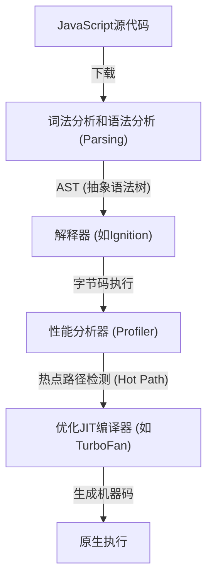
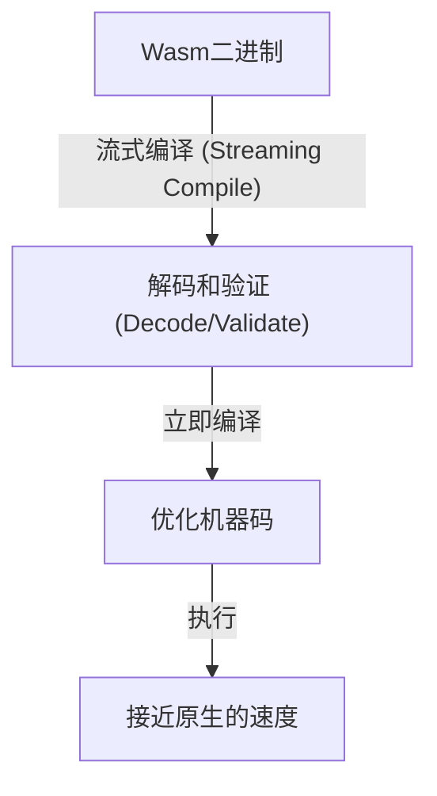
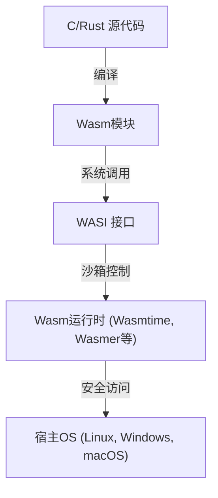

自从网页浏览器诞生以来，很长一段时间内，在浏览器上运行的编程语言一直是JavaScript的天下。然而，随着Web应用程序变得越来越复杂，并要求具备与桌面应用程序相媲美的性能，仅靠JavaScript已遇到难以逾越的瓶颈。为了打破这一瓶颈，WebAssembly (Wasm) 应运而生。

本文将深入探讨WebAssembly的全貌，从JavaScript的执行模型及其局限性，asm.js的诞生到WebAssembly的演进，Wasm的技术架构（二进制格式和堆栈机），从C/C++/Rust的编译过程，到通过WASI向浏览器外扩展。

## 1. JavaScript的执行模型与JIT编译的局限性

为了理解WebAssembly的真正价值，我们必须首先了解JavaScript是如何在浏览器上执行的，以及它面临着哪些局限性。

### 1.1 解析和编译的成本

JavaScript是一种基于文本的动态类型语言。当浏览器接收到JavaScript代码时，需要经过以下步骤才能执行。



第一道关卡是“解析 (Parsing)”。在加载庞大的JavaScript文件时，浏览器必须解析文本并构建抽象语法树 (AST)。这个过程会给CPU带来沉重的负担，特别是在移动设备上，这是延迟页面初始加载时间 (TTI: Time to Interactive) 的主要因素。

### 1.2 JIT编译器与类型推断的困境

现代JavaScript引擎（如V8、SpiderMonkey、JavaScriptCore等）通过搭载JIT (Just-In-Time) 编译器实现了速度的飞跃。JIT编译器在代码执行期间检测频繁调用的部分（热点路径），推断该部分的类型，并生成优化的机器码。

然而，由于JavaScript是动态类型语言，变量的类型在运行时可能会发生变化。JIT编译器基于“这个变量始终是数字”的假设 (Assumption) 进行优化。

### 1.3 令人畏惧的去优化 (Deoptimization)

如果在执行过程中假设被打破（例如，将字符串传递给以前一直传递数字的函数），JIT编译器将不得不丢弃优化的机器码，回到较慢的解释器执行。这被称为“去优化 (Deoptimization)”或“Bailout”。

去优化一旦发生，性能就会急剧下降。在进行复杂计算的应用程序（如3D游戏、视频剪辑、物理模拟等）中，这种不可预测的性能波动是致命的。开发者总是被迫编写“JIT友好”的代码，从而导致本末倒置——必须迎合特定引擎的优化策略。

## 2. asm.js的诞生：对静态类型的渴望

感受到JavaScript性能极限的Mozilla开发者们在2013年发布了一个名为“asm.js”的子集。

### 2.1 asm.js的方法

asm.js不是一种新语言，而是JavaScript的一个严格子集。通过使用特定的编码模式（使用位运算进行类型注解），可以在静态时确定变量的类型。

例如，通过如下编写，可以告知引擎 `x` 和 `y` 是32位整数。

```javascript
function add(x, y) {
    x = x | 0; // 明示为32位整数
    y = y | 0;
    return (x + y) | 0;
}
```

### 2.2 asm.js的功绩与局限

支持asm.js的浏览器在检测到这种特定模式时，可以直接生成没有去优化风险的原生代码（类似于AOT编译）。因此，通过Emscripten将C/C++代码转换为asm.js并在浏览器上运行3D游戏等壮举得以实现。

然而，asm.js存在以下问题：
- **文件体积膨胀**: 类型注解导致文本冗长。
- **解析成本**: 依然需要解析庞大的文本文件。
- **表达能力的局限**: 受限于JavaScript语法，难以支持64位整数等高级功能。

为了从根本上解决这些局限，浏览器厂商联合设计了“WebAssembly”。

## 3. WebAssembly (Wasm) 的架构

WebAssembly (Wasm) 是一种紧凑的二进制格式，能够以接近原生代码的速度在浏览器上运行。它在2019年成为W3C标准，确立了继HTML、CSS、JavaScript之后的“Web第四种语言”地位。

### 3.1 通过二进制格式实现加速

Wasm最大的特点是它是“二进制格式 (.wasm)”而不是文本。



浏览器从网络下载Wasm二进制文件时，会一边下载一边进行流式解码和编译。由于不需要构建AST这一繁重的解析处理，其启动时间相比JavaScript有压倒性的优势。

### 3.2 堆栈机模型 (Stack Machine)

Wasm被设计为在虚拟的“堆栈机”上运行。与寄存器机（如x86、ARM等）不同，堆栈机是将操作数压入堆栈 (Push)，运算指令从堆栈中取出值进行计算，然后再将结果压回堆栈 (Pop/Push) 的简单模型。

例如，计算 `1 + 2` 在概念上如下所示：

1. `i32.const 1` (将1压入堆栈)
2. `i32.const 2` (将2压入堆栈)
3. `i32.add` (从堆栈中取出两个值，相加后将结果压入堆栈)

通过这种简单且抽象的模型，Wasm可以轻松快速地转换为各种物理硬件的机器码（JIT/AOT编译），如x86、ARM、MIPS等。

### 3.3 线性内存 (Linear Memory)

Wasm模块拥有与JavaScript垃圾回收 (GC) 隔离的独立连续内存区域（线性内存）。从JavaScript侧来看，它只是一个普通的 `ArrayBuffer`。

C/C++和Rust等语言在此线性内存上通过操作指针进行手动内存管理。这可以防止由于GC暂停时间而导致的掉帧，非常适合对实时性要求极高的应用程序。

### 3.4 强大的安全性和沙箱

WebAssembly从设计之初就将安全性放在首位。Wasm模块在浏览器强大的沙箱环境中执行。
对线性内存的访问会受到严格的边界检查，从而防止缓冲区溢出等攻击。此外，Wasm本身没有直接访问DOM (Document Object Model)、网络或文件系统的权限，所有必要的操作都必须通过导入并调用JavaScript（或宿主环境）提供的函数来实现。

## 4. 从其他语言到Wasm的编译生态系统

WebAssembly并不期望开发者直接手写Wasm的文本表示形式 (WAT)。它作为C/C++、Rust、Go等语言编译的目标平台而存在。

### 4.1 Emscripten与C/C++

Emscripten是基于LLVM的Wasm编译器工具链。最初是为asm.js开发的，但现在已成为生成Wasm的事实标准。

Emscripten的强大之处在于它可以自动生成JavaScript胶水代码，用于模拟标准C库 (libc)、文件系统（使用浏览器的IndexedDB构建虚拟文件系统）和OpenGL（转换为WebGL）等。借此，现有的庞大C/C++代码库（如游戏引擎或图像处理库）可以相对轻松地移植到Web上。

### 4.2 Rust：Wasm时代的一等公民

Rust是一种兼具基于所有权模型的内存安全性和极快执行速度的现代系统编程语言，因其与WebAssembly的极佳兼容性而闻名。

Rust工具链原生支持Wasm目标 (`wasm32-unknown-unknown`)，通过使用强大的 `wasm-bindgen` 库，可以与JavaScript进行无缝接口调用（如DOM操作和JavaScript类的交互）。由于Rust没有垃圾回收，生成的Wasm二进制文件可以保持极小的体积，因此在Web前端开发中，“仅将繁重的处理用Rust/Wasm编写”的方法正在激增。

### 4.3 垃圾回收语言 (Go, C#, Kotlin)

近年来，Wasm标准中引入“Wasm GC (Garbage Collection)”提案的举措正在推进。过去在将Go或C# (Blazor) 编译为Wasm时，需要在模块中捆绑语言特定的庞大垃圾回收器，导致二进制体积臃肿。

随着Wasm GC在浏览器中的原生实现，现在可以直接利用宿主（如V8等JavaScript引擎）的高性能垃圾回收器。这使得Java、Kotlin、Dart (Flutter) 等采用动态内存管理的语言在WebAssembly的支持上实现了爆炸式的飞跃。

## 5. WebAssembly System Interface (WASI)：走出浏览器

WebAssembly不仅仅是局限于浏览器内的技术。它正试图以更轻量、更安全的方式实现Java曾提出的“Write Once, Run Anywhere (一次编写，到处运行)”的梦想。推动这一进程的正是 **WASI (WebAssembly System Interface)**。

### 5.1 什么是WASI？

如前所述，Wasm默认无法访问操作系统功能（文件输入/输出、网络、系统时钟等）。在浏览器内，JavaScript起到了桥梁作用，但如果在浏览器外部的服务器环境运行Wasm，就需要一个通用接口。

WASI是为WebAssembly标准化的系统接口。它提供类似于POSIX的API，使Wasm模块能够安全地访问操作系统资源。



### 5.2 替代容器的下一代轻量级运行环境

随着WASI的出现，世界正关注将WebAssembly作为取代Docker容器的“纳米容器”。与Docker容器相比，Wasm具有以下优势：

1. **压倒性的启动速度**: Wasm运行时只需几毫秒至几微秒即可启动，比容器快数百倍。
2. **平台无关性**: 同一个Wasm二进制文件可以在ARM或x86、Linux或Windows上无缝运行。
3. **强大的安全性**: 默认情况下完全隔离，只能访问通过WASI明确授权的目录和端口。

### 5.3 在边缘计算中的应用

这一特性在CDN边缘工作节点和无服务器函数 (FaaS) 领域得到了最充分的发挥。Fastly的Compute@Edge和Cloudflare Workers在内部使用V8的Isolate或专用的Wasm运行时，在世界各地的边缘服务器上实现了毫秒级的扩展和执行。

## 6. 总结与未来展望

WebAssembly并不是为了取代JavaScript。JavaScript在控制UI和操作DOM方面拥有无与伦比的灵活性和生态系统。Wasm是JavaScript的最佳补充，专治JavaScript不擅长的领域，例如“繁重的计算任务”、“利用现有C/C++/Rust资产”和“严格的性能保证”。

从音视频编码器、CAD软件、高级数据可视化、加密处理，再到浏览器内AI推理（如TensorFlow.js的Wasm后端），Wasm的用例每天都在扩大。

此外，通过WASI在云原生和边缘计算领域的飞跃正在给后端架构带来革命。为突破浏览器极限而诞生的WebAssembly，如今已跨越Web的边界，正逐步走上作为在任何地方安全快速执行代码的“通用二进制格式”之路。
