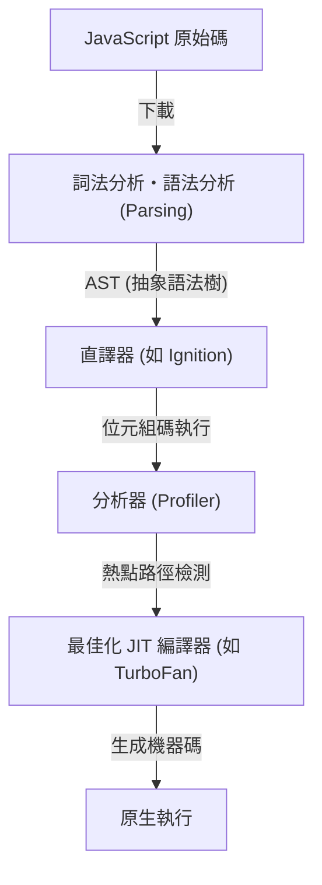
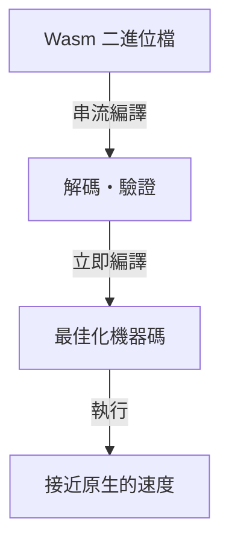
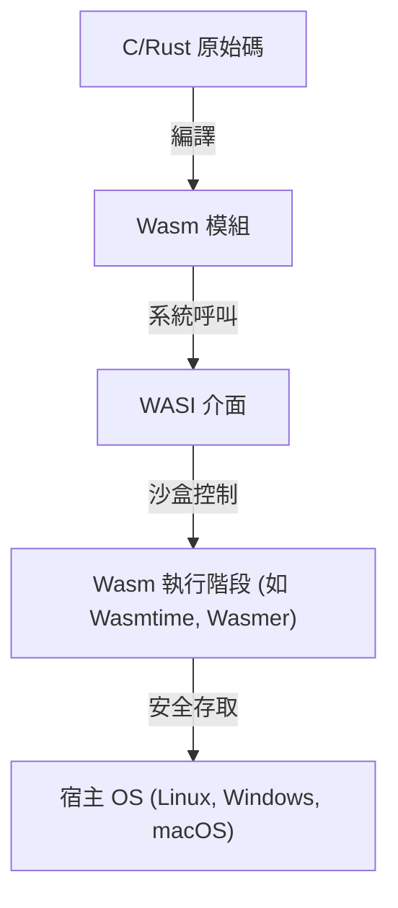

自從網頁瀏覽器誕生以來，長期以來在瀏覽器上運行的程式語言一直是 JavaScript 的天下。然而，隨著網頁應用程式日益複雜，並要求達到媲美桌面應用程式的效能，僅靠 JavaScript 已漸漸顯露出無法跨越的障礙。為了打破這道障礙而誕生的，正是 WebAssembly (Wasm)。

本文將深入探討 WebAssembly 的全貌，從 JavaScript 的執行模型與其極限、asm.js 的誕生與向 WebAssembly 的演進，到 Wasm 的技術架構（二進位格式與堆疊機）、從 C/C++/Rust 的編譯流程，以及透過 WASI 向瀏覽器外擴展等面向進行詳盡解說。

## 1. JavaScript 的執行模型與 JIT 編譯的極限

為了理解 WebAssembly 的真正價值，首先必須了解 JavaScript 在瀏覽器上是如何執行的，以及它面臨著什麼樣的極限。

### 1.1 解析與編譯的成本

JavaScript 是一種基於文字的動態型別語言。當瀏覽器接收到 JavaScript 程式碼時，會經過以下步驟來執行。



第一道關卡是「解析 (Parsing)」。在讀取龐大的 JavaScript 檔案時，瀏覽器必須解析文字以建立抽象語法樹 (AST)。這個過程對 CPU 造成很大的負擔，特別是在行動裝置上，這是導致頁面初始載入時間 (TTI: Time to Interactive) 延遲的一大主因。

### 1.2 JIT 編譯器與型別推論的兩難

現代的 JavaScript 引擎 (如 V8、SpiderMonkey、JavaScriptCore 等) 透過搭載 JIT (Just-In-Time) 編譯器，實現了飛躍性的速度提升。JIT 編譯器會在程式碼執行中檢測頻繁呼叫的部分 (熱點路徑)，推論該部分的型別，並生成經過最佳化的機器碼。

然而，由於 JavaScript 是動態型別語言，變數的型別在執行時有可能會改變。JIT 編譯器會基於「這個變數始終是數值」的假設 (Assumption) 來進行最佳化。

### 1.3 可怕的去最佳化 (Deoptimization)

如果在執行中這個假設被打破 (例如：原本一直傳入數值的函式，突然被傳入了字串)，JIT 編譯器就不得不捨棄已最佳化的機器碼，退回到較慢的直譯器執行。這被稱為「去最佳化 (Deoptimization)」或「Bailout」。

當 Deoptimization 發生時，效能會急遽下降。在進行高度運算的應用程式 (如 3D 遊戲、影片編輯、物理運算等) 中，這種無法預測的效能波動是致命的。開發者經常被迫撰寫「JIT 友善」的程式碼，並必須意識到引擎特有的最佳化機制，這產生了本末倒置的情況。

## 2. asm.js 的誕生：對靜態型別的渴望

感受到 JavaScript 效能極限的 Mozilla 開發者們，在 2013 年發表了一個名為「asm.js」的子集。

### 2.1 asm.js 的方法

asm.js 並不是一種新語言，而是 JavaScript 的嚴格子集。透過使用特定的編碼模式 (利用位元運算進行型別註解)，可以靜態地確定變數的型別。

例如，透過以下的撰寫方式，可以告知引擎 `x` 和 `y` 是 32 位元整數。

```javascript
function add(x, y) {
    x = x | 0; // 明示為 32 位元整數
    y = y | 0;
    return (x + y) | 0;
}
```

### 2.2 asm.js 的功績與極限

支援 asm.js 的瀏覽器在偵測到這種特定模式時，可以直接生成沒有 Deoptimization 風險的原生程式碼 (以接近 Ahead-Of-Time 編譯的方式)。藉此，達成了透過 Emscripten 將 C/C++ 程式碼轉換為 asm.js，並在瀏覽器上運行 3D 遊戲的壯舉。

然而，asm.js 存在著以下問題：
- **檔案體積膨脹**：由於型別註解導致文字變得冗長。
- **解析成本**：依然需要解析龐大的文字檔案。
- **表現力的極限**：因為受限於 JavaScript 的語法，難以支援 64 位元整數等進階功能。

為了解決這些根本性的極限，各大瀏覽器廠商聯手設計出了「WebAssembly」。

## 3. WebAssembly (Wasm) 的架構

WebAssembly (Wasm) 是一種緊湊的二進位格式，能在瀏覽器上以接近原生程式碼的速度執行。在 2019 年成為 W3C 標準，確立了其作為繼 HTML、CSS、JavaScript 之後的「Web 第四種語言」的地位。

### 3.1 透過二進位格式提升速度

Wasm 最大的特徵在於它不是文字，而是「二進位格式 (.wasm)」。



瀏覽器從網路下載 Wasm 二進位檔的同時，就會開始透過串流進行解碼與編譯。因為不需要建立 AST 這種繁重的解析過程，比起 JavaScript，啟動時間有著壓倒性的優勢。

### 3.2 堆疊機模型

Wasm 被設計成在虛擬的「堆疊機 (Stack Machine)」上執行。堆疊機與暫存器機 (如 x86 或 ARM) 不同，它採用了簡單的模型：將運算元推入 (Push) 堆疊，運算指令從堆疊中取出值進行計算，然後將結果再次推入 (Pop/Push) 堆疊。

例如，`1 + 2` 的計算在概念上如下：

1. `i32.const 1` (將 1 推入堆疊)
2. `i32.const 2` (將 2 推入堆疊)
3. `i32.add` (從堆疊取出兩個值相加，並將結果推入堆疊)

透過這種簡單且抽象化的模型，Wasm 能夠容易且快速地轉換 (JIT/AOT 編譯) 為 x86、ARM、MIPS 等各種實體硬體的機器碼。

### 3.3 線性記憶體 (Linear Memory)

Wasm 模組擁有獨立且連續的記憶體區域 (線性記憶體)，這與 JavaScript 的垃圾回收 (GC) 是分離的。從 JavaScript 側來看，這只不過是一個 `ArrayBuffer`。

C/C++ 或 Rust 等語言，會在這個線性記憶體上透過操作指標來手動管理記憶體。這可以防止因 GC 暫停時間造成的掉幀，非常適合要求即時性的應用程式。

### 3.4 強大的安全性與沙盒

WebAssembly 從設計之初就將安全性視為最優先考量。Wasm 模組在瀏覽器強大的沙盒環境內執行。
對於線性記憶體的存取會進行嚴格的邊界檢查，以防止緩衝區溢位等攻擊。此外，Wasm 本身沒有直接存取 DOM、網路或檔案系統的權限，所有必要的操作都必須透過匯入並呼叫由 JavaScript (或宿主環境) 提供的函式來完成。

## 4. 從其他語言編譯至 Wasm 的生態系統

WebAssembly 並不是設計讓開發者直接手寫其文字表示 (WAT)。它是作為 C/C++、Rust、Go 等語言編譯的目標平台而運作的。

### 4.1 Emscripten 與 C/C++

Emscripten 是一個基於 LLVM 的 Wasm 編譯器工具鏈。它最初是為了 asm.js 開發的，但現在已成為生成 Wasm 的業界標準。

Emscripten 強大的地方在於，它會自動生成 JavaScript 的膠水 (Glue) 程式碼，用來模擬標準 C 函式庫 (libc)、檔案系統 (使用瀏覽器 IndexedDB 的虛擬檔案系統)、OpenGL (轉換為 WebGL) 等。這使得現有龐大的 C/C++ 程式碼庫 (例如遊戲引擎或影像處理函式庫) 能夠相對容易地移植到 Web 上。

### 4.2 Rust：Wasm 時代的一等公民語言

Rust 是一種現代系統程式設計語言，兼具基於所有權模型的記憶體安全性以及極快的執行速度，以與 WebAssembly 絕佳的相容性而聞名。

Rust 工具鏈內建支援 Wasm 目標 (`wasm32-unknown-unknown`)，透過使用強大的 `wasm-bindgen` 函式庫，可以無縫地與 JavaScript 進行介接 (DOM 操作或 JavaScript 類別的交換)。由於 Rust 沒有垃圾回收機制，生成的 Wasm 二進位檔體積可以壓到極小，因此在 Web 前端開發中，「只用 Rust/Wasm 來寫繁重的處理」這種方法正快速增加。

### 4.3 具備垃圾回收的語言 (Go, C#, Kotlin)

近年來，將「Wasm GC (Garbage Collection)」提案納入 Wasm 標準的行動正在進行中。過去在將 Go 或 C# (Blazor) 編譯為 Wasm 時，必須在模組內綑綁語言專屬的龐大垃圾回收器，導致二進位檔體積膨脹的問題。

隨著 Wasm GC 在瀏覽器中的原生實作，將能直接利用宿主 (如 V8 等 JavaScript 引擎) 的高效能垃圾回收器。這使得需要動態記憶體管理的語言 (如 Java、Kotlin、Dart(Flutter)) 在 WebAssembly 支援方面迎來爆發性的進化。

## 5. WebAssembly System Interface (WASI): 走出瀏覽器

WebAssembly 並不僅僅是局限在瀏覽器內的技術。它正試圖以更輕量且安全的方式，實現 Java 曾經提出「Write Once, Run Anywhere (一次編寫，到處執行)」的夢想。推動這一進程的正是 **WASI (WebAssembly System Interface)**。

### 5.1 什麼是 WASI？

如前所述，Wasm 預設無法存取作業系統的功能 (檔案 I/O、網路、系統時鐘等)。在瀏覽器內是由 JavaScript 作為橋樑，但若要在瀏覽器外的伺服器環境運行 Wasm，就需要一個共通的介面。

WASI 是為 WebAssembly 標準化的系統介面。它提供類似 POSIX 的 API，使 Wasm 模組能夠安全地存取作業系統的資源。



### 5.2 取代容器的次世代輕量執行環境

隨著 WASI 的出現，世界各地都開始關注將 WebAssembly 作為取代 Docker 容器的「奈米容器 (Nano Container)」。相較於 Docker 容器，Wasm 具有以下優勢：

1. **壓倒性的啟動速度**：Wasm 執行階段可在數毫秒至數微秒內啟動，這比容器快上數百倍。
2. **跨平台獨立性**：同一個 Wasm 二進位檔可以在 ARM 或 x86、Linux 或 Windows 上執行。
3. **強大的安全性**：預設為完全隔離，只能存取透過 WASI 明確許可的目錄或通訊埠。

### 5.3 邊緣運算中的應用

這項特性的最佳發揮領域在 CDN 的 Edge Worker 或是無伺服器函式 (FaaS)。Fastly 的 Compute@Edge 和 Cloudflare Workers 在內部使用了 V8 的 Isolate 或專屬的 Wasm 執行階段，在世界各地的邊緣伺服器上實現了毫秒級別的擴展與執行。

## 6. 總結與未來展望

WebAssembly 並不是用來取代 JavaScript 的。JavaScript 在 UI 控制與 DOM 操作上擁有無與倫比的靈活性和生態系統。Wasm 則是補足 JavaScript 不擅長的領域（例如「繁重的計算處理」、「活用現有 C/C++/Rust 資產」、「嚴格的效能保證」）的最佳拍檔。

從影片/音訊編碼器、CAD 軟體、進階的資料視覺化、加密處理，一直到瀏覽器內的 AI 推理 (如 TensorFlow.js 的 Wasm 後端等)，Wasm 的應用案例正日益擴大。

此外，透過 WASI 在雲端原生及邊緣運算領域的突破，也正在引發後端架構的革命。為了打破瀏覽器極限而誕生的 WebAssembly，如今甚至跳脫了 Web 的框架，開始步上成為在任何地方皆能安全且快速執行程式碼的「通用二進位格式 (Universal Binary Format)」之路。
