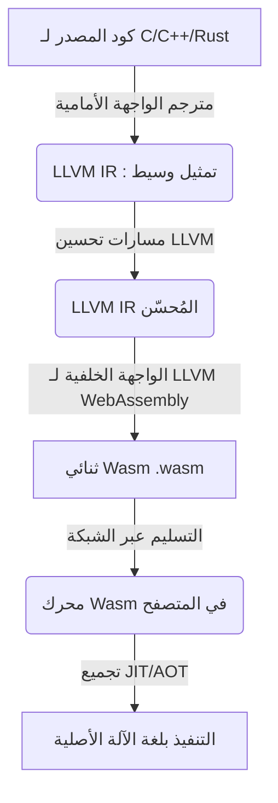
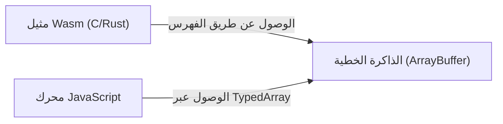
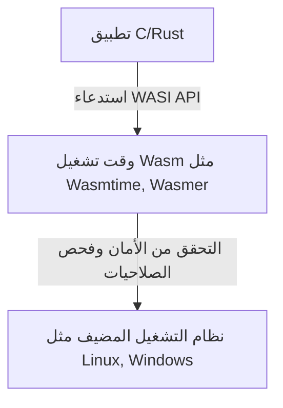

# مقدمة: صعود WebAssembly (Wasm)

سيطرت لغة واحدة، وهي JavaScript، على متصفحات الويب لفترة طويلة. ولكن، مع تزايد تعقيد تطبيقات الويب وتطلبها لأداء يضاهي التطبيقات الأصلية (native apps)، بدأت حدود JavaScript وحدها بالظهور. وهنا جاء دور **WebAssembly (Wasm)**.

WebAssembly هي تنسيق ثنائي (binary format) جديد يمكن تنفيذه بسرعة تقارب سرعة الكود الأصلي في المتصفح. يتم تجميعها (compiled) من لغات برمجة مثل C و C++ و [Rust](https://kenji.blog/ar/p/programming-languages-history-paradigm-evolution/)، وتُحدث اليوم ثورة ليس فقط في تطوير الويب، ولكن في مجالات واسعة تمتد من جانب الخادم (server-side) وحوسبة الحافة (edge computing)، وصولاً إلى أجهزة إنترنت الأشياء (IoT).

في هذا المقال، سنشرح بشكل شامل حاضر ومستقبل WebAssembly، من المفاهيم الأساسية، إلى الآلية التقنية لكيفية عمل C و Rust داخل المتصفح، التكامل مع JavaScript، مقارنة الأداء، وتطبيقاتها في العالم خارج المتصفح (WASI).

---

# 1. ما هي WebAssembly؟

## 1.1 خلفية الظهور

حتى قبل ظهور WebAssembly، كانت هناك عدة محاولات لتحسين أداء JavaScript. على سبيل المثال، **Native Client (NaCl)** من Google، و **asm.js** من Mozilla.

- **asm.js**: كانت مجموعة فرعية من JavaScript، صُممت بحيث يسهل على مترجم JIT في المتصفح تحسينها عن طريق إضافة تحديدات النوع كتعليقات توضيحية.
- **NaCl**: كانت تقنية حماية (sandbox) لتنفيذ الكود الأصلي بأمان داخل المتصفح، لكنها لم تصل إلى مرحلة التوحيد القياسي بين بائعي المتصفحات.

بناءً على هذه التأملات والتجارب، تعاون كبار بائعي المتصفحات (Mozilla و Google و Microsoft و Apple) لصياغة معيار مفتوح وهو **WebAssembly**.

## 1.2 فلسفة تصميم Wasm

تضع WebAssembly أهداف التصميم التالية:

1. **سريعة وفعالة**: يمكن تنفيذها بسرعة قريبة من السرعة الأصلية (native)، مع وقت تحميل قصير.
2. **آمنة**: يتم تنفيذها في بيئة حماية (sandbox) وتلتزم بسياسات الأمان الخاصة بالمضيف.
3. **مفتوحة وقابلة لتصحيح الأخطاء**: تمتلك تنسيقاً نصياً قابلاً للقراءة البشرية (WAT: WebAssembly Text format) بالتزامن مع التنسيق الثنائي.
4. **التكامل مع الويب**: تعمل بالتنسيق مع JavaScript، ويمكنها التفاعل بسلاسة مع واجهات برمجة تطبيقات الويب (Web APIs) الحالية.

---

# 2. كيف تعمل C/Rust في المتصفح

دعونا نرى تدريجياً كيف يتم تنفيذ كود C أو Rust فعلياً على المتصفح.

## 2.1 خط أنابيب التجميع (Compilation [Pipeline](https://kenji.blog/ar/p/cicd-pipeline-github-actions-best-practices/))

عادةً ما تُترجم اللغات مثل C أو [Rust](https://kenji.blog/ar/p/programming-languages-history-paradigm-evolution/) إلى لغة الآلة المعتمدة على نظام التشغيل أو بنية وحدة المعالجة المركزية (CPU). ولكن في حالة WebAssembly، يتم تحديد بنية Wasm مثل "wasm32" كبنية مستهدفة (target architecture).

في كثير من الحالات، يتم استخدام بنية المترجم LLVM.



بهذه الطريقة، يمر الكود الذي يكتبه المطور عبر تمثيل وسيط (IR)، ويتم تحسينه، ويصبح في النهاية ملفاً ثنائياً مضغوطاً بامتداد `.wasm`.

## 2.2 الكود البايتي (Bytecode) وآلة المكدس ([Stack](https://kenji.blog/ar/p/c-language-pointers-memory-management-stack-heap/) Machine)

تتبنى WebAssembly بنية **آلة المكدس (Stack Machine)**. لا تحتوي على سجلات (registers)، وتتم جميع الحسابات على المكدس (بنية بيانات من نوع LIFO).

على سبيل المثال، عند إجراء عملية جمع بسيطة `$ 1 + 2 $`، يبدو التمثيل النصي لـ Wasm (WAT) كما يلي:

```wasm
(module
  (func $add (param $a i32) (param $b i32) (result i32)
    local.get $a
    local.get $b
    i32.add)
  (export "add" (func $add))
)
```

1. يتم وضع قيمة المتغير a في المكدس باستخدام `local.get $a`.
2. يتم وضع قيمة المتغير b في المكدس باستخدام `local.get $b`.
3. تستخرج `i32.add` قيمتين من المكدس وتجمعهما، وتضع النتيجة في المكدس.

بفضل هذه البنية البسيطة، تصبح عمليات فك التشفير والتحقق سريعة، مما يسمح بتجميع JIT في المتصفح في وقت قصير جداً.

## 2.3 نموذج الذاكرة (الذاكرة الخطية)

تُجرى عمليات الذاكرة باستخدام المؤشرات (pointers) بشكل متكرر في C و [Rust](https://kenji.blog/ar/p/programming-languages-history-paradigm-evolution/). لتحقيق ذلك، تتبنى WebAssembly مفهوم **الذاكرة الخطية (Linear Memory)**.

الذاكرة الخطية هي مصفوفة متصلة من البايتات يمكن الوصول إليها من مثيل (instance) WebAssembly. من وجهة نظر JavaScript، تبدو كـ `ArrayBuffer` أو `SharedArrayBuffer`. المؤشرات داخل Wasm هي مجرد فهارس (قيم صحيحة) لهذه المصفوفة.



من خلال هذه الآلية، تمنع Wasm الكود من الوصول مباشرة إلى ذاكرة نظام التشغيل المضيف، وتوفر بيئة حماية قوية.

---

# 3. التكامل بين JavaScript و WebAssembly

لا تهدف WebAssembly إلى استبدال JavaScript، بل لاستكمالها. في معظم الحالات، تتولى JavaScript معالجة شجرة نموذج كائن المستند (DOM) والتعامل مع الأحداث (event handling)، وتُفوض عمليات الحساب الثقيلة إلى WebAssembly.

## 3.1 المتغيرات العامة والاستيراد والتصدير

يمكن لوحدة WebAssembly استيراد وتصدير الدوال والذاكرة والجداول والمتغيرات العامة للتفاعل مع JavaScript.

```javascript
// تحميل وتهيئة وحدة WebAssembly
fetch('module.wasm')
  .then(response => response.arrayBuffer())
  .then(bytes => WebAssembly.instantiate(bytes, {
    env: {
      // استيراد دالة JavaScript إلى Wasm
      consoleLog: (arg) => console.log("Wasm says: " + arg)
    }
  }))
  .then(results => {
    // استدعاء دالة تم تصديرها من Wasm
    const add = results.instance.exports.add;
    console.log("1 + 2 = ", add(1, 2));
  });
```

## 3.2 الوصول إلى واجهات برمجة تطبيقات الويب (Web APIs) والربط (Binding)

لا تمتلك Wasm نفسها القدرة على الوصول المباشر إلى DOM أو Web API. للوصول إليها، يجب المرور عبر JavaScript.
ولكن، كتابة هذه العمليات يدوياً يتطلب جهداً كبيراً. لذلك، تتوفر أدوات مثل **wasm-bindgen** في النظام البيئي لـ [Rust](https://kenji.blog/ar/p/programming-languages-history-paradigm-evolution/).

```rust
// كود Rust (باستخدام wasm-bindgen)
use wasm_bindgen::prelude::*;

#[wasm_bindgen]
extern "C" {
    fn alert(s: &str);
}

#[wasm_bindgen]
pub fn greet(name: &str) {
    alert(&format!("Hello, {}!", name));
}
```

عند تجميع هذا الكود، سيقوم `wasm-bindgen` تلقائياً بإنشاء كود الغراء (glue code) الخاص بـ JavaScript، ويخفي تمرير ذاكرة السلاسل النصية وغيرها. وبفضل هذا، تحصل على تجربة تطوير تبدو وكأنك تستدعي واجهات برمجة تطبيقات المتصفح مباشرة من [Rust](https://kenji.blog/ar/p/programming-languages-history-paradigm-evolution/).

---

# 4. الأداء ومقارنة السرعة

لماذا تعد WebAssembly أسرع من JavaScript؟

1. **سرعة التحليل (Parsing Speed)**: لأن Wasm عبارة عن تنسيق ثنائي، يمكن فك تشفيرها بسرعة أكبر بكثير من تحليل كود المصدر النصي لـ JS وبناء شجرة بناء الجملة المجردة (AST).
2. **تحسين JIT**: نظراً لأن JS لغة مكتوبة ديناميكياً (dynamically typed)، يجب على مترجم JIT إجراء استنتاج النوع في وقت التشغيل، وإذا فشل الاستنتاج، يجب عليه إلغاء التحسين (Deoptimization). في المقابل، Wasm مكتوبة بشكل ثابت (statically typed)، ويتم تطبيق تحسينات قوية بالفعل في وقت التجميع باستخدام LLVM وما إلى ذلك، مما يسمح للمتصفح بالتركيز على إنشاء لغة الآلة مباشرة.
3. **تجنب تجميع القمامة (GC)**: Wasm المكتوبة بـ C أو Rust تدير ذاكرتها الخاصة، مما يمنع حدوث فترات توقف غير متوقعة بسبب GC في محرك JS (※ سيتم مناقشة مواصفات Wasm GC لاحقاً).

## 4.1 اختبار الأداء (Benchmark): متتالية فيبوناتشي

دعونا نقارن سرعة JavaScript و Rust (Wasm) في حساب بسيط لمتتالية فيبوناتشي.
رياضياً، يُعبر عنها بالصيغة العودية (recursive formula) التالية. التعقيد الحسابي هو أسي `$ O(2^n) $`، ويستهلك وحدة المعالجة المركزية (CPU) بشكل كبير.

$$
F(n) =
\begin{cases}
0 & (n = 0) \\\\
1 & (n = 1) \\\\
F(n-1) + F(n-2) & (n \ge 2)
\end{cases}
$$

### تنفيذ JavaScript
```javascript
function fibJs(n) {
  if (n <= 1) return n;
  return fibJs(n - 1) + fibJs(n - 2);
}
```

### تنفيذ [Rust](https://kenji.blog/ar/p/programming-languages-history-paradigm-evolution/)
```rust
#[no_mangle]
pub fn fib_wasm(n: u32) -> u32 {
    if n <= 1 { return n; }
    fib_wasm(n - 1) + fib_wasm(n - 2)
}
```

عند الحساب بـ $n=40$، في حين يتم تنفيذ JavaScript (محرك V8) أيضاً بسرعة كبيرة بفضل تحسين JIT، غالباً ما تُنفذ Wasm الناتجة من [Rust](https://kenji.blog/ar/p/programming-languages-history-paradigm-evolution/) أسرع بـ **حوالي 1.5 إلى 2 مرة أو أكثر**. في مجالات مثل عمليات المصفوفات أو معالجة الصور، حيث يُستفاد من الوصول المتتالي للذاكرة وتعليمات SIMD، يصبح هذا الفارق أكثر وضوحاً.

---

# 5. Rust و C++ كلغات تطوير

اللغات الأكثر شيوعاً كخلفية لـ WebAssembly هي C/C++ و Rust.

## 5.1 C++ و Emscripten

تاريخياً، كانت C/C++ هي الأقدم استخداماً للنقل (porting) إلى الويب. **Emscripten** هي سلسلة أدوات (toolchain) تستخدم LLVM لتحويل كود C/C++ إلى Wasm.
تتضمن محاكاة POSIX وطبقة تحويل إلى OpenGL (WebGL) لتشغيل المكتبات الضخمة الحالية المكتوبة بـ C/C++ (على سبيل المثال، SQLite، FFmpeg، OpenCV، ومحركات الألعاب) في المتصفح.

## 5.2 Rust و WebAssembly

حالياً، اللغة الأكثر جذباً للانتباه كلغة من الدرجة الأولى لـ WebAssembly هي **Rust**.
أسباب تفضيل Rust هي كما يلي:

- **صغر وقت التشغيل (Runtime)**: نظراً لأن Rust لا تحتوي على GC أو وقت تشغيل ضخم، يمكن الحفاظ على حجم ملفات Wasm الثنائية الناتجة صغيراً جداً.
- **wasm-pack / wasm-bindgen**: النظام البيئي متطور للغاية، مما يسمح بإعداد مشروع Wasm ونشره كحزمة npm ببضعة أسطر من الأوامر.
- **أمان الذاكرة**: نظراً لأنه يتم ضمان أمان الذاكرة في وقت التجميع، يمكن تقليل مخاطر تلف الذاكرة بسبب الأخطاء (bugs)، حتى عند تنفيذ عمليات معقدة على جانب المتصفح.

---

# 6. الميزات المتقدمة وتوسيع مواصفات WebAssembly

تستمر WebAssembly في التطور حتى بعد إصدارها الأولي (MVP)، ويتم حالياً تنفيذ العديد من الامتدادات (extensions) القوية في المتصفحات.

## 6.1 SIMD (تعليمة واحدة، بيانات متعددة)
تم دعم تعليمات SIMD التي تعالج بيانات متعددة في وقت واحد بتعليمة واحدة (128 بت SIMD). يتيح ذلك تحسينات هائلة في الأداء في مجالات مثل معالجة الصور، معالجة الصوت، وخوارزميات التشفير.

## 6.2 الخيوط (Threads) والذاكرة المشتركة (Shared Memory)
باستخدام Web Workers و `SharedArrayBuffer`، أصبح من الممكن لمثيلات Wasm المتعددة مشاركة نفس مساحة الذاكرة وتنفيذ المعالجة المتوازية (parallel processing) متعددة الخيوط. وهذا يسمح لمحاكاة الفيزياء المتقدمة ومحركات الألعاب بالعمل بسلاسة في المتصفح.

## 6.3 تجميع القمامة (Wasm GC)
بينما كانت Wasm التقليدية مصممة للغات مثل C و [Rust](https://kenji.blog/ar/p/programming-languages-history-paradigm-evolution/) التي تدير الذاكرة الخطية يدوياً، تم توحيد مقترح **Wasm GC** لتجميع اللغات التي تتطلب تجميع القمامة، مثل [Java](https://kenji.blog/ar/p/programming-languages-history-paradigm-evolution/) و Kotlin و C# و Dart، بكفاءة إلى Wasm. ونتيجة لذلك، يتحسن أداء منصات مثل Flutter Web بشكل كبير.

---

# 7. العالم خارج المتصفح: WASI (واجهة نظام WebAssembly)

لا تقتصر إمكانيات WebAssembly على المتصفح فقط. **"ماذا لو أمكننا استخدام Wasm كتنسيق قياسي خارج المتصفح أيضاً؟"** هذه الفكرة أدت إلى ولادة **WASI (WebAssembly System Interface)**.

## 7.1 ما هو WASI؟
WASI هي واجهة قياسية تتيح لبرامج WebAssembly الوصول إلى موارد نظام التشغيل (مثل نظام الملفات، الشبكة، متغيرات البيئة) بأمان.
يمكنها منح وحدات Wasm الصلاحيات الضرورية فقط (أمان قائم على القدرات أو Capability-based security) مع الحفاظ على نموذج بيئة الحماية (sandbox) الخاص بالمتصفح.



## 7.2 الاستبدال والتعايش مع حاويات [Docker](https://kenji.blog/ar/p/docker-container-namespace-[cgroups](https://kenji.blog/ar/p/docker-container-namespace-cgroups-layers/)-layers/)
أثار السيد Solomon Hykes، مخترع Docker، ضجة عندما قال: "لو كانت Wasm و WASI موجودتين في عام 2008، لما كنا بحاجة إلى إنشاء Docker".
تتمتع Wasm بمزايا قوية تتمثل في كونها أخف وزناً من الحاويات (containers)، أسرع في بدء التشغيل (بضع ميلي ثانية)، ولا تعتمد على نظام التشغيل أو بنية وحدة المعالجة المركزية.
حالياً، هناك مشاريع نشطة (مثل Kwasm و Spin) لتنسيق وحدات Wasm مباشرة على [Kubernetes](https://kenji.blog/ar/p/kubernetes-k8s-architecture-pod-service-ingress/) كبديل لحاويات Docker.

---

# 8. مستقبل WebAssembly

## 8.1 نموذج المكون (Component Model)
أكبر تحدٍ يواجه WebAssembly حالياً هو صعوبة الربط بين وحدات Wasm المكتوبة بلغات مختلفة (نظراً لاختلاف تمثيل الذاكرة للسلاسل النصية أو أنواع البيانات المعقدة بين اللغات).

حل هذه المشكلة هو **WebAssembly Component Model**.
إذا تم تحقيق نموذج المكون، سيصبح من الممكن، على سبيل المثال، استدعاء الدوال بسلاسة من "وحدة Wasm مكتوبة بـ Python" إلى "وحدة Wasm مكتوبة بـ [Rust](https://kenji.blog/ar/p/programming-languages-history-paradigm-evolution/)". يحمل هذا إمكانية أن يصبح الأساس لبنية الخدمات المصغرة (microservices architecture) للجيل القادم، المستقلة عن المنصة واللغة.

## 8.2 Wasm كنظام إضافات (Plugin System)
بالفعل، اعتمدت العديد من البرامج مثل Figma و EnvoyProxy و Microsoft Flight Simulator على WebAssembly كنظام إضافات خاص بها. وذلك لأنها تتيح تنفيذ كود الأطراف الثالثة (third-party code) الذي ينشئه المستخدمون بأمان وسرعة عالية داخل التطبيق الرئيسي.

---

# الخلاصة

تتجاوز WebAssembly إطار كونها مجرد "تقنية سريعة تعمل في المتصفح"، وتنمو لتصبح لغة مشتركة في البيئات السحابية الأصلية (cloud-native)، حوسبة الحافة، وبنية الإضافات (plugin architectures).

عالم يمكن فيه نشر المنطق (logic) القوي المُطوَّر بلغات برمجة الأنظمة مثل C و C++ و Rust، بغض النظر عن المنصة، وبشكل آمن وسريع. هذا هو بالضبط **الحاضر والمستقبل** الذي تفتحه WebAssembly.

في تطوير الويب المستقبلي، سيصبح النهج الهجين هو السائد: ستستمر JavaScript/TypeScript في تولي بناء واجهات المستخدم (UI)، بينما سيتم استخدام WebAssembly للمنطق الأساسي الذي يتطلب الأداء العالي ولإعادة استخدام الأصول الأصلية (native assets) الحالية، كل في مكانه المناسب.

ندعوك لتجربة الغوص في عالم WebAssembly باستخدام Rust أو Emscripten.
