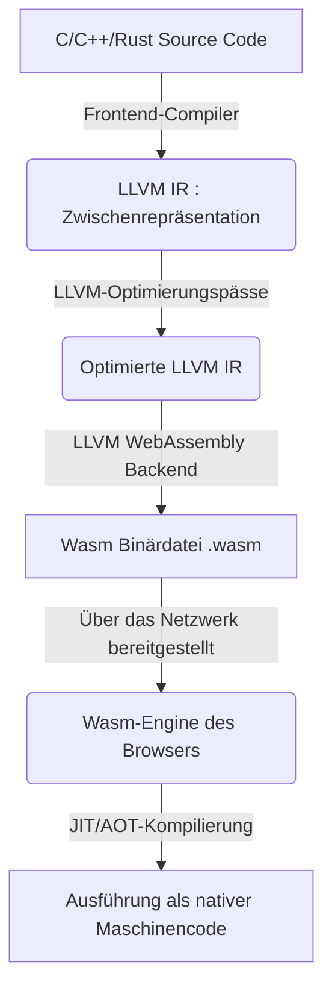
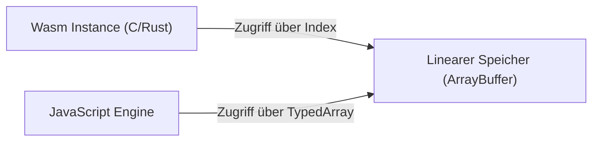
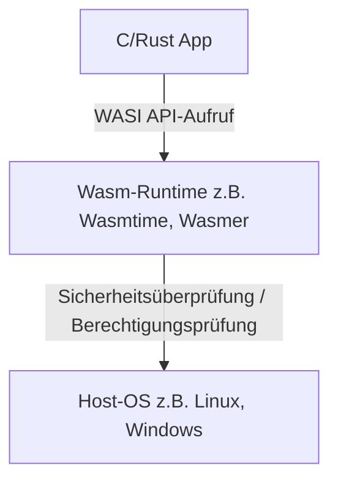

# Einführung: Der Aufstieg von WebAssembly (Wasm)

Webbrowser wurden lange Zeit von einer einzigen Sprache dominiert: JavaScript. Da Webanwendungen jedoch immer komplexer wurden und Leistungen erforderten, die mit nativen Apps vergleichbar sind, wurden die Grenzen von JavaScript allein sichtbar. Hier kommt **WebAssembly (Wasm)** ins Spiel.

WebAssembly ist ein neues Binärformat, das im Browser mit einer Geschwindigkeit ausgeführt werden kann, die nahe an nativem Code liegt. Es wird aus Programmiersprachen wie C, C++ und Rust kompiliert und bringt heute Innovationen nicht nur in die Webentwicklung, sondern auch in Bereiche wie serverseitiges und Edge-Computing bis hin zu IoT-Geräten.

In diesem Artikel werden wir die Gegenwart und Zukunft von WebAssembly umfassend erklären – von den grundlegenden Konzepten über die technischen Mechanismen, wie C und Rust im Browser funktionieren, die Integration mit JavaScript und Leistungsvergleiche bis hin zu Anwendungen in der Welt außerhalb des Browsers (WASI).

---

# 1. Was ist WebAssembly?

## 1.1 Hintergrund der Entstehung

Schon vor der Entstehung von WebAssembly gab es mehrere Versuche, die Leistung von JavaScript zu verbessern. Beispiele sind **Native Client (NaCl)** von Google und **asm.js** von Mozilla.

- **asm.js**: Eine Teilmenge von JavaScript, die so konzipiert war, dass der JIT-Compiler des Browsers sie durch Typangaben als Annotationen leichter optimieren konnte.
- **NaCl**: Eine Sandbox-Technologie zur sicheren Ausführung von nativem Code im Browser, die jedoch nicht von allen Browserherstellern standardisiert wurde.

Aus diesen Erfahrungen und Überlegungen heraus entwickelten die großen Browserhersteller (Mozilla, Google, Microsoft, Apple) gemeinsam den offenen Standard **WebAssembly**.

## 1.2 Designphilosophie von Wasm

WebAssembly verfolgt die folgenden Designziele:

1.  **Schnell und effizient**: Ausführung mit nahezu nativer Geschwindigkeit und kurze Ladezeiten.
2.  **Sicher**: Ausführung in einer Sandbox-Umgebung und Einhaltung der Sicherheitsrichtlinien des Hosts.
3.  **Offen und debuggbar**: Neben dem Binärformat soll es auch ein für Menschen lesbares Textformat (WAT: WebAssembly Text format) geben.
4.  **Integration in das Web**: Reibungslose Zusammenarbeit mit JavaScript und nahtlose Integration in bestehende Web-APIs.

---

# 2. Wie C/Rust im Browser funktioniert

Wie genau wird nun C- oder Rust-Code im Browser ausgeführt? Betrachten wir den Prozess Schritt für Schritt.

## 2.1 Kompilierungs-[Pipeline](https://kenji.blog/de/p/cicd-pipeline-github-actions-best-practices/)

Sprachen wie C und Rust werden normalerweise in Maschinencode kompiliert, der vom Betriebssystem und der CPU-Architektur abhängt. Bei WebAssembly wird jedoch eine Wasm-spezifische Architektur wie "wasm32" als Zielarchitektur angegeben.

In den meisten Fällen wird die Compiler-Infrastruktur LLVM verwendet.



Auf diese Weise wird der vom Entwickler geschriebene Code über eine Zwischenrepräsentation (IR) optimiert und wird schließlich zu einer kompakten Binärdatei mit der Erweiterung `.wasm`.

## 2.2 Bytecode und Stack-Maschine

WebAssembly verwendet eine **Stack-Maschinen**-Architektur. Es hat keine Register; alle Berechnungen werden auf einem Stack (einer Datenstruktur nach dem LIFO-Prinzip) durchgeführt.

Wenn wir beispielsweise eine einfache Addition `$ 1 + 2 $` durchführen, sieht die Textdarstellung von Wasm (WAT) so aus:

```wasm
(module
  (func $add (param $a i32) (param $b i32) (result i32)
    local.get $a
    local.get $b
    i32.add)
  (export "add" (func $add))
)
```

1.  `local.get $a` legt den Wert der Variablen a auf den Stack.
2.  `local.get $b` legt den Wert der Variablen b auf den Stack.
3.  `i32.add` nimmt zwei Werte vom Stack, addiert sie und legt das Ergebnis wieder auf den Stack.

Diese einfache Struktur beschleunigt den Dekodierungs- und Verifizierungsprozess und ermöglicht dem Browser eine sehr schnelle JIT-Kompilierung.

## 2.3 Speichermodell (Linearer Speicher)

In C und Rust werden Speicheroperationen häufig mit Zeigern durchgeführt. Um dies zu ermöglichen, verwendet WebAssembly das Konzept des **linearen Speichers (Linear Memory)**.

Linearer Speicher ist ein zusammenhängendes Byte-Array, auf das von einer WebAssembly-Instanz aus zugegriffen werden kann. Aus der Sicht von JavaScript sieht es wie ein `ArrayBuffer` oder `SharedArrayBuffer` aus. Ein Zeiger in Wasm ist lediglich ein Index (ein ganzzahliger Wert) in dieses Array.



Dieser Mechanismus verhindert, dass Wasm-Code direkt auf den Speicher des Host-Betriebssystems zugreift, und bietet eine leistungsstarke Sandbox-Umgebung.

---

# 3. Integration von JavaScript und WebAssembly

WebAssembly soll JavaScript nicht ersetzen, sondern ergänzen. In vielen Fällen übernimmt JavaScript DOM-Manipulationen und Event-Handling, während rechenintensive Aufgaben an WebAssembly delegiert werden.

## 3.1 Globale Variablen und Import/Export

WebAssembly-Module können Funktionen, Speicher, Tabellen und globale Variablen importieren und exportieren, um mit JavaScript zu kommunizieren.

```javascript
// Laden und Instanziieren des WebAssembly-Moduls
fetch('module.wasm')
  .then(response => response.arrayBuffer())
  .then(bytes => WebAssembly.instantiate(bytes, {
    env: {
      // JavaScript-Funktion in Wasm importieren
      consoleLog: (arg) => console.log("Wasm says: " + arg)
    }
  }))
  .then(results => {
    // Aus Wasm exportierte Funktion aufrufen
    const add = results.instance.exports.add;
    console.log("1 + 2 = ", add(1, 2));
  });
```

## 3.2 Zugriff auf Web-APIs und Bindings

Wasm selbst hat keine Möglichkeit, direkt auf das DOM oder Web-APIs zuzugreifen. Der Zugriff muss über JavaScript erfolgen.
Dies manuell zu schreiben, ist jedoch sehr mühsam. Dafür bietet das Rust-Ökosystem Tools wie **wasm-bindgen**.

```rust
// Rust-Code (verwendet wasm-bindgen)
use wasm_bindgen::prelude::*;

#[wasm_bindgen]
extern "C" {
    fn alert(s: &str);
}

#[wasm_bindgen]
pub fn greet(name: &str) {
    alert(&format!("Hello, {}!", name));
}
```

Wenn dieser Code kompiliert wird, generiert `wasm-bindgen` automatisch den JavaScript-Glue-Code (den verbindenden Code) und verbirgt die Speicherübergabe von Zeichenketten und Ähnlichem. Dadurch entsteht das Gefühl, direkt aus Rust heraus Browser-APIs aufzurufen.

---

# 4. Leistungs- und Geschwindigkeitsvergleich

Warum ist WebAssembly schneller als JavaScript?

1.  **Parsing-Geschwindigkeit**: Da Wasm ein Binärformat ist, kann es viel schneller dekodiert werden als das Parsen von textbasiertem JS-Quellcode zur Erstellung eines abstrakten Syntaxbaums (AST).
2.  **JIT-Optimierung**: Da JS eine dynamisch typisierte Sprache ist, muss der JIT-Compiler zur Laufzeit Typinferenzen durchführen, und wenn die Inferenz falsch ist, muss die Optimierung rückgängig gemacht werden (Deoptimization). Wasm ist statisch typisiert, und da starke Optimierungen durch Tools wie LLVM bereits zur Kompilierzeit durchgeführt wurden, kann sich der Browser direkt auf die Generierung von Maschinencode konzentrieren.
3.  **Vermeidung von Garbage Collection (GC)**: Wasm, das in C oder Rust geschrieben ist, verwaltet seinen Speicher selbst. Daher gibt es keine unerwarteten Pausen (Verzögerungen) durch den GC der JS-Engine (※ Details zur Wasm-GC-Spezifikation siehe unten).

## 4.1 Benchmark: Fibonacci-Folge

Vergleichen wir die Geschwindigkeit von JavaScript und Rust (Wasm) anhand der einfachen Berechnung der Fibonacci-Folge.
Mathematisch wird dies durch die folgende rekursive Gleichung dargestellt. Die zeitliche Komplexität ist exponentiell `$ O(2^n) $` und beansprucht die CPU stark.

$$
F(n) =
\begin{cases}
0 & (n = 0) \\\\
1 & (n = 1) \\\\
F(n-1) + F(n-2) & (n \ge 2)
\end{cases}
$$

### JavaScript-Implementierung
```javascript
function fibJs(n) {
  if (n <= 1) return n;
  return fibJs(n - 1) + fibJs(n - 2);
}
```

### Rust-Implementierung
```rust
#[no_mangle]
pub fn fib_wasm(n: u32) -> u32 {
    if n <= 1 { return n; }
    fib_wasm(n - 1) + fib_wasm(n - 2)
}
```

Wenn wir für $n=40$ rechnen lassen, ist JavaScript (V8-Engine) dank JIT-Optimierung in der Regel ebenfalls recht schnell, aber das aus Rust generierte Wasm ist oft **etwa 1,5- bis über 2-mal** schneller. Insbesondere in Bereichen, in denen sequentieller Speicherzugriff oder SIMD-Befehle von Vorteil sind, wie bei Matrixoperationen oder Bildverarbeitung, wird der Unterschied noch deutlicher.

---

# 5. Rust und C++ als Entwicklungssprachen

Die beliebtesten Quellsprachen für WebAssembly sind C/C++ und Rust.

## 5.1 C++ und Emscripten

Historisch gesehen wurden C/C++ am längsten für Web-Portierungen verwendet. **Emscripten** ist eine Toolchain, die LLVM verwendet, um C/C++-Code in Wasm zu konvertieren.
Es bietet POSIX-Emulation und eine Übersetzungsschicht zu OpenGL (WebGL), um große, bestehende C/C++-Bibliotheken (wie SQLite, FFmpeg, OpenCV, Spiel-Engines usw.) im Browser auszuführen.

## 5.2 Rust und WebAssembly

Derzeit ist **Rust** die Sprache, die als erstklassige Sprache für WebAssembly am meisten Aufmerksamkeit erhält.
Die Gründe für die Beliebtheit von Rust sind folgende:

- **Geringe Runtime-Größe**: Da Rust keine GC oder eine riesige Laufzeitumgebung hat, kann die Größe der generierten Wasm-Binärdateien sehr klein gehalten werden.
- **wasm-pack / wasm-bindgen**: Das Ökosystem ist sehr ausgereift; Sie können ein Wasm-Projekt mit nur wenigen Befehlszeilen einrichten und als npm-Paket veröffentlichen.
- **Speichersicherheit**: Da die Speichersicherheit zur Kompilierzeit garantiert wird, können Sie das Risiko von Speicherbeschädigungen durch Bugs verringern, selbst wenn Sie komplexe Prozesse auf der Browserseite ausführen.

---

# 6. Erweiterte Funktionen und Spezifikationserweiterungen von WebAssembly

WebAssembly entwickelt sich seit seiner ersten Veröffentlichung (MVP) ständig weiter, und viele leistungsstarke Erweiterungen sind heute in Browsern implementiert.

## 6.1 SIMD (Single Instruction, Multiple Data)
SIMD-Befehle, die mehrere Daten gleichzeitig mit einer einzigen Anweisung verarbeiten, werden jetzt unterstützt (128-Bit-SIMD). Dies verspricht drastische Leistungsverbesserungen bei der Bildverarbeitung, Audioverarbeitung, Verschlüsselungsalgorithmen usw.

## 6.2 Threads und gemeinsamer Speicher
Durch die Verwendung von Web Workers und `SharedArrayBuffer` ist es nun möglich, dass mehrere Wasm-Instanzen denselben Speicherbereich teilen und eine parallele Verarbeitung über Multithreading durchführen. Dadurch laufen fortschrittliche physikalische Simulationen und Spiel-Engines reibungslos im Browser.

## 6.3 Garbage Collection (Wasm GC)
Während das traditionelle Wasm für C und Rust entwickelt wurde, die den linearen Speicher manuell verwalten, wird derzeit ein Vorschlag für **Wasm GC** standardisiert, um Sprachen, die eine Garbage Collection benötigen (wie Java, Kotlin, C# und Dart), effizient nach Wasm zu kompilieren. Dadurch wird die Leistung von Frameworks wie Flutter Web dramatisch verbessert.

---

# 7. Die Welt außerhalb des Browsers: WASI (WebAssembly System Interface)

Das Potenzial von WebAssembly beschränkt sich nicht auf den Browser. Die Idee **"Was wäre, wenn wir Wasm als Standardformat außerhalb des Browsers verwenden könnten?"** führte zur Schaffung von **WASI (WebAssembly System Interface)**.

## 7.1 Was ist WASI?
WASI ist eine Standard-Schnittstelle für WebAssembly-Programme, um sicher auf Betriebssystemressourcen (wie Dateisystem, Netzwerk, Umgebungsvariablen) zuzugreifen.
Es erhält das Sandbox-Modell des Browsers aufrecht, gewährt dem Wasm-Modul jedoch nur die erforderlichen Berechtigungen (Capability-based security).



## 7.2 Alternative zu und Koexistenz mit [Docker](https://kenji.blog/de/p/docker-container-namespace-[cgroups](https://kenji.blog/de/p/docker-container-namespace-cgroups-layers/)-layers/)-[Container](https://kenji.blog/de/p/docker-container-namespace-cgroups-layers/)n
Solomon Hykes, der Erfinder von Docker, sorgte für Aufsehen, als er sagte: "Wenn es 2008 bereits Wasm und WASI gegeben hätte, hätten wir Docker nicht entwickeln müssen."
Wasm ist wesentlich leichtgewichtiger als Container, startet schneller (in Millisekunden) und hat den enormen Vorteil, unabhängig von Betriebssystem und CPU-Architektur zu sein.
Derzeit werden Projekte wie Kwasm und Spin aktiv entwickelt, um Wasm-Module anstelle von Docker-Containern direkt auf [Kubernetes](https://kenji.blog/de/p/kubernetes-k8s-architecture-pod-service-ingress/) zu orchestrieren.

---

# 8. Die Zukunft von WebAssembly

## 8.1 Komponentenmodell (Component Model)
Die größte Herausforderung für WebAssembly besteht derzeit darin, dass es schwierig ist, in verschiedenen Sprachen geschriebene Wasm-Module miteinander zu verknüpfen (da die Speicherdarstellung von Zeichenketten und komplexen Datentypen je nach Sprache variiert).

Dieses Problem wird durch das **WebAssembly Component Model** gelöst.
Wenn das Komponentenmodell realisiert wird, wird es beispielsweise möglich sein, Funktionsaufrufe nahtlos von einem "in Python geschriebenen Wasm-Modul" zu einem "in Rust geschriebenen Wasm-Modul" durchzuführen. Dies hat das Potenzial, die Grundlage für eine plattform- und sprachunabhängige [[Microservice](https://kenji.blog/de/p/microservices-architecture-bff-api-gateway/)s](https://kenji.blog/de/p/microservices-architecture-bff-api-gateway/)-Architektur der nächsten Generation zu bilden.

## 8.2 Wasm als Plugin-System
Bereits jetzt nutzen viele Softwareanwendungen wie Figma, EnvoyProxy und Microsoft Flight Simulator WebAssembly als ihr eigenes Plugin-System. Dies liegt daran, dass von Benutzern erstellter Code von Drittanbietern sicher und schnell innerhalb der Hauptanwendung ausgeführt werden kann.

---

# Zusammenfassung

WebAssembly wächst weit über den Rahmen einer reinen "schnellen Technologie, die im Browser funktioniert" hinaus und entwickelt sich zu einer gemeinsamen Sprache für Cloud-Native, Edge-Computing und Plugin-Architekturen.

Eine Welt, in der leistungsstarke Logik, die in Systemprogrammiersprachen wie C, C++ und Rust entwickelt wurde, plattformübergreifend, sicher und mit hoher Geschwindigkeit bereitgestellt werden kann. Genau das ist die **Gegenwart und Zukunft**, die WebAssembly erschließt.

Bei der zukünftigen Webentwicklung wird ein hybrider Ansatz zur Norm werden, bei dem JavaScript/TypeScript weiterhin für den Aufbau der Benutzeroberfläche verantwortlich ist, während WebAssembly am richtigen Ort für leistungsrelevante Kernlogik und die Wiederverwendung bestehender nativer Ressourcen eingesetzt wird.

Wir laden Sie ein, mithilfe von Rust oder Emscripten in die Welt von WebAssembly einzutauchen.
