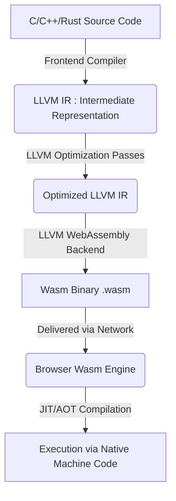
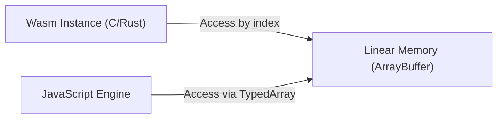
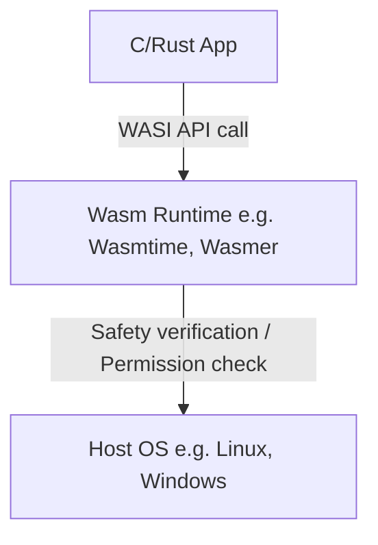

# Introduction: The Rise of WebAssembly (Wasm)

For a long time, web browsers were dominated by a single language: JavaScript. However, as web applications have become more complex and require performance comparable to native apps, the limitations of JavaScript alone have become apparent. This is where **WebAssembly (Wasm)** comes in.

WebAssembly is a new binary format that can execute at near-native speeds in the browser. Compiled from programming languages such as C, C++, and [Rust](https://kenji.blog/en/p/programming-languages-history-paradigm-evolution/), it is currently bringing innovation not only to web development but also to a wide range of areas including server-side, edge computing, and even IoT devices.

In this article, we will thoroughly explain the present and future of WebAssembly, covering basic concepts, the technical mechanisms of how C and Rust work within the browser, integration with JavaScript, performance comparisons, and applications outside the browser (WASI).

---

# 1. What is WebAssembly?

## 1.1 Background of Its Creation

Even before the birth of WebAssembly, there were several attempts to improve JavaScript performance. Examples include **Native Client (NaCl)** by Google and **asm.js** by Mozilla.

- **asm.js**: A subset of JavaScript that was designed to be easy for the browser's JIT compiler to optimize by adding type annotations.
- **NaCl**: A sandbox technology for securely running native code within the browser, but it never reached standardization among browser vendors.

Based on these reflections and experiences, major browser vendors (Mozilla, Google, Microsoft, Apple) collaborated to formulate an open standard known as **WebAssembly**.

## 1.2 Design Philosophy of Wasm

WebAssembly has the following design goals:

1. **Fast and Efficient**: It can be executed at near-native speed and has short load times.
2. **Safe**: It runs in a sandboxed environment and adheres to host security policies.
3. **Open and Debuggable**: In addition to the binary format, it has a human-readable text format (WAT: WebAssembly Text format).
4. **Integration with the Web**: It works cooperatively with JavaScript and can seamlessly integrate with existing Web APIs.

---

# 2. How C/Rust Runs in the Browser

So, how exactly does C and Rust code execute in the browser? Let's look at the process step by step.

## 2.1 Compilation [Pipeline](https://kenji.blog/en/p/cicd-pipeline-github-actions-best-practices/)

Languages like C and [Rust](https://kenji.blog/en/p/programming-languages-history-paradigm-evolution/) are typically compiled into machine code dependent on the OS or CPU architecture. However, in the case of WebAssembly, you specify a Wasm architecture such as "wasm32" as the target.

In many cases, the LLVM compiler infrastructure is used.



In this way, the code written by the developer goes through an intermediate representation (IR), is optimized, and finally becomes a compact binary file with a `.wasm` extension.

## 2.2 Bytecode and [Stack](https://kenji.blog/en/p/c-language-pointers-memory-management-stack-heap/) Machine

WebAssembly adopts a **stack machine** architecture. It has no registers, and all calculations are performed on a stack (a LIFO data structure).

For example, when performing a simple addition `$ 1 + 2 $`, the Wasm text representation (WAT) looks like this:

```wasm
(module
  (func $add (param $a i32) (param $b i32) (result i32)
    local.get $a
    local.get $b
    i32.add)
  (export "add" (func $add))
)
```

1.  `local.get $a` pushes the value of variable a onto the stack.
2.  `local.get $b` pushes the value of variable b onto the stack.
3.  `i32.add` pops the two values from the stack, adds them, and pushes the result onto the stack.

This simple structure allows for fast decoding and validation processes, enabling JIT compilation in the browser to be performed in a very short time.

## 2.3 Memory Model (Linear Memory)

Memory manipulation using pointers is frequent in C and [Rust](https://kenji.blog/en/p/programming-languages-history-paradigm-evolution/). To achieve this, WebAssembly adopts the concept of **Linear Memory**.

Linear memory is a contiguous byte array that can be accessed from a WebAssembly instance. From JavaScript, it appears as an `ArrayBuffer` or `SharedArrayBuffer`. [Pointer](https://kenji.blog/en/p/c-language-pointers-memory-management-stack-heap/)s within Wasm are simply indices (integer values) of this array.



This mechanism prevents Wasm code from directly accessing the host OS memory, providing a robust sandbox environment.

---

# 3. Integration of JavaScript and WebAssembly

WebAssembly is not meant to replace JavaScript, but rather to complement it. In many cases, JavaScript handles DOM manipulation and event handling, while delegating heavy computational tasks to WebAssembly.

## 3.1 Global Variables, Imports, and Exports

WebAssembly modules can import and export functions, memory, tables, and global variables to interact with JavaScript.

```javascript
// Load and instantiate the WebAssembly module
fetch('module.wasm')
  .then(response => response.arrayBuffer())
  .then(bytes => WebAssembly.instantiate(bytes, {
    env: {
      // Import a JavaScript function into Wasm
      consoleLog: (arg) => console.log("Wasm says: " + arg)
    }
  }))
  .then(results => {
    // Call a function exported from Wasm
    const add = results.instance.exports.add;
    console.log("1 + 2 = ", add(1, 2));
  });
```

## 3.2 Web API Access and Bindings

Wasm itself does not have the ability to directly access the DOM or Web APIs. Access must be done through JavaScript.
However, writing this manually is very tedious. Therefore, tools like **wasm-bindgen** are available in the [Rust](https://kenji.blog/en/p/programming-languages-history-paradigm-evolution/) ecosystem.

```rust
// Rust code (using wasm-bindgen)
use wasm_bindgen::prelude::*;

#[wasm_bindgen]
extern "C" {
    fn alert(s: &str);
}

#[wasm_bindgen]
pub fn greet(name: &str) {
    alert(&format!("Hello, {}!", name));
}
```

When this code is compiled, `wasm-bindgen` automatically generates JavaScript glue code, hiding the details of memory passing for strings, etc. This provides a development experience as if you were directly calling browser APIs from [Rust](https://kenji.blog/en/p/programming-languages-history-paradigm-evolution/).

---

# 4. Performance and Speed Comparison

Why is WebAssembly faster than JavaScript?

1.  **Parsing Speed**: Since Wasm is a binary format, it can be decoded much faster than parsing text-based JS source code to build an Abstract Syntax [Tree](https://kenji.blog/en/p/tree-graph-data-structures-search-dfs-bfs-dijkstra/) (AST).
2.  **JIT Optimization**: Because JS is a dynamically typed language, the JIT compiler must perform type inference at runtime and undo optimizations (Deoptimization) if the inference is wrong. Wasm is statically typed, and powerful optimizations have already been performed at compile time by tools like LLVM, allowing the browser to focus directly on generating machine code.
3.  **Avoidance of Garbage Collection (GC)**: Wasm written in C or [Rust](https://kenji.blog/en/p/programming-languages-history-paradigm-evolution/) manages memory independently, so unexpected pauses (stop-the-world) caused by the JS engine's GC do not occur (*We will discuss Wasm GC specifications later).

## 4.1 Benchmark: Fibonacci Sequence

Let's compare the speed of JavaScript and Rust (Wasm) using a simple Fibonacci sequence calculation.
Mathematically, it is represented by the following recursive formula. The computational complexity is exponential `$ O(2^n) $`, heavily consuming the CPU.

$$
F(n) =
\begin{cases}
0 & (n = 0) \\\\
1 & (n = 1) \\\\
F(n-1) + F(n-2) & (n \ge 2)
\end{cases}
$$

### JavaScript Implementation
```javascript
function fibJs(n) {
  if (n <= 1) return n;
  return fibJs(n - 1) + fibJs(n - 2);
}
```

### [Rust](https://kenji.blog/en/p/programming-languages-history-paradigm-evolution/) Implementation
```rust
#[no_mangle]
pub fn fib_wasm(n: u32) -> u32 {
    if n <= 1 { return n; }
    fib_wasm(n - 1) + fib_wasm(n - 2)
}
```

When calculated at $n=40$, JavaScript (V8 engine) generally executes quite quickly due to JIT optimization, but Wasm generated from [Rust](https://kenji.blog/en/p/programming-languages-history-paradigm-evolution/) is often **about 1.5 to over 2 times** faster. Especially in areas like matrix operations and image processing, where contiguous memory access and SIMD instructions shine, the difference becomes even more pronounced.

---

# 5. Rust and C++ as Development Languages

The most popular source languages for WebAssembly are C/C++ and Rust.

## 5.1 C++ and Emscripten

Historically, C/C++ has been used for porting to the web for the longest time. **Emscripten** is a toolchain that uses LLVM to convert C/C++ code into Wasm.
It features POSIX emulation and translation layers to OpenGL (WebGL) to run massive existing C/C++ libraries (such as SQLite, FFmpeg, OpenCV, game engines, etc.) in the browser.

## 5.2 Rust and WebAssembly

Currently, **Rust** is gaining the most attention as a first-class language for WebAssembly.
The reasons Rust is favored are as follows:

- **Small Runtime**: Rust does not have a GC or a huge runtime, so the size of the generated Wasm binary can be kept very small.
- **wasm-pack / wasm-bindgen**: The ecosystem is highly refined, allowing you to bootstrap a Wasm project and publish it as an npm package with just a few lines of commands.
- **Memory Safety**: Since memory safety is guaranteed at compile time, the risk of memory corruption due to bugs is reduced even when executing complex processes on the browser side.

---

# 6. Advanced Features and Specification Extensions of WebAssembly

WebAssembly has continued to evolve since its initial release (MVP), and many powerful extensions have now been implemented in browsers.

## 6.1 SIMD (Single Instruction, Multiple Data)
SIMD instructions, which process multiple pieces of data simultaneously with a single instruction, are now supported (128-bit SIMD). This promises dramatic performance improvements in image processing, audio processing, encryption algorithms, etc.

## 6.2 Threads and Shared Memory
By utilizing Web Workers and `SharedArrayBuffer`, multiple Wasm instances can share the same memory area and perform parallel processing with multithreading. This allows advanced physics simulations and game engines to run smoothly in the browser.

## 6.3 Garbage Collection (Wasm GC)
While traditional Wasm was designed for languages like C and [Rust](https://kenji.blog/en/p/programming-languages-history-paradigm-evolution/) that manually manage linear memory, the **Wasm GC** proposal is being standardized to efficiently compile languages that require garbage collection, such as [Java](https://kenji.blog/en/p/programming-languages-history-paradigm-evolution/), Kotlin, C#, and Dart, to Wasm. This is dramatically improving the performance of frameworks like Flutter Web.

---

# 7. The World Outside the Browser: WASI (WebAssembly System Interface)

The potential of WebAssembly is not limited to inside the browser. **"What if we could use Wasm as a standard format outside the browser as well?"** From this idea, **WASI (WebAssembly System Interface)** was born.

## 7.1 What is WASI?
WASI is a standard interface for WebAssembly programs to safely access OS resources (file systems, networks, environment variables, etc.).
It allows granting only the necessary permissions to a Wasm module (Capability-based security) while maintaining the browser's sandbox model.



## 7.2 Alternative and Coexistence with [Docker](https://kenji.blog/en/p/docker-container-namespace-cgroups-layers/) [Container](https://kenji.blog/en/p/docker-container-namespace-cgroups-layers/)s
Solomon Hykes, the inventor of Docker, made waves by stating, "If Wasm and WASI had existed in 2008, we wouldn't have needed to create Docker."
Wasm has powerful advantages over containers: it is far lighter, starts faster (in milliseconds), and is not dependent on the OS or CPU architecture.
Currently, projects that orchestrate Wasm modules directly on [Kubernetes](https://kenji.blog/en/p/kubernetes-k8s-architecture-pod-service-ingress/) as an alternative to Docker containers (such as Kwasm and Spin) are being actively developed.

---

# 8. The Future of WebAssembly

## 8.1 Component Model
The biggest challenge with current WebAssembly is that it is difficult to link Wasm modules written in different languages together (because memory representations of strings and complex data types differ from language to language).

The **WebAssembly Component Model** solves this.
If the Component Model is realized, it will become possible to seamlessly call functions between a "Wasm module written in [Rust](https://kenji.blog/en/p/programming-languages-history-paradigm-evolution/)" and a "Wasm module written in Python." This has the potential to become the foundation for a next-generation microservice architecture that is independent of platforms and languages.

## 8.2 Wasm as a Plugin System
Already, many software applications such as Figma, EnvoyProxy, and Microsoft Flight Simulator have adopted WebAssembly as their proprietary plugin system. This is because user-created third-party code can be safely and rapidly executed within the main application.

---

# Conclusion

WebAssembly has grown far beyond a mere "fast technology that runs in the browser," and is becoming a lingua franca in cloud-native, edge computing, and plugin architectures.

A world where powerful logic developed in system programming languages like C, C++, and Rust can be deployed safely and quickly, regardless of the platform. That is the **present and future** that WebAssembly is pioneering.

In future web development, a right-tool-for-the-job hybrid approach will likely become mainstream, where UI construction continues to be handled by JavaScript/TypeScript, and WebAssembly is utilized for core logic that requires performance or for reusing existing native assets.

By all means, dive into the world of WebAssembly yourself using Rust or Emscripten.
