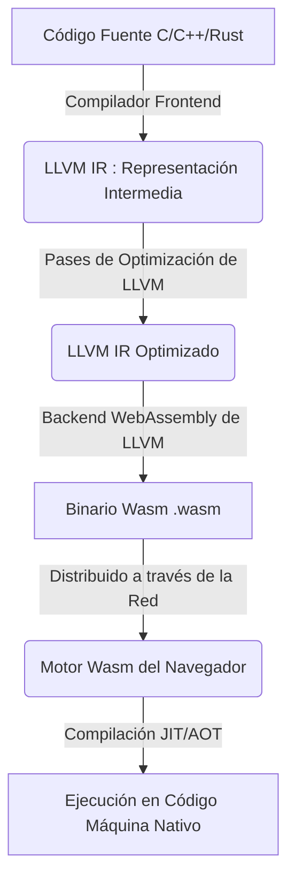
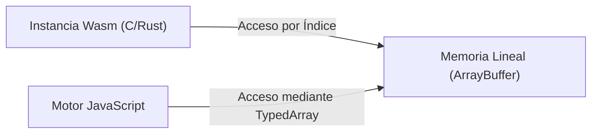
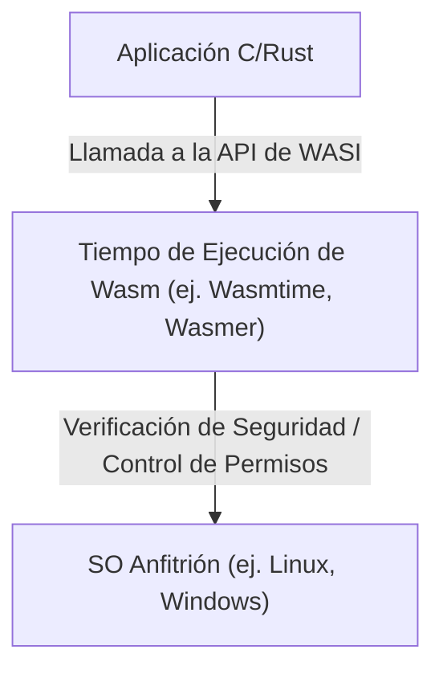

# Introducción: El Auge de WebAssembly (Wasm)

Durante mucho tiempo, los navegadores web han estado dominados por un único lenguaje: JavaScript. Sin embargo, a medida que las aplicaciones web se han vuelto más complejas y requieren un rendimiento comparable al de las aplicaciones nativas, los límites de usar solo JavaScript se han hecho evidentes. Aquí es donde entra en juego **WebAssembly (Wasm)**.

WebAssembly es un nuevo formato binario que puede ejecutarse en el navegador a velocidades cercanas a las del código nativo. Se compila a partir de lenguajes de programación como C, C++ y Rust, y actualmente está impulsando la innovación no solo en el desarrollo web, sino también en una amplia gama de áreas, incluyendo el lado del servidor, la computación en el borde (edge computing) e incluso en dispositivos IoT.

En este artículo, explicaremos exhaustivamente el presente y el futuro de WebAssembly, desde sus conceptos básicos, los mecanismos técnicos de cómo C y Rust funcionan dentro del navegador, su integración con JavaScript, comparaciones de rendimiento, hasta sus aplicaciones en el mundo fuera del navegador (WASI).

---

# 1. ¿Qué es WebAssembly?

## 1.1 Antecedentes de su Creación

Incluso antes de la creación de WebAssembly, hubo varios intentos de mejorar el rendimiento de JavaScript. Por ejemplo, **Native Client (NaCl)** de Google y **asm.js** de Mozilla.

- **asm.js**: Un subconjunto de JavaScript, diseñado para facilitar la optimización por parte de los compiladores JIT del navegador mediante la adición de anotaciones de tipos.
- **NaCl**: Una tecnología de sandbox (entorno aislado) para ejecutar de forma segura código nativo dentro del navegador, pero no logró la estandarización entre los proveedores de navegadores.

Basándose en estas reflexiones y experiencias, los principales proveedores de navegadores (Mozilla, Google, Microsoft, Apple) colaboraron para establecer un estándar abierto: **WebAssembly**.

## 1.2 Filosofía de Diseño de Wasm

WebAssembly tiene los siguientes objetivos de diseño:

1.  **Rápido y eficiente** : Debe ejecutarse a velocidades cercanas a las nativas y tener tiempos de carga cortos.
2.  **Seguro** : Debe ejecutarse en un entorno de sandbox y cumplir con las políticas de seguridad del host.
3.  **Abierto y depurable** : Junto con el formato binario, debe tener un formato de texto legible por humanos (WAT: WebAssembly Text format).
4.  **Integración con la Web** : Debe funcionar en coordinación con JavaScript y poder integrarse perfectamente con las API web existentes.

---

# 2. Cómo Funciona C/Rust en el Navegador

Entonces, ¿cómo se ejecuta exactamente el código de C o Rust en el navegador? Veamos este proceso paso a paso.

## 2.1 La Tubería de Compilación (Compilation [Pipeline](https://kenji.blog/es/p/cicd-pipeline-github-actions-best-practices/))

Los lenguajes como C y Rust normalmente se compilan a código máquina dependiente del sistema operativo o la arquitectura de la CPU. Sin embargo, en el caso de WebAssembly, se especifica una arquitectura para Wasm como destino, por ejemplo, "wasm32".

En muchos casos, se utiliza la infraestructura del compilador LLVM.



De esta manera, el código escrito por los desarrolladores pasa por una representación intermedia (IR), se optimiza y, en última instancia, se convierte en un archivo binario compacto con la extensión `.wasm`.

## 2.2 Código de Bytes (Bytecode) y la Máquina de Pila (Stack Machine)

WebAssembly adopta una arquitectura de **máquina de pila**. No tiene registros; en su lugar, todos los cálculos se realizan sobre una pila (una estructura de datos LIFO).

Por ejemplo, al realizar una simple suma `$ 1 + 2 $`, la representación de texto de Wasm (WAT) se vería así:

```wasm
(module
  (func $add (param $a i32) (param $b i32) (result i32)
    local.get $a
    local.get $b
    i32.add)
  (export "add" (func $add))
)
```

1.  `local.get $a` empuja el valor de la variable a en la pila.
2.  `local.get $b` empuja el valor de la variable b en la pila.
3.  `i32.add` saca dos valores de la pila, los suma y empuja el resultado de vuelta a la pila.

Esta estructura simple permite que el proceso de decodificación y validación sea rápido, haciendo que la compilación JIT en el navegador se realice en muy poco tiempo.

## 2.3 Modelo de Memoria (Memoria Lineal)

En C y Rust, las operaciones de memoria usando punteros se realizan con frecuencia. Para lograr esto, WebAssembly adopta el concepto de **Memoria Lineal (Linear Memory)**.

La memoria lineal es un array contiguo de bytes al que se puede acceder desde una instancia de WebAssembly. Desde JavaScript, esto se ve como un `ArrayBuffer` o `SharedArrayBuffer`. Un puntero dentro de Wasm no es más que un índice (un valor entero) en este array.



A través de este mecanismo, se evita que el código Wasm acceda directamente a la memoria del sistema operativo anfitrión, proporcionando un entorno de sandbox robusto.

---

# 3. Integración de JavaScript y WebAssembly

WebAssembly no pretende reemplazar a JavaScript, sino complementarlo. En la mayoría de los casos, JavaScript se encarga de la manipulación del DOM y el manejo de eventos, mientras que las tareas de cálculo pesado se delegan a WebAssembly.

## 3.1 Variables Globales, Importaciones y Exportaciones

Los módulos de WebAssembly pueden importar y exportar funciones, memoria, tablas y variables globales para comunicarse con JavaScript.

```javascript
// Cargar e instanciar el módulo WebAssembly
fetch('module.wasm')
  .then(response => response.arrayBuffer())
  .then(bytes => WebAssembly.instantiate(bytes, {
    env: {
      // Importar una función de JavaScript en Wasm
      consoleLog: (arg) => console.log("Wasm dice: " + arg)
    }
  }))
  .then(results => {
    // Llamar a una función exportada desde Wasm
    const add = results.instance.exports.add;
    console.log("1 + 2 = ", add(1, 2));
  });
```

## 3.2 Acceso y Enlaces a las API Web

Wasm por sí mismo no tiene la capacidad de acceder directamente al DOM o a las API Web. Para hacerlo, debe pasar por JavaScript.
Sin embargo, escribir todo esto manualmente requiere mucho esfuerzo. Por ello, el ecosistema de Rust proporciona herramientas como **wasm-bindgen**.

```rust
// Código Rust (usando wasm-bindgen)
use wasm_bindgen::prelude::*;

#[wasm_bindgen]
extern "C" {
    fn alert(s: &str);
}

#[wasm_bindgen]
pub fn greet(name: &str) {
    alert(&format!("¡Hola, {}!", name));
}
```

Al compilar este código, `wasm-bindgen` genera automáticamente el código de enlace (código pegamento) de JavaScript, ocultando el paso de memoria para las cadenas de texto, etc. Esto proporciona una experiencia de desarrollo como si estuvieras llamando directamente a las API del navegador desde Rust.

---

# 4. Comparación de Rendimiento y Velocidad

¿Por qué WebAssembly es más rápido que JavaScript?

1.  **Velocidad de Análisis (Parsing)** : Como Wasm es un formato binario, se puede decodificar mucho más rápido que analizar el código fuente de texto JS para construir un Árbol de Sintaxis Abstracta (AST).
2.  **Optimización JIT** : Como JS es un lenguaje de tipado dinámico, el compilador JIT debe inferir los tipos en tiempo de ejecución, y si la inferencia falla, tiene que deshacer la optimización (Deoptimization). Wasm tiene un tipado estático y ya ha pasado por optimizaciones potentes (con LLVM, etc.) en el momento de la compilación, por lo que el navegador puede concentrarse directamente en generar código máquina.
3.  **Evitar la Recolección de Basura (GC)** : Wasm escrito en C o Rust gestiona la memoria por su cuenta, por lo que no se producen pausas inesperadas causadas por el GC del motor JS (※Las especificaciones de Wasm GC se tratarán más adelante).

## 4.1 Benchmark: Sucesión de Fibonacci

Comparemos la velocidad de JavaScript y Rust (Wasm) utilizando un cálculo simple de la sucesión de Fibonacci.
Matemáticamente se expresa con la siguiente fórmula recursiva. La complejidad computacional es exponencial `$ O(2^n) $`, lo que consume mucha CPU.

$$
F(n) =
\begin{cases}
0 & (n = 0) \\\\
1 & (n = 1) \\\\
F(n-1) + F(n-2) & (n \ge 2)
\end{cases}
$$

### Implementación en JavaScript
```javascript
function fibJs(n) {
  if (n <= 1) return n;
  return fibJs(n - 1) + fibJs(n - 2);
}
```

### Implementación en Rust
```rust
#[no_mangle]
pub fn fib_wasm(n: u32) -> u32 {
    if n <= 1 { return n; }
    fib_wasm(n - 1) + fib_wasm(n - 2)
}
```

Al calcular para $n=40$, aunque JavaScript (motor V8) se ejecuta bastante rápido debido a las optimizaciones del JIT, el Wasm generado desde Rust suele ser **entre 1.5 y más de 2 veces** más rápido en la mayoría de los casos. Especialmente en áreas donde el acceso secuencial a la memoria y las instrucciones SIMD brillan, como los cálculos de matrices o el procesamiento de imágenes, la diferencia es aún más pronunciada.

---

# 5. Rust y C++ como Lenguajes de Desarrollo

Los lenguajes más populares como origen para compilar a WebAssembly son C/C++ y Rust.

## 5.1 C++ y Emscripten

Históricamente, C/C++ son los lenguajes que se han utilizado durante más tiempo para portar a la web. **Emscripten** es una cadena de herramientas que utiliza LLVM para convertir código C/C++ a Wasm.
Cuenta con emulación POSIX y una capa de conversión a OpenGL (WebGL) para ejecutar enormes bibliotecas existentes de C/C++ (como SQLite, FFmpeg, OpenCV, motores de juegos, etc.) en el navegador.

## 5.2 Rust y WebAssembly

Actualmente, **Rust** es el lenguaje de primera clase que atrae más atención para WebAssembly.
Las razones por las que se prefiere Rust son las siguientes:

- **Pequeño tiempo de ejecución (runtime)** : Rust no tiene un GC ni un runtime gigantesco, por lo que el tamaño del binario Wasm generado se puede mantener muy pequeño.
- **wasm-pack / wasm-bindgen** : El ecosistema es muy refinado, permitiendo configurar un proyecto Wasm y publicarlo como un paquete npm con solo unas pocas líneas de comandos.
- **Seguridad de memoria** : Dado que la seguridad de la memoria está garantizada en el momento de la compilación, el riesgo de corrupción de la memoria debido a errores se reduce, incluso cuando se ejecutan procesos complejos en el navegador.

---

# 6. Características Avanzadas y Extensiones de WebAssembly

WebAssembly ha continuado evolucionando desde su lanzamiento inicial (MVP), y ahora se han implementado muchas extensiones poderosas en los navegadores.

## 6.1 SIMD (Instrucción Única, Datos Múltiples)
Se han admitido instrucciones SIMD que procesan múltiples datos simultáneamente con una sola instrucción (SIMD de 128 bits). Esto promete mejoras drásticas en el rendimiento en procesamiento de imágenes, procesamiento de audio y algoritmos criptográficos.

## 6.2 Hilos y Memoria Compartida
Al usar Web Workers y `SharedArrayBuffer`, ahora es posible que múltiples instancias de Wasm compartan el mismo espacio de memoria y realicen procesamiento paralelo a través del multihilo. Esto permite que las simulaciones físicas avanzadas y los motores de juegos se ejecuten sin problemas en el navegador.

## 6.3 Recolección de Basura (Wasm GC)
Aunque el Wasm tradicional fue diseñado para lenguajes como C y Rust, que gestionan manualmente la memoria lineal, se están estandarizando las propuestas de **Wasm GC** para compilar de manera eficiente lenguajes que requieren recolección de basura, como Java, Kotlin, C# y Dart, a Wasm. Esto está mejorando dramáticamente el rendimiento de frameworks como Flutter Web.

---

# 7. El Mundo Fuera del Navegador: WASI (WebAssembly System Interface)

El potencial de WebAssembly no se limita al navegador. La idea de **"¿Y si pudiéramos usar Wasm como un formato estándar incluso fuera del navegador?"** dio lugar a **WASI (WebAssembly System Interface)**.

## 7.1 ¿Qué es WASI?
WASI es una interfaz estándar para que los programas WebAssembly accedan a los recursos del sistema operativo (sistema de archivos, red, variables de entorno, etc.) de forma segura.
Mantiene el modelo de sandbox del navegador, a la vez que otorga solo los permisos necesarios a los módulos de Wasm (Seguridad basada en capacidades).



## 7.2 Alternativa y Coexistencia con Contenedores [Docker](https://kenji.blog/es/p/docker-container-namespace-[cgroups](https://kenji.blog/es/p/docker-container-namespace-cgroups-layers/)-layers/)
El creador de Docker, Solomon Hykes, causó revuelo cuando dijo: "Si Wasm y WASI hubieran existido en 2008, no habríamos necesitado crear Docker".
Wasm es mucho más ligero que los contenedores, se inicia más rápido (en unos pocos milisegundos) y tiene la gran ventaja de ser independiente del sistema operativo y de la arquitectura de la CPU.
Hoy en día, se están desarrollando activamente proyectos (como Kwasm y Spin) para orquestar módulos Wasm directamente en [Kubernetes](https://kenji.blog/es/p/kubernetes-k8s-architecture-pod-service-ingress/) como alternativa a los contenedores Docker.

---

# 8. El Futuro de WebAssembly

## 8.1 El Modelo de Componentes (Component Model)
El mayor desafío con WebAssembly en la actualidad es que es difícil hacer que módulos Wasm escritos en diferentes lenguajes colaboren entre sí (porque las representaciones en memoria de cadenas y tipos de datos complejos varían entre lenguajes).

El **WebAssembly Component Model** (Modelo de Componentes) resolverá esto.
Una vez implementado, será posible llamar a funciones sin problemas desde un "módulo Wasm escrito en Rust" a un "módulo Wasm escrito en Python". Esto tiene el potencial de convertirse en la base para la arquitectura de microservicios de próxima generación que sea independiente de la plataforma y el lenguaje.

## 8.2 Wasm como Sistema de Plugins
Ya hay una gran cantidad de software que ha adoptado WebAssembly como su sistema de plugins, como Figma, EnvoyProxy y Microsoft Flight Simulator. Esto se debe a que el código de terceros creado por los usuarios se puede ejecutar de manera segura y rápida dentro de la aplicación principal.

---

# Resumen

WebAssembly está trascendiendo sus límites de ser solo una "tecnología rápida que se ejecuta en el navegador", y está creciendo para convertirse en el lenguaje común para arquitecturas nativas de la nube, edge computing y sistemas de plugins.

Un mundo donde la lógica poderosa desarrollada en lenguajes de programación de sistemas como C, C++ y Rust se puede implementar de manera segura y rápida independientemente de la plataforma; ese es el **presente y futuro** que está forjando WebAssembly.

En el desarrollo web futuro, el enfoque híbrido en el que JavaScript/TypeScript continúa a cargo de la construcción de la interfaz de usuario (UI), mientras que WebAssembly se utiliza para la lógica central que requiere rendimiento y la reutilización de activos nativos existentes, se convertirá en la norma.

Por supuesto, te animo a dar el salto al mundo de WebAssembly usando Rust o Emscripten.
