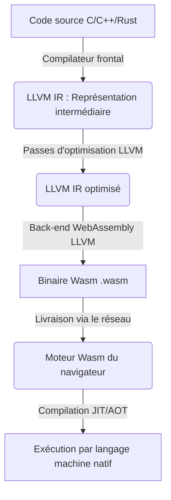
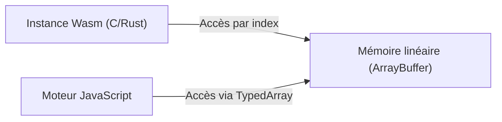
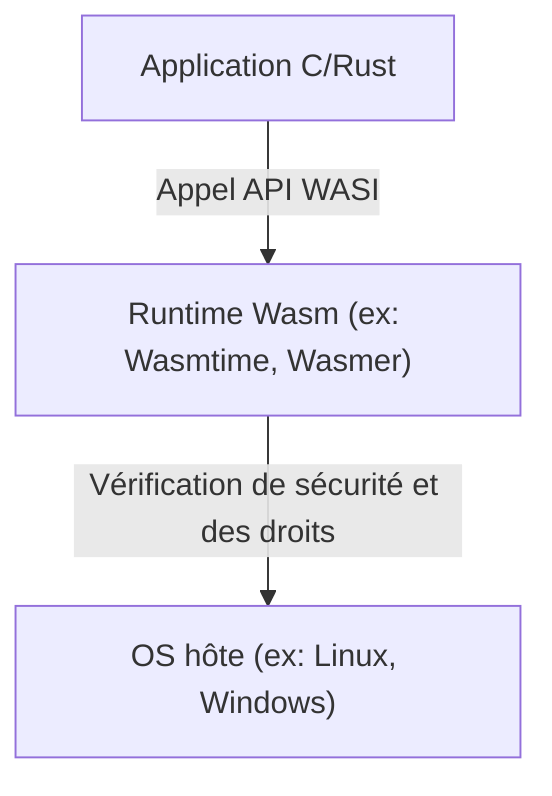

# Introduction : L'essor de WebAssembly (Wasm)

Les navigateurs web ont longtemps été dominés par un seul langage, le JavaScript. Cependant, avec la complexification des applications web et l'exigence de performances comparables aux applications natives, les limites du JavaScript seul sont devenues apparentes. C'est là qu'intervient **WebAssembly ([Wasm](/fr/p/webassembly-wasm-from-cpp-and-rust/))**.

WebAssembly est un nouveau format binaire qui peut s'exécuter dans le navigateur à des vitesses proches de celles du code natif. Compilé à partir de langages de programmation tels que C, C++ et [Rust](https://kenji.blog/fr/p/programming-languages-history-paradigm-evolution/), il apporte désormais de l'innovation non seulement au développement web, mais aussi au développement côté serveur, à l'edge computing et même aux appareils IoT.

Dans cet article, nous expliquerons en profondeur le présent et l'avenir de WebAssembly, des concepts de base aux mécanismes techniques permettant d'exécuter C ou Rust dans le navigateur, en passant par l'intégration avec JavaScript, les comparaisons de performances et les applications en dehors du navigateur (WASI).

---

# 1. Qu'est-ce que WebAssembly ?

## 1.1 Contexte de sa création

Avant la naissance de WebAssembly, il y a eu plusieurs tentatives pour améliorer les performances de JavaScript. Par exemple, **Native Client (NaCl)** par Google ou **asm.js** par Mozilla.

- **asm.js** : Un sous-ensemble de JavaScript conçu de manière à ce que le compilateur JIT du navigateur puisse facilement l'optimiser en ajoutant le typage sous forme d'annotations.
- **NaCl** : Une technologie bac à sable pour exécuter en toute sécurité du code natif dans le navigateur, mais elle n'est pas parvenue à s'imposer comme un standard parmi les différents éditeurs de navigateurs.

Sur la base de ces expériences, les principaux fournisseurs de navigateurs (Mozilla, Google, Microsoft, Apple) ont collaboré pour formuler une norme ouverte : **WebAssembly**.

## 1.2 Philosophie de conception de Wasm

WebAssembly s'est fixé les objectifs de conception suivants :

1.  **Rapide et efficace** : Pouvoir s'exécuter à une vitesse proche de celle du code natif avec des temps de chargement courts.
2.  **Sûr** : S'exécuter dans un environnement de bac à sable (sandbox) et respecter les politiques de sécurité de l'hôte.
3.  **Ouvert et débogable** : Disposer d'un format texte lisible par l'homme (WAT : WebAssembly Text format) en plus de son format binaire.
4.  **Intégration avec le Web** : Travailler de concert avec JavaScript et s'intégrer de manière transparente aux API Web existantes.

---

# 2. Comment C/Rust fonctionnent dans le navigateur

Concrètement, comment le code C ou Rust est-il exécuté dans le navigateur ? Examinons ce processus étape par étape.

## 2.1 [Pipeline](https://kenji.blog/fr/p/cicd-pipeline-github-actions-best-practices/) de compilation

Les langages comme C et [Rust](https://kenji.blog/fr/p/programming-languages-history-paradigm-evolution/) sont généralement compilés en langage machine dépendant du système d'exploitation et de l'architecture du processeur. Toutefois, dans le cas de WebAssembly, une architecture spécifique à [Wasm](/fr/p/webassembly-wasm-from-cpp-and-rust/) telle que "wasm32" est spécifiée comme architecture cible.

Dans la plupart des cas, l'infrastructure du compilateur LLVM est utilisée.



Ainsi, le code écrit par le développeur passe par une représentation intermédiaire (IR), est optimisé et devient finalement un fichier binaire compact avec l'extension `.wasm`.

## 2.2 Bytecode et machine à pile

WebAssembly adopte une architecture de **machine à pile** (stack machine). Elle ne possède pas de registres et tous les calculs sont effectués sur une pile (structure de données de type LIFO).

Par exemple, pour effectuer une simple addition `$ 1 + 2 $`, la représentation textuelle de [Wasm](/fr/p/webassembly-wasm-from-cpp-and-rust/) (WAT) serait la suivante.

```wasm
(module
  (func $add (param $a i32) (param $b i32) (result i32)
    local.get $a
    local.get $b
    i32.add)
  (export "add" (func $add))
)
```

1.  `local.get $a` pour mettre la valeur de la variable a sur la pile.
2.  `local.get $b` pour mettre la valeur de la variable b sur la pile.
3.  `i32.add` pour prendre les deux valeurs de la pile, les additionner et mettre le résultat sur la pile.

Grâce à cette structure simple, les processus de décodage et de validation sont très rapides, et la compilation JIT dans le navigateur peut s'effectuer en un temps très court.

## 2.3 Modèle de mémoire (Mémoire linéaire)

En C et [Rust](https://kenji.blog/fr/p/programming-languages-history-paradigm-evolution/), la manipulation de la mémoire avec des [pointeurs](/fr/p/c-language-pointers-memory-management-stack-heap/) est fréquente. Pour rendre cela possible, WebAssembly adopte le concept de **mémoire linéaire** (Linear Memory).

La mémoire linéaire est un tableau d'octets contigu accessible depuis l'instance WebAssembly. Depuis JavaScript, elle est vue comme un `ArrayBuffer` ou un `SharedArrayBuffer`. Les [pointeurs](/fr/p/c-language-pointers-memory-management-stack-heap/) dans [Wasm](/fr/p/webassembly-wasm-from-cpp-and-rust/) ne sont que de simples index (valeurs entières) dans ce tableau.



Ce mécanisme empêche le code [Wasm](/fr/p/webassembly-wasm-from-cpp-and-rust/) d'accéder directement à la mémoire du système d'exploitation hôte, offrant ainsi un environnement de bac à sable robuste.

---

# 3. Intégration de JavaScript et WebAssembly

WebAssembly n'a pas pour but de remplacer JavaScript, mais de le compléter. Le plus souvent, JavaScript se charge de la manipulation du DOM et de la gestion des événements, tandis que les calculs lourds sont délégués à WebAssembly.

## 3.1 Variables globales, importations et exportations

Les modules WebAssembly peuvent importer et exporter des fonctions, de la mémoire, des tables et des variables globales pour communiquer avec JavaScript.

```javascript
// Chargement et instanciation du module WebAssembly
fetch('module.wasm')
  .then(response => response.arrayBuffer())
  .then(bytes => WebAssembly.instantiate(bytes, {
    env: {
      // Importation de la fonction JavaScript dans Wasm
      consoleLog: (arg) => console.log("Wasm says: " + arg)
    }
  }))
  .then(results => {
    // Appel de la fonction exportée depuis Wasm
    const add = results.instance.exports.add;
    console.log("1 + 2 = ", add(1, 2));
  });
```

## 3.2 Accès aux API Web et liaisons (bindings)

[Wasm](/fr/p/webassembly-wasm-from-cpp-and-rust/) n'a pas en soi la capacité d'accéder directement au DOM ou aux API Web. Il doit passer par JavaScript pour y accéder.
Cependant, écrire cela manuellement prend énormément de temps. Par conséquent, l'écosystème [Rust](https://kenji.blog/fr/p/programming-languages-history-paradigm-evolution/) fournit des outils tels que **[wasm](/fr/p/webassembly-wasm-from-cpp-and-rust/)-bindgen**.

```rust
// Code Rust (utilisant wasm-bindgen)
use wasm_bindgen::prelude::*;

#[wasm_bindgen]
extern "C" {
    fn alert(s: &str);
}

#[wasm_bindgen]
pub fn greet(name: &str) {
    alert(&format!("Hello, {}!", name));
}
```

Lorsque l'on compile ce code, `wasm-bindgen` génère automatiquement le code glue (le code servant de colle) pour JavaScript, masquant ainsi le passage des chaînes de caractères en mémoire, etc. Cela procure une expérience de développement comme si l'on appelait directement les API du navigateur depuis [Rust](https://kenji.blog/fr/p/programming-languages-history-paradigm-evolution/).

---

# 4. Comparaison des performances et de la vitesse

Pourquoi WebAssembly est-il plus rapide que JavaScript ?

1.  **Vitesse d'analyse (Parsing)** : Comme [Wasm](/fr/p/webassembly-wasm-from-cpp-and-rust/) est un format binaire, il peut être décodé beaucoup plus rapidement que l'analyse du code source JS textuel pour construire un arbre syntaxique abstrait (AST).
2.  **Optimisation JIT** : Le JS étant un langage à typage dynamique, le compilateur JIT doit deviner les types à l'exécution et annuler l'optimisation (Deoptimization) s'il se trompe. [Wasm](/fr/p/webassembly-wasm-from-cpp-and-rust/) est à typage statique, et des optimisations puissantes sont déjà effectuées lors de la compilation par LLVM, permettant au navigateur de se concentrer directement sur la génération du langage machine.
3.  **Évitement du ramasse-miettes (Garbage Collection, GC)** : [Wasm](/fr/p/webassembly-wasm-from-cpp-and-rust/), écrit en C ou Rust, gérant la mémoire de façon autonome, il n'y a pas de pauses inattendues (temps d'arrêt) causées par le GC du moteur JS (※Nous aborderons plus loin les spécifications du GC [Wasm](/fr/p/webassembly-wasm-from-cpp-and-rust/)).

## 4.1 Benchmark : Suite de Fibonacci

Comparons la vitesse de JavaScript et de Rust ([Wasm](/fr/p/webassembly-wasm-from-cpp-and-rust/)) avec un simple calcul de la suite de Fibonacci.
Mathématiquement, cela s'exprime par la formule récursive suivante. La complexité est exponentielle `$ O(2^n) $`, ce qui consomme fortement le CPU.

$$
F(n) =
\begin{cases}
0 & (n = 0) \\\\
1 & (n = 1) \\\\
F(n-1) + F(n-2) & (n \ge 2)
\end{cases}
$$

### Implémentation en JavaScript
```javascript
function fibJs(n) {
  if (n <= 1) return n;
  return fibJs(n - 1) + fibJs(n - 2);
}
```

### Implémentation en [Rust](https://kenji.blog/fr/p/programming-languages-history-paradigm-evolution/)
```rust
#[no_mangle]
pub fn fib_wasm(n: u32) -> u32 {
    if n <= 1 { return n; }
    fib_wasm(n - 1) + fib_wasm(n - 2)
}
```

Lorsqu'on le calcule pour $n=40$, JavaScript (moteur V8) s'exécute aussi assez rapidement grâce à l'optimisation JIT, mais le [Wasm](/fr/p/webassembly-wasm-from-cpp-and-rust/) généré à partir de [Rust](https://kenji.blog/fr/p/programming-languages-history-paradigm-evolution/) s'exécute souvent **environ 1,5 à plus de 2 fois** plus vite. La différence devient encore plus évidente dans les domaines où l'accès contigu à la mémoire et les instructions SIMD sont exploités, comme le calcul matriciel ou le traitement d'images.

---

# 5. Rust et C++ comme langages de développement

Les langages source les plus populaires pour WebAssembly sont C/C++ et Rust.

## 5.1 C++ et Emscripten

Historiquement, le C/C++ est le langage qui a été utilisé depuis le plus longtemps pour porter du code sur le Web. **Emscripten** est une chaîne d'outils (toolchain) qui utilise LLVM pour convertir du code C/C++ en [Wasm](/fr/p/webassembly-wasm-from-cpp-and-rust/).
Il dispose d'une émulation POSIX et d'une couche de conversion vers OpenGL (WebGL) pour faire fonctionner d'immenses bibliothèques C/C++ existantes (par exemple, SQLite, FFmpeg, OpenCV, les moteurs de jeu) dans le navigateur.

## 5.2 Rust et WebAssembly

Actuellement, le langage de première classe le plus en vue pour WebAssembly est **Rust**.
Les raisons pour lesquelles Rust est apprécié sont les suivantes :

- **Petite taille du runtime** : Rust n'a pas de GC ni de gros runtime, ce qui permet de maintenir la taille du binaire [Wasm](/fr/p/webassembly-wasm-from-cpp-and-rust/) généré à un niveau très bas.
- **[wasm](/fr/p/webassembly-wasm-from-cpp-and-rust/)-pack / [wasm](/fr/p/webassembly-wasm-from-cpp-and-rust/)-bindgen** : L'écosystème est très abouti, permettant de lancer un projet [Wasm](/fr/p/webassembly-wasm-from-cpp-and-rust/) en quelques lignes de commande et de le publier en tant que paquet npm.
- **Sécurité de la mémoire** : La sécurité de la mémoire étant garantie à la compilation, les risques de corruption de mémoire dus à des bugs sont réduits, même lors de l'exécution de traitements complexes côté navigateur.

---

# 6. Fonctionnalités avancées et extensions des spécifications de WebAssembly

WebAssembly continue d'évoluer depuis sa version initiale (MVP), et de nombreuses extensions puissantes sont désormais implémentées dans les navigateurs.

## 6.1 SIMD (Single Instruction, Multiple Data)
La prise en charge des instructions SIMD, qui traitent plusieurs données simultanément en une seule instruction (SIMD 128 bits), a été ajoutée. Cela promet des améliorations drastiques de performances dans le traitement d'images, le traitement audio et les algorithmes de cryptographie.

## 6.2 Threads et mémoire partagée
En utilisant les Web Workers et `SharedArrayBuffer`, il est désormais possible pour plusieurs instances Wasm de partager la même zone mémoire et d'effectuer des traitements parallèles multithread. Cela permet aux simulations physiques avancées et aux moteurs de jeu de fonctionner de manière fluide dans le navigateur.

## 6.3 Ramasse-miettes (Wasm GC)
Alors que le Wasm traditionnel était conçu pour le C ou [Rust](https://kenji.blog/fr/p/programming-languages-history-paradigm-evolution/) qui gèrent manuellement la mémoire linéaire, la proposition **Wasm GC** est en cours de standardisation pour compiler efficacement vers Wasm des langages nécessitant un ramasse-miettes, comme [Java](https://kenji.blog/fr/p/programming-languages-history-paradigm-evolution/), Kotlin, C# et Dart. Grâce à cela, les performances des applications telles que Flutter Web s'améliorent considérablement.

---

# 7. Le monde au-delà du navigateur : WASI (WebAssembly System Interface)

Le potentiel de WebAssembly ne se limite pas à l'intérieur du navigateur. **"Et si nous pouvions utiliser [Wasm](/fr/p/webassembly-wasm-from-cpp-and-rust/) comme format standard en dehors du navigateur ?"** C'est de cette idée qu'est né **WASI (WebAssembly System Interface)**.

## 7.1 Qu'est-ce que WASI ?
WASI est une interface standard permettant aux programmes WebAssembly d'accéder de manière sécurisée aux ressources du système d'exploitation (système de fichiers, réseau, variables d'environnement, etc.).
Il permet d'accorder aux modules Wasm uniquement les autorisations nécessaires (sécurité basée sur les capacités, ou Capability-based security) tout en conservant le modèle de bac à sable du navigateur.



## 7.2 Alternative et coexistence avec les conteneurs [Docker](https://kenji.blog/fr/p/docker-container-namespace-[cgroups](https://kenji.blog/fr/p/docker-container-namespace-cgroups-layers/)-layers/)
Solomon Hykes, l'inventeur de Docker, a fait sensation en déclarant : "Si Wasm et WASI avaient existé en 2008, nous n'aurions pas eu besoin de créer Docker".
Wasm est beaucoup plus léger que les conteneurs, démarre plus rapidement (en quelques millisecondes) et possède le grand avantage de ne pas dépendre de l'OS ni de l'architecture du processeur.
Aujourd'hui, des projets (comme Kwasm et Spin) qui orchestrent directement des modules Wasm à la place des conteneurs Docker sur [Kubernetes](https://kenji.blog/fr/p/kubernetes-k8s-architecture-pod-service-ingress/) sont activement développés.

---

# 8. L'avenir de WebAssembly

## 8.1 Le modèle de composants (Component Model)
Le plus grand défi actuel de WebAssembly est la difficulté à faire interagir des modules Wasm écrits dans différents langages (car la représentation en mémoire des chaînes de caractères et des types de données complexes varie selon les langages).

Le **WebAssembly Component Model** (Modèle de composants WebAssembly) vient résoudre ce problème.
Si le modèle de composants devient une réalité, il sera possible de faire appel, de manière transparente, à des fonctions d'un "module [Wasm](/fr/p/webassembly-wasm-from-cpp-and-rust/) écrit en [Rust](https://kenji.blog/fr/p/programming-languages-history-paradigm-evolution/)" depuis un "module [Wasm](/fr/p/webassembly-wasm-from-cpp-and-rust/) écrit en Python". Cela a le potentiel de devenir la base de l'architecture de microservices de nouvelle génération, indépendante de la plateforme et du langage.

## 8.2 Wasm comme système de plugins
De nombreux logiciels, tels que Figma, EnvoyProxy ou Microsoft Flight Simulator, ont déjà adopté WebAssembly pour leur propre système de plugins. En effet, cela permet d'exécuter du code tiers créé par les utilisateurs de manière sécurisée et rapide au sein de l'application principale.

---

# Conclusion

WebAssembly a largement dépassé son statut de simple "technologie rapide fonctionnant dans le navigateur" pour devenir un langage commun dans le cloud native, l'edge computing et l'architecture de plugins.

Un monde où la logique puissante développée dans des langages de programmation système comme C, C++ ou Rust peut être déployée en toute sécurité et rapidement, quelle que soit la plateforme : voilà le **présent et l'avenir** que WebAssembly est en train de façonner.

Dans le développement web à l'avenir, la construction d'interfaces utilisateur continuera d'être assurée par JavaScript/TypeScript, tandis que WebAssembly sera utilisé pour la logique de base exigeant des performances élevées et pour la réutilisation des actifs natifs existants. Cette approche hybride, où l'outil adapté est mis à la bonne place, devrait devenir dominante.

N'hésitez pas à plonger dans le monde de WebAssembly en utilisant Rust ou Emscripten !
