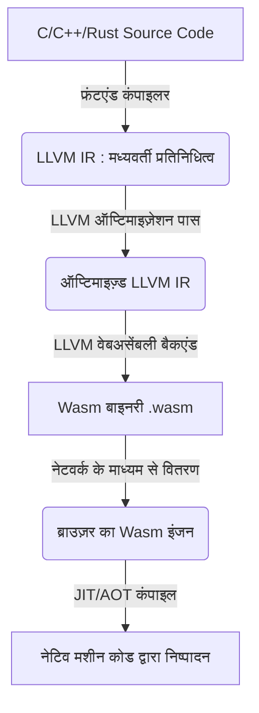
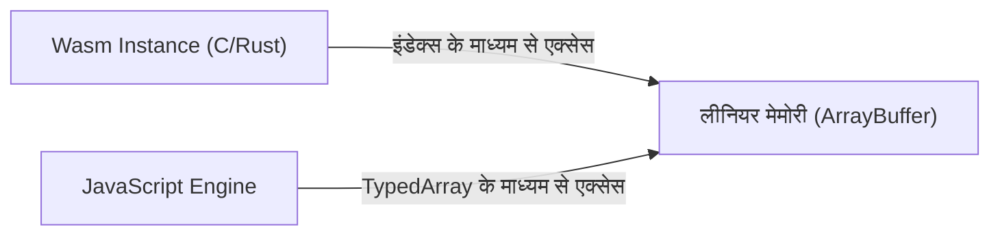
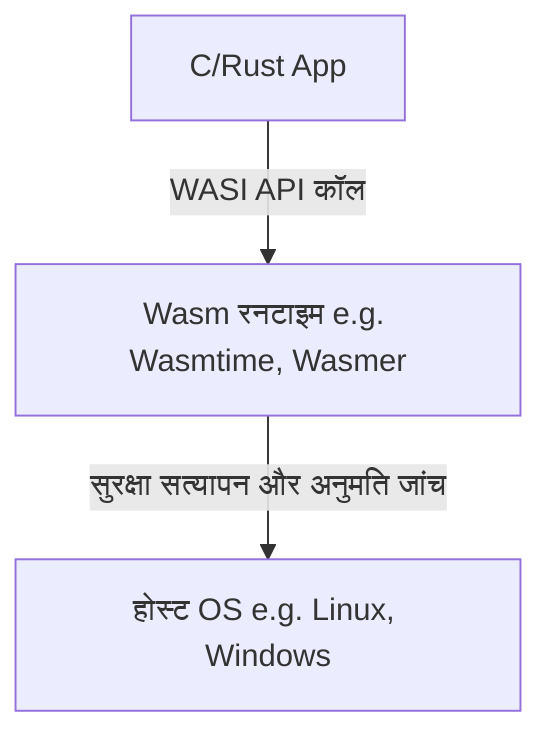

# परिचय: वेबअसेंबली (Wasm) का उदय

वेब ब्राउज़रों पर लंबे समय तक एक ही भाषा, जावास्क्रिप्ट का दबदबा रहा है। हालाँकि, जैसे-जैसे वेब एप्लिकेशन अधिक जटिल होते गए और उन्हें नेटिव ऐप जैसी परफॉर्मेंस की आवश्यकता होने लगी, अकेले जावास्क्रिप्ट की सीमाएं स्पष्ट हो गईं। यहीं से **[WebAssembly](/hi/p/webassembly-wasm-from-cpp-and-rust/) (Wasm)** की शुरुआत हुई।

वेबअसेंबली एक नया बाइनरी फॉर्मेट है जो ब्राउज़र में नेटिव कोड के समान गति पर चल सकता है। यह C, C++, और [Rust](https://kenji.blog/hi/p/programming-languages-history-paradigm-evolution/) जैसी प्रोग्रामिंग भाषाओं से कंपाइल होकर उत्पन्न होता है। आज, यह न केवल वेब डेवलपमेंट में बल्कि सर्वर-साइड, एज कंप्यूटिंग और यहां तक ​​कि IoT उपकरणों जैसे क्षेत्रों में भी नवाचार (इनोवेशन) ला रहा है।

इस लेख में, हम वेबअसेंबली के वर्तमान और भविष्य के बारे में विस्तार से चर्चा करेंगे, जिसमें वेबअसेंबली की मूलभूत अवधारणाएं (कन्सेप्ट्स), तकनीकी तंत्र कि C या Rust ब्राउज़र के अंदर कैसे काम करते हैं, जावास्क्रिप्ट के साथ इसका एकीकरण, परफॉर्मेंस की तुलना और ब्राउज़र के बाहर इसके अनुप्रयोग (WASI) शामिल हैं।

---

# 1. वेबअसेंबली क्या है?

## 1.1 जन्म की पृष्ठभूमि

वेबअसेंबली के आने से पहले भी, जावास्क्रिप्ट की परफॉर्मेंस को बेहतर बनाने के कई प्रयास किए गए थे। उदाहरण के लिए, Google का **Native Client (NaCl)** और Mozilla का **asm.js**।

- **asm.js**: यह जावास्क्रिप्ट का एक सब-सेट था, जिसे इस तरह डिज़ाइन किया गया था ताकि ब्राउज़र का JIT कंपाइलर टाइप जानकारी को एनोटेशन के रूप में देकर आसानी से ऑप्टिमाइज़ कर सके।
- **NaCl**: यह ब्राउज़र के अंदर सुरक्षित रूप से नेटिव कोड चलाने के लिए एक सैंडबॉक्स तकनीक थी, लेकिन ब्राउज़र वेंडर्स के बीच इसका मानकीकरण (स्टैंडर्डाइजेशन) नहीं हो सका।

इन अनुभवों से सीखते हुए, प्रमुख ब्राउज़र वेंडर्स (Mozilla, Google, Microsoft, Apple) ने मिलकर **वेबअसेंबली ([WebAssembly](/hi/p/webassembly-wasm-from-cpp-and-rust/))** नामक एक ओपन स्टैंडर्ड विकसित किया।

## 1.2 Wasm का डिज़ाइन दर्शन

वेबअसेंबली के निम्नलिखित डिज़ाइन लक्ष्य हैं:

1.  **तेज़ और कुशल** : इसे नेटिव स्पीड के करीब निष्पादित (execute) किया जा सके, और लोड समय कम हो।
2.  **सुरक्षित** : यह एक सैंडबॉक्स वातावरण में चले, और होस्ट की सुरक्षा नीतियों का पालन करे।
3.  **ओपन और डिबग करने योग्य** : बाइनरी फॉर्मेट के साथ-साथ, इसमें मानव-पठनीय टेक्स्ट फॉर्मेट (WAT: [WebAssembly](/hi/p/webassembly-wasm-from-cpp-and-rust/) Text format) भी हो।
4.  **वेब के साथ एकीकरण** : यह जावास्क्रिप्ट के साथ मिलकर काम कर सके और मौजूदा वेब API के साथ आसानी से इंटीग्रेट हो।

---

# 2. ब्राउज़र में C/Rust कैसे काम करता है

तो, आइए स्टेप-बाय-स्टेप देखें कि ब्राउज़र में C या Rust कोड वास्तव में कैसे निष्पादित होता है।

## 2.1 कंपाइलेशन पाइपलाइन

C और Rust जैसी भाषाओं को आमतौर पर OS और CPU आर्किटेक्चर के आधार पर मशीन कोड में कंपाइल किया जाता है। लेकिन वेबअसेंबली के मामले में, हम टार्गेट आर्किटेक्चर के रूप में Wasm आर्किटेक्चर (जैसे "wasm32") निर्दिष्ट करते हैं।

ज्यादातर मामलों में, LLVM कंपाइलर इन्फ्रास्ट्रक्चर का उपयोग किया जाता है।



इस तरह, डेवलपर द्वारा लिखा गया कोड मध्यवर्ती प्रतिनिधित्व (IR) के माध्यम से ऑप्टिमाइज़ किया जाता है, और अंततः `.wasm` एक्सटेंशन के साथ एक कॉम्पैक्ट बाइनरी फ़ाइल बन जाता है।

## 2.2 बाइटकोड और स्टैक मशीन

वेबअसेंबली **स्टैक मशीन** आर्किटेक्चर को अपनाती है। इसमें कोई रजिस्टर नहीं होता, और सभी गणनाएं स्टैक (LIFO डेटा संरचना) पर की जाती हैं।

उदाहरण के लिए, एक साधारण जोड़ `$ 1 + 2 $` करने के लिए, Wasm का टेक्स्ट रिप्रजेंटेशन (WAT) इस प्रकार होगा:

```wasm
(module
  (func $add (param $a i32) (param $b i32) (result i32)
    local.get $a
    local.get $b
    i32.add)
  (export "add" (func $add))
)
```

1.  `local.get $a` के साथ वेरिएबल a की वैल्यू को स्टैक पर धकेलें।
2.  `local.get $b` के साथ वेरिएबल b की वैल्यू को स्टैक पर धकेलें।
3.  `i32.add` के साथ स्टैक से दो वैल्यू निकालें, उन्हें जोड़ें, और परिणाम को वापस स्टैक पर धकेलें।

इस सरल संरचना के कारण, डिकोडिंग और सत्यापन (वेरिफिकेशन) बहुत तेज़ होते हैं, जिससे ब्राउज़र में JIT कंपाइलेशन बहुत कम समय में हो जाता है।

## 2.3 मेमोरी मॉडल (लीनियर मेमोरी)

C और [Rust](https://kenji.blog/hi/p/programming-languages-history-paradigm-evolution/) में अक्सर [पॉइंटर्स](/hi/p/c-language-pointers-memory-management-stack-heap/) का उपयोग करके मेमोरी को मैनिपुलेट किया जाता है। इसे संभव बनाने के लिए, वेबअसेंबली **लीनियर मेमोरी (Linear Memory)** की अवधारणा का उपयोग करती है।

लीनियर मेमोरी एक सन्निहित (continuous) बाइट ऐरे है जिसे वेबअसेंबली इंस्टेंस द्वारा एक्सेस किया जा सकता है। जावास्क्रिप्ट से, यह `ArrayBuffer` या `SharedArrayBuffer` के रूप में दिखाई देता है। Wasm के भीतर [पॉइंटर्स](/hi/p/c-language-pointers-memory-management-stack-heap/) इस ऐरे के केवल इंडेक्स (पूर्णांक मान) होते हैं।



यह तंत्र Wasm कोड को होस्ट OS की मेमोरी को सीधे एक्सेस करने से रोकता है, और एक मजबूत सैंडबॉक्स वातावरण प्रदान करता है।

---

# 3. जावास्क्रिप्ट और वेबअसेंबली का एकीकरण

वेबअसेंबली जावास्क्रिप्ट को बदलने के लिए नहीं है, बल्कि इसके पूरक (complement) के रूप में है। कई मामलों में, DOM मैनिपुलेशन और इवेंट हैंडलिंग जावास्क्रिप्ट द्वारा की जाती है, जबकि भारी गणना (कैलकुलेशन) वाले कार्य वेबअसेंबली को सौंपे जाते हैं।

## 3.1 ग्लोबल वेरिएबल्स और आयात/निर्यात

वेबअसेंबली मॉड्यूल जावास्क्रिप्ट के साथ बातचीत करने के लिए फ़ंक्शंस, मेमोरी, टेबल और ग्लोबल वेरिएबल्स को इंपोर्ट (आयात) और एक्सपोर्ट (निर्यात) कर सकते हैं।

```javascript
// वेबअसेंबली मॉड्यूल लोड और इंस्टेंशिएट करना
fetch('module.wasm')
  .then(response => response.arrayBuffer())
  .then(bytes => WebAssembly.instantiate(bytes, {
    env: {
      // जावास्क्रिप्ट फ़ंक्शन को Wasm में आयात करना
      consoleLog: (arg) => console.log("Wasm says: " + arg)
    }
  }))
  .then(results => {
    // Wasm से निर्यातित फ़ंक्शन को कॉल करना
    const add = results.instance.exports.add;
    console.log("1 + 2 = ", add(1, 2));
  });
```

## 3.2 Web API तक पहुंच और बाइंडिंग

Wasm में सीधे DOM या Web API तक पहुंचने की क्षमता नहीं होती है। एक्सेस के लिए इसे जावास्क्रिप्ट से होकर गुज़रना पड़ता है।
लेकिन इसे मैन्युअली लिखना बहुत थकाऊ हो सकता है। इसलिए, [Rust](https://kenji.blog/hi/p/programming-languages-history-paradigm-evolution/) इकोसिस्टम में **wasm-bindgen** जैसे टूल उपलब्ध हैं।

```rust
// Rust कोड (wasm-bindgen का उपयोग करके)
use wasm_bindgen::prelude::*;

#[wasm_bindgen]
extern "C" {
    fn alert(s: &str);
}

#[wasm_bindgen]
pub fn greet(name: &str) {
    alert(&format!("Hello, {}!", name));
}
```

जब आप इस कोड को कंपाइल करते हैं, तो `wasm-bindgen` स्वचालित रूप से जावास्क्रिप्ट का ग्लू कोड (glue code) उत्पन्न करता है और स्ट्रिंग मेमोरी पासिंग जैसी चीजों को छिपा देता है। यह ऐसा विकास अनुभव देता है मानो [Rust](https://kenji.blog/hi/p/programming-languages-history-paradigm-evolution/) से सीधे ब्राउज़र API को कॉल किया जा रहा हो।

---

# 4. परफॉर्मेंस और स्पीड की तुलना

वेबअसेंबली जावास्क्रिप्ट से अधिक तेज़ क्यों है?

1.  **पार्सिंग स्पीड** : क्योंकि Wasm एक बाइनरी फॉर्मेट है, इसे टेक्स्ट JS सोर्स कोड को पार्स करने और एब्सट्रैक्ट सिंटैक्स ट्री (AST) बनाने की तुलना में कहीं अधिक तेज़ी से डिकोड किया जा सकता है।
2.  **JIT ऑप्टिमाइज़ेशन** : चूँकि JS एक डायनामिकली-टाइप्ड भाषा है, JIT कंपाइलर को रनटाइम पर टाइप अनुमान लगाना पड़ता है, और यदि अनुमान गलत होता है तो उसे ऑप्टिमाइज़ेशन वापस लेना पड़ता है (Deoptimization)। Wasm स्टैटिक रूप से टाइप्ड है, और संकलन समय पर LLVM आदि द्वारा शक्तिशाली ऑप्टिमाइज़ेशन पहले ही हो चुका होता है, इसलिए ब्राउज़र सीधे मशीन कोड जनरेट करने पर ध्यान केंद्रित कर सकता है।
3.  **गारबेज कलेक्शन (GC) से बचाव** : C या Rust में लिखे गए Wasm अपनी मेमोरी खुद मैनेज करते हैं, जिससे JS इंजन के GC के कारण अप्रत्याशित पॉज़ (रुकने का समय) नहीं होता है (*Wasm GC विनिर्देशों को बाद में समझाया गया है)।

## 4.1 बेंचमार्क: फाइबोनैचि अनुक्रम

आइए एक साधारण फाइबोनैचि अनुक्रम की गणना के साथ जावास्क्रिप्ट और Rust (Wasm) की गति की तुलना करें।
गणितीय रूप से, इसे निम्नलिखित पुनरावर्ती (recursive) सूत्र द्वारा व्यक्त किया जा सकता है। कम्प्यूटेशनल कॉम्प्लेक्सिटी एक्सपोनेंशियल `$ O(2^n) $` है और यह बहुत अधिक CPU की खपत करता है।

$$
F(n) =
\begin{cases}
0 & (n = 0) \\\\
1 & (n = 1) \\\\
F(n-1) + F(n-2) & (n \ge 2)
\end{cases}
$$

### जावास्क्रिप्ट इम्प्लीमेंटेशन
```javascript
function fibJs(n) {
  if (n <= 1) return n;
  return fibJs(n - 1) + fibJs(n - 2);
}
```

### [Rust](https://kenji.blog/hi/p/programming-languages-history-paradigm-evolution/) इम्प्लीमेंटेशन
```rust
#[no_mangle]
pub fn fib_wasm(n: u32) -> u32 {
    if n <= 1 { return n; }
    fib_wasm(n - 1) + fib_wasm(n - 2)
}
```

जब $n=40$ के लिए गणना की जाती है, जावास्क्रिप्ट (V8 इंजन) भी आमतौर पर JIT ऑप्टिमाइज़ेशन के कारण काफी तेज़ी से निष्पादित होता है, लेकिन [Rust](https://kenji.blog/hi/p/programming-languages-history-paradigm-evolution/) से जनरेट हुआ Wasm अक्सर **लगभग 1.5 से 2 गुना** तेज़ होता है। विशेष रूप से मैट्रिक्स संचालन या इमेज प्रोसेसिंग जैसे क्षेत्रों में, जहाँ कंटीन्यूअस मेमोरी एक्सेस और SIMD निर्देश प्रभावी होते हैं, यह अंतर और भी स्पष्ट हो जाता है।

---

# 5. डेवलपमेंट भाषा के रूप में Rust और C++

C/C++ और Rust वेबअसेंबली के लिए स्रोत भाषाओं के रूप में सबसे लोकप्रिय हैं।

## 5.1 C++ और Emscripten

ऐतिहासिक रूप से, C/C++ का सबसे लंबे समय से वेब पर पोर्टिंग के लिए उपयोग किया जाता रहा है। **Emscripten** एक टूलचेन है जो LLVM का उपयोग करके C/C++ कोड को Wasm में कनवर्ट करता है।
यह POSIX एमुलेशन और OpenGL (WebGL) के लिए एक ट्रांसलेशन लेयर प्रदान करता है, जिससे मौजूदा बड़े C/C++ लाइब्रेरी (जैसे SQLite, FFmpeg, OpenCV, गेम इंजन) ब्राउज़र में चल सकते हैं।

## 5.2 Rust और वेबअसेंबली

वर्तमान में, **Rust** वेबअसेंबली के लिए फर्स्ट-क्लास भाषा के रूप में सबसे अधिक ध्यान आकर्षित कर रहा है।
Rust को पसंद किए जाने के निम्नलिखित कारण हैं:

- **छोटा रनटाइम** : Rust में GC या भारी रनटाइम नहीं है, इसलिए उत्पन्न Wasm बाइनरी का आकार बहुत छोटा रखा जा सकता है।
- **wasm-pack / wasm-bindgen** : इकोसिस्टम अत्यधिक परिष्कृत है, और आप कुछ ही कमांड के साथ Wasm प्रोजेक्ट स्थापित कर सकते हैं और इसे npm पैकेज के रूप में प्रकाशित कर सकते हैं।
- **मेमोरी सुरक्षा** : चूंकि कंपाइलेशन के दौरान मेमोरी सुरक्षा की गारंटी होती है, इसलिए ब्राउज़र साइड पर जटिल प्रक्रियाओं को चलाने पर भी बग के कारण मेमोरी करप्शन का जोखिम कम हो जाता है।

---

# 6. वेबअसेंबली के एडवांस फीचर्स और एक्सटेंशन्स

वेबअसेंबली अपने प्रारंभिक रिलीज़ (MVP) के बाद से विकसित होना जारी है, और अब कई शक्तिशाली एक्सटेंशन ब्राउज़रों में लागू किए गए हैं।

## 6.1 SIMD (Single Instruction, Multiple Data)
SIMD निर्देशों के लिए समर्थन जोड़ा गया है जो एक ही निर्देश के साथ एक साथ कई डेटा को प्रोसेस करते हैं (128-बिट SIMD)। इससे इमेज प्रोसेसिंग, ऑडियो प्रोसेसिंग और एन्क्रिप्शन एल्गोरिदम आदि में नाटकीय रूप से परफॉर्मेंस में सुधार होने की उम्मीद है।

## 6.2 थ्रेड्स और शेयर्ड मेमोरी
Web Workers और `SharedArrayBuffer` का उपयोग करके, कई Wasm इंस्टेंसेस एक ही मेमोरी स्पेस को साझा कर सकते हैं और मल्टीथ्रेडिंग के साथ समानांतर प्रसंस्करण (पैरेलल प्रोसेसिंग) कर सकते हैं। यह सुनिश्चित करता है कि उन्नत भौतिकी सिमुलेशन और गेम इंजन ब्राउज़र में सुचारू रूप से चलें।

## 6.3 गारबेज कलेक्शन (Wasm GC)
पारंपरिक Wasm को C और [Rust](https://kenji.blog/hi/p/programming-languages-history-paradigm-evolution/) के लिए डिज़ाइन किया गया था, जहाँ लीनियर मेमोरी को मैन्युअल रूप से प्रबंधित किया जाता है। हालाँकि, [Java](https://kenji.blog/hi/p/programming-languages-history-paradigm-evolution/), Kotlin, C# और Dart जैसी गारबेज-कलेक्टेड भाषाओं को Wasm में कुशलतापूर्वक कंपाइल करने के लिए **Wasm GC** प्रस्ताव को मानकीकृत किया जा रहा है। इसने Flutter Web जैसी चीज़ों के प्रदर्शन में नाटकीय रूप से सुधार किया है।

---

# 7. ब्राउज़र के बाहर की दुनिया: WASI (WebAssembly System Interface)

वेबअसेंबली की क्षमता केवल ब्राउज़र तक सीमित नहीं है। **"क्या होगा यदि Wasm को ब्राउज़र के बाहर भी एक मानक (स्टैंडर्ड) प्रारूप के रूप में इस्तेमाल किया जा सके?"** इस विचार से **WASI ([WebAssembly](/hi/p/webassembly-wasm-from-cpp-and-rust/) System Interface)** का जन्म हुआ।

## 7.1 WASI क्या है?
WASI वेबअसेंबली प्रोग्रामों के लिए OS रिसोर्सेज (जैसे फाइल सिस्टम, नेटवर्क, एनवायरनमेंट वेरिएबल्स) तक सुरक्षित रूप से पहुंचने के लिए एक मानक इंटरफ़ेस है।
यह ब्राउज़र के सैंडबॉक्स मॉडल को बनाए रखते हुए Wasm मॉड्यूल को केवल आवश्यक अनुमतियाँ (Capability-based security) प्रदान करने में सक्षम बनाता है।



## 7.2 डॉकर कंटेनर्स का विकल्प और सह-अस्तित्व
डॉकर के आविष्कारक सोलोमन हाइक्स (Solomon Hykes) के इस बयान से काफी चर्चा हुई: "यदि 2008 में Wasm और WASI मौजूद होते, तो मुझे डॉकर बनाने की आवश्यकता नहीं होती।"
Wasm कंटेनरों की तुलना में बहुत हल्का है, तेज़ी से शुरू होता है (कुछ मिलीसेकंड), और OS या CPU आर्किटेक्चर पर निर्भर न होने का शक्तिशाली लाभ रखता है।
वर्तमान में, कुबेरनेट्स ([Kubernetes](https://kenji.blog/hi/p/kubernetes-k8s-architecture-pod-service-ingress/)) पर डॉकर कंटेनरों के बजाय सीधे Wasm मॉड्यूल को ऑर्केस्ट्रेट करने के लिए कई प्रोजेक्ट्स (जैसे Kwasm और Spin) सक्रिय रूप से विकसित किए जा रहे हैं।

---

# 8. वेबअसेंबली का भविष्य

## 8.1 कॉम्पोनेंट मॉडल (Component Model)
वर्तमान वेबअसेंबली के लिए सबसे बड़ी चुनौती अलग-अलग भाषाओं में लिखे गए Wasm मॉड्यूलों को आपस में जोड़ना है (क्योंकि स्ट्रिंग्स और जटिल डेटा प्रकारों के मेमोरी रिप्रजेंटेशन भाषाओं के बीच भिन्न होते हैं)।

इसे हल करने के लिए **[WebAssembly](/hi/p/webassembly-wasm-from-cpp-and-rust/) Component Model** लाया गया है।
एक बार जब कॉम्पोनेंट मॉडल साकार हो जाता है, तो "Python में लिखे गए Wasm मॉड्यूल" से "[Rust](https://kenji.blog/hi/p/programming-languages-history-paradigm-evolution/) में लिखे गए Wasm मॉड्यूल" के फ़ंक्शंस को बिना किसी बाधा के कॉल करना संभव हो जाएगा। इसमें प्लेटफ़ॉर्म और भाषा-स्वतंत्र नेक्स्ट-जेनरेशन माइक्रो-सर्विस आर्किटेक्चर की नींव बनने की क्षमता है।

## 8.2 Wasm एक प्लगइन सिस्टम के रूप में
Figma, EnvoyProxy और Microsoft Flight Simulator जैसे कई सॉफ़्टवेयर पहले ही अपने स्वयं के प्लगइन सिस्टम के रूप में वेबअसेंबली को अपना चुके हैं। ऐसा इसलिए है क्योंकि यह उपयोगकर्ता द्वारा बनाए गए तृतीय-पक्ष (third-party) कोड को मुख्य एप्लिकेशन के भीतर सुरक्षित और तेज़ी से चलाने की अनुमति देता है।

---

# निष्कर्ष

वेबअसेंबली केवल "ब्राउज़र में चलने वाली तेज़ तकनीक" की सीमाओं को पार कर चुका है, और क्लाउड-नेटिव, एज कंप्यूटिंग और प्लगइन आर्किटेक्चर में एक आम भाषा के रूप में विकसित हो रहा है।

एक ऐसी दुनिया जहाँ C, C++ और Rust जैसी सिस्टम प्रोग्रामिंग भाषाओं में विकसित शक्तिशाली लॉजिक को प्लेटफ़ॉर्म की परवाह किए बिना सुरक्षित और तेज़ी से तैनात (deploy) किया जा सकता है। यही वेबअसेंबली का **वर्तमान और भविष्य** है जिसे यह आकार दे रहा है।

भविष्य के वेब डेवलपमेंट में, एक उपयुक्त हाइब्रिड दृष्टिकोण मुख्यधारा बन जाएगा जहाँ UI का निर्माण जावास्क्रिप्ट/टाइपस्क्रिप्ट द्वारा किया जाता रहेगा, जबकि वेबअसेंबली का उपयोग कोर लॉजिक (जहाँ परफॉर्मेंस की आवश्यकता है) और मौजूदा नेटिव एसेट्स के पुन: उपयोग के लिए किया जाएगा।

कृपया Rust या Emscripten का उपयोग करके वेबअसेंबली की दुनिया में गोता लगाने का प्रयास करें।
