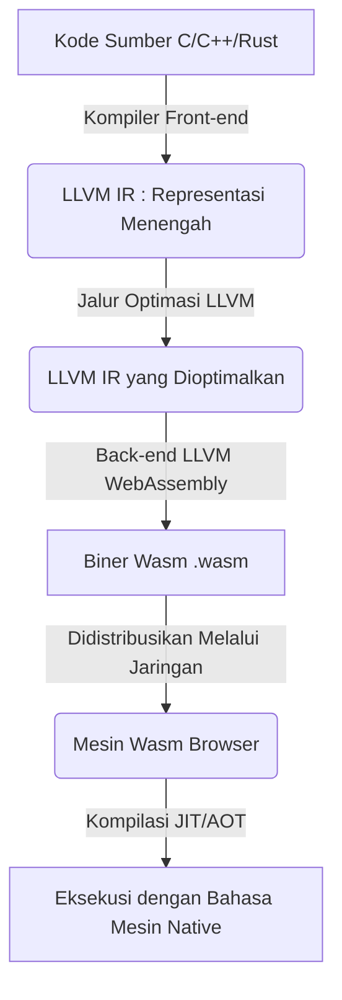
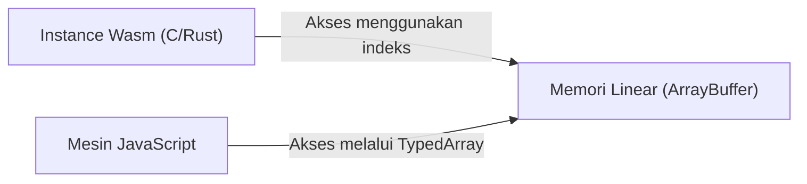
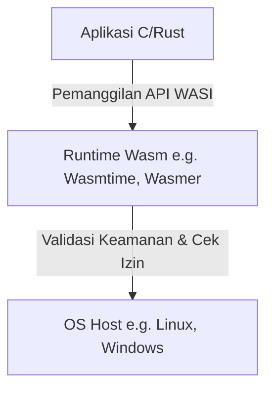

# Pengantar: Kebangkitan WebAssembly (Wasm)

Browser web telah lama didominasi oleh satu bahasa saja, yaitu JavaScript. Namun, seiring dengan aplikasi web yang semakin kompleks dan membutuhkan performa yang setara dengan aplikasi native, keterbatasan JavaScript mulai terlihat. Di sinilah **WebAssembly (Wasm)** muncul.

WebAssembly adalah format biner baru yang dapat dijalankan di browser dengan kecepatan yang mendekati kode native. Ini dikompilasi dari bahasa pemrograman seperti C, C++, dan Rust, dan saat ini membawa inovasi tidak hanya dalam pengembangan web, tetapi juga di berbagai bidang, mulai dari server-side, komputasi edge, hingga perangkat IoT.

Pada artikel ini, kita akan membahas secara tuntas masa kini dan masa depan WebAssembly, mulai dari konsep dasar, mekanisme teknis bagaimana C dan Rust dapat berjalan di dalam browser, integrasi dengan JavaScript, perbandingan performa, hingga penerapannya di dunia luar browser (WASI).

---

# 1. Apa itu WebAssembly?

## 1.1 Latar Belakang Kemunculannya

Bahkan sebelum WebAssembly lahir, sudah ada beberapa upaya untuk meningkatkan performa JavaScript. Contohnya adalah **Native Client (NaCl)** oleh Google dan **asm.js** oleh Mozilla.

- **asm.js**: Subkumpulan JavaScript yang dirancang sedemikian rupa sehingga kompiler JIT browser dapat dengan mudah mengoptimalkannya dengan memberikan penentuan tipe sebagai anotasi.
- **NaCl**: Teknologi kotak pasir (sandbox) untuk menjalankan kode native dengan aman di dalam browser, tetapi belum mencapai standarisasi di antara para vendor browser.

Berdasarkan refleksi dan pengalaman ini, vendor browser utama (Mozilla, Google, Microsoft, Apple) bekerja sama merumuskan standar terbuka yang disebut **WebAssembly**.

## 1.2 Filosofi Desain Wasm

WebAssembly memiliki tujuan desain berikut:

1.  **Cepat dan Efisien** : Dapat dieksekusi dengan kecepatan mendekati native, dan waktu pemuatannya singkat.
2.  **Aman** : Dijalankan di lingkungan kotak pasir dan mematuhi kebijakan keamanan host.
3.  **Terbuka dan Dapat Di-debug** : Memiliki format teks yang dapat dibaca manusia (WAT: WebAssembly Text format) di samping format binernya.
4.  **Terintegrasi dengan Web** : Bekerja sama dengan JavaScript dan dapat berintegrasi mulus dengan API Web yang sudah ada.

---

# 2. Mekanisme Berjalannya C/Rust di Browser

Lalu, bagaimana tepatnya kode C atau Rust dieksekusi di browser? Mari kita lihat prosesnya tahap demi tahap.

## 2.1 Alur Kompilasi

Bahasa seperti C dan Rust biasanya dikompilasi ke dalam bahasa mesin yang bergantung pada OS atau arsitektur CPU. Namun dalam kasus WebAssembly, kita menentukan arsitektur untuk Wasm, seperti "wasm32", sebagai target arsitektur.

Seringkali, basis kompiler yang disebut LLVM digunakan.



Dengan cara ini, kode yang ditulis oleh pengembang melewati representasi menengah (IR), dioptimalkan, dan akhirnya menjadi file biner ringkas dengan ekstensi `.wasm`.

## 2.2 Kode Byte dan Mesin Tumpukan (Stack Machine)

WebAssembly mengadopsi arsitektur **mesin tumpukan (stack machine)**. Ia tidak memiliki register, dan semua perhitungan dilakukan pada tumpukan (struktur data LIFO).

Sebagai contoh, saat melakukan penambahan sederhana $ 1 + 2 $ (wait math: $\text{1 + 2}$ ? No math was $ 1 + 2 $), representasi teks (WAT) Wasm-nya adalah sebagai berikut.

```wasm
(module
  (func $add (param $a i32) (param $b i32) (result i32)
    local.get $a
    local.get $b
    i32.add)
  (export "add" (func $add))
)
```

1.  `local.get $a` menaruh nilai variabel a ke dalam tumpukan.
2.  `local.get $b` menaruh nilai variabel b ke dalam tumpukan.
3.  `i32.add` mengambil dua nilai dari tumpukan, menjumlahkannya, dan menaruh hasilnya ke dalam tumpukan.

Struktur sederhana ini mempercepat proses dekode dan validasi, sehingga kompilasi JIT di browser dapat diselesaikan dalam waktu yang sangat singkat.

## 2.3 Model Memori (Memori Linear)

Di bahasa C dan Rust, operasi memori menggunakan pointer sangat sering dilakukan. Untuk mewujudkan hal ini, WebAssembly mengadopsi konsep **Memori Linear (Linear Memory)**.

Memori linear adalah susunan byte berurutan yang dapat diakses oleh instance WebAssembly. Dari JavaScript, ini terlihat sebagai `ArrayBuffer` atau `SharedArrayBuffer`. Pointer dalam Wasm hanyalah indeks (nilai integer) dari array ini.



Mekanisme ini mencegah kode Wasm dari mengakses memori OS host secara langsung, memberikan lingkungan kotak pasir yang kuat.

---

# 3. Integrasi JavaScript dan WebAssembly

WebAssembly tidak ditujukan untuk menggantikan JavaScript, melainkan untuk melengkapinya. Dalam banyak kasus, JavaScript menangani operasi DOM dan penanganan event (event handling), sementara pemrosesan komputasi yang berat didelegasikan ke WebAssembly.

## 3.1 Variabel Global, Impor, dan Ekspor

Modul WebAssembly dapat mengimpor dan mengekspor fungsi, memori, tabel, dan variabel global untuk berinteraksi dengan JavaScript.

```javascript
// Pemuatan dan instansiasi modul WebAssembly
fetch('module.wasm')
  .then(response => response.arrayBuffer())
  .then(bytes => WebAssembly.instantiate(bytes, {
    env: {
      // Mengimpor fungsi JavaScript ke dalam Wasm
      consoleLog: (arg) => console.log("Wasm berkata: " + arg)
    }
  }))
  .then(results => {
    // Memanggil fungsi yang diekspor dari Wasm
    const add = results.instance.exports.add;
    console.log("1 + 2 = ", add(1, 2));
  });
```

## 3.2 Akses dan Pengikatan ke Web API

Wasm sendiri tidak memiliki fungsi untuk mengakses DOM atau API Web secara langsung. Untuk mengaksesnya, kita harus melalui JavaScript.
Namun, menulis semua itu secara manual akan sangat memakan waktu. Oleh karena itu, di ekosistem Rust, terdapat alat bernama **wasm-bindgen**.

```rust
// Kode Rust (menggunakan wasm-bindgen)
use wasm_bindgen::prelude::*;

#[wasm_bindgen]
extern "C" {
    fn alert(s: &str);
}

#[wasm_bindgen]
pub fn greet(name: &str) {
    alert(&format!("Halo, {}!", name));
}
```

Saat kode ini dikompilasi, `wasm-bindgen` secara otomatis akan menghasilkan kode lem (glue code) JavaScript, dan menyembunyikan hal-hal seperti pengiriman memori string. Hal ini memberikan pengalaman pengembangan seolah-olah kita memanggil API browser secara langsung dari Rust.

---

# 4. Perbandingan Performa dan Kecepatan

Mengapa WebAssembly lebih cepat dari JavaScript?

1.  **Kecepatan Parsing** : Karena Wasm memiliki format biner, proses dekodenya jauh lebih cepat dibandingkan dengan melakukan parsing pada kode sumber JS dan membangun pohon sintaksis abstrak (AST).
2.  **Optimasi JIT** : Karena JS adalah bahasa yang tipenya dinamis, kompiler JIT perlu melakukan inferensi tipe saat dijalankan, dan jika tebakannya salah, ia harus membatalkan optimasinya (Deoptimization). Wasm memiliki tipe yang statis dan telah mengalami optimasi yang kuat saat proses kompilasi (misalnya melalui LLVM), sehingga browser bisa fokus untuk langsung menghasilkan kode mesin.
3.  **Menghindari Pengumpulan Sampah (Garbage Collection / GC)** : Kode Wasm yang ditulis dalam C atau Rust mengelola memorinya sendiri, sehingga tidak akan ada jeda waktu (pause) tak terduga yang disebabkan oleh GC mesin JS (*Detail tentang spesifikasi Wasm GC akan dijelaskan nanti).

## 4.1 Benchmark: Deret Fibonacci

Mari kita bandingkan kecepatan JavaScript dan Rust (Wasm) menggunakan perhitungan sederhana untuk deret Fibonacci.
Secara matematis, deret ini direpresentasikan oleh rumus rekursif di bawah ini. Kompleksitas waktunya bersifat eksponensial $ O(2^n) $ dan sangat memakan CPU.

$$
F(n) =
\begin{cases}
0 & (n = 0) \\\\
1 & (n = 1) \\\\
F(n-1) + F(n-2) & (n \ge 2)
\end{cases}
$$

### Implementasi JavaScript
```javascript
function fibJs(n) {
  if (n <= 1) return n;
  return fibJs(n - 1) + fibJs(n - 2);
}
```

### Implementasi Rust
```rust
#[no_mangle]
pub fn fib_wasm(n: u32) -> u32 {
    if n <= 1 { return n; }
    fib_wasm(n - 1) + fib_wasm(n - 2)
}
```

Jika dihitung untuk nilai $n=40$, JavaScript (mesin V8) pada umumnya berjalan sangat cepat berkat optimasi JIT, tetapi Wasm yang dihasilkan dari Rust biasanya berjalan **sekitar 1,5 hingga lebih dari 2 kali** lebih cepat. Perbedaan ini menjadi semakin terlihat dalam bidang di mana akses memori yang berurutan dan instruksi SIMD berguna, seperti perhitungan matriks dan pemrosesan gambar.

---

# 5. Rust dan C++ sebagai Bahasa Pengembangan

Bahasa sumber yang paling populer untuk WebAssembly adalah C/C++ dan Rust.

## 5.1 C++ dan Emscripten

Secara historis, C/C++ telah menjadi yang pertama kali digunakan untuk migrasi (porting) ke web. **Emscripten** adalah untaian alat (toolchain) yang mengubah kode C/C++ menjadi Wasm menggunakan LLVM.
Ia menyediakan lapisan emulasi POSIX dan konversi OpenGL (WebGL) untuk menjalankan perpustakaan (library) C/C++ yang sangat besar (contohnya SQLite, FFmpeg, OpenCV, mesin game, dll.) di browser.

## 5.2 Rust dan WebAssembly

Saat ini, **Rust** mendapatkan banyak perhatian sebagai bahasa kelas satu untuk WebAssembly.
Alasan utama Rust disukai adalah sebagai berikut:

- **Ukuran Runtime yang Kecil** : Karena Rust tidak memiliki GC atau runtime yang besar, ukuran biner Wasm yang dihasilkan bisa dijaga agar tetap sangat kecil.
- **wasm-pack / wasm-bindgen** : Ekosistemnya sangat canggih; Anda dapat memulai proyek Wasm hanya dengan beberapa perintah dan mempublikasikannya sebagai paket npm.
- **Keamanan Memori** : Karena keamanan memori dijamin saat proses kompilasi, risiko kerusakan memori karena *bug* dapat dikurangi, bahkan saat menjalankan operasi kompleks di sisi browser.

---

# 6. Fitur Lanjutan dan Ekstensi Spesifikasi WebAssembly

WebAssembly terus berevolusi sejak rilis awalnya (MVP), dan saat ini, banyak fitur ekstensi yang kuat telah diimplementasikan di browser.

## 6.1 SIMD (Single Instruction, Multiple Data)
Dukungan untuk instruksi SIMD yang memproses beberapa data secara bersamaan dengan satu instruksi kini telah didukung (SIMD 128-bit). Hal ini memungkinkan peningkatan performa yang dramatis dalam pemrosesan gambar, pemrosesan audio, algoritma enkripsi, dan lain-lain.

## 6.2 Thread dan Memori Bersama
Dengan memanfaatkan Web Workers dan `SharedArrayBuffer`, kini beberapa instansi Wasm dapat berbagi ruang memori yang sama dan menjalankan pemrosesan paralel (multi-threading). Ini memungkinkan simulasi fisik dan mesin game yang kompleks untuk berjalan lancar di browser.

## 6.3 Pengumpulan Sampah (Wasm GC)
Sementara Wasm konvensional dirancang untuk C dan Rust yang mengelola memori linear secara manual, spesifikasi **Wasm GC** perlahan-lahan sedang distandarisasi agar dapat secara efisien mengkompilasi bahasa yang membutuhkan pengumpulan sampah seperti Java, Kotlin, C#, dan Dart ke dalam Wasm. Berkat ini, performa aplikasi web seperti Flutter Web telah meningkat secara drastis.

---

# 7. Dunia di Luar Browser: WASI (WebAssembly System Interface)

Potensi WebAssembly tidak hanya terbatas di dalam browser. **WASI (WebAssembly System Interface)** lahir dari ide: **"Bagaimana jika Wasm dapat digunakan sebagai format standar di luar browser juga?"**

## 7.1 Apa itu WASI?
WASI adalah antarmuka standar yang memungkinkan program WebAssembly untuk mengakses sumber daya OS (seperti sistem berkas, jaringan, variabel lingkungan, dll.) secara aman.
Ia memungkinkan pemberian akses khusus (Capability-based security) hanya pada izin yang diperlukan untuk modul Wasm dengan tetap mempertahankan model kotak pasir milik browser.



## 7.2 Alternatif dan Koeksistensi dengan Kontainer [Docker](https://kenji.blog/id/p/docker-container-namespace-[cgroups](https://kenji.blog/id/p/docker-container-namespace-cgroups-layers/)-layers/)
Solomon Hykes, penemu Docker, membuat komentar populer yang menyatakan: "Jika Wasm dan WASI sudah ada di tahun 2008, maka kami tidak perlu menciptakan Docker."
Wasm memiliki kelebihan yang kuat yaitu jauh lebih ringan dibandingkan kontainer, waktu nyalanya lebih cepat (dalam hitungan milidetik), dan tidak bergantung pada OS atau arsitektur CPU tertentu.
Saat ini, beberapa proyek (seperti Kwasm dan Spin) yang mendalangi eksekusi modul Wasm secara langsung sebagai pengganti kontainer Docker pada [Kubernetes](https://kenji.blog/id/p/kubernetes-k8s-architecture-pod-service-ingress/) sedang aktif dikembangkan.

---

# 8. Masa Depan WebAssembly

## 8.1 Model Komponen (Component Model)
Masalah terbesar yang dihadapi WebAssembly saat ini adalah sulitnya untuk menghubungkan modul Wasm yang ditulis dengan berbagai bahasa pemrograman (karena representasi memori untuk tipe data yang kompleks dan string berbeda antara satu bahasa dengan bahasa lainnya).

**WebAssembly Component Model** adalah solusi untuk masalah ini.
Jika Model Komponen terwujud, maka Anda bisa melakukan hal-hal seperti secara langsung memanggil fungsi di "Modul Wasm yang ditulis dalam Python" dari "Modul Wasm yang ditulis dengan Rust". Hal ini memiliki potensi sebagai pondasi dari arsitektur layanan mikro (microservices) generasi berikutnya yang independen dari platform dan bahasa tertentu.

## 8.2 Wasm sebagai Sistem Plugin
Sudah banyak perangkat lunak, seperti Figma, EnvoyProxy, dan Microsoft Flight Simulator, yang mengadopsi WebAssembly sebagai sistem plugin khusus mereka. Ini dikarenakan kode pihak ketiga buatan pengguna bisa dieksekusi dengan aman dan sangat cepat di dalam aplikasi utamanya.

---

# Kesimpulan

WebAssembly sedang berkembang menjadi bahasa universal dalam arsitektur cloud-native, komputasi edge, dan sistem plugin, yang mana ini jauh melampaui anggapan bahwa ia hanyalah sebuah "teknologi yang cepat untuk berjalan di dalam browser".

Sebuah dunia di mana logika yang kuat, yang dikembangkan menggunakan bahasa pemrograman sistem seperti C, C++, atau Rust, dapat diterapkan dengan cepat dan aman secara cross-platform. Itulah **masa kini dan masa depan** yang sedang diukir oleh WebAssembly.

Ke depannya, untuk pengembangan web, JavaScript/TypeScript akan terus mengemban tugas dalam membangun antarmuka UI, sementara pendekatan hibrida akan menjadi tren, di mana WebAssembly dimanfaatkan untuk penggunaan logika inti yang sangat memerlukan performa tinggi serta mengoptimalkan kode asli yang sudah ada.

Oleh karena itu, cobalah gunakan Rust atau Emscripten, dan melompatlah masuk ke dalam dunia WebAssembly!
