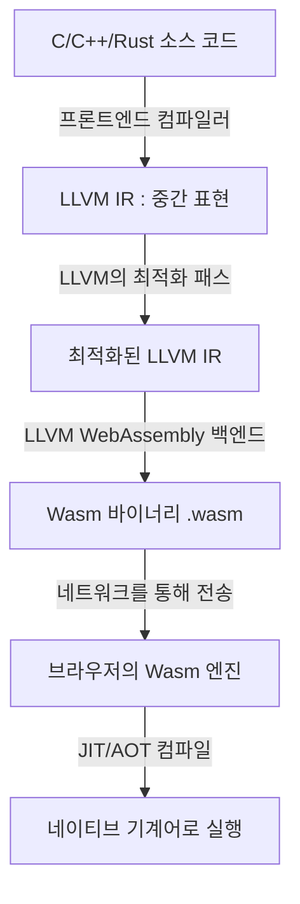
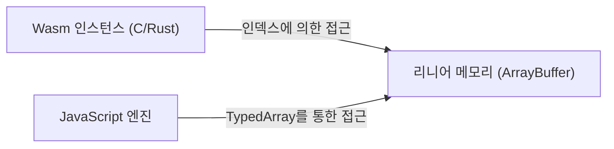
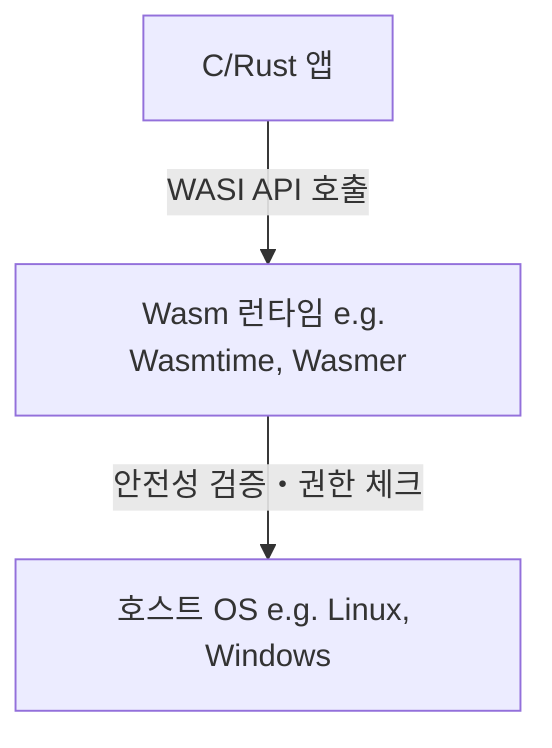

# 시작하며：WebAssembly(Wasm)의 대두

웹 브라우저는 오랫동안 JavaScript라는 단일 언어에 의해 지배되어 왔습니다. 그러나 웹 애플리케이션이 복잡해지고 네이티브 앱에 필적하는 퍼포먼스가 요구됨에 따라, JavaScript 단독으로는 한계가 보이기 시작했습니다. 그래서 등장한 것이  **WebAssembly (Wasm)**  입니다.

WebAssembly는 브라우저 상에서 네이티브 코드에 가까운 속도로 실행할 수 있는 새로운 바이너리 포맷입니다. C, C++, [Rust](https://kenji.blog/ko/p/programming-languages-history-paradigm-evolution/) 등의 프로그래밍 언어에서 컴파일되어 생성되며, 현재는 웹 개발뿐만 아니라 서버 사이드나 엣지 컴퓨팅, 나아가 IoT 디바이스에 이르기까지 폭넓은 영역에서 혁신을 가져오고 있습니다.

본 기사에서는 WebAssembly의 기본 개념부터 브라우저 내에서 C나 Rust가 어떻게 동작하는지에 대한 기술적인 원리, JavaScript와의 연동, 퍼포먼스 비교, 그리고 브라우저 외부 세계에서의 응용(WASI)까지, WebAssembly의 현재와 미래에 대해 철저하게 해설합니다.

---

# 1. WebAssembly란 무엇인가?

## 1.1 탄생 배경

WebAssembly가 탄생하기 전에도 JavaScript의 퍼포먼스를 향상시키려는 시도는 몇 가지 존재했습니다. 예를 들어, Google의  **Native Client (NaCl)**  이나 Mozilla의  **asm.js**  등입니다.

- **asm.js**: JavaScript의 서브셋으로, 타입 지정을 어노테이션으로 부여함으로써 브라우저의 JIT 컴파일러가 최적화하기 쉽도록 설계되었습니다.
- **NaCl**: 브라우저 내에서 네이티브 코드를 안전하게 실행하는 샌드박스 기술이었으나, 브라우저 벤더 간의 표준화에는 이르지 못했습니다.

이러한 반성과 경험을 바탕으로, 주요 브라우저 벤더(Mozilla, Google, Microsoft, Apple)가 협력하여 제정한 오픈 표준 규격이  **WebAssembly**  입니다.

## 1.2 Wasm의 설계 철학

WebAssembly는 다음의 설계 목표를 내세우고 있습니다.

1. **고속 및 효율성**: 네이티브에 가까운 속도로 실행할 수 있고, 로드 시간도 짧을 것.
2. **안전성**: 샌드박스 환경에서 실행되며, 호스트의 보안 정책을 준수할 것.
3. **오픈 및 디버그 가능**: 바이너리 포맷과 동시에 사람이 읽을 수 있는 텍스트 포맷(WAT: WebAssembly Text format)을 가질 것.
4. **웹과의 통합**: JavaScript와 협조하여 동작하며, 기존 웹 API와 매끄럽게 연동될 것.

---

# 2. 브라우저에서 C/Rust가 동작하는 원리

그럼 구체적으로 C나 Rust 코드가 어떻게 브라우저 상에서 실행되는 것일까요? 그 프로세스를 단계적으로 살펴보겠습니다.

## 2.1 컴파일 파이프라인

C나 Rust와 같은 언어는 보통 OS나 CPU 아키텍처에 의존적인 기계어로 컴파일됩니다. 그러나 WebAssembly의 경우, 타겟 아키텍처로 "wasm32" 등의 Wasm용 아키텍처를 지정합니다.

대부분의 경우, LLVM이라는 컴파일러 기반이 이용됩니다.



이와 같이 개발자가 작성한 코드는 중간 표현(IR)을 거쳐 최적화되고, 최종적으로 `.wasm` 이라는 확장자를 가진 컴팩트한 바이너리 파일이 됩니다.

## 2.2 바이트코드와 스택 머신

WebAssembly는  **스택 머신**  아키텍처를 채택하고 있습니다. 레지스터를 가지지 않으며, 모든 계산은 스택(LIFO 형식의 데이터 구조)에 대해 수행됩니다.

예를 들어, 단순한 덧셈 `$ 1 + 2 $` 를 수행할 경우, Wasm의 텍스트 표현(WAT)에서는 다음과 같습니다.

```wasm
(module
  (func $add (param $a i32) (param $b i32) (result i32)
    local.get $a
    local.get $b
    i32.add)
  (export "add" (func $add))
)
```

1. `local.get $a` 로 변수 a의 값을 스택에 쌓는다.
2. `local.get $b` 로 변수 b의 값을 스택에 쌓는다.
3. `i32.add` 로 스택에서 두 개의 값을 꺼내어 더하고, 결과를 스택에 쌓는다.

이러한 단순한 구조로 인해 디코드 처리나 검증 처리가 고속화되어, 브라우저에서의 JIT 컴파일이 매우 짧은 시간에 이루어집니다.

## 2.3 메모리 모델 (리니어 메모리)

C나 [Rust](https://kenji.blog/ko/p/programming-languages-history-paradigm-evolution/)에서는 포인터를 사용한 메모리 조작이 빈번하게 발생합니다. WebAssembly는 이를 구현하기 위해  **리니어 메모리 (Linear Memory)**  라는 개념을 채택하고 있습니다.

리니어 메모리는 WebAssembly 인스턴스에서 접근할 수 있는 연속된 바이트 배열입니다. JavaScript에서는 `ArrayBuffer` 또는 `SharedArrayBuffer` 로 보입니다. Wasm 내의 포인터는 단순한 이 배열의 인덱스(정수 값)에 불과합니다.



이 구조를 통해 Wasm 코드가 직접 호스트 OS의 메모리에 접근하는 것을 방지하고, 강력한 샌드박스 환경을 제공합니다.

---

# 3. JavaScript와 WebAssembly의 연동

WebAssembly는 JavaScript를 대체하는 것이 아니라 보완하는 것입니다. 대부분의 경우 DOM 조작이나 이벤트 핸들링은 JavaScript가 담당하고, 무거운 계산 처리는 WebAssembly에 위임합니다.

## 3.1 글로벌 변수와 임포트・익스포트

WebAssembly 모듈은 JavaScript와 상호작용하기 위해 함수, 메모리, 테이블, 글로벌 변수를 임포트 및 익스포트할 수 있습니다.

```javascript
// WebAssembly 모듈의 로드 및 인스턴스화
fetch('module.wasm')
  .then(response => response.arrayBuffer())
  .then(bytes => WebAssembly.instantiate(bytes, {
    env: {
      // JavaScript의 함수를 Wasm에 임포트시킨다
      consoleLog: (arg) => console.log("Wasm이 말하길: " + arg)
    }
  }))
  .then(results => {
    // Wasm에서 익스포트된 함수를 호출한다
    const add = results.instance.exports.add;
    console.log("1 + 2 = ", add(1, 2));
  });
```

## 3.2 Web API로의 접근과 바인딩

Wasm 자체는 DOM이나 Web API에 직접 접근하는 기능을 가지고 있지 않습니다. 접근하려면 JavaScript를 거쳐야 합니다.
하지만 이를 수동으로 작성하는 것은 매우 번거롭습니다. 그래서 [Rust](https://kenji.blog/ko/p/programming-languages-history-paradigm-evolution/) 생태계에서는  **wasm-bindgen**  과 같은 도구가 마련되어 있습니다.

```rust
// Rust 코드 (wasm-bindgen을 사용)
use wasm_bindgen::prelude::*;

#[wasm_bindgen]
extern "C" {
    fn alert(s: &str);
}

#[wasm_bindgen]
pub fn greet(name: &str) {
    alert(&format!("안녕하세요, {}!", name));
}
```

이 코드를 컴파일하면 `wasm-bindgen` 이 자동으로 JavaScript의 글루 코드(접착제가 되는 코드)를 생성하여 문자열의 메모리 전달 등을 은닉해 줍니다. 이를 통해 [Rust](https://kenji.blog/ko/p/programming-languages-history-paradigm-evolution/)에서 직접 브라우저의 API를 호출하는 듯한 개발 경험을 얻을 수 있습니다.

---

# 4. 퍼포먼스와 속도 비교

왜 WebAssembly는 JavaScript보다 빠를까요?

1. **파싱 속도**: Wasm은 바이너리 포맷이기 때문에, 텍스트인 JS 소스 코드를 파싱하여 추상 구문 트리(AST)를 구축하는 것보다 훨씬 빠르게 디코드할 수 있습니다.
2. **JIT의 최적화**: JS는 동적 타입 언어이므로 JIT 컴파일러는 실행 시에 타입 추론을 수행하며, 추론이 빗나가면 최적화를 취소(Deoptimization)해야 합니다. Wasm은 정적 타입이며, 컴파일 시에 LLVM 등에서 강력한 최적화가 이미 완료되어 있으므로 브라우저는 직접 기계어를 생성하는 데 집중할 수 있습니다.
3. **가비지 컬렉션(GC)의 회피**: C나 Rust로 작성된 Wasm은 독자적으로 메모리를 관리하므로, JS 엔진의 GC로 인한 예기치 않은 일시 정지(Pause)가 발생하지 않습니다(※Wasm GC의 사양에 대해서는 후술).

## 4.1 벤치마크：피보나치 수열

단순한 피보나치 수열 계산으로 JavaScript와 Rust(Wasm)의 속도를 비교해 봅시다.
수학적으로는 다음의 재귀식으로 표현됩니다. 계산 복잡도는 지수 함수적인 `$ O(2^n) $` 이 되며, CPU를 많이 소모합니다.

$$
F(n) =
\begin{cases}
0 & (n = 0) \\\\
1 & (n = 1) \\\\
F(n-1) + F(n-2) & (n \ge 2)
\end{cases}
$$

### JavaScript 구현
```javascript
function fibJs(n) {
  if (n <= 1) return n;
  return fibJs(n - 1) + fibJs(n - 2);
}
```

### [Rust](https://kenji.blog/ko/p/programming-languages-history-paradigm-evolution/) 구현
```rust
#[no_mangle]
pub fn fib_wasm(n: u32) -> u32 {
    if n <= 1 { return n; }
    fib_wasm(n - 1) + fib_wasm(n - 2)
}
```

$n=40$ 으로 계산시켰을 경우, 일반적으로 JavaScript(V8 엔진)에서도 JIT의 최적화 덕분에 꽤 고속으로 실행되지만, [Rust](https://kenji.blog/ko/p/programming-languages-history-paradigm-evolution/)에서 생성된 Wasm 쪽이  **약 1.5배에서 2배 이상**  빠르게 실행되는 경우가 많습니다. 특히 행렬 연산이나 이미지 처리 등, 메모리의 연속 접근이나 SIMD 명령이 빛을 발하는 영역에서는 그 차이가 더욱 두드러집니다.

---

# 5. 개발 언어로서의 Rust와 C++

WebAssembly의 소스 언어로 가장 인기 있는 것이 C/C++와 Rust입니다.

## 5.1 C++와 Emscripten

역사적으로 가장 오래 전부터 웹으로의 이식에 사용되어 온 것이 C/C++입니다. **Emscripten**  은 LLVM을 이용해 C/C++ 코드를 Wasm으로 변환하는 툴체인입니다.
기존의 C/C++의 거대한 라이브러리(예를 들어 SQLite, FFmpeg, OpenCV, 게임 엔진 등)를 브라우저 상에서 동작시키기 위한 POSIX 에뮬레이션이나 OpenGL(WebGL)로의 변환 계층을 갖추고 있습니다.

## 5.2 Rust와 WebAssembly

현재 WebAssembly의 일급 객체(first-class) 언어로 가장 주목받고 있는 것이  **Rust**  입니다.
Rust가 선호되는 이유는 다음과 같습니다.

- **런타임의 작음**: Rust는 GC나 거대한 런타임을 가지지 않기 때문에 생성되는 Wasm 바이너리의 크기를 매우 작게 유지할 수 있습니다.
- **wasm-pack / wasm-bindgen**: 생태계가 매우 세련되어 있어, 몇 줄의 명령어로 Wasm 프로젝트를 시작하고 npm 패키지로 공개하는 것이 가능합니다.
- **메모리 안전성**: 컴파일 시에 메모리의 안전성이 보장되므로, 복잡한 처리를 브라우저 측에서 실행시키더라도 버그로 인한 메모리 손상 위험을 줄일 수 있습니다.

---

# 6. WebAssembly의 고급 기능과 사양 확장

WebAssembly는 초기 릴리스(MVP) 이후에도 진화를 거듭하고 있으며, 현재는 많은 강력한 확장 기능이 브라우저에 구현되어 있습니다.

## 6.1 SIMD (Single Instruction, Multiple Data)
하나의 명령으로 여러 데이터를 동시에 처리하는 SIMD 명령이 지원되었습니다(128비트 SIMD). 이를 통해 이미지 처리, 음성 처리, 암호화 알고리즘 등에서 극적인 퍼포먼스 향상을 기대할 수 있습니다.

## 6.2 스레드와 공유 메모리
Web Workers와 `SharedArrayBuffer` 를 이용함으로써 여러 Wasm 인스턴스가 동일한 메모리 영역을 공유하고, 멀티스레드로 병렬 처리를 수행하는 것이 가능해졌습니다. 이를 통해 고도의 물리 시뮬레이션이나 게임 엔진 등이 브라우저에서 원활하게 동작합니다.

## 6.3 가비지 컬렉션 (Wasm GC)
기존의 Wasm은 리니어 메모리를 수동으로 관리하는 C나 [Rust](https://kenji.blog/ko/p/programming-languages-history-paradigm-evolution/)를 위한 설계였으나, [Java](https://kenji.blog/ko/p/programming-languages-history-paradigm-evolution/), Kotlin, C#, Dart 등 가비지 컬렉션을 필요로 하는 언어를 효율적으로 Wasm으로 컴파일하기 위한  **Wasm GC**  제안이 표준화되어 가고 있습니다. 이를 통해 Flutter Web 등의 퍼포먼스가 비약적으로 향상되고 있습니다.

---

# 7. 브라우저 외부 세계：WASI (WebAssembly System Interface)

WebAssembly의 가능성은 브라우저 안에만 머물지 않습니다. **"만약 브라우저 밖에서도 Wasm을 표준적인 포맷으로 사용할 수 있다면?"**  이라는 발상에서 탄생한 것이  **WASI (WebAssembly System Interface)**  입니다.

## 7.1 WASI란?
WASI는 WebAssembly 프로그램이 OS 리소스(파일 시스템, 네트워크, 환경 변수 등)에 안전하게 접근하기 위한 표준 인터페이스입니다.
브라우저의 샌드박스 모델을 유지하면서 필요한 권한만을 Wasm 모듈에 부여하는 것(Capability-based security)이 가능합니다.



## 7.2 [Docker](https://kenji.blog/ko/p/docker-container-namespace-[cgroups](https://kenji.blog/ko/p/docker-container-namespace-cgroups-layers/)-layers/) 컨테이너와의 대체 및 공존
Docker의 발명자인 Solomon Hykes는 "만약 2008년에 Wasm과 WASI가 존재했더라면 Docker를 만들 필요는 없었을 것이다"라고 발언하여 화제가 되었습니다.
Wasm은 컨테이너보다 훨씬 가볍고 시작이 빠르며(수 밀리초), OS나 CPU 아키텍처에 의존하지 않는다는 강력한 장점을 가지고 있습니다.
현재는 [Kubernetes](https://kenji.blog/ko/p/kubernetes-k8s-architecture-pod-service-ingress/) 상에서 Docker 컨테이너 대신 Wasm 모듈을 직접 오케스트레이션하는 프로젝트(Kwasm이나 Spin 등)가 활발하게 개발되고 있습니다.

---

# 8. WebAssembly의 미래

## 8.1 컴포넌트 모델 (Component Model)
현재 WebAssembly의 가장 큰 과제는 서로 다른 언어로 작성된 Wasm 모듈끼리 연동시키는 것이 어렵다는 점입니다(문자열이나 복잡한 데이터 타입의 메모리 표현이 언어에 따라 다르기 때문).

이를 해결하는 것이  **WebAssembly Component Model**  입니다.
컴포넌트 모델이 실현되면 "[Rust](https://kenji.blog/ko/p/programming-languages-history-paradigm-evolution/)로 작성된 Wasm 모듈"을 "Python으로 작성된 Wasm 모듈"에서 매끄럽게 함수 호출하는 등의 일이 가능해집니다. 이는 플랫폼과 언어에 의존하지 않는 차세대 마이크로서비스 아키텍처의 기반이 될 가능성을 품고 있습니다.

## 8.2 플러그인 시스템으로서의 Wasm
이미 Figma나 EnvoyProxy, Microsoft Flight Simulator 등 많은 소프트웨어가 독자적인 플러그인 시스템으로 WebAssembly를 채택하고 있습니다. 사용자가 작성한 서드파티 코드를 안전하고 빠르게 본체 애플리케이션 내에서 실행할 수 있기 때문입니다.

---

# 요약

WebAssembly는 단순한 "브라우저에서 동작하는 빠른 기술"이라는 틀을 크게 벗어나, 클라우드 네이티브, 엣지 컴퓨팅, 플러그인 아키텍처에서의 공통 언어로 성장하고 있습니다.

C, C++, Rust와 같은 시스템 프로그래밍 언어로 개발된 강력한 로직을 플랫폼에 구애받지 않고 안전하고 빠르게 전개할 수 있는 세상. 그것이 바로 WebAssembly가 개척하는  **현재와 미래**  입니다.

향후 웹 개발에 있어서, UI 구축은 계속해서 JavaScript/TypeScript가 담당하고 퍼포먼스가 요구되는 코어 로직이나 기존 네이티브 자산의 재사용에는 WebAssembly가 활용되는 적재적소의 하이브리드 접근 방식이 주류가 되어 갈 것입니다.

꼭 Rust나 Emscripten을 사용하여 여러분도 WebAssembly의 세계로 뛰어들어 보시기 바랍니다.
