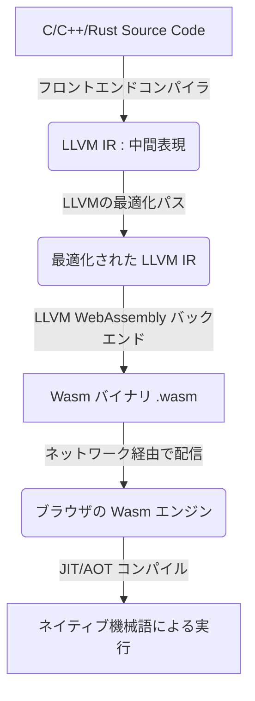
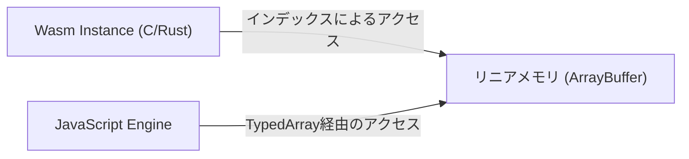
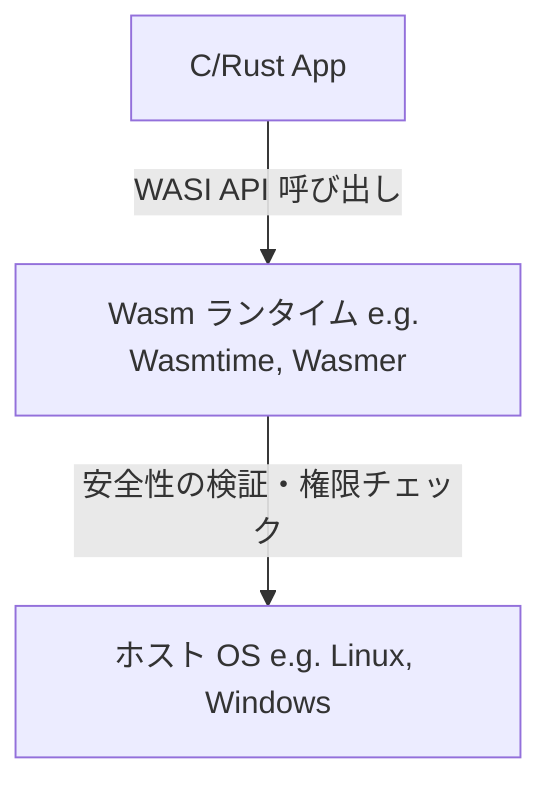

# はじめに：WebAssembly(Wasm)の台頭

Webブラウザは長らく、JavaScriptという単一の言語によって支配されてきました。しかし、ウェブアプリケーションが複雑化し、ネイティブアプリに匹敵するパフォーマンスが求められるようになるにつれ、JavaScript単体での限界も見えてきました。そこで登場したのが **WebAssembly (Wasm)** です。

WebAssemblyは、ブラウザ上でネイティブコードに近い速度で実行できる新しいバイナリフォーマットです。C、C++、[Rust](https://kenji.blog/p/programming-languages-history-paradigm-evolution/)などの[プログラミング言語](https://kenji.blog/p/programming-languages-history-paradigm-evolution/)からコンパイルして生成され、現在ではWeb開発だけでなく、サーバーサイドやエッジコンピューティング、さらにはIoTデバイスに至るまで、幅広い領域で革新をもたらしています。

本記事では、WebAssemblyの基本概念から、ブラウザ内でCやRustがどのように動くのかという技術的な仕組み、JavaScriptとの連携、パフォーマンスの比較、そしてブラウザ外の世界での応用（WASI）まで、WebAssemblyの現在と未来について徹底的に解説します。

---

# 1. WebAssemblyとは何か？

## 1.1 誕生の背景

WebAssemblyが誕生する前にも、JavaScriptのパフォーマンスを向上させる試みはいくつか存在しました。たとえば、Googleによる **Native Client (NaCl)** や、Mozillaによる **asm.js** などです。

- **asm.js**: JavaScriptのサブセットであり、型指定をアノテーションとして付与することで、ブラウザのJITコンパイラが最適化しやすいように設計されていました。
- **NaCl**: ブラウザ内でネイティブコードを安全に実行するサンドボックス技術でしたが、ブラウザベンダー間の標準化には至りませんでした。

これらの反省と経験を踏まえ、主要ブラウザベンダー（Mozilla, Google, Microsoft, Apple）が協力して策定したオープンな標準規格が **WebAssembly** です。

## 1.2 Wasmの設計哲学

WebAssemblyは以下の設計目標を掲げています。

1.  **高速かつ効率的** : ネイティブに近い速度で実行でき、ロード時間も短いこと。
2.  **安全** : サンドボックス環境で実行され、ホストのセキュリティポリシーを遵守すること。
3.  **オープンでデバッグ可能** : バイナリフォーマットと同時に、人間が読めるテキストフォーマット（WAT: WebAssembly Text format）を持つこと。
4.  **Webとの統合** : JavaScriptと協調して動作し、既存のWeb APIとシームレスに連携できること。

---

# 2. ブラウザでC/Rustが動く仕組み

では、具体的にCやRustのコードがどのようにしてブラウザ上で実行されるのでしょうか。そのプロセスを段階的に見ていきましょう。

## 2.1 コンパイル[パイプライン](https://kenji.blog/p/cicd-pipeline-github-actions-best-practices/)

Cや[Rust](https://kenji.blog/p/programming-languages-history-paradigm-evolution/)のような言語は、通常、OSやCPUアーキテクチャに依存したマシン語にコンパイルされます。しかしWebAssemblyの場合、ターゲットアーキテクチャとして「wasm32」などのWasm用アーキテクチャを指定します。

多くの場合、LLVMというコンパイラ基盤が利用されます。



このように、開発者が書いたコードは中間表現（IR）を経て最適化され、最終的に `.wasm` という拡張子を持つコンパクトなバイナリファイルになります。

## 2.2 バイトコードと[スタック](https://kenji.blog/p/c-language-pointers-memory-management-stack-heap/)マシン

WebAssemblyは **スタックマシン** アーキテクチャを採用しています。レジスタを持たず、計算はすべてスタック（LIFO形式のデータ構造）に対して行われます。

たとえば、単純な足し算 `$ 1 + 2 $` を行う場合、Wasmのテキスト表現（WAT）では以下のようになります。

```wasm
(module
  (func $add (param $a i32) (param $b i32) (result i32)
    local.get $a
    local.get $b
    i32.add)
  (export "add" (func $add))
)
```

1.  `local.get $a` で変数aの値を[スタック](https://kenji.blog/p/c-language-pointers-memory-management-stack-heap/)に積む。
2.  `local.get $b` で変数bの値を[スタック](https://kenji.blog/p/c-language-pointers-memory-management-stack-heap/)に積む。
3.  `i32.add` で[スタック](https://kenji.blog/p/c-language-pointers-memory-management-stack-heap/)から2つの値を取り出して足し、結果をスタックに積む。

このシンプルな構造により、デコード処理や検証処理が高速になり、ブラウザでのJITコンパイルが非常に短時間で行えます。

## 2.3 メモリモデル（リニアメモリ）

Cや[Rust](https://kenji.blog/p/programming-languages-history-paradigm-evolution/)では[ポインタ](https://kenji.blog/p/c-language-pointers-memory-management-stack-heap/)を使ったメモリ操作が頻繁に行われます。WebAssemblyはこれを実現するために **リニアメモリ (Linear Memory)** という概念を採用しています。

リニアメモリは、WebAssemblyインスタンスからアクセスできる連続したバイト配列です。JavaScriptからは `ArrayBuffer` または `SharedArrayBuffer` として見えます。Wasm内の[ポインタ](https://kenji.blog/p/c-language-pointers-memory-management-stack-heap/)は、単なるこの配列のインデックス（整数値）に過ぎません。



この仕組みにより、Wasmのコードが直接ホストOSのメモリにアクセスするのを防ぎ、強力なサンドボックス環境を提供しています。

---

# 3. JavaScriptとWebAssemblyの連携

WebAssemblyはJavaScriptを置き換えるものではなく、補完するものです。多くの場合、DOM操作やイベントハンドリングはJavaScriptが担当し、重い計算処理をWebAssemblyに委譲します。

## 3.1 グローバル変数とインポート・エクスポート

WebAssemblyモジュールは、JavaScriptとやり取りするために、関数、メモリ、テーブル、グローバル変数をインポート・エクスポートできます。

```javascript
// WebAssemblyモジュールのロードとインスタンス化
fetch('module.wasm')
  .then(response => response.arrayBuffer())
  .then(bytes => WebAssembly.instantiate(bytes, {
    env: {
      // JavaScriptの関数をWasmにインポートさせる
      consoleLog: (arg) => console.log("Wasm says: " + arg)
    }
  }))
  .then(results => {
    // Wasmからエクスポートされた関数を呼び出す
    const add = results.instance.exports.add;
    console.log("1 + 2 = ", add(1, 2));
  });
```

## 3.2 Web APIへのアクセスとバインディング

Wasm自体はDOMやWeb APIに直接アクセスする機能を持ちません。アクセスするにはJavaScriptを経由する必要があります。
しかし、これらを手動で記述するのは非常に手間がかかります。そこで、[Rust](https://kenji.blog/p/programming-languages-history-paradigm-evolution/)のエコシステムでは **wasm-bindgen** といったツールが用意されています。

```rust
// Rustコード (wasm-bindgenを使用)
use wasm_bindgen::prelude::*;

#[wasm_bindgen]
extern "C" {
    fn alert(s: &str);
}

#[wasm_bindgen]
pub fn greet(name: &str) {
    alert(&format!("Hello, {}!", name));
}
```

このコードをコンパイルすると、`wasm-bindgen` が自動的にJavaScriptのグルーコード（接着剤となるコード）を生成し、文字列のメモリ受け渡しなどを隠蔽してくれます。これにより、[Rust](https://kenji.blog/p/programming-languages-history-paradigm-evolution/)から直接ブラウザのAPIを呼び出しているかのような開発体験が得られます。

---

# 4. パフォーマンスと速度の比較

なぜWebAssemblyはJavaScriptよりも速いのでしょうか？

1.  **パース速度** : Wasmはバイナリフォーマットであるため、テキストのJSソースコードをパースして抽象構文木(AST)を構築するよりもはるかに高速にデコードできます。
2.  **JITの最適化** : JSは動的型付け言語であるため、JITコンパイラは実行時に型推論を行い、推論が外れると最適化を取り消す（Deoptimization）必要があります。Wasmは静的型付けであり、コンパイル時にLLVMなどで強力な最適化が既に済んでいるため、ブラウザは直接マシン語を生成することに集中できます。
3.  **ガベージコレクション(GC)の回避** : CやRustで記述されたWasmは独自にメモリを管理するため、JSエンジンのGCによる予期せぬポーズ（停止時間）が発生しません（※Wasm GCの仕様については後述）。

## 4.1 ベンチマーク：[フィボナッチ数列](https://kenji.blog/p/dynamic-programming-dp-introduction-knapsack-fibonacci/)

単純なフィボナッチ数列の計算で、JavaScriptと[Rust](https://kenji.blog/p/programming-languages-history-paradigm-evolution/)(Wasm)の速度を比較してみましょう。
数学的には以下の再帰式で表されます。計算量は指数関数的 `$ O(2^n) $` となり、CPUを強く消費します。

$$
F(n) =
\begin{cases}
0 & (n = 0) \\\\
1 & (n = 1) \\\\
F(n-1) + F(n-2) & (n \ge 2)
\end{cases}
$$

### JavaScript実装
```javascript
function fibJs(n) {
  if (n <= 1) return n;
  return fibJs(n - 1) + fibJs(n - 2);
}
```

### [Rust](https://kenji.blog/p/programming-languages-history-paradigm-evolution/)実装
```rust
#[no_mangle]
pub fn fib_wasm(n: u32) -> u32 {
    if n <= 1 { return n; }
    fib_wasm(n - 1) + fib_wasm(n - 2)
}
```

$n=40$ で計算させた場合、一般的にJavaScript（V8エンジン）でもJITの最適化によりかなり高速に実行されますが、[Rust](https://kenji.blog/p/programming-languages-history-paradigm-evolution/)から生成されたWasmの方が **約1.5倍から2倍以上** 高速に実行されるケースが多いです。特に行列演算や画像処理など、メモリの連続アクセスやSIMD命令が活きる領域では、その差はさらに顕著になります。

---

# 5. 開発言語としてのRustとC++

WebAssemblyのソース言語として最も人気があるのがC/C++とRustです。

## 5.1 C++とEmscripten

歴史的に最も古くからWebへの移植に使われてきたのがC/C++です。**Emscripten** は、LLVMを利用してC/C++コードをWasmに変換するツールチェーンです。
既存のC/C++の巨大なライブラリ（例えば、SQLite、FFmpeg、OpenCV、ゲームエンジンなど）をブラウザ上で動かすためのPOSIXエミュレーションやOpenGL(WebGL)への変換層を備えています。

## 5.2 RustとWebAssembly

現在、WebAssemblyのファーストクラス言語として最も注目されているのが **Rust** です。
Rustが好まれる理由は以下の通りです。

- **ランタイムの小ささ** : RustはGCや巨大なランタイムを持たないため、生成されるWasmバイナリのサイズを非常に小さく抑えることができます。
- **wasm-pack / wasm-bindgen** : エコシステムが非常に洗練されており、数行のコマンドでWasmプロジェクトを立ち上げ、npmパッケージとして公開することが可能です。
- **メモリ安全性** : コンパイル時にメモリの安全性が保証されるため、複雑な処理をブラウザ側で実行させても、バグによるメモリ破損のリスクを低減できます。

---

# 6. WebAssemblyの高度な機能と仕様拡張

WebAssemblyは初期リリース（MVP）以降も進化を続けており、現在では多くの強力な拡張機能がブラウザに実装されています。

## 6.1 SIMD (Single Instruction, Multiple Data)
1つの命令で複数のデータを同時に処理するSIMD命令がサポートされました（128ビットSIMD）。これにより、画像処理、音声処理、[暗号化](https://kenji.blog/p/modern-cryptography-public-key-hash-signature/)アルゴリズムなどで劇的なパフォーマンス向上が見込めます。

## 6.2 スレッドと共有メモリ
Web Workersと `SharedArrayBuffer` を利用することで、複数のWasmインスタンスが同じメモリ領域を共有し、マルチスレッドで並行処理を行うことが可能になりました。これにより、高度な物理シミュレーションやゲームエンジンなどがブラウザでスムーズに動作します。

## 6.3 ガベージコレクション (Wasm GC)
従来のWasmはリニアメモリを手動で管理するCや[Rust](https://kenji.blog/p/programming-languages-history-paradigm-evolution/)向けの設計でしたが、[Java](https://kenji.blog/p/programming-languages-history-paradigm-evolution/)、Kotlin、C#、Dartなどのガベージコレクションを必要とする言語を効率的にWasmへコンパイルするための **Wasm GC** 提案が標準化されつつあります。これにより、Flutter Webなどのパフォーマンスが飛躍的に向上しています。

---

# 7. ブラウザ外の世界：WASI (WebAssembly System Interface)

WebAssemblyの可能性はブラウザの中だけにとどまりません。**「もしブラウザの外でもWasmを標準的なフォーマットとして使えたら？」** という発想から生まれたのが **WASI (WebAssembly System Interface)** です。

## 7.1 WASIとは？
WASIは、WebAssemblyプログラムがOSのリソース（ファイルシステム、ネットワーク、環境変数など）に安全にアクセスするための標準インターフェースです。
ブラウザのサンドボックスモデルを維持しつつ、必要な権限だけをWasmモジュールに付与する（Capability-based security）ことができます。



## 7.2 [Docker](https://kenji.blog/p/docker-container-namespace-cgroups-layers/)[コンテナ](https://kenji.blog/p/docker-container-namespace-cgroups-layers/)との代替・共存
Dockerの発明者であるSolomon Hykes氏は、「もし2008年にWasmとWASIが存在していたら、Dockerを作る必要はなかった」と発言し話題になりました。
Wasmはコンテナよりもはるかに軽量で起動が速く（数ミリ秒）、OSやCPUアーキテクチャに依存しないという強力なメリットを持っています。
現在では、[Kubernetes](https://kenji.blog/p/kubernetes-k8s-architecture-pod-service-ingress/)上でDockerコンテナの代わりにWasmモジュールを直接オーケストレーションするプロジェクト（KwasmやSpinなど）が活発に開発されています。

---

# 8. WebAssemblyの未来

## 8.1 コンポーネントモデル (Component Model)
現在のWebAssemblyの最大の課題は、異なる言語で書かれたWasmモジュール同士を連携させるのが難しいことです（文字列や複雑なデータ型のメモリ表現が言語によって異なるため）。

これを解決するのが **WebAssembly Component Model** です。
コンポーネントモデルが実現すれば、「[Rust](https://kenji.blog/p/programming-languages-history-paradigm-evolution/)で書かれたWasmモジュール」を「Pythonで書かれたWasmモジュール」からシームレスに関数呼び出しする、といったことが可能になります。これは、プラットフォームと言語に依存しない次世代の[マイクロサービス](https://kenji.blog/p/microservices-architecture-bff-api-gateway/)・アーキテクチャの基盤となる可能性を秘めています。

## 8.2 プラグインシステムとしてのWasm
既に、FigmaやEnvoyProxy、Microsoft Flight Simulatorなど、多くのソフトウェアが独自のプラグインシステムとしてWebAssemblyを採用しています。ユーザーが作成したサードパーティのコードを安全かつ高速に本体のアプリケーション内で実行できるからです。

---

# まとめ

WebAssemblyは、単なる「ブラウザで動く高速な技術」という枠を大きく超え、クラウドネイティブ、エッジコンピューティング、プラグインアーキテクチャにおける共通言語として成長しつつあります。

C、C++、[Rust](https://kenji.blog/p/programming-languages-history-paradigm-evolution/)のようなシステム[プログラミング言語](https://kenji.blog/p/programming-languages-history-paradigm-evolution/)で開発された強力なロジックを、プラットフォームを問わず安全かつ高速に展開できる世界。それこそがWebAssemblyが切り拓く **現在と未来** です。

今後のWeb開発において、UIの構築は引き続きJavaScript/TypeScriptが担い、パフォーマンスが要求されるコアロジックや既存のネイティブ資産の再利用にはWebAssemblyが活用されるという適材適所のハイブリッドなアプローチが主流となっていくでしょう。

ぜひ、RustやEmscriptenを使って、あなたもWebAssemblyの世界に飛び込んでみてください。
