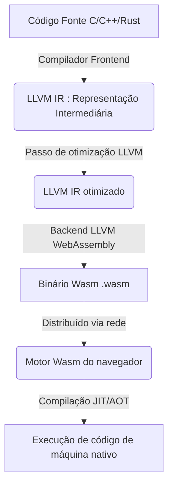
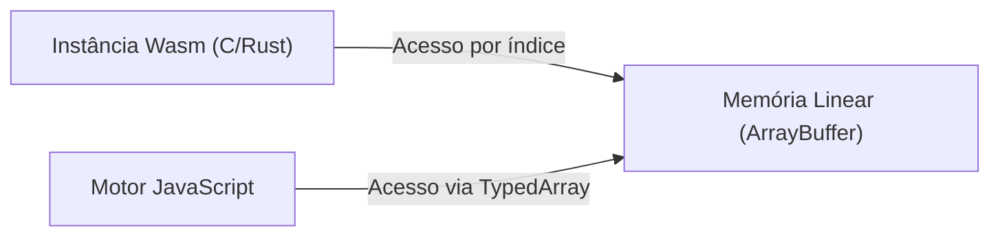
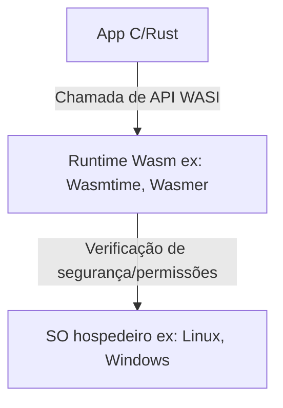

# Introdução: A ascensão do WebAssembly(Wasm)

O navegador web tem sido, por muito tempo, dominado por uma única linguagem: JavaScript. No entanto, à medida que os aplicativos da web se tornaram mais complexos e exigiram desempenho comparável aos aplicativos nativos, os limites do JavaScript sozinho tornaram-se evidentes. Foi então que surgiu o **WebAssembly (Wasm)**.

O WebAssembly é um novo formato binário que pode ser executado quase à velocidade nativa no navegador. Ele é gerado através da compilação de linguagens de programação como C, C++ e [Rust](https://kenji.blog/pt/p/programming-languages-history-paradigm-evolution/). Hoje em dia, está trazendo inovações não apenas no desenvolvimento web, mas também em áreas amplas que vão desde o lado do servidor (server-side) e edge computing, até dispositivos IoT.

Neste artigo, explicaremos de forma abrangente o presente e o futuro do WebAssembly, desde os conceitos básicos, passando pelo mecanismo técnico de como C e Rust funcionam no navegador, integração com JavaScript, comparação de desempenho, até aplicações fora do navegador (WASI).

---

# 1. O que é WebAssembly?

## 1.1 Contexto de seu surgimento

Antes do surgimento do WebAssembly, houve várias tentativas de melhorar o desempenho do JavaScript. Por exemplo, o **Native Client (NaCl)** do Google e o **asm.js** da Mozilla.

- **asm.js**: Era um subconjunto do JavaScript, projetado para ser facilmente otimizado pelo compilador JIT do navegador ao adicionar anotações de tipagem.
- **NaCl**: Era uma tecnologia de sandbox para executar código nativo de forma segura no navegador, mas não alcançou a padronização entre os fornecedores de navegadores.

Com base nessas experiências e reflexões, os principais fornecedores de navegadores (Mozilla, Google, Microsoft, Apple) colaboraram para estabelecer um padrão aberto chamado **WebAssembly**.

## 1.2 Filosofia de design do Wasm

O WebAssembly tem os seguintes objetivos de design:

1.  **Rápido e eficiente**: Pode ser executado em uma velocidade próxima à nativa e tem um tempo de carregamento curto.
2.  **Seguro**: Executado em um ambiente de sandbox, aderindo às políticas de segurança do host.
3.  **Aberto e depurável**: Possui um formato binário, bem como um formato de texto legível por humanos (WAT: WebAssembly Text format).
4.  **Integração com a Web**: Funciona de forma harmoniosa com JavaScript e pode interagir perfeitamente com as Web APIs existentes.

---

# 2. Como C/Rust funciona no navegador

Então, como exatamente o código em C ou Rust é executado no navegador? Vamos ver o processo passo a passo.

## 2.1 [Pipeline](https://kenji.blog/pt/p/cicd-pipeline-github-actions-best-practices/) de compilação

Linguagens como C ou [Rust](https://kenji.blog/pt/p/programming-languages-history-paradigm-evolution/) normalmente são compiladas para código de máquina dependente do sistema operacional ou da arquitetura da CPU. No entanto, no caso do WebAssembly, especifica-se uma arquitetura específica para Wasm, como "wasm32", como a arquitetura alvo.

Na maioria dos casos, utiliza-se a infraestrutura de compiladores LLVM.



Dessa forma, o código escrito pelo desenvolvedor passa por uma representação intermediária (IR), é otimizado e, por fim, torna-se um arquivo binário compacto com a extensão `.wasm`.

## 2.2 Bytecode e Máquina de Pilha

O WebAssembly adota a arquitetura de **máquina de pilha (stack machine)**. Não possui registradores, e todos os cálculos são realizados em uma pilha (estrutura de dados LIFO).

Por exemplo, ao realizar uma simples adição `$ 1 + 2 $`, a representação de texto do Wasm (WAT) seria da seguinte forma:

```wasm
(module
  (func $add (param $a i32) (param $b i32) (result i32)
    local.get $a
    local.get $b
    i32.add)
  (export "add" (func $add))
)
```

1.  `local.get $a` empurra o valor da variável 'a' para a pilha.
2.  `local.get $b` empurra o valor da variável 'b' para a pilha.
3.  `i32.add` retira os dois valores da pilha, soma-os e empurra o resultado para a pilha.

Com esta estrutura simples, os processos de decodificação e validação são mais rápidos, e a compilação JIT no navegador pode ser feita em um tempo muito curto.

## 2.3 Modelo de memória (Memória Linear)

No C e no [Rust](https://kenji.blog/pt/p/programming-languages-history-paradigm-evolution/), operações de memória usando ponteiros ocorrem frequentemente. Para permitir isso, o WebAssembly adotou o conceito de **Memória Linear (Linear Memory)**.

A memória linear é um array de bytes contínuo que pode ser acessado por instâncias do WebAssembly. Do ponto de vista do JavaScript, aparece como um `ArrayBuffer` ou `SharedArrayBuffer`. Os ponteiros dentro do Wasm são apenas índices (números inteiros) para esse array.



Este mecanismo impede que o código Wasm acesse diretamente a memória do SO hospedeiro, oferecendo um ambiente de sandbox robusto.

---

# 3. Integração do JavaScript com WebAssembly

O WebAssembly não visa substituir o JavaScript, mas sim complementá-lo. Na maioria dos casos, a manipulação do DOM e o tratamento de eventos são feitos pelo JavaScript, enquanto cálculos pesados são delegados ao WebAssembly.

## 3.1 Variáveis globais, importação e exportação

Os módulos WebAssembly podem importar e exportar funções, memória, tabelas e variáveis globais para interagir com o JavaScript.

```javascript
// Carregando e instanciando o módulo WebAssembly
fetch('module.wasm')
  .then(response => response.arrayBuffer())
  .then(bytes => WebAssembly.instantiate(bytes, {
    env: {
      // Importando a função JavaScript para o Wasm
      consoleLog: (arg) => console.log("Wasm says: " + arg)
    }
  }))
  .then(results => {
    // Chamando a função exportada do Wasm
    const add = results.instance.exports.add;
    console.log("1 + 2 = ", add(1, 2));
  });
```

## 3.2 Acesso e bindings a Web APIs

O Wasm em si não tem a capacidade de acessar diretamente o DOM ou as Web APIs. Para acessá-las, é necessário passar pelo JavaScript.
No entanto, escrever isso manualmente dá muito trabalho. É por isso que, no ecossistema [Rust](https://kenji.blog/pt/p/programming-languages-history-paradigm-evolution/), existem ferramentas como o **wasm-bindgen**.

```rust
// Código Rust (usando wasm-bindgen)
use wasm_bindgen::prelude::*;

#[wasm_bindgen]
extern "C" {
    fn alert(s: &str);
}

#[wasm_bindgen]
pub fn greet(name: &str) {
    alert(&format!("Hello, {}!", name));
}
```

Ao compilar este código, o `wasm-bindgen` gera automaticamente o código de cola (código intermédio) para o JavaScript, ocultando a passagem de memória para strings e afins. Isso proporciona uma experiência de desenvolvimento que parece como se estivesse chamando as APIs do navegador diretamente a partir do [Rust](https://kenji.blog/pt/p/programming-languages-history-paradigm-evolution/).

---

# 4. Desempenho e Comparação de Velocidade

Por que o WebAssembly é mais rápido que o JavaScript?

1.  **Velocidade de análise (Parsing)**: Como o Wasm é um formato binário, pode ser decodificado muito mais rápido do que analisar (parse) o código-fonte de texto JS e construir uma Árvore de Sintaxe Abstrata (AST).
2.  **Otimização do JIT**: Sendo o JS uma linguagem de tipagem dinâmica, o compilador JIT deve fazer inferências de tipos em tempo de execução, e se as suposições estiverem erradas, ele precisa desfazer a otimização (Desotimização). O Wasm é de tipagem estática, e otimizações pesadas (via LLVM, etc.) já foram aplicadas no momento da compilação, permitindo que o navegador se concentre diretamente na geração de código de máquina.
3.  **Evitar a Coleta de Lixo (GC)**: Wasm escrito em C ou Rust gerencia sua própria memória, evitando pausas inesperadas causadas pelo GC do motor JS (※A especificação do Wasm GC é discutida mais adiante).

## 4.1 Benchmark: Sequência de Fibonacci

Vamos comparar a velocidade de JavaScript e Rust(Wasm) no cálculo simples da sequência de Fibonacci.
Matematicamente, é representado pela seguinte equação recursiva. A complexidade de tempo é exponencial `$ O(2^n) $`, o que consome bastante CPU.

$$
F(n) =
\begin{cases}
0 & (n = 0) \\\\
1 & (n = 1) \\\\
F(n-1) + F(n-2) & (n \ge 2)
\end{cases}
$$

### Implementação em JavaScript
```javascript
function fibJs(n) {
  if (n <= 1) return n;
  return fibJs(n - 1) + fibJs(n - 2);
}
```

### Implementação em [Rust](https://kenji.blog/pt/p/programming-languages-history-paradigm-evolution/)
```rust
#[no_mangle]
pub fn fib_wasm(n: u32) -> u32 {
    if n <= 1 { return n; }
    fib_wasm(n - 1) + fib_wasm(n - 2)
}
```

Ao calcular para $n=40$, mesmo que o JavaScript (motor V8) execute de forma bastante rápida graças às otimizações do JIT, o Wasm gerado pelo [Rust](https://kenji.blog/pt/p/programming-languages-history-paradigm-evolution/) geralmente é **cerca de 1,5 a 2 vezes ou mais** rápido. Essa diferença é ainda mais notável em áreas que tiram proveito do acesso sequencial à memória ou de instruções SIMD, como operações de matrizes e processamento de imagens.

---

# 5. Rust e C++ como Linguagens de Desenvolvimento

As linguagens fonte mais populares para o WebAssembly são C/C++ e Rust.

## 5.1 C++ e Emscripten

Historicamente, a linguagem mais antiga utilizada para conversões para web é C/C++. O **Emscripten** é uma cadeia de ferramentas que usa LLVM para converter código C/C++ para Wasm.
Ele fornece emulação POSIX e camadas de conversão para OpenGL (WebGL) para permitir a execução de enormes bibliotecas C/C++ existentes (como SQLite, FFmpeg, OpenCV, motores de jogo, etc.) no navegador.

## 5.2 Rust e WebAssembly

Atualmente, **Rust** é a linguagem de primeira classe que mais chama a atenção para o WebAssembly.
As razões pelas quais o Rust é o favorito incluem:

- **Runtime pequeno**: O Rust não tem GC nem um runtime enorme, permitindo que o tamanho dos binários Wasm gerados seja muito pequeno.
- **wasm-pack / wasm-bindgen**: O ecossistema é muito refinado e permite iniciar projetos Wasm com apenas alguns comandos de linha e publicá-los como pacotes npm.
- **Segurança de memória**: Como a segurança de memória é garantida em tempo de compilação, o risco de corrupção de memória por bugs é reduzido, mesmo ao executar operações complexas do lado do navegador.

---

# 6. Funcionalidades Avançadas e Extensão das Especificações do WebAssembly

O WebAssembly continuou a evoluir após o seu lançamento inicial (MVP) e agora conta com muitas extensões poderosas implementadas nos navegadores.

## 6.1 SIMD (Single Instruction, Multiple Data)
Foram introduzidas instruções SIMD, permitindo que uma única instrução processe vários dados simultaneamente (SIMD de 128 bits). Isso proporciona um aumento dramático no desempenho em processamento de imagens, áudio e algoritmos de criptografia.

## 6.2 Threads e Memória Compartilhada
Através da utilização de Web Workers e `SharedArrayBuffer`, múltiplas instâncias Wasm podem agora compartilhar o mesmo espaço de memória, permitindo processamento paralelo com múltiplos threads. Isso permite que simulações físicas complexas e motores de jogos rodem de forma fluida no navegador.

## 6.3 Coleta de Lixo (Wasm GC)
Enquanto o Wasm tradicional foi projetado para C e [Rust](https://kenji.blog/pt/p/programming-languages-history-paradigm-evolution/) com gestão manual da memória linear, a proposta do **Wasm GC** para compilar eficientemente linguagens que requerem Garbage Collection (GC) (como [Java](https://kenji.blog/pt/p/programming-languages-history-paradigm-evolution/), Kotlin, C# e Dart) está em processo de padronização. Isso levou a uma melhoria drástica no desempenho do Flutter Web e afins.

---

# 7. O Mundo Fora do Navegador: WASI (WebAssembly System Interface)

O potencial do WebAssembly não se limita ao navegador. E se pudéssemos usar o Wasm como formato padrão fora do navegador? Dessa ideia surgiu o **WASI (WebAssembly System Interface)**.

## 7.1 O que é WASI?
O WASI é uma interface padrão para programas WebAssembly acederem de forma segura a recursos do sistema operacional (como sistema de arquivos, redes, variáveis de ambiente, etc.).
Ele mantém o modelo sandbox do navegador enquanto concede aos módulos Wasm apenas as permissões de que precisam (Segurança baseada em capacidades).



## 7.2 Substituição e Coexistência com contêineres [Docker](https://kenji.blog/pt/p/docker-container-namespace-[cgroups](https://kenji.blog/pt/p/docker-container-namespace-cgroups-layers/)-layers/)
O criador do Docker, Solomon Hykes, chamou atenção quando disse: "Se Wasm e WASI existissem em 2008, não precisaríamos criar o Docker".
O Wasm possui enormes vantagens: é muito mais leve que um contêiner, inicia-se mais rápido (em poucos milissegundos) e não depende do sistema operacional ou da arquitetura da CPU.
Atualmente, estão sendo ativamente desenvolvidos projetos (como Kwasm e Spin) para orquestrar módulos Wasm diretamente no [Kubernetes](https://kenji.blog/pt/p/kubernetes-k8s-architecture-pod-service-ingress/) em vez de contêineres Docker.

---

# 8. O Futuro do WebAssembly

## 8.1 Modelo de Componentes (Component Model)
O maior desafio atual do WebAssembly é a dificuldade de interligar módulos Wasm escritos em linguagens diferentes (já que a representação na memória de strings e tipos de dados complexos varia consoante a linguagem).

A solução para isso é o **WebAssembly Component Model**.
Se o Component Model for realizado, será possível chamar uma função sem atritos de um "módulo Wasm escrito em Python" para um "módulo Wasm escrito em [Rust](https://kenji.blog/pt/p/programming-languages-history-paradigm-evolution/)", por exemplo. Isso tem o potencial de ser a base da arquitetura de microsserviços da próxima geração, independentemente da plataforma e da linguagem.

## 8.2 Wasm como um sistema de plugins
Já existem muitos softwares, como Figma, EnvoyProxy e Microsoft Flight Simulator, adotando o WebAssembly para os seus próprios sistemas de plugins. Isso porque o código de terceiros escrito por usuários pode ser executado dentro do aplicativo principal de forma rápida e segura.

---

# Conclusão

O WebAssembly está a crescer muito além de "uma tecnologia rápida para o navegador" e está se a tornar uma linguagem comum em ambientes cloud-native, edge computing e arquiteturas de plugins.

Um mundo onde lógica poderosa desenvolvida em linguagens de programação de sistemas como C, C++ e Rust pode ser executada em qualquer plataforma com rapidez e segurança. É exatamente esse o **presente e futuro** que o WebAssembly está abrindo.

No futuro do desenvolvimento web, a abordagem híbrida de usar as ferramentas certas para os trabalhos certos provavelmente se tornará o padrão: JavaScript/TypeScript continuará sendo o responsável pela construção da UI, enquanto o WebAssembly será aproveitado para a lógica central que exige alto desempenho e para reutilizar os ativos nativos existentes.

Por que não dar um salto para o mundo do WebAssembly utilizando Rust e Emscripten?
