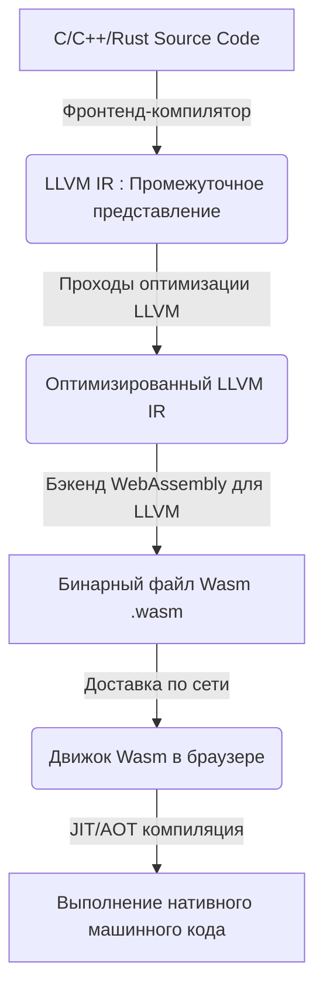
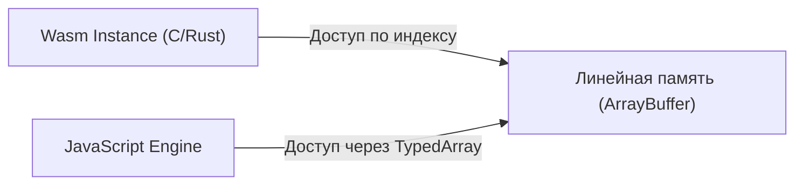
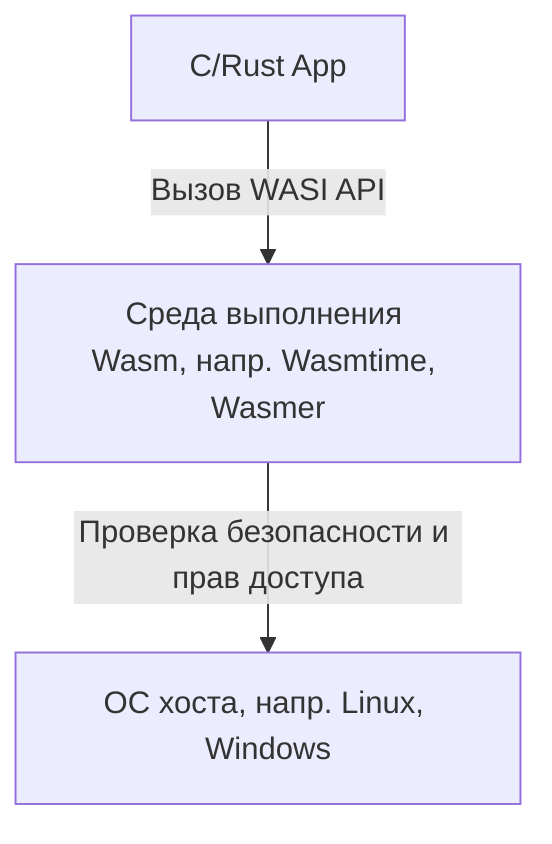

# Введение: Появление WebAssembly (Wasm)

Веб-браузеры долгое время контролировались одним языком — JavaScript. Однако по мере того, как веб-приложения становились всё сложнее и от них требовалась производительность, сопоставимая с нативными приложениями, стали очевидны ограничения одного только JavaScript. Именно тогда и появился **WebAssembly (Wasm)**.

WebAssembly — это новый бинарный формат, который может выполняться в браузере со скоростью, близкой к нативному коду. Он компилируется из таких языков программирования, как C, C++ и Rust, и в настоящее время приносит инновации не только в веб-разработку, но и в широкий спектр областей, включая серверную часть, граничные вычисления (edge computing) и даже устройства IoT.

В этой статье мы подробно рассмотрим настоящее и будущее WebAssembly: от базовых концепций до технических механизмов работы C и Rust в браузере, взаимодействия с JavaScript, сравнения производительности и применения за пределами браузера (WASI).

---

# 1. Что такое WebAssembly?

## 1.1 Предпосылки создания

Ещё до появления WebAssembly существовало несколько попыток улучшить производительность JavaScript. Примерами могут служить **Native Client (NaCl)** от Google и **asm.js** от Mozilla.

- **asm.js**: Подмножество JavaScript, разработанное таким образом, чтобы JIT-компиляторам браузеров было легче оптимизировать код за счёт использования аннотаций типов.
- **NaCl**: Технология песочницы для безопасного выполнения нативного кода в браузере, однако она не стала стандартом среди разработчиков браузеров.

С учётом этого опыта и ошибок основные разработчики браузеров (Mozilla, Google, Microsoft, Apple) объединились для создания открытого стандарта — **WebAssembly**.

## 1.2 Философия дизайна Wasm

WebAssembly ставит перед собой следующие цели проектирования:

1.  **Высокая скорость и эффективность**: Выполнение со скоростью, близкой к нативной, и быстрое время загрузки.
2.  **Безопасность**: Выполнение в изолированной среде (песочнице) с соблюдением политик безопасности хоста.
3.  **Открытость и возможность отладки**: Наличие не только бинарного формата, но и текстового формата, понятного человеку (WAT: WebAssembly Text format).
4.  **Интеграция с Web**: Совместная работа с JavaScript и бесшовная интеграция с существующими Web API.

---

# 2. Как C/Rust работают в браузере

Теперь давайте шаг за шагом рассмотрим, как именно код на C или Rust выполняется в браузере.

## 2.1 Конвейер компиляции

Языки вроде C и Rust обычно компилируются в машинный код, зависящий от ОС и архитектуры процессора. Однако в случае WebAssembly в качестве целевой архитектуры указывается специфичная для Wasm архитектура, например, «wasm32».

Часто для этого используется инфраструктура компилятора LLVM.



Таким образом, написанный разработчиком код проходит через промежуточное представление (IR), оптимизируется и в итоге превращается в компактный бинарный файл с расширением `.wasm`.

## 2.2 Байт-код и стековая машина

WebAssembly использует архитектуру **стековой машины**. В ней нет регистров, и все вычисления выполняются со стеком (структурой данных LIFO).

Например, для выполнения простого сложения `$ 1 + 2 $` текстовое представление Wasm (WAT) будет выглядеть так:

```wasm
(module
  (func $add (param $a i32) (param $b i32) (result i32)
    local.get $a
    local.get $b
    i32.add)
  (export "add" (func $add))
)
```

1.  `local.get $a` помещает значение переменной a в стек.
2.  `local.get $b` помещает значение переменной b в стек.
3.  `i32.add` извлекает два значения из стека, складывает их и помещает результат обратно в стек.

Благодаря этой простой структуре процессы декодирования и верификации проходят быстро, а JIT-компиляция в браузере занимает очень мало времени.

## 2.3 Модель памяти (Линейная память)

В C и Rust часто используются указатели для работы с памятью. Чтобы реализовать это, WebAssembly применяет концепцию **линейной памяти (Linear Memory)**.

Линейная память — это непрерывный массив байтов, к которому может обращаться экземпляр WebAssembly. Для JavaScript он выглядит как `ArrayBuffer` или `SharedArrayBuffer`. Указатели внутри Wasm — это просто индексы (целые числа) этого массива.



Этот механизм не позволяет коду Wasm напрямую обращаться к памяти операционной системы хоста, обеспечивая надёжную изолированную среду.

---

# 3. Взаимодействие JavaScript и WebAssembly

WebAssembly не заменяет JavaScript, а дополняет его. Чаще всего манипуляции с DOM и обработка событий остаются за JavaScript, а тяжелые вычисления делегируются WebAssembly.

## 3.1 Глобальные переменные, импорт и экспорт

Модули WebAssembly могут импортировать и экспортировать функции, память, таблицы и глобальные переменные для взаимодействия с JavaScript.

```javascript
// Загрузка и инстанцирование модуля WebAssembly
fetch('module.wasm')
  .then(response => response.arrayBuffer())
  .then(bytes => WebAssembly.instantiate(bytes, {
    env: {
      // Импорт функции JavaScript в Wasm
      consoleLog: (arg) => console.log("Wasm says: " + arg)
    }
  }))
  .then(results => {
    // Вызов экспортированной функции из Wasm
    const add = results.instance.exports.add;
    console.log("1 + 2 = ", add(1, 2));
  });
```

## 3.2 Доступ к Web API и биндинги

Сам по себе Wasm не имеет возможности напрямую обращаться к DOM или Web API. Для этого необходимо использовать JavaScript.
Однако писать всё это вручную очень трудоёмко. Поэтому в экосистеме Rust предусмотрены такие инструменты, как **wasm-bindgen**.

```rust
// Код на Rust (с использованием wasm-bindgen)
use wasm_bindgen::prelude::*;

#[wasm_bindgen]
extern "C" {
    fn alert(s: &str);
}

#[wasm_bindgen]
pub fn greet(name: &str) {
    alert(&format!("Hello, {}!", name));
}
```

При компиляции этого кода `wasm-bindgen` автоматически генерирует связующий код (glue code) на JavaScript, скрывая передачу строк в памяти и другие детали. Это создаёт ощущение разработки, как если бы вы вызывали API браузера напрямую из Rust.

---

# 4. Производительность и сравнение скорости

Почему WebAssembly быстрее JavaScript?

1.  **Скорость парсинга**: Поскольку Wasm является бинарным форматом, его декодирование происходит гораздо быстрее, чем парсинг исходного текстового кода JS для построения абстрактного синтаксического дерева (AST).
2.  **JIT-оптимизация**: Так как JS является языком с динамической типизацией, JIT-компилятору приходится выполнять вывод типов во время выполнения, и если вывод оказывается неверным, оптимизацию необходимо отменить (Deoptimization). Wasm имеет статическую типизацию, и мощные оптимизации с помощью LLVM и других инструментов уже выполнены на этапе компиляции, поэтому браузер может сосредоточиться непосредственно на генерации машинного кода.
3.  **Избегание сборки мусора (GC)**: Wasm, написанный на C или Rust, управляет памятью самостоятельно, поэтому не возникает неожиданных пауз (остановок) из-за работы сборщика мусора движка JS (※ о спецификации Wasm GC будет рассказано ниже).

## 4.1 Бенчмарк: Последовательность Фибоначчи

Давайте сравним скорость работы JavaScript и Rust (Wasm) на простом вычислении чисел Фибоначчи.
Математически это выражается следующим рекурсивным уравнением. Сложность вычислений является экспоненциальной `$ O(2^n) $`, что сильно нагружает процессор.

$$
F(n) =
\begin{cases}
0 & (n = 0) \\\\
1 & (n = 1) \\\\
F(n-1) + F(n-2) & (n \ge 2)
\end{cases}
$$

### Реализация на JavaScript
```javascript
function fibJs(n) {
  if (n <= 1) return n;
  return fibJs(n - 1) + fibJs(n - 2);
}
```

### Реализация на Rust
```rust
#[no_mangle]
pub fn fib_wasm(n: u32) -> u32 {
    if n <= 1 { return n; }
    fib_wasm(n - 1) + fib_wasm(n - 2)
}
```

При расчёте для $n=40$ JavaScript (в движке V8) обычно выполняется довольно быстро благодаря JIT-оптимизациям, но Wasm, сгенерированный из Rust, во многих случаях оказывается **примерно в 1.5 - 2 раза быстрее**. В областях, где активно используются матричные вычисления, обработка изображений, последовательный доступ к памяти и SIMD-инструкции, эта разница становится ещё более заметной.

---

# 5. Rust и C++ как языки разработки

Самыми популярными исходными языками для WebAssembly являются C/C++ и Rust.

## 5.1 C++ и Emscripten

Исторически C/C++ используются для переноса кода в веб дольше всего. **Emscripten** — это набор инструментов (toolchain), который использует LLVM для преобразования кода на C/C++ в Wasm.
Он включает эмуляцию POSIX и слой трансляции в OpenGL (WebGL) для запуска огромных существующих библиотек на C/C++ (например, SQLite, FFmpeg, OpenCV, игровых движков) в браузере.

## 5.2 Rust и WebAssembly

В настоящее время **Rust** привлекает наибольшее внимание как язык первого класса для WebAssembly.
Причины популярности Rust следующие:

- **Небольшой размер среды выполнения (runtime)**: Поскольку в Rust нет GC и громоздкой среды выполнения, размер генерируемых бинарных файлов Wasm можно сделать очень маленьким.
- **wasm-pack / wasm-bindgen**: Экосистема очень хорошо продумана, и создать проект Wasm, а затем опубликовать его как npm-пакет можно всего за несколько строк команд.
- **Безопасность памяти**: Поскольку безопасность памяти гарантируется на этапе компиляции, даже при выполнении сложной логики на стороне браузера снижается риск повреждения памяти из-за багов.

---

# 6. Продвинутые функции и расширения спецификаций WebAssembly

WebAssembly продолжает развиваться со времени первоначального выпуска (MVP), и сейчас в браузерах реализовано множество мощных расширений.

## 6.1 SIMD (Single Instruction, Multiple Data)
Добавлена поддержка SIMD-инструкций, позволяющих обрабатывать несколько элементов данных одновременно с помощью одной инструкции (128-битный SIMD). Это обеспечивает значительное повышение производительности при обработке изображений, звука и в алгоритмах шифрования.

## 6.2 Потоки и разделяемая память
Использование Web Workers и `SharedArrayBuffer` позволяет нескольким экземплярам Wasm разделять одну и ту же область памяти и выполнять параллельную обработку в несколько потоков. Благодаря этому сложные физические симуляции и игровые движки работают в браузере плавно.

## 6.3 Сборка мусора (Wasm GC)
Изначально Wasm был спроектирован для C и Rust с ручным управлением линейной памятью, но сейчас стандартизируется предложение **Wasm GC**, позволяющее эффективно компилировать в Wasm языки, требующие сборщика мусора, такие как Java, Kotlin, C# и Dart. Это привело к значительному повышению производительности таких технологий, как Flutter Web.

---

# 7. Мир за пределами браузера: WASI (WebAssembly System Interface)

Возможности WebAssembly не ограничиваются только браузером. Идея **«Что, если мы сможем использовать Wasm в качестве стандартного формата и вне браузера?»** привела к созданию **WASI (WebAssembly System Interface)**.

## 7.1 Что такое WASI?
WASI — это стандартный интерфейс, который позволяет программам WebAssembly безопасно обращаться к ресурсам ОС (файловой системе, сети, переменным окружения и т. д.).
Он сохраняет модель песочницы браузера, но при этом предоставляет модулю Wasm только необходимые права (безопасность на основе возможностей - Capability-based security).



## 7.2 Альтернатива и сосуществование с [Docker](https://kenji.blog/ru/p/docker-container-namespace-[cgroups](https://kenji.blog/ru/p/docker-container-namespace-cgroups-layers/)-layers/) контейнерами
Создатель Docker, Соломон Хайкс (Solomon Hykes), вызвал бурные обсуждения своим заявлением: «Если бы Wasm и WASI существовали в 2008 году, нам бы не пришлось создавать Docker».
Wasm намного легче контейнеров, запускается быстрее (за считанные миллисекунды) и имеет огромное преимущество в виде независимости от ОС и архитектуры процессора.
В настоящее время активно развиваются проекты (такие как Kwasm и Spin) по прямой оркестрации модулей Wasm в [Kubernetes](https://kenji.blog/ru/p/kubernetes-k8s-architecture-pod-service-ingress/) вместо контейнеров Docker.

---

# 8. Будущее WebAssembly

## 8.1 Компонентная модель (Component Model)
Самой большой проблемой WebAssembly на данный момент является сложность связывания модулей Wasm, написанных на разных языках (поскольку представление строк и сложных типов данных в памяти зависит от языка).

Эту проблему решает **WebAssembly Component Model**.
Если компонентная модель будет реализована, станет возможным бесшовный вызов функций из «модуля Wasm, написанного на Python» в «модуль Wasm, написанного на Rust». Это имеет потенциал стать основой для архитектуры микросервисов следующего поколения, не зависящей от платформы и языка.

## 8.2 Wasm как система плагинов
Многие программы, такие как Figma, EnvoyProxy и Microsoft Flight Simulator, уже используют WebAssembly в качестве собственной системы плагинов. Это позволяет безопасно и быстро выполнять сторонний код, созданный пользователями, внутри основного приложения.

---

# Заключение

WebAssembly уже давно вышел за рамки простой «быстрой технологии для браузера» и превращается в общий язык для cloud-native приложений, граничных вычислений и архитектур плагинов.

Мир, в котором мощная логика, разработанная на языках системного программирования вроде C, C++ и Rust, может безопасно и быстро развертываться независимо от платформы. Это и есть **настоящее и будущее**, которое открывает WebAssembly.

В будущей веб-разработке гибридный подход станет мейнстримом: создание UI по-прежнему будет возложено на JavaScript/TypeScript, а WebAssembly будет использоваться для основной логики, требующей производительности, или для переиспользования существующих нативных ресурсов.

Обязательно попробуйте окунуться в мир WebAssembly, используя Rust или Emscripten!
