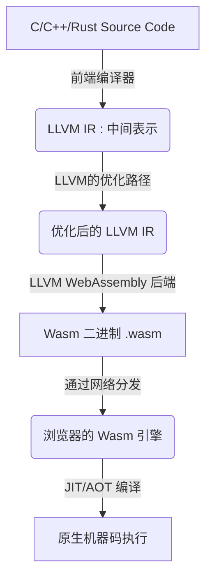
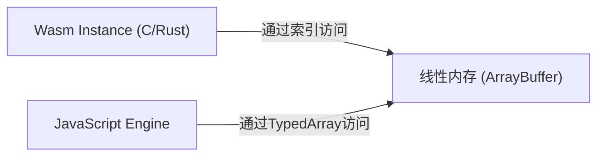
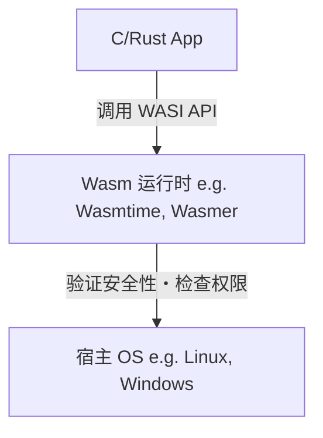

# 前言：WebAssembly(Wasm)的崛起

长期以来，Web 浏览器一直被 JavaScript 这一单一语言所主导。然而，随着 Web 应用程序变得日益复杂，以及对媲美原生应用的性能需求不断增加，仅靠 JavaScript 的局限性也开始显现。于是， **WebAssembly (Wasm)** 应运而生。

WebAssembly 是一种新的二进制格式，可以在浏览器上以接近原生代码的速度运行。它是由 C、C++、Rust 等编程语言编译生成的，如今不仅在 Web 开发中，甚至在服务器端、边缘计算乃至 IoT 设备等广泛领域都带来了创新。

在本文中，我们将从 WebAssembly 的基本概念出发，深入探讨 C 和 Rust 在浏览器中运行的技术机制、与 JavaScript 的协作、性能对比，以及在浏览器外世界的应用（WASI），全面讲解 WebAssembly 的现在与未来。

---

# 1. WebAssembly 是什么？

## 1.1 诞生的背景

在 WebAssembly 诞生之前，也曾有过几次提升 JavaScript 性能的尝试。例如，Google 的 **Native Client (NaCl)** 和 Mozilla 的 **asm.js** 等。

- **asm.js**: 是 JavaScript 的一个子集，通过将类型指定作为注解添加，其设计使得浏览器的 JIT 编译器更容易进行优化。
- **NaCl**: 是一种在浏览器内安全执行原生代码的沙箱技术，但并未能在各大浏览器厂商之间达成标准化。

基于这些经验教训，主要浏览器厂商（Mozilla、Google、Microsoft、Apple）共同合作制定的开放标准规范即是 **WebAssembly** 。

## 1.2 Wasm 的设计哲学

WebAssembly 提出了以下设计目标：

1.  **高速且高效** : 能够以接近原生的速度执行，并且加载时间短。
2.  **安全** : 在沙箱环境中运行，并遵守宿主的安全策略。
3.  **开放且可调试** : 在提供二进制格式的同时，也拥有人类可读的文本格式（WAT: WebAssembly Text format）。
4.  **与Web的集成** : 与 JavaScript 协同工作，能够与现有的 Web API 无缝衔接。

---

# 2. C/Rust 在浏览器中运行的机制

那么，C 和 Rust 的代码具体是如何在浏览器上执行的呢？让我们分步骤来看一下这个过程。

## 2.1 编译流水线

像 C 和 Rust 这样的语言，通常会被编译为依赖于 OS 或 CPU 架构的机器码。但在 WebAssembly 的情况下，会指定诸如“wasm32”等 Wasm 专用架构作为目标架构。

在大多数情况下，会利用 LLVM 这个编译器基础设施。



像这样，开发者编写的代码经过中间表示（IR）进行优化，最终变成扩展名为 `.wasm` 的紧凑二进制文件。

## 2.2 字节码与堆栈机

WebAssembly 采用了 **堆栈机** 架构。它没有寄存器，所有的计算都是针对堆栈（LIFO 格式的数据结构）进行的。

例如，在进行简单的加法 `$ 1 + 2 $` 时，Wasm 的文本表示（WAT）如下所示。

```wasm
(module
  (func $add (param $a i32) (param $b i32) (result i32)
    local.get $a
    local.get $b
    i32.add)
  (export "add" (func $add))
)
```

1.  通过 `local.get $a` 将变量 a 的值压入堆栈。
2.  通过 `local.get $b` 将变量 b 的值压入堆栈。
3.  通过 `i32.add` 从堆栈中取出两个值相加，并将结果压入堆栈。

由于这种简单的结构，解码和验证处理变得非常快，使得浏览器中的 JIT 编译可以在极短的时间内完成。

## 2.3 内存模型（线性内存）

在 C 和 Rust 中，频繁使用指针进行内存操作。为了实现这一点，WebAssembly 引入了 **线性内存 (Linear Memory)** 的概念。

线性内存是可以从 WebAssembly 实例中访问的连续字节数组。在 JavaScript 看来，它就像是 `ArrayBuffer` 或 `SharedArrayBuffer` 。Wasm 内部的指针仅仅是这个数组的索引（整数值）而已。



通过这种机制，防止了 Wasm 代码直接访问宿主 OS 的内存，从而提供了一个强大的沙箱环境。

---

# 3. JavaScript 与 WebAssembly 的协作

WebAssembly 并不是要取代 JavaScript，而是为了对其进行补充。在多数情况下，DOM 操作和事件处理由 JavaScript 负责，而将繁重的计算处理委托给 WebAssembly。

## 3.1 全局变量与导入・导出

为了与 JavaScript 进行交互，WebAssembly 模块可以导入和导出函数、内存、表以及全局变量。

```javascript
// 加载并实例化 WebAssembly 模块
fetch('module.wasm')
  .then(response => response.arrayBuffer())
  .then(bytes => WebAssembly.instantiate(bytes, {
    env: {
      // 将 JavaScript 函数导入到 Wasm 中
      consoleLog: (arg) => console.log("Wasm says: " + arg)
    }
  }))
  .then(results => {
    // 调用从 Wasm 导出的函数
    const add = results.instance.exports.add;
    console.log("1 + 2 = ", add(1, 2));
  });
```

## 3.2 访问 Web API 与绑定

Wasm 本身并不具备直接访问 DOM 或 Web API 的功能。如果要访问，必须通过 JavaScript。
然而，手动编写这些代码非常繁琐。因此，在 Rust 的生态系统中提供了 **wasm-bindgen** 等工具。

```rust
// Rust 代码 (使用 wasm-bindgen)
use wasm_bindgen::prelude::*;

#[wasm_bindgen]
extern "C" {
    fn alert(s: &str);
}

#[wasm_bindgen]
pub fn greet(name: &str) {
    alert(&format!("Hello, {}!", name));
}
```

当编译这段代码时， `wasm-bindgen` 会自动生成 JavaScript 的胶水代码（起粘合作用的代码），并隐藏字符串的内存传递等细节。借此，我们可以获得仿佛从 Rust 直接调用浏览器 API 一般的开发体验。

---

# 4. 性能与速度的对比

为什么 WebAssembly 比 JavaScript 更快呢？

1.  **解析速度** : 由于 Wasm 是二进制格式，比起解析纯文本的 JS 源代码并构建抽象语法树 (AST)，它的解码速度要快得多。
2.  **JIT的优化** : 由于 JS 是动态类型语言，JIT 编译器必须在运行时进行类型推断，一旦推断错误就需要取消优化 (Deoptimization)。而 Wasm 是静态类型的，并且在编译时通过 LLVM 等工具已经完成了强大的优化，所以浏览器可以专注于直接生成机器码。
3.  **避免垃圾回收 (GC)** : 用 C 或 Rust 编写的 Wasm 会自行管理内存，因此不会发生 JS 引擎的 GC 导致的意外暂停（停顿时间）（※ 关于 Wasm GC 的规范将在后文介绍）。

## 4.1 基准测试：斐波那契数列

让我们通过简单的斐波那契数列计算，来对比一下 JavaScript 和 Rust(Wasm) 的速度。
在数学上，它由以下的递归公式表示。其时间复杂度呈指数级 `$ O(2^n) $` ，会极大地消耗 CPU。

$$
F(n) =
\begin{cases}
0 & (n = 0) \\\\
1 & (n = 1) \\\\
F(n-1) + F(n-2) & (n \ge 2)
\end{cases}
$$

### JavaScript 实现
```javascript
function fibJs(n) {
  if (n <= 1) return n;
  return fibJs(n - 1) + fibJs(n - 2);
}
```

### Rust 实现
```rust
#[no_mangle]
pub fn fib_wasm(n: u32) -> u32 {
    if n <= 1 { return n; }
    fib_wasm(n - 1) + fib_wasm(n - 2)
}
```

在令 $n=40$ 进行计算时，通常 JavaScript（V8引擎）由于 JIT 优化也能执行得相当快，但由 Rust 生成的 Wasm 往往比其 **约1.5倍到2倍以上** 更快。特别是在矩阵运算或图像处理等能够发挥内存连续访问和 SIMD 指令优势的领域，这种差异会更加显著。

---

# 5. 作为开发语言的 Rust 和 C++

作为 WebAssembly 的源语言，最受欢迎的是 C/C++ 和 Rust。

## 5.1 C++ 与 Emscripten

从历史上看，最早被用于向 Web 移植的就是 C/C++。 **Emscripten** 是一个利用 LLVM 将 C/C++ 代码转换为 Wasm 的工具链。
它具备 POSIX 模拟和向 OpenGL(WebGL) 转换的层，以便在浏览器上运行现有的庞大 C/C++ 库（例如，SQLite、FFmpeg、OpenCV、游戏引擎等）。

## 5.2 Rust 与 WebAssembly

目前，作为 WebAssembly 的一等公民最受关注的是 **Rust** 。
Rust 备受青睐的原因如下：

- **运行时小** : Rust 没有 GC 或庞大的运行时，因此可以将生成的 Wasm 二进制文件的大小控制得非常小。
- **wasm-pack / wasm-bindgen** : 其生态系统非常完善，只需几行命令就可以搭建 Wasm 项目，并将其作为 npm 包发布。
- **内存安全性** : 由于在编译时保证了内存安全，因此即使在浏览器端执行复杂的处理，也能降低因 Bug 导致内存损坏的风险。

---

# 6. WebAssembly 的高级功能与规范扩展

WebAssembly 在初始发布（MVP）之后也在不断演进，如今浏览器中已经实现了许多强大的扩展功能。

## 6.1 SIMD (Single Instruction, Multiple Data)
支持了使用单条指令同时处理多个数据的 SIMD 指令（128位 SIMD）。借此，有望在图像处理、音频处理、加密算法等方面实现性能的飞跃。

## 6.2 线程与共享内存
通过利用 Web Workers 和 `SharedArrayBuffer` ，多个 Wasm 实例可以共享同一个内存区域，并以多线程并发执行处理。这使得高级物理模拟或游戏引擎等能够在浏览器中流畅运行。

## 6.3 垃圾回收 (Wasm GC)
传统的 Wasm 是为 C 或 Rust 这种需要手动管理线性内存的语言设计的，但为了高效地将 Java、Kotlin、C#、Dart 等需要垃圾回收的语言编译到 Wasm， **Wasm GC** 提案正在标准化。由此，Flutter Web 等的性能得到了突飞猛进的提升。

---

# 7. 浏览器外的世界：WASI (WebAssembly System Interface)

WebAssembly 的可能性并不局限于浏览器之中。出于 **“如果能在浏览器之外将Wasm作为标准格式使用呢？”** 的想法， **WASI (WebAssembly System Interface)** 诞生了。

## 7.1 WASI 是什么？
WASI 是一种标准接口，旨在让 WebAssembly 程序安全地访问 OS 资源（文件系统、网络、环境变量等）。
在维持浏览器沙箱模型的同时，它可以只赋予 Wasm 模块所需的权限（基于能力的安全性，Capability-based security）。



## 7.2 [Docker](https://kenji.blog/zh-cn/p/docker-container-namespace-[cgroups](https://kenji.blog/zh-cn/p/docker-container-namespace-cgroups-layers/)-layers/) 容器的替代与共存
Docker 的发明者 Solomon Hykes 曾发表言论称，“如果在2008年就已经有了 Wasm 和 WASI，那么我们就没有必要去创造 Docker 了”，这一言论引发了热议。
Wasm 比容器轻量得多，启动极快（几毫秒级别），且具有不依赖 OS 或 CPU 架构的巨大优势。
如今，在 [Kubernetes](https://kenji.blog/zh-cn/p/kubernetes-k8s-architecture-pod-service-ingress/) 上直接编排 Wasm 模块以取代 Docker 容器的项目（如 Kwasm 和 Spin 等）正处于活跃的开发阶段。

---

# 8. WebAssembly 的未来

## 8.1 组件模型 (Component Model)
当前 WebAssembly 面临的最大挑战是，让不同语言编写的 Wasm 模块协同工作非常困难（因为不同语言中字符串或复杂数据类型的内存表示是不同的）。

能够解决这个问题的是 **WebAssembly Component Model** 。
如果组件模型得以实现，就能够做到例如从“用 Python 编写的 Wasm 模块”中无缝地调用“用 Rust 编写的 Wasm 模块”的函数。它具备成为不依赖平台和语言的下一代微服务架构基础的潜力。

## 8.2 作为插件系统的 Wasm
事实上，Figma、EnvoyProxy、Microsoft Flight Simulator 等众多软件已经采用 WebAssembly 作为其专属的插件系统。这是因为它们能够安全且高速地在主体应用程序中运行用户编写的第三方代码。

---

# 总结

WebAssembly 已经远远超越了单纯“在浏览器中运行的高速技术”的范畴，正逐渐成长为云原生、边缘计算以及插件架构中的通用语言。

在这个世界里，使用 C、C++、Rust 等系统编程语言开发出的强大逻辑，可以不受平台限制地被安全且高速地部署。那正是 WebAssembly 所开拓的 **现在与未来** 。

在未来的 Web 开发中，构建 UI 将继续由 JavaScript/TypeScript 承担，而对性能要求较高的核心逻辑或现有原生资产的复用，则将利用 WebAssembly。这种各司其职的混合架构将会成为主流。

请务必尝试使用 Rust 或 Emscripten，让自己也投入到 WebAssembly 的世界中来吧。
