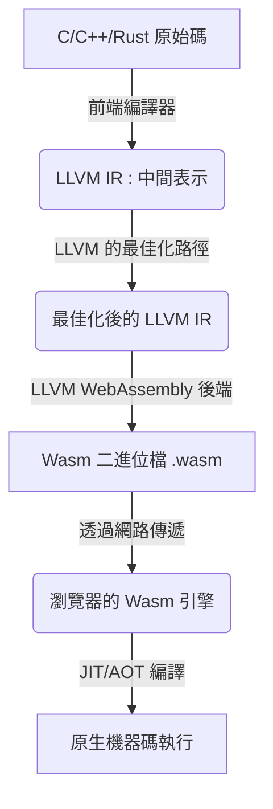
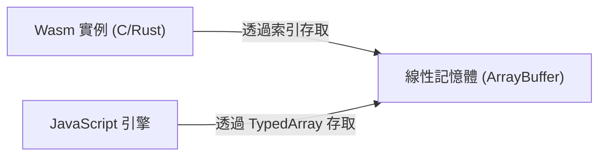
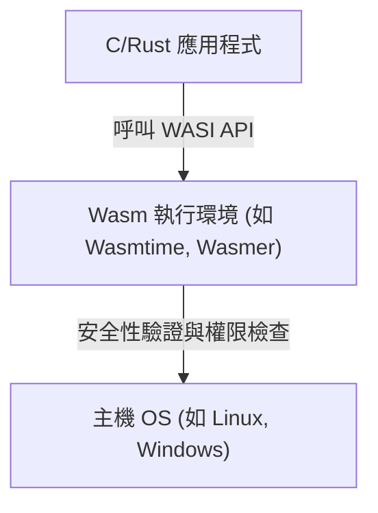

# 前言：WebAssembly (Wasm) 的崛起

網路瀏覽器長期以來一直被 JavaScript 這一單一語言所主導。然而，隨著網頁應用程式變得日益複雜，並要求媲美原生應用程式的效能時，單靠 JavaScript 的極限也逐漸顯現。於是， **WebAssembly (Wasm)** 應運而生。

WebAssembly 是一種能在瀏覽器上以接近原生程式碼的速度執行的新型二進位格式。它由 C、C++、[Rust](https://kenji.blog/zh-tw/p/programming-languages-history-paradigm-evolution/) 等程式語言編譯生成，如今不僅在網頁開發，更在伺服器端、邊緣運算，甚至是物聯網（IoT）裝置等廣泛領域帶來了創新。

本文將從 WebAssembly 的基本概念出發，深入解析 C 與 Rust 如何在瀏覽器內執行的技術原理、與 JavaScript 的協作、效能比較，以及在瀏覽器外世界的應用（WASI），帶您徹底了解 WebAssembly 的現在與未來。

---

# 1. 什麼是 WebAssembly？

## 1.1 誕生背景

在 WebAssembly 誕生之前，也存在過一些嘗試提升 JavaScript 效能的技術。例如 Google 提出的 **Native Client (NaCl)** ，以及 Mozilla 提出的 **asm.js** 。

- **asm.js** : JavaScript 的子集，透過加上型別標註，讓瀏覽器的 JIT 編譯器能更容易地進行最佳化。
- **NaCl** : 在瀏覽器內安全執行原生程式碼的沙盒技術，但未能成為各家瀏覽器供應商的統一標準。

基於這些反省與經驗，主要瀏覽器供應商（Mozilla、Google、Microsoft、Apple）共同合作制定了開放的標準規範，這就是 **WebAssembly** 。

## 1.2 Wasm 的設計哲學

WebAssembly 設定了以下設計目標：

1.  **高速且高效** ：能以接近原生的速度執行，且載入時間短。
2.  **安全** ：在沙盒環境中執行，並遵守主機的安全性原則。
3.  **開放且可除錯** ：在具備二進位格式的同時，也提供人類可讀的文字格式（WAT: WebAssembly Text format）。
4.  **與 Web 整合** ：能與 JavaScript 協同運作，並與現有的 Web API 無縫接軌。

---

# 2. 瀏覽器執行 C/Rust 的運作原理

那麼，具體來說 C 或 Rust 的程式碼是如何在瀏覽器上執行的呢？讓我們逐步探討這個過程。

## 2.1 編譯管線

像 C 或 Rust 這樣的語言，通常會被編譯為相依於作業系統或 CPU 架構的機器碼。但在 WebAssembly 的情況下，會指定「wasm32」等 Wasm 專用的架構作為目標架構。

大多數情況下，會使用 LLVM 這個編譯器基礎架構。



如上圖所示，開發者撰寫的程式碼會經過中間表示（IR）進行最佳化，最終成為副檔名為 `.wasm` 的精簡二進位檔案。

## 2.2 位元組碼與堆疊機器

WebAssembly 採用了 **堆疊機器 ([Stack](https://kenji.blog/zh-tw/p/c-language-pointers-memory-management-stack-heap/) Machine)** 架構。它沒有暫存器，所有的計算都是對堆疊（LIFO 形式的資料結構）進行。

例如，進行簡單的加法 `$ 1 + 2 $` 時，Wasm 的文字表示（WAT）會像下面這樣：

```wasm
(module
  (func $add (param $a i32) (param $b i32) (result i32)
    local.get $a
    local.get $b
    i32.add)
  (export "add" (func $add))
)
```

1.  透過 `local.get $a` 將變數 a 的值推入堆疊。
2.  透過 `local.get $b` 將變數 b 的值推入堆疊。
3.  透過 `i32.add` 從堆疊中取出兩個值相加，並將結果推入堆疊。

這種簡單的結構讓解碼與驗證處理變得非常快速，使瀏覽器能在極短的時間內完成 JIT 編譯。

## 2.3 記憶體模型（線性記憶體）

在 C 或 [Rust](https://kenji.blog/zh-tw/p/programming-languages-history-paradigm-evolution/) 中，頻繁使用指標來操作記憶體。為了實現這一點，WebAssembly 採用了 **線性記憶體 (Linear Memory)** 的概念。

線性記憶體是 WebAssembly 實例可以存取的連續位元組陣列。從 JavaScript 來看，它就是一個 `ArrayBuffer` 或 `SharedArrayBuffer` 。Wasm 內的指標，只不過是這個陣列的索引（整數值）而已。



透過這種機制，可以防止 Wasm 的程式碼直接存取主機 OS 的記憶體，提供了一個強大的沙盒環境。

---

# 3. JavaScript 與 WebAssembly 的整合

WebAssembly 並不是要取代 JavaScript，而是作為它的補充。在大多數情況下，DOM 操作與事件處理會交由 JavaScript 負責，而繁重的計算處理則委派給 WebAssembly。

## 3.1 全域變數與匯入/匯出

WebAssembly 模組可以匯入或匯出函式、記憶體、表格與全域變數，藉此與 JavaScript 互動。

```javascript
// 載入 WebAssembly 模組並實例化
fetch('module.wasm')
  .then(response => response.arrayBuffer())
  .then(bytes => WebAssembly.instantiate(bytes, {
    env: {
      // 讓 JavaScript 的函式匯入到 Wasm 中
      consoleLog: (arg) => console.log("Wasm 說： " + arg)
    }
  }))
  .then(results => {
    // 呼叫從 Wasm 匯出的函式
    const add = results.instance.exports.add;
    console.log("1 + 2 = ", add(1, 2));
  });
```

## 3.2 存取 Web API 與綁定

Wasm 本身並不具備直接存取 DOM 或 Web API 的功能。若要存取，必須透過 JavaScript。
然而，手動撰寫這些程式碼非常耗時。因此，[Rust](https://kenji.blog/zh-tw/p/programming-languages-history-paradigm-evolution/) 生態圈提供了 **wasm-bindgen** 這樣的工具。

```rust
// Rust 程式碼（使用 wasm-bindgen）
use wasm_bindgen::prelude::*;

#[wasm_bindgen]
extern "C" {
    fn alert(s: &str);
}

#[wasm_bindgen]
pub fn greet(name: &str) {
    alert(&format!("Hello, {}!", name));
}
```

編譯這段程式碼時， `wasm-bindgen` 會自動生成 JavaScript 的膠水程式碼（Glue Code），並隱藏字串在記憶體中的傳遞細節。這帶來了彷彿直接從 [Rust](https://kenji.blog/zh-tw/p/programming-languages-history-paradigm-evolution/) 呼叫瀏覽器 API 般的開發體驗。

---

# 4. 效能與速度比較

為什麼 WebAssembly 比 JavaScript 更快？

1.  **解析速度** ：由於 Wasm 是二進位格式，解碼速度遠快於解析 JS 文字原始碼並建立抽象語法樹（AST）的過程。
2.  **JIT 最佳化** ：JS 是動態型別語言，JIT 編譯器必須在執行時進行型別推論，若推論錯誤則需要取消最佳化（Deoptimization）。而 Wasm 是靜態型別，在編譯時已由 LLVM 等進行了強大的最佳化，因此瀏覽器可以直接專注於生成機器碼。
3.  **避免垃圾回收 (GC)** ：以 C 或 Rust 撰寫的 Wasm 會自行管理記憶體，因此不會發生因 JS 引擎的 GC 而導致的意外暫停（※關於 Wasm GC 的規範將在後文提及）。

## 4.1 基準測試：費氏數列

讓我們用簡單的費氏數列計算，來比較 JavaScript 與 Rust (Wasm) 的速度。
在數學上，它可以由以下的遞迴式表示。其時間複雜度為指數級 `$ O(2^n) $` ，會大量消耗 CPU 資源。

$$
F(n) =
\begin{cases}
0 & (n = 0) \\\\
1 & (n = 1) \\\\
F(n-1) + F(n-2) & (n \ge 2)
\end{cases}
$$

### JavaScript 實作
```javascript
function fibJs(n) {
  if (n <= 1) return n;
  return fibJs(n - 1) + fibJs(n - 2);
}
```

### [Rust](https://kenji.blog/zh-tw/p/programming-languages-history-paradigm-evolution/) 實作
```rust
#[no_mangle]
pub fn fib_wasm(n: u32) -> u32 {
    if n <= 1 { return n; }
    fib_wasm(n - 1) + fib_wasm(n - 2)
}
```

在計算 $n=40$ 的情況下，一般來說即便 JavaScript（V8 引擎）憑藉 JIT 最佳化能以相當快的速度執行，由 [Rust](https://kenji.blog/zh-tw/p/programming-languages-history-paradigm-evolution/) 生成的 Wasm 往往還是能快上 **約 1.5 到 2 倍以上** 。特別是在矩陣運算或影像處理等，能充分發揮記憶體連續存取與 SIMD 指令優勢的領域，差距會更加顯著。

---

# 5. 作為開發語言的 Rust 與 C++

WebAssembly 最受歡迎的原始語言是 C/C++ 和 Rust。

## 5.1 C++ 與 Emscripten

歷史上最早用於移植到 Web 的是 C/C++。 **Emscripten** 是一個利用 LLVM 將 C/C++ 程式碼轉換為 Wasm 的工具鏈。
它具備了 POSIX 模擬和 OpenGL (WebGL) 轉換層，能讓現有龐大的 C/C++ 函式庫（例如 SQLite、FFmpeg、OpenCV、遊戲引擎等）在瀏覽器上執行。

## 5.2 Rust 與 WebAssembly

目前在 WebAssembly 領域最受矚目、被視為一等公民語言的是 **Rust** 。
Rust 受到青睞的原因如下：

- **極小的執行時期環境** ：Rust 沒有 GC 或龐大的執行環境，因此生成的 Wasm 二進位檔體積可以壓得非常小。
- **wasm-pack / wasm-bindgen** ：生態系統非常完善，只需幾行指令就能建立 Wasm 專案，並作為 npm 套件發布。
- **記憶體安全性** ：編譯時能保證記憶體安全，即使在瀏覽器端執行複雜的處理，也能降低因 Bug 導致記憶體損毀的風險。

---

# 6. WebAssembly 的進階功能與規格擴展

WebAssembly 在初始發布（MVP）之後依然持續進化，目前瀏覽器中已經實作了許多強大的擴展功能。

## 6.1 SIMD (Single Instruction, Multiple Data)
支援了以單一指令同時處理多筆資料的 SIMD 指令（128 位元 SIMD）。這在影像處理、音訊處理以及加密演算法等方面帶來了戲劇性的效能提升。

## 6.2 執行緒與共用記憶體
透過使用 Web Workers 和 `SharedArrayBuffer` ，多個 Wasm 實例可以共用同一塊記憶體區域，進行多執行緒的平行處理。這使得高度複雜的物理模擬或遊戲引擎能在瀏覽器中流暢運作。

## 6.3 垃圾回收 (Wasm GC)
傳統的 Wasm 主要是為 C 或 [Rust](https://kenji.blog/zh-tw/p/programming-languages-history-paradigm-evolution/) 這類手動管理線性記憶體的語言所設計，但為了讓 [Java](https://kenji.blog/zh-tw/p/programming-languages-history-paradigm-evolution/)、Kotlin、C#、Dart 等需要垃圾回收的語言能有效率地編譯為 Wasm， **Wasm GC** 提案正逐步標準化。這讓 Flutter Web 等應用的效能有了飛躍性的提升。

---

# 7. 瀏覽器外的世界：WASI (WebAssembly System Interface)

WebAssembly 的潛力並不侷限於瀏覽器內。 **「如果能在瀏覽器外也將 Wasm 作為標準格式使用呢？」** 基於這樣的想法而誕生的就是 **WASI (WebAssembly System Interface)** 。

## 7.1 WASI 是什麼？
WASI 是一個標準介面，讓 WebAssembly 程式能安全地存取作業系統資源（如檔案系統、網路、環境變數等）。
它能在維持瀏覽器沙盒模型的同時，只賦予 Wasm 模組所需的權限（基於權能的安全性，Capability-based security）。



## 7.2 [Docker](https://kenji.blog/zh-tw/p/docker-container-namespace-[cgroups](https://kenji.blog/zh-tw/p/docker-container-namespace-cgroups-layers/)-layers/) 容器的替代與共存
Docker 的發明者 Solomon Hykes 曾發表過引發熱議的言論：「如果在 2008 年就存在 Wasm 與 WASI，那我們就沒必要創造 Docker 了。」
Wasm 具備比容器更輕量、啟動更快（僅需幾毫秒），且不依賴特定 OS 或 CPU 架構的強大優勢。
目前，在 [Kubernetes](https://kenji.blog/zh-tw/p/kubernetes-k8s-architecture-pod-service-ingress/) 上直接編排 Wasm 模組來取代 Docker 容器的專案（如 Kwasm 和 Spin 等）正活躍地開發中。

---

# 8. WebAssembly 的未來

## 8.1 元件模型 (Component Model)
目前 WebAssembly 最大的挑戰在於，很難讓以不同語言寫成的 Wasm 模組互相協作（因為字串或複雜資料型別在不同語言中的記憶體表示方式不同）。

為了解決這個問題， **WebAssembly Component Model** 應運而生。
一旦元件模型實現，就能輕易達成「從 Python 寫成的 Wasm 模組中，無縫呼叫 [Rust](https://kenji.blog/zh-tw/p/programming-languages-history-paradigm-evolution/) 寫成的 Wasm 模組」等操作。這蘊含著成為不依賴平台與語言之次世代微服務架構基礎的潛力。

## 8.2 作為外掛程式系統的 Wasm
現在，Figma、EnvoyProxy、Microsoft Flight Simulator 等眾多軟體，都已採用 WebAssembly 作為其專屬的外掛程式系統。因為它能安全且高速地在應用程式本體內執行使用者所建立的第三方應用程式碼。

---

# 總結

WebAssembly 已經大大超越了單純「在瀏覽器中執行的高速技術」的範疇，正逐漸成長為雲端原生（Cloud Native）、邊緣運算以及外掛架構中的共通語言。

將 C、C++、Rust 等系統程式語言開發的強大邏輯，安全且高速地部署到任何平台的世界——這正是 WebAssembly 所開創的 **現在與未來** 。

在未來的網頁開發中，UI 的建構將繼續由 JavaScript/TypeScript 擔綱，而要求效能的核心邏輯或現有原生資產的再利用，則將交由 WebAssembly 負責，這種適才適所的混合架構將成為主流。

強烈建議您透過 Rust 或 Emscripten，親自躍入 WebAssembly 的世界探索一番。
