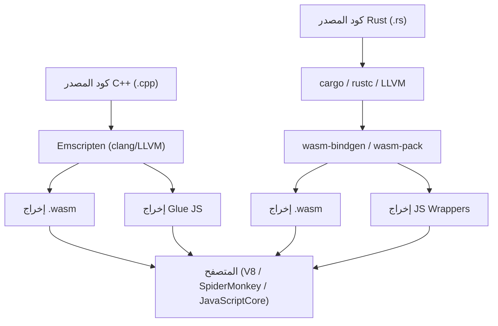
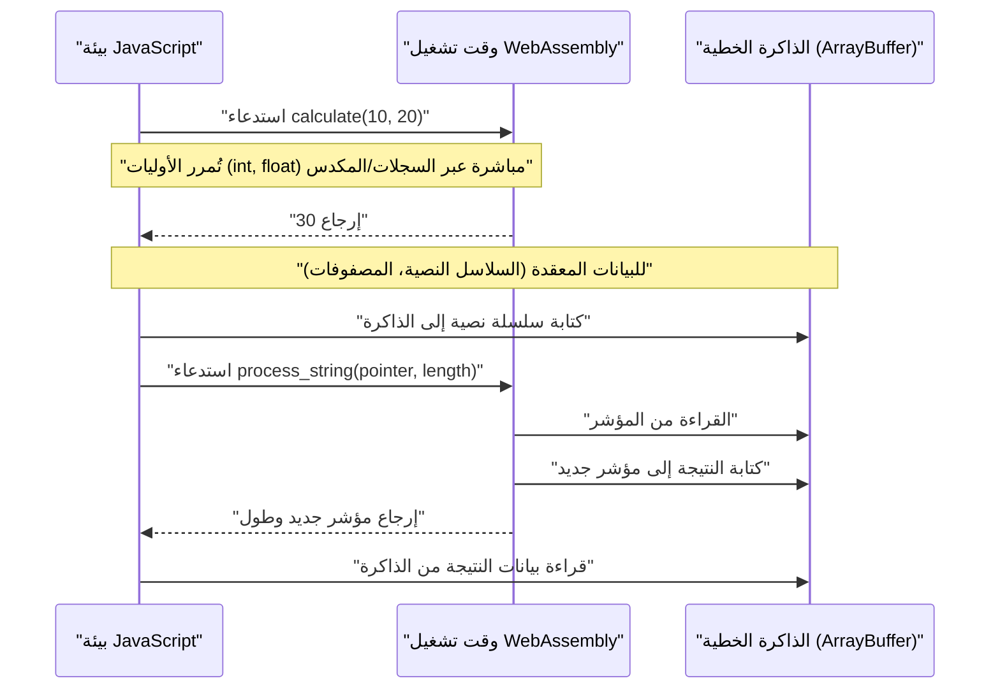
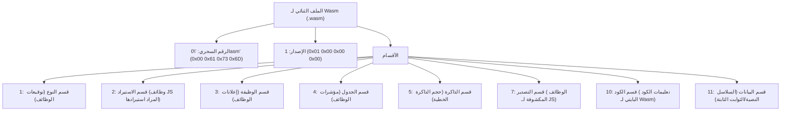

## 1. مقدمة

في تطوير الويب الحديث، أثبتت JavaScript (و TypeScript) مكانتها لفترة طويلة باعتبارها لغة البرمجة الوحيدة التي تعمل في المتصفح. ومع ذلك، في السنوات الأخيرة، زاد الطلب على تنفيذ حسابات أكثر تقدمًا في المتصفح نفسه، مثل معالجة الصور، وترميز الفيديو، والألعاب ثلاثية الأبعاد، والمحاكاة الفيزيائية. وهنا ظهر **WebAssembly (المعروف باسم Wasm)**.

تبدأ هذه المقالة بأساسيات WebAssembly، وتشرح الإجراءات والهياكل الداخلية بالتفصيل لإخراج Wasm من لغتين قويتين لبرمجة النظم: C++ (باستخدام Emscripten) و Rust (باستخدام `wasm-pack`)، وربطها ببيئة JavaScript. بالإضافة إلى ذلك، سنتعمق بشكل شامل في إدارة حدود الذاكرة، وطرق تمرير البيانات المعقدة مثل السلاسل النصية والمصفوفات، والأعباء الإضافية على الأداء، وصولاً إلى التنسيق الثنائي لـ Wasm (`.wasm`).

## 2. نظرة عامة على WebAssembly (Wasm) وبنيته

WebAssembly هو تنسيق أوامر ثنائي لآلة افتراضية تعتمد على المكدس (Stack-based virtual machine). تم تصميمه كـ "هدف تجميع محمول" يمكن التحويل البرمجي إليه من لغات مثل C/C++، Rust، Go، و Zig، ويهدف إلى التنفيذ بسرعة تقترب من السرعة الأصلية على متصفحات الويب.

يوضح الشكل التالي التدفق العام لسلسلة الأدوات (toolchain) بدءًا من توليد WebAssembly من C++ و Rust حتى تنفيذه في المتصفح.



Wasm ليس بديلاً عن JavaScript. تم تصميمه ليعمل جنبًا إلى جنب مع JavaScript، ويستفيد من نقاط قوة كليهما عن طريق تفريغ المهام ذات الحمل الحسابي الثقيل إلى Wasm.

## 3. تحدي رياضي: حساب مجموعة ماندلبروت

في هذه المقالة، سنقوم بالتنفيذ بلغة C++ و Rust باستخدام خوارزمية رسم "مجموعة ماندلبروت (Mandelbrot set)" التي تضع حملاً عاليًا على وحدة المعالجة المركزية (CPU).

يتم تعريف مجموعة ماندلبروت بواسطة صيغة التكرار المعقدة التالية:

$$ z_{n+1} = z_n^2 + c $$

حيث $z$ و $c$ أعداد مركبة، ويبدأ الحساب من $z_0 = 0$. بالنسبة لعدد مركب معين $c$، فإن مجموعة ماندلبروت هي مجموعة من $c$ حيث لا تتباعد القيمة المطلقة لـ $z_n$ عند تكرار الحساب بشكل لا نهائي. بشكل عام، عند الحساب على جهاز كمبيوتر، يعتبر متباعدًا تحت الشروط التالية:

$$ |z_n| > 2 $$

بمعنى آخر، بالنسبة للجزء الحقيقي $x$ والجزء التخيلي $y$، يتم تحديد ما إذا كان يفي بالشرط التالي حتى أقصى عدد من الحلقات (على سبيل المثال $N = 1000$):

$$ x^2 + y^2 > 4 $$

## 4. النهج باستخدام C++ و Emscripten

Emscripten هي سلسلة أدوات مترجم تعتمد على LLVM وهي المعيار الفعلي لتجميع كود C/C++ إلى WebAssembly. إنها توفر وقت تشغيل (runtime) قوي يحاكي مكالمات نظام POSIX باستخدام واجهات برمجة تطبيقات المتصفح (Web API).

### كود تنفيذ C++

يقوم كود C++ التالي بحساب مجموعة ماندلبروت للعرض والارتفاع المحددين، ويخزن النتائج (عدد التكرارات لكل بكسل) في مصفوفة أحادية البعد.

```cpp
#include <emscripten/emscripten.h>
#include <vector>

// تحديد ارتباط C ليتم استدعاؤه من JavaScript
extern "C" {

    // إرجاع مؤشر إلى المخزن المؤقت الذي يخزن نتائج الحساب
    EMSCRIPTEN_KEEPALIVE
    int* compute_mandelbrot(int width, int height, int max_iter) {
        // تأمين المخزن المؤقت كمتغير ثابت (للتبسيط)
        static std::vector<int> buffer;
        buffer.resize(width * height);

        for (int row = 0; row < height; ++row) {
            for (int col = 0; col < width; ++col) {
                double c_re = (col - width / 2.0) * 4.0 / width;
                double c_im = (row - height / 2.0) * 4.0 / width;
                double x = 0, y = 0;
                int iteration = 0;
                
                while (x*x + y*y <= 4 && iteration < max_iter) {
                    double x_new = x*x - y*y + c_re;
                    y = 2*x*y + c_im;
                    x = x_new;
                    iteration++;
                }
                buffer[row * width + col] = iteration;
            }
        }
        return buffer.data();
    }

    // وظيفة تحرير الذاكرة (عند الضرورة)
    EMSCRIPTEN_KEEPALIVE
    void free_buffer() {
        // ...
    }
}
```

### الترجمة والاستدعاء من JavaScript

نستخدم Emscripten لترجمة هذا الكود.

```bash
emcc mandelbrot.cpp -O3 -s WASM=1 -s EXPORTED_FUNCTIONS="['_compute_mandelbrot', '_malloc', '_free']" -s EXPORTED_RUNTIME_METHODS="['ccall', 'cwrap']" -o mandelbrot.js
```

على جانب JavaScript، نقوم بتحميل كود الغراء (`mandelbrot.js`) الذي تم إنشاؤه بواسطة Emscripten، واستدعائه باستخدام WebAssembly API على النحو التالي:

```javascript
Module.onRuntimeInitialized = () => {
    const width = 800;
    const height = 600;
    const maxIter = 1000;

    // استدعاء دالة C++ والحصول على المؤشر
    const resultPtr = Module.ccall(
        'compute_mandelbrot', // اسم دالة C
        'number',             // نوع القيمة المرجعة (المؤشر هو رقم)
        ['number', 'number', 'number'], // أنواع المتغيرات
        [width, height, maxIter]
    );

    // قراءة بيانات المصفوفة مباشرة من الذاكرة الخطية (Module.HEAP32)
    const numElements = width * height;
    const resultView = new Int32Array(Module.HEAP32.buffer, resultPtr, numElements);

    console.log("اكتمل الحساب. بيانات البكسل الأول: " + resultView[0]);
};
```

## 5. النهج باستخدام Rust و `wasm-pack`

توفر Rust دعمًا من الدرجة الأولى لـ WebAssembly، وباستخدام أدوات `wasm-bindgen` و `wasm-pack`، يمكن تحقيق تكامل متقدم بين JavaScript و Rust. في حين أن Emscripten يتبع نهج "إحضار وقت تشغيل C/C++ الضخم إلى المتصفح"، فإن `wasm-pack` في Rust يتبع نهج "إنشاء الروابط الضرورية فقط (كود الغراء JS)".

### كود تنفيذ Rust

قم بإنشاء مشروع Cargo وحدد `cdylib` و `wasm-bindgen` في `Cargo.toml`.

```toml
[lib]
crate-type = ["cdylib"]

[dependencies]
wasm-bindgen = "0.2"
```

بعد ذلك، اكتب التنفيذ في `src/lib.rs`.

```rust
use wasm_bindgen::prelude::*;

#[wasm_bindgen]
pub fn compute_mandelbrot_rust(width: usize, height: usize, max_iter: u32) -> Vec<i32> {
    let mut buffer = vec![0; width * height];

    for row in 0..height {
        for col in 0..width {
            let c_re = (col as f64 - width as f64 / 2.0) * 4.0 / width as f64;
            let c_im = (row as f64 - height as f64 / 2.0) * 4.0 / width as f64;
            
            let mut x = 0.0;
            let mut y = 0.0;
            let mut iteration = 0;
            
            while x*x + y*y <= 4.0 && iteration < max_iter {
                let x_new = x*x - y*y + c_re;
                y = 2.0 * x * y + c_im;
                x = x_new;
                iteration += 1;
            }
            buffer[row * width + col] = iteration as i32;
        }
    }
    
    buffer
}
```

### الترجمة والاستدعاء من JavaScript

قم بالبناء باستخدام أمر `wasm-pack`.

```bash
wasm-pack build --target web
```

استورد الحزمة التي تم إنشاؤها من JavaScript. بفضل `wasm-bindgen`، يتم تحويل `Vec<i32>` في Rust تلقائيًا إلى `Int32Array` في JavaScript (إخفاء عمليات المؤشر).

```javascript
import init, { compute_mandelbrot_rust } from './pkg/mandelbrot_wasm.js';

async function run() {
    await init(); // تهيئة وحدة WebAssembly

    const width = 800;
    const height = 600;
    const maxIter = 1000;

    // يمكن استلام النتيجة مباشرة كمصفوفة JavaScript
    const resultView = compute_mandelbrot_rust(width, height, maxIter);
    
    console.log("اكتمل الحساب. بيانات البكسل الأول: " + resultView[0]);
}
run();
```

## 6. الغوص العميق: حدود الذاكرة وتمرير أنواع البيانات

أحد أهم المفاهيم في WebAssembly هو "الذاكرة الخطية (Linear Memory)". لا يمكن لكود Wasm الوصول المباشر إلى مساحة ذاكرة المضيف (المتصفح)، وبدلاً من ذلك يتم تخصيص `ArrayBuffer` معزول وضخم. هذه هي الذاكرة الخطية.



### كيفية تمرير السلاسل النصية والمصفوفات

يمكن تمرير الأعداد الصحيحة وأرقام الفاصلة العائمة (`i32`, `i64`, `f32`, `f64`) مباشرة كقيم إلى وظائف Wasm. ومع ذلك، لا يمكن تمرير الأنواع المعقدة مثل السلاسل النصية، المصفوفات، والهياكل (structs) مباشرة كتوقيعات (signatures) لوظيفة Wasm.

**في حالة Emscripten**:
1. يستدعي جانب JS `Module._malloc` لتخصيص مساحة ذاكرة خطية في جانب Wasm.
2. يكتب JS البيانات في عنوان الذاكرة المخصص (المؤشر) باستخدام أدوات مثل `Module.HEAPU8.set()`.
3. يُمرر المؤشر إلى وظيفة C++.
4. بعد الحساب، يقرأ JS النتيجة من المؤشر، وأخيرًا يستدعي `Module._free`.

**في حالة wasm-bindgen (Rust)**:
يتم إخفاء سير عمل إدارة الذاكرة المعقد المذكور أعلاه بالكامل داخل كود الغراء (غلاف JS) الذي يتم إنشاؤه تلقائيًا. عندما تمرر مجرد `String` أو `Array` من JS إلى دالة Rust، يتم تلقائيًا في الخلفية تأمين المخزن المؤقت (ما يعادل `malloc`)، النسخ، تمرير المؤشر، وتحرير الذاكرة.

## 7. الأعباء الإضافية على الأداء والتحسين

يمكن تنفيذ WebAssembly بسرعة تقترب من السرعة الأصلية، ولكن يوجد عبء إضافي (overhead) في "الاتصال عبر الحدود بين JavaScript و WebAssembly (Interop)".

* **عبء الاستدعاء**: تكلفة التبديل لمحرك JavaScript لاستدعاء وظيفة Wasm. على الرغم من أنه تم تحسينه بشكل كبير حاليًا، إلا أنه يجب تجنب تصميم يستدعي وظيفة خفيفة جدًا عشرات الآلاف من المرات في كل إطار.
* **تكلفة نسخ الذاكرة**: عند تمرير السلاسل النصية أو المصفوفات إلى Wasm، يحدث نسخ للبيانات من الذاكرة المُدارة بواسطة جمع القمامة (Garbage Collection) في JS إلى الذاكرة الخطية لـ Wasm (ArrayBuffer). عند تمرير كميات كبيرة من البيانات، يتطلب الأمر تصميمًا "خاليًا من النسخ (zero-copy)" حيث يتم بناء البيانات في ذاكرة Wasm منذ البداية، ويصل إليها جانب JS من خلال عرض TypedArray (مثل `Uint8Array`).

على سبيل المثال، في محركات الألعاب ومحركات الفيزياء، من الشائع الاحتفاظ بكل الحالة (state) داخل الذاكرة الخطية لـ Wasm، بينما تكون JavaScript مسؤولة فقط عن مُشغل "التحديث" لكل إطار ورسم الشاشة (استدعاء WebGL/WebGPU API).

## 8. تشريح التنسيق الثنائي لـ WebAssembly (.wasm)

دعونا الآن نلقي نظرة على البنية الداخلية لملف `.wasm` الذي ينتجه المترجم. يتكون الملف الثنائي لـ Wasm من مجموعة من الكتل المنطقية تسمى "أقسام (Sections)" مع التركيز على قابلية التوسعة وسرعة التحليل.



يبدأ الرقم السحري للملف دائمًا بـ `0x00 0x61 0x73 0x6D` (`\0asm`). كل قسم يليه له معرّف (ID) خاص به.

* **قسم النوع (Type Section)**: يُعرف جميع توقيعات الوظائف المستخدمة (أنواع الوسائط والقيم المرجعة).
* **قسم الاستيراد (Import Section)**: قائمة بالوظائف والذاكرة المقدمة لـ Wasm من بيئة JavaScript. على سبيل المثال، إذا تم استدعاء `console.log` من C++، فسيتم الإعلان عنه هنا.
* **قسم الكود (Code Section)**: يخزن تعليمات الكود البايتي الفعلية (مثل `i32.add`، `call`، `loop`). نظرًا لأنه آلة تعتمد على المكدس، فإنه يضع المعاملات على المكدس ويستدعي تعليمات العملية.
* **قسم البيانات (Data Section)**: يتم تحميل القيم الحرفية للسلاسل الثابتة أو بيانات التهيئة المحددة في كود C++ أو Rust إلى الذاكرة الخطية من هذا القسم.

من خلال البث والترجمة (Streaming Compilation) (الترجمة إلى لغة الآلة بالتوازي أثناء التنزيل) لهذه الأقسام، تحقق محركات Wasm في المتصفح سرعة تشغيل أسرع بشكل كبير.

## 9. C++ مقابل Rust: أيهما يجب أن تختار؟

عند إنشاء WebAssembly، يعتمد الاختيار بين C++ و Rust بشكل كبير على متطلبات المشروع والأصول الحالية.

**الحالات التي يجب فيها اختيار C++ / Emscripten**:
* عندما تريد ترحيل (porting) مكتبات C/C++ الحالية (مثل FFmpeg، OpenCV، SQLite) إلى المتصفح.
* مشاريع ترحيل الألعاب التي تريد فيها استخدام القدرة على تحويل واجهات برمجة تطبيقات الرسومات مثل OpenGL إلى WebGL (طبقة محاكاة GL في Emscripten) كما هي.
* عندما تكون ميزات نظام التشغيل الافتراضية ضرورية، مثل محاكاة نظام الملفات (MEMFS).

**الحالات التي يجب فيها اختيار Rust / wasm-pack**:
* عند تطوير وحدة نمطية جديدة عالية الأداء من الصفر كجزء من تطبيق ويب.
* عندما تريد تكاملًا قويًا وآمنًا من حيث النوع مع نظام JavaScript البيئي (وحدات NPM أو TypeScript).
* عندما تحتاج إلى حجم ثنائي صغير نسبيًا وإدارة ذاكرة آمنة (نموذج الملكية في Rust).
* عندما ترغب في الاستفادة من سلسلة الأدوات الحديثة مثل إدارة التبعيات بواسطة Cargo.

## 10. الخلاصة

يعد WebAssembly تقنية مبتكرة لتنفيذ العمليات الثقيلة حسابيًا داخل المتصفح. كلا النهجين - نهج الترحيل الكامل باستخدام C++ و Emscripten، والنهج المعياري المرتبط بإحكام بـ JavaScript باستخدام Rust و wasm-bindgen - لهما نقاط قوة خاصة بهما.

في الحسابات مثل مجموعة ماندلبروت، يمكن أن يوفر Wasm زيادة في السرعة تتراوح من عدة أضعاف إلى عشرات الأضعاف مقارنة بـ JavaScript وحدها. ومع ذلك، لا يمكن استخراج الأداء الحقيقي إلا إذا تم فهم آلية حدود الذاكرة بين Wasm و JS بشكل صحيح، وتم تصميم النظام لتجنب النسخ غير الضروري للذاكرة.

نأمل أن تعمق هذه المقالة فهمك للتدفق الشامل لإخراج Wasm من C++ و Rust وتشغيله في المتصفح، والبنية الكامنة وراءه. في تطوير تطبيقات الويب من الجيل التالي، سيكون WebAssembly بلا شك سلاحًا قويًا.
