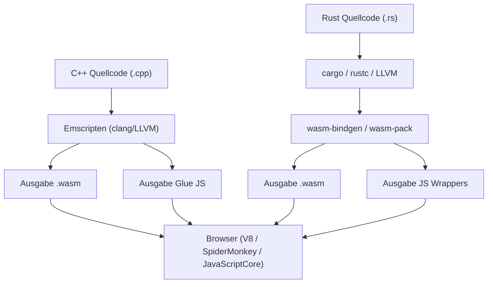
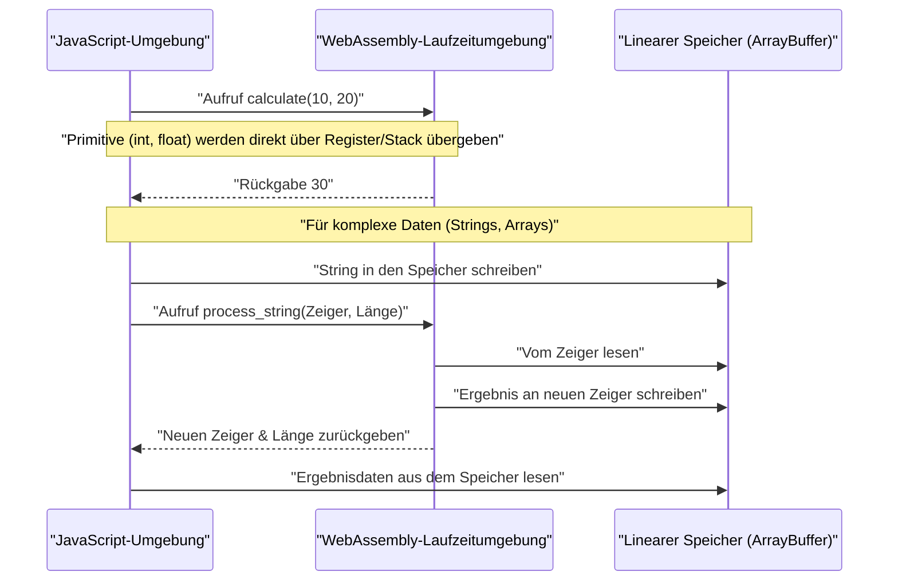
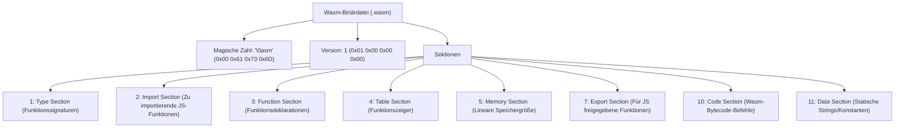

## 1. Einführung

In der modernen Webentwicklung hat sich JavaScript (und TypeScript) lange als die einzige Programmiersprache etabliert, die im Browser läuft. In den letzten Jahren ist jedoch die Nachfrage nach der Ausführung von komplexeren Berechnungen direkt im Browser gestiegen, wie zum Beispiel Bildverarbeitung, Videokodierung, 3D-Spiele und physikalische Simulationen. Hier kommt **WebAssembly (kurz Wasm)** ins Spiel.

In diesem Artikel beginnen wir mit den Grundlagen von WebAssembly und erläutern die detaillierten Schritte sowie die interne Struktur, um Wasm aus zwei leistungsstarken Systemprogrammiersprachen – C++ (mit Emscripten) und Rust (mit `wasm-pack`) – zu kompilieren und in eine JavaScript-Umgebung zu integrieren. Darüber hinaus werden wir Themen wie die Verwaltung von Speichergrenzen, die Übergabe komplexer Daten wie Strings und Arrays, den Performance-Overhead sowie das Wasm-Binärformat (`.wasm`) im Detail betrachten.

## 2. Überblick und Architektur von WebAssembly (Wasm)

WebAssembly ist ein binäres Befehlsformat für eine stackbasierte virtuelle Maschine. Es wurde als "portables Kompilierungsziel" entworfen, das aus Sprachen wie C/C++, Rust, Go, Zig und anderen kompiliert werden kann, und zielt darauf ab, im Webbrowser mit nahezu nativer Geschwindigkeit ausgeführt zu werden.

Das folgende Diagramm veranschaulicht den groben Ablauf der Toolchain, vom Generieren von WebAssembly aus C++ und Rust bis hin zur Ausführung im Browser.



Wasm soll JavaScript nicht ersetzen. Es ist so konzipiert, dass es zusammen mit JavaScript arbeitet, sodass rechenintensive Aufgaben an Wasm ausgelagert werden können, wodurch die Stärken beider Technologien genutzt werden.

## 3. Die mathematische Herausforderung: Berechnung der Mandelbrot-Menge

In diesem Artikel verwenden wir den rechenintensiven Zeichenalgorithmus der "Mandelbrot-Menge", um ihn in C++ und Rust zu implementieren.

Die Mandelbrot-Menge wird durch die folgende komplexe Rekursionsformel definiert:

$$ z_{n+1} = z_n^2 + c $$

Hierbei sind $z$ und $c$ komplexe Zahlen, und die Berechnung beginnt mit $z_0 = 0$. Die Mandelbrot-Menge ist die Menge aller komplexen Zahlen $c$, für die der Betrag von $z_n$ nach unendlich vielen Iterationen nicht divergiert. Im Allgemeinen wird bei der Berechnung auf einem Computer angenommen, dass sie unter folgender Bedingung divergiert ist:

$$ |z_n| > 2 $$

Das heißt, für den Realteil $x$ und den Imaginärteil $y$ wird bis zu einer maximalen Anzahl von Iterationen (z.B. $N = 1000$) geprüft, ob die folgende Bedingung erfüllt ist:

$$ x^2 + y^2 > 4 $$

## 4. Der Ansatz mit C++ und Emscripten

Emscripten ist eine LLVM-basierte Compiler-Toolchain und der De-facto-Standard zum Kompilieren von C/C++-Code nach WebAssembly. Es bietet eine leistungsstarke Laufzeitumgebung, die POSIX-Systemaufrufe durch Browser-APIs (Web-APIs) emuliert.

### C++ Implementierungscode

Der folgende C++-Code berechnet die Mandelbrot-Menge für eine angegebene Breite und Höhe und speichert die Ergebnisse (die Iterationsanzahl für jedes Pixel) in einem eindimensionalen Array.

```cpp
#include <emscripten/emscripten.h>
#include <vector>

// C-Linkage angeben, damit es von JavaScript aus aufgerufen werden kann
extern "C" {

    // Gibt einen Zeiger auf den Puffer zurück, in dem die Berechnungsergebnisse gespeichert sind
    EMSCRIPTEN_KEEPALIVE
    int* compute_mandelbrot(int width, int height, int max_iter) {
        // Puffer als statische Variable reservieren (zur Vereinfachung)
        static std::vector<int> buffer;
        buffer.resize(width * height);

        for (int row = 0; row < height; ++row) {
            for (int col = 0; col < width; ++col) {
                double c_re = (col - width / 2.0) * 4.0 / width;
                double c_im = (row - height / 2.0) * 4.0 / width;
                double x = 0, y = 0;
                int iteration = 0;
                
                while (x*x + y*y <= 4 && iteration < max_iter) {
                    double x_new = x*x - y*y + c_re;
                    y = 2*x*y + c_im;
                    x = x_new;
                    iteration++;
                }
                buffer[row * width + col] = iteration;
            }
        }
        return buffer.data();
    }

    // Funktion zur Speicherfreigabe (falls erforderlich)
    EMSCRIPTEN_KEEPALIVE
    void free_buffer() {
        // ...
    }
}
```

### Kompilierung und Aufruf aus JavaScript

Kompilieren Sie diesen Code mit Emscripten.

```bash
emcc mandelbrot.cpp -O3 -s WASM=1 -s EXPORTED_FUNCTIONS="['_compute_mandelbrot', '_malloc', '_free']" -s EXPORTED_RUNTIME_METHODS="['ccall', 'cwrap']" -o mandelbrot.js
```

Auf der JavaScript-Seite laden wir den von Emscripten generierten Glue-Code (`mandelbrot.js`) und rufen ihn mithilfe der WebAssembly-API wie folgt auf:

```javascript
Module.onRuntimeInitialized = () => {
    const width = 800;
    const height = 600;
    const maxIter = 1000;

    // C++-Funktion aufrufen und Zeiger abrufen
    const resultPtr = Module.ccall(
        'compute_mandelbrot', // Name der C-Funktion
        'number',             // Rückgabetyp (Zeiger ist eine number)
        ['number', 'number', 'number'], // Argumenttypen
        [width, height, maxIter]
    );

    // Array-Daten direkt aus dem linearen Speicher (Module.HEAP32) lesen
    const numElements = width * height;
    const resultView = new Int32Array(Module.HEAP32.buffer, resultPtr, numElements);

    console.log("Berechnung abgeschlossen. Erster Pixelwert: " + resultView[0]);
};
```

## 5. Der Ansatz mit Rust und `wasm-pack`

Rust bietet erstklassige Unterstützung für WebAssembly. Mit den Tools `wasm-bindgen` und `wasm-pack` ist eine fortschrittliche Interaktion zwischen JavaScript und Rust möglich. Während der Ansatz von Emscripten darin besteht, "eine riesige C/C++-Laufzeitumgebung in den Browser zu bringen", verfolgt `wasm-pack` von Rust den Ansatz, "nur das absolut notwendige Binding (JS Glue-Code) zu generieren".

### Rust Implementierungscode

Erstellen Sie ein Cargo-Projekt und geben Sie `cdylib` und `wasm-bindgen` in der Datei `Cargo.toml` an.

```toml
[lib]
crate-type = ["cdylib"]

[dependencies]
wasm-bindgen = "0.2"
```

Schreiben Sie als Nächstes die Implementierung in `src/lib.rs`.

```rust
use wasm_bindgen::prelude::*;

#[wasm_bindgen]
pub fn compute_mandelbrot_rust(width: usize, height: usize, max_iter: u32) -> Vec<i32> {
    let mut buffer = vec![0; width * height];

    for row in 0..height {
        for col in 0..width {
            let c_re = (col as f64 - width as f64 / 2.0) * 4.0 / width as f64;
            let c_im = (row as f64 - height as f64 / 2.0) * 4.0 / width as f64;
            
            let mut x = 0.0;
            let mut y = 0.0;
            let mut iteration = 0;
            
            while x*x + y*y <= 4.0 && iteration < max_iter {
                let x_new = x*x - y*y + c_re;
                y = 2.0 * x * y + c_im;
                x = x_new;
                iteration += 1;
            }
            buffer[row * width + col] = iteration as i32;
        }
    }
    
    buffer
}
```

### Kompilierung und Aufruf aus JavaScript

Erstellen Sie den Build mit dem Befehl `wasm-pack`.

```bash
wasm-pack build --target web
```

Importieren Sie das generierte Paket aus JavaScript. Dank `wasm-bindgen` wird der Rust-Typ `Vec<i32>` automatisch in ein JavaScript `Int32Array` konvertiert (die Zeigeroperationen werden verborgen).

```javascript
import init, { compute_mandelbrot_rust } from './pkg/mandelbrot_wasm.js';

async function run() {
    await init(); // Initialisierung des WebAssembly-Moduls

    const width = 800;
    const height = 600;
    const maxIter = 1000;

    // Das Ergebnis kann direkt als JavaScript-Array empfangen werden
    const resultView = compute_mandelbrot_rust(width, height, maxIter);
    
    console.log("Berechnung abgeschlossen. Erster Pixelwert: " + resultView[0]);
}
run();
```

## 6. Tiefer Einblick: Speichergrenzen und Übergabe von Datentypen

Eines der wichtigsten Konzepte in WebAssembly ist der "lineare Speicher (Linear Memory)". Wasm-Code kann nicht direkt auf den Speicherbereich des Hosts (Browsers) zugreifen. Stattdessen wird ihm ein einziger, isolierter und riesiger `ArrayBuffer` zugewiesen. Dies ist der lineare Speicher.



### Wie man Strings und Arrays übergibt

Ganzzahlen und Gleitkommazahlen (`i32`, `i64`, `f32`, `f64`) können direkt als Werte an Wasm-Funktionen übergeben werden. Komplexe Typen wie Strings, Arrays oder Strukturen können jedoch nicht direkt als Wasm-Funktionssignatur übergeben werden.

**Im Fall von Emscripten**:
1. Auf der JS-Seite `Module._malloc` aufrufen, um Speicher im linearen Speicherbereich von Wasm zu reservieren.
2. Von JS aus Daten mit Funktionen wie `Module.HEAPU8.set()` an die reservierte Speicheradresse (den Zeiger) schreiben.
3. Den Zeiger an die C++-Funktion übergeben.
4. Nach der Berechnung das Ergebnis vom Zeiger auf der JS-Seite lesen und schließlich `Module._free` aufrufen.

**Im Fall von wasm-bindgen (Rust)**:
Der obige komplizierte Speicherverwaltungsablauf ist vollständig im automatisch generierten Glue-Code (JS Wrapper) verborgen. Wenn Sie einfach einen `String` oder ein `Array` von der JS-Seite an eine Rust-Funktion übergeben, werden im Hintergrund automatisch Pufferzuweisung (ähnlich wie `malloc`), Kopieren, Zeigerübergabe und Speicherfreigabe durchgeführt.

## 7. Performance-Overhead und Optimierung

Obwohl WebAssembly mit nahezu nativer Geschwindigkeit ausgeführt werden kann, gibt es einen Overhead bei der Kommunikation über die Grenze zwischen JavaScript und WebAssembly (Interop).

* **Aufruf-Overhead**: Dies sind die Umschaltkosten, die entstehen, wenn die JavaScript-Engine eine Wasm-Funktion aufruft. Heutzutage ist dies zwar stark optimiert, aber Designs, bei denen eine sehr leichte Funktion zehntausende Male pro Frame aufgerufen wird, sollten vermieden werden.
* **Speicherkopierkosten**: Bei der Übergabe von Strings oder Arrays an Wasm werden Daten aus dem von der JS-Garbage-Collection verwalteten Speicher in den linearen Speicher (ArrayBuffer) von Wasm kopiert. Bei der Übergabe großer Datenmengen ist ein "Zero-Copy"-Design erforderlich, bei dem die Daten von Anfang an im Wasm-Speicher aufgebaut werden und von der JS-Seite über eine TypedArray-Ansicht (wie z. B. `Uint8Array`) auf sie zugegriffen wird.

Zum Beispiel ist es in Spiel- oder Physik-Engines üblich, alle Zustände im linearen Wasm-Speicher zu halten. JavaScript ist dann nur noch für den Trigger ("Aktualisieren") pro Frame und das Rendern des Bildschirms (Aufrufe der WebGL/WebGPU-API) zuständig.

## 8. Anatomie des WebAssembly-Binärformats (.wasm)

Schauen wir uns nun die interne Struktur der vom Compiler ausgegebenen `.wasm`-Datei an. Das Wasm-Binärformat besteht aus einer Sammlung von logischen Blöcken, die "Sektionen" genannt werden. Dies dient der Erweiterbarkeit und der Parse-Geschwindigkeit.



Die magische Zahl der Datei beginnt immer mit `0x00 0x61 0x73 0x6D` (`\0asm`). Jede folgende Sektion hat eine entsprechende ID.

* **Type Section**: Definiert alle verwendeten Funktionssignaturen (Typen der Argumente und Rückgabewerte).
* **Import Section**: Eine Liste von Funktionen und Speicherbereichen, die Wasm von der JavaScript-Umgebung zur Verfügung gestellt werden. Wenn Sie beispielsweise `console.log` in C++ aufrufen möchten, wird dies hier deklariert.
* **Code Section**: Hier sind die eigentlichen Bytecode-Befehle (wie `i32.add`, `call`, `loop` etc.) gespeichert. Da es sich um eine Stack-Maschine handelt, werden Operanden auf den Stack gelegt, bevor ein Rechenbefehl aufgerufen wird.
* **Data Section**: Statische String-Literale oder Initialisierungsdaten, die im C++- oder Rust-Code definiert sind, werden aus dieser Sektion in den linearen Speicher geladen.

Wasm-Engines im Browser beschleunigen die Startzeit dramatisch, indem sie diese Sektionen per "Streaming-Kompilierung" verarbeiten (während des Downloads werden sie parallel in Maschinencode übersetzt).

## 9. C++ vs. Rust: Welches sollte man wählen?

Die Entscheidung, ob Sie C++ oder Rust zur Generierung von WebAssembly verwenden, hängt stark von den Projektanforderungen und den vorhandenen Ressourcen ab.

**Wann man C++ / Emscripten wählen sollte**:
* Wenn Sie bestehende C/C++-Bibliotheken (z. B. FFmpeg, OpenCV, SQLite) in den Browser portieren möchten.
* Bei Spieleportierungsprojekten, die die Emulationsschicht von Emscripten (die Grafik-APIs wie OpenGL in WebGL übersetzt) direkt nutzen möchten.
* Wenn virtualisierte OS-Funktionen erforderlich sind, wie z. B. die Dateisystememulation (MEMFS).

**Wann man Rust / wasm-pack wählen sollte**:
* Wenn Sie ein völlig neues, hochperformantes Modul als Teil einer Webanwendung von Grund auf entwickeln.
* Wenn Sie eine starke und typsichere Integration mit dem JavaScript-Ökosystem (NPM-Module und TypeScript) wünschen.
* Wenn Sie eine vergleichsweise kleine Binärgröße und ein sicheres Speichermanagement (Rusts Ownership-Modell) benötigen.
* Wenn Sie von einer modernen Toolchain, wie z. B. dem Abhängigkeitsmanagement mit Cargo, profitieren möchten.

## 10. Zusammenfassung

WebAssembly ist eine innovative Technologie, um rechenintensive Prozesse im Browser auszuführen. Sowohl der Full-Stack-Portierungsansatz mit C++ und Emscripten als auch der modulare, eng mit JavaScript gekoppelte Ansatz mit Rust und wasm-bindgen haben ihre jeweiligen Stärken.

Bei Berechnungen wie der der Mandelbrot-Menge kann Wasm im Vergleich zu reinem JavaScript Geschwindigkeitsverbesserungen um ein Vielfaches oder sogar ein Vielfaches von Zehn erwarten lassen. Um jedoch die volle Performance abzurufen, ist es unerlässlich, die Mechanismen der Speichergrenzen zwischen Wasm und JS richtig zu verstehen und ein Design zu entwerfen, das unnötige Speicherkopien vermeidet.

Wir hoffen, dass dieser Artikel Ihnen ein tieferes Verständnis für den gesamten Ablauf der Wasm-Generierung aus C++ und Rust bis hin zur Ausführung im Browser sowie der zugrunde liegenden Architektur vermittelt hat. Für die Entwicklung von Webanwendungen der nächsten Generation wird WebAssembly zweifellos eine starke Waffe sein.
