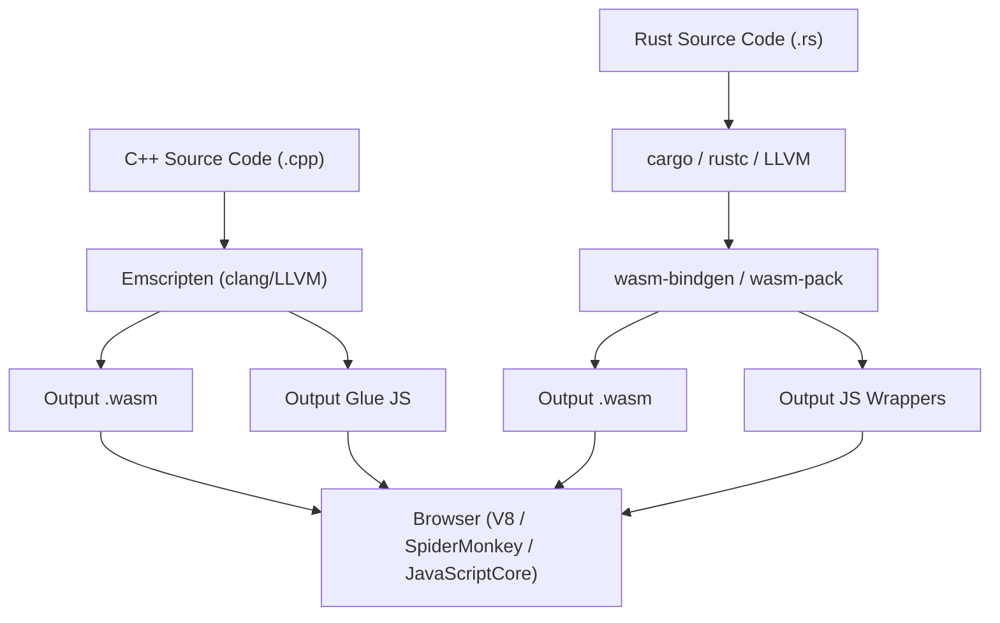
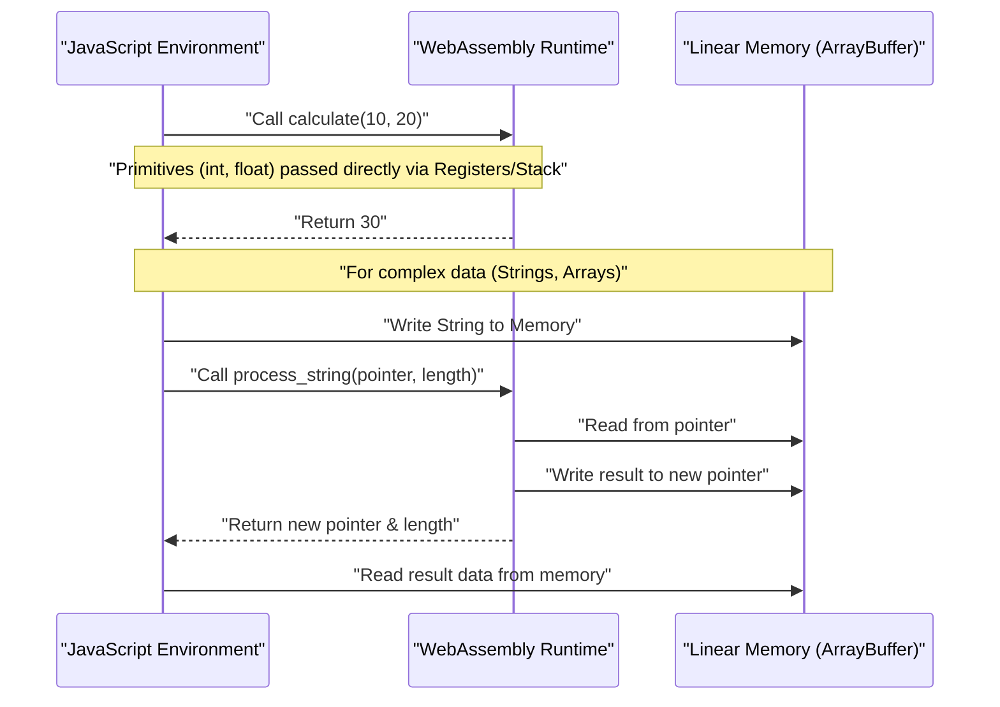
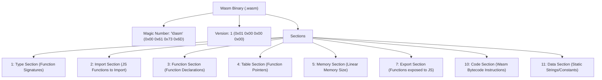

## 1. Introduction

In modern web development, JavaScript (and TypeScript) has long established its position as the sole programming language running on the browser. However, in recent years, there has been an increasing demand to execute more advanced computations directly in the browser, such as image processing, video encoding, 3D games, and physical simulations. This is where **WebAssembly (commonly known as Wasm)** comes into play.

In this article, starting from the basics of WebAssembly, we will explain the detailed steps and internal structures for outputting Wasm from two powerful system programming languages, C++ (using Emscripten) and Rust (using `wasm-pack`), and integrating them with the JavaScript environment. Furthermore, we will delve deeply into managing memory boundaries, passing complex data such as strings and arrays, performance overheads, and the Wasm binary format (`.wasm`).

## 2. Overview and Architecture of WebAssembly (Wasm)

WebAssembly is a binary instruction format for a stack-based virtual machine. It is designed as a "portable compilation target" that can be compiled from languages like C/C++, Rust, Go, and Zig, with the goal of running at near-native speed on web browsers.

The following diagram illustrates the general toolchain flow from generating WebAssembly from C++ and Rust to executing it in the browser.



Wasm is not meant to replace JavaScript. It is designed to work alongside JavaScript, taking advantage of each other's strengths by offloading computationally intensive tasks to Wasm.

## 3. Mathematical Challenge: Calculating the Mandelbrot Set

In this article, we will implement the drawing algorithm of the "Mandelbrot set", which places a heavy load on the CPU, using C++ and Rust.

The Mandelbrot set is defined by the following complex recurrence relation:

$$ z_{n+1} = z_n^2 + c $$

Here, $z$ and $c$ are complex numbers, and the calculation starts from $z_0 = 0$. For a given complex number $c$, the set of $c$ for which the absolute value of $z_n$ does not diverge when the calculation is repeated infinitely is the Mandelbrot set. Generally, when calculating on a computer, it is considered to have diverged under the following condition:

$$ |z_n| > 2 $$

In other words, for the real part $x$ and the imaginary part $y$, it is determined whether the following condition is met up to the maximum number of loop iterations (e.g., $N = 1000$):

$$ x^2 + y^2 > 4 $$

## 4. Approach with C++ and Emscripten

Emscripten is an LLVM-based compiler toolchain and the de facto standard for compiling C/C++ code into WebAssembly. It provides a powerful runtime that emulates POSIX system calls with browser APIs (Web APIs).

### C++ Implementation Code

The following C++ code calculates the Mandelbrot set for a specified width and height, and stores the result (the number of iterations for each pixel) in a one-dimensional array.

```cpp
#include <emscripten/emscripten.h>
#include <vector>

// Specify C linkage so it can be called from JavaScript
extern "C" {

    // Returns a pointer to the buffer storing the calculation results
    EMSCRIPTEN_KEEPALIVE
    int* compute_mandelbrot(int width, int height, int max_iter) {
        // Allocate buffer as a static variable (for simplicity)
        static std::vector<int> buffer;
        buffer.resize(width * height);

        for (int row = 0; row < height; ++row) {
            for (int col = 0; col < width; ++col) {
                double c_re = (col - width / 2.0) * 4.0 / width;
                double c_im = (row - height / 2.0) * 4.0 / width;
                double x = 0, y = 0;
                int iteration = 0;
                
                while (x*x + y*y <= 4 && iteration < max_iter) {
                    double x_new = x*x - y*y + c_re;
                    y = 2*x*y + c_im;
                    x = x_new;
                    iteration++;
                }
                buffer[row * width + col] = iteration;
            }
        }
        return buffer.data();
    }

    // Memory deallocation function (if needed)
    EMSCRIPTEN_KEEPALIVE
    void free_buffer() {
        // ...
    }
}
```

### Compilation and Calling from JavaScript

Compile this code using Emscripten.

```bash
emcc mandelbrot.cpp -O3 -s WASM=1 -s EXPORTED_FUNCTIONS="['_compute_mandelbrot', '_malloc', '_free']" -s EXPORTED_RUNTIME_METHODS="['ccall', 'cwrap']" -o mandelbrot.js
```

On the JavaScript side, load the glue code (`mandelbrot.js`) generated by Emscripten, and call it using the WebAssembly API as follows.

```javascript
Module.onRuntimeInitialized = () => {
    const width = 800;
    const height = 600;
    const maxIter = 1000;

    // Call the C++ function and get the pointer
    const resultPtr = Module.ccall(
        'compute_mandelbrot', // C function name
        'number',             // Return type (pointer is a number)
        ['number', 'number', 'number'], // Argument types
        [width, height, maxIter]
    );

    // Read array data directly from linear memory (Module.HEAP32)
    const numElements = width * height;
    const resultView = new Int32Array(Module.HEAP32.buffer, resultPtr, numElements);

    console.log("Calculation complete. First pixel data: " + resultView[0]);
};
```

## 5. Approach with Rust and `wasm-pack`

Rust provides first-class support for WebAssembly, and by using the `wasm-bindgen` and `wasm-pack` tools, advanced integration between JavaScript and Rust is possible. While Emscripten takes the approach of "bringing a massive C/C++ runtime into the browser", Rust's `wasm-pack` takes the approach of "generating only the minimal necessary bindings (JS glue code)".

### Rust Implementation Code

Create a Cargo project, and specify `cdylib` and `wasm-bindgen` in `Cargo.toml`.

```toml
[lib]
crate-type = ["cdylib"]

[dependencies]
wasm-bindgen = "0.2"
```

Next, write the implementation in `src/lib.rs`.

```rust
use wasm_bindgen::prelude::*;

#[wasm_bindgen]
pub fn compute_mandelbrot_rust(width: usize, height: usize, max_iter: u32) -> Vec<i32> {
    let mut buffer = vec![0; width * height];

    for row in 0..height {
        for col in 0..width {
            let c_re = (col as f64 - width as f64 / 2.0) * 4.0 / width as f64;
            let c_im = (row as f64 - height as f64 / 2.0) * 4.0 / width as f64;
            
            let mut x = 0.0;
            let mut y = 0.0;
            let mut iteration = 0;
            
            while x*x + y*y <= 4.0 && iteration < max_iter {
                let x_new = x*x - y*y + c_re;
                y = 2.0 * x * y + c_im;
                x = x_new;
                iteration += 1;
            }
            buffer[row * width + col] = iteration as i32;
        }
    }
    
    buffer
}
```

### Compilation and Calling from JavaScript

Build it with the `wasm-pack` command.

```bash
wasm-pack build --target web
```

Import the generated package from JavaScript. Thanks to `wasm-bindgen`, Rust's `Vec<i32>` is automatically converted to JavaScript's `Int32Array` (hiding the pointer operations).

```javascript
import init, { compute_mandelbrot_rust } from './pkg/mandelbrot_wasm.js';

async function run() {
    await init(); // Initialize the WebAssembly module

    const width = 800;
    const height = 600;
    const maxIter = 1000;

    // You can directly receive the result as a JavaScript array
    const resultView = compute_mandelbrot_rust(width, height, maxIter);
    
    console.log("Calculation complete. First pixel data: " + resultView[0]);
}
run();
```

## 6. Deep Dive: Memory Boundaries and Passing Data Types

One of the most important concepts in WebAssembly is "Linear Memory". Wasm code cannot directly access the host's (browser's) memory space; instead, it is allocated a single isolated huge `ArrayBuffer`. This is the linear memory.



### How to Pass Strings and Arrays

Integers and floating-point numbers (`i32`, `i64`, `f32`, `f64`) can be passed directly as values to Wasm functions. However, complex types like strings, arrays, and structs cannot be passed directly through Wasm function signatures.

**For Emscripten**:
1. Call `Module._malloc` on the JS side to allocate a linear memory region on the Wasm side.
2. Write data to the allocated memory address (pointer) from JS using `Module.HEAPU8.set()`, etc.
3. Pass the pointer to the C++ function.
4. After calculation, read the result from the pointer on the JS side, and finally call `Module._free`.

**For wasm-bindgen (Rust)**:
The cumbersome memory management flow mentioned above is completely hidden within the automatically generated glue code (JS wrapper). When simply passing a `String` or `Array` from the JS side to a Rust function, a series of processes such as buffer allocation (equivalent to `malloc`), copying, passing pointers, and freeing memory are automatically performed behind the scenes.

## 7. Performance Overhead and Optimization

WebAssembly can be executed at near-native speed, but there is an overhead in the "communication crossing the boundary between JavaScript and WebAssembly (Interop)".

* **Call Overhead**: The switching cost for the JavaScript engine to call a Wasm function. Although it is heavily optimized now, a design that calls very light functions tens of thousands of times per frame should be avoided.
* **Memory Copy Cost**: When passing strings or arrays to Wasm, data copying occurs from memory managed by JS garbage collection to Wasm's linear memory (ArrayBuffer). When passing large amounts of data, a "zero-copy" design is required where the data is initially constructed in Wasm memory and accessed from the JS side through a TypedArray view (such as `Uint8Array`).

For example, in game engines and physics engines, it is a common architecture to keep all states in Wasm's linear memory, and JavaScript is only responsible for the trigger to "update" per frame and screen rendering (calling WebGL/WebGPU APIs).

## 8. Anatomy of the WebAssembly Binary Format (.wasm)

Now let's look at the internal structure of the `.wasm` file output by the compiler. The Wasm binary is composed of a set of logical blocks called "sections", prioritizing extensibility and parsing speed.



The magic number of the file always starts with `0x00 0x61 0x73 0x6D` (`\0asm`). Each subsequent section has an ID.

* **Type Section**: Defines all function signatures (argument and return types) used.
* **Import Section**: A list of functions and memory provided to Wasm from the JavaScript environment. For example, if you call `console.log` from C++, it is declared here.
* **Code Section**: Stores the actual bytecode instructions (`i32.add`, `call`, `loop`, etc.). Since it is a stack machine, the format is to push operands onto the stack and call calculation instructions.
* **Data Section**: Static string literals and initialization data defined in C++ or Rust code are loaded into linear memory from this section.

The browser's Wasm engine realizes a dramatic speedup in startup by streaming compilation of these sections (compiling to machine code in parallel while downloading).

## 9. C++ vs Rust: Which Should You Choose?

When generating WebAssembly, whether to choose C++ or Rust heavily depends on the project's requirements and existing assets.

**Cases where you should choose C++ / Emscripten**:
* When you want to port existing C/C++ libraries (FFmpeg, OpenCV, SQLite, etc.) to the browser.
* Game porting projects that want to fully utilize the functionality of converting graphics APIs like OpenGL to WebGL (Emscripten's GL emulation layer).
* When virtualized OS features are needed, such as file system emulation (MEMFS).

**Cases where you should choose Rust / wasm-pack**:
* When developing a new high-performance module from scratch as part of a web application.
* When you want robust, type-safe integration with the JavaScript ecosystem (NPM modules and TypeScript).
* When you demand a relatively small binary size and secure memory management (Rust's ownership model).
* When you want to enjoy a modern toolchain such as dependency management with Cargo.

## 10. Conclusion

WebAssembly is an innovative technology for executing computationally intensive processes within the browser. Both the full-stack porting approach using C++ and Emscripten and the modular approach tightly coupled with JavaScript using Rust and wasm-bindgen have their own strengths.

In calculations like the Mandelbrot set, Wasm can be expected to improve speed by several times to tens of times compared to JavaScript alone. However, you cannot draw out true performance unless you correctly understand the memory boundary mechanism between Wasm and JS and design to avoid unnecessary memory copying.

We hope that through this article, you have deepened your understanding of the flow of outputting Wasm from C++ and Rust and running it in the browser, as well as the architecture behind it. In next-generation web application development, WebAssembly will undoubtedly become a powerful weapon.
