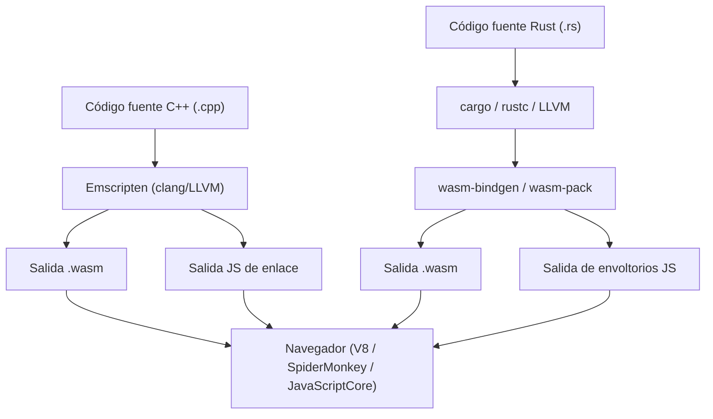
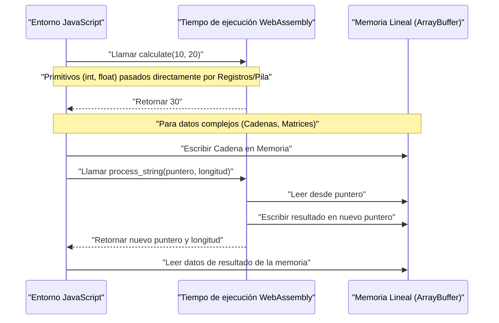
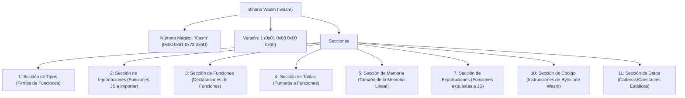

## 1. Introducción

En el desarrollo web moderno, JavaScript (y TypeScript) ha consolidado su posición como el único lenguaje de programación que se ejecuta en el navegador durante mucho tiempo. Sin embargo, en los últimos años, ha aumentado la demanda de realizar cálculos más avanzados en el propio navegador, como el procesamiento de imágenes, la codificación de video, los juegos en 3D y la simulación física. Es aquí donde entra **WebAssembly (conocido como Wasm)**.

En este artículo, comenzaremos desde los fundamentos de WebAssembly, y explicaremos detalladamente los procedimientos y la estructura interna para generar Wasm a partir de dos potentes lenguajes de programación de sistemas: C++ (usando Emscripten) y Rust (usando `wasm-pack`), y cómo integrarlos con el entorno de JavaScript. Además, profundizaremos en la gestión de los límites de memoria, cómo pasar datos complejos como cadenas y matrices, la sobrecarga de rendimiento y el formato binario de Wasm (`.wasm`).

## 2. Descripción general y arquitectura de WebAssembly (Wasm)

WebAssembly es un formato de instrucciones binarias para una máquina virtual basada en pila. Está diseñado como un "objetivo de compilación portátil" que se puede compilar a partir de lenguajes como C/C++, Rust, Go, Zig, etc., con el objetivo de ejecutarse a una velocidad cercana a la nativa en los navegadores web.

El siguiente diagrama muestra el flujo general de la cadena de herramientas desde que se genera WebAssembly a partir de C++ y Rust hasta que se ejecuta en el navegador.



Wasm no reemplaza a JavaScript. Está diseñado para funcionar junto con JavaScript, delegando las tareas de gran carga computacional a Wasm, aprovechando así los puntos fuertes de cada uno.

## 3. Desafío matemático: Cálculo del conjunto de Mandelbrot

En este artículo, utilizaremos el algoritmo de dibujo del "conjunto de Mandelbrot", que impone una gran carga en la CPU, para implementarlo en C++ y Rust.

El conjunto de Mandelbrot se define mediante la siguiente relación de recurrencia compleja:

$$ z_{n+1} = z_n^2 + c $$

Aquí, $z$ y $c$ son números complejos, y el cálculo comienza desde $z_0 = 0$. El conjunto de Mandelbrot es el conjunto de $c$ para los cuales el valor absoluto de $z_n$ no diverge cuando el cálculo se repite infinitamente para un número complejo $c$. Generalmente, al calcular en una computadora, se considera que ha divergido bajo la siguiente condición:

$$ |z_n| > 2 $$

Es decir, para la parte real $x$ y la parte imaginaria $y$, se determina si se cumple la siguiente condición hasta un número máximo de iteraciones (por ejemplo, $N = 1000$):

$$ x^2 + y^2 > 4 $$

## 4. Enfoque con C++ y Emscripten

Emscripten es una cadena de herramientas de compilación basada en LLVM y es el estándar de facto para compilar código C/C++ a WebAssembly. Proporciona un potente entorno de ejecución que emula llamadas al sistema POSIX con la API del navegador (Web API).

### Código de implementación en C++

El siguiente código de C++ calcula el conjunto de Mandelbrot del ancho y alto especificados y almacena el resultado (el número de iteraciones de cada píxel) en una matriz unidimensional.

```cpp
#include <emscripten/emscripten.h>
#include <vector>

// Especificar enlazado C para que pueda ser llamado desde JavaScript
extern "C" {

    // Devuelve un puntero al búfer que almacena el resultado del cálculo
    EMSCRIPTEN_KEEPALIVE
    int* compute_mandelbrot(int width, int height, int max_iter) {
        // Asignar el búfer como una variable estática (para simplificar)
        static std::vector<int> buffer;
        buffer.resize(width * height);

        for (int row = 0; row < height; ++row) {
            for (int col = 0; col < width; ++col) {
                double c_re = (col - width / 2.0) * 4.0 / width;
                double c_im = (row - height / 2.0) * 4.0 / width;
                double x = 0, y = 0;
                int iteration = 0;
                
                while (x*x + y*y <= 4 && iteration < max_iter) {
                    double x_new = x*x - y*y + c_re;
                    y = 2*x*y + c_im;
                    x = x_new;
                    iteration++;
                }
                buffer[row * width + col] = iteration;
            }
        }
        return buffer.data();
    }

    // Función para liberar memoria (si es necesario)
    EMSCRIPTEN_KEEPALIVE
    void free_buffer() {
        // ...
    }
}
```

### Compilación y llamada desde JavaScript

Compilaremos este código usando Emscripten.

```bash
emcc mandelbrot.cpp -O3 -s WASM=1 -s EXPORTED_FUNCTIONS="['_compute_mandelbrot', '_malloc', '_free']" -s EXPORTED_RUNTIME_METHODS="['ccall', 'cwrap']" -o mandelbrot.js
```

En el lado de JavaScript, se carga el código de enlace (`mandelbrot.js`) generado por Emscripten y se llama usando la API de WebAssembly como se muestra a continuación.

```javascript
Module.onRuntimeInitialized = () => {
    const width = 800;
    const height = 600;
    const maxIter = 1000;

    // Llamar a la función C++ y obtener el puntero
    const resultPtr = Module.ccall(
        'compute_mandelbrot', // Nombre de la función en C
        'number',             // Tipo de valor de retorno (el puntero es number)
        ['number', 'number', 'number'], // Tipos de los argumentos
        [width, height, maxIter]
    );

    // Leer directamente los datos de la matriz de la memoria lineal (Module.HEAP32)
    const numElements = width * height;
    const resultView = new Int32Array(Module.HEAP32.buffer, resultPtr, numElements);

    console.log("Cálculo completado. Datos del primer píxel: " + resultView[0]);
};
```

## 5. Enfoque con Rust y `wasm-pack`

Rust ofrece soporte de primera clase para WebAssembly, y el uso de las herramientas `wasm-bindgen` y `wasm-pack` permite una alta integración entre JavaScript y Rust. Mientras que Emscripten adopta el enfoque de "llevar un enorme tiempo de ejecución de C/C++ al navegador", el `wasm-pack` de Rust adopta el enfoque de "generar solo los enlaces (código de enlace JS) mínimos necesarios".

### Código de implementación en Rust

Crearemos un proyecto de Cargo y especificaremos `cdylib` y `wasm-bindgen` en `Cargo.toml`.

```toml
[lib]
crate-type = ["cdylib"]

[dependencies]
wasm-bindgen = "0.2"
```

A continuación, escribimos la implementación en `src/lib.rs`.

```rust
use wasm_bindgen::prelude::*;

#[wasm_bindgen]
pub fn compute_mandelbrot_rust(width: usize, height: usize, max_iter: u32) -> Vec<i32> {
    let mut buffer = vec![0; width * height];

    for row in 0..height {
        for col in 0..width {
            let c_re = (col as f64 - width as f64 / 2.0) * 4.0 / width as f64;
            let c_im = (row as f64 - height as f64 / 2.0) * 4.0 / width as f64;
            
            let mut x = 0.0;
            let mut y = 0.0;
            let mut iteration = 0;
            
            while x*x + y*y <= 4.0 && iteration < max_iter {
                let x_new = x*x - y*y + c_re;
                y = 2.0 * x * y + c_im;
                x = x_new;
                iteration += 1;
            }
            buffer[row * width + col] = iteration as i32;
        }
    }
    
    buffer
}
```

### Compilación y llamada desde JavaScript

Construimos con el comando `wasm-pack`.

```bash
wasm-pack build --target web
```

Importamos el paquete generado desde JavaScript. Gracias a `wasm-bindgen`, el `Vec<i32>` de Rust se convierte automáticamente en un `Int32Array` de JavaScript (ocultando la manipulación de punteros).

```javascript
import init, { compute_mandelbrot_rust } from './pkg/mandelbrot_wasm.js';

async function run() {
    await init(); // Inicialización del módulo WebAssembly

    const width = 800;
    const height = 600;
    const maxIter = 1000;

    // Se puede recibir el resultado directamente como una matriz de JavaScript
    const resultView = compute_mandelbrot_rust(width, height, maxIter);
    
    console.log("Cálculo completado. Datos del primer píxel: " + resultView[0]);
}
run();
```

## 6. Profundización: Límites de memoria y paso de tipos de datos

Uno de los conceptos más importantes en WebAssembly es la "memoria lineal (Linear Memory)". El código Wasm no puede acceder directamente al espacio de memoria del anfitrión (navegador), sino que se le asigna un enorme `ArrayBuffer` aislado. Esta es la memoria lineal.



### Cómo pasar cadenas y matrices

Los enteros y los números de punto flotante (`i32`, `i64`, `f32`, `f64`) se pueden pasar directamente como valores a las funciones Wasm. Sin embargo, los tipos complejos como cadenas, matrices y estructuras no se pueden pasar directamente como firmas de funciones Wasm.

**En el caso de Emscripten**:
1. Llamar a `Module._malloc` en el lado de JS para asignar un área de memoria lineal en el lado de Wasm.
2. Escribir los datos desde JS en la dirección de memoria asignada (puntero) usando algo como `Module.HEAPU8.set()`.
3. Pasar el puntero a la función de C++.
4. Después del cálculo, leer el resultado desde el puntero en el lado de JS y finalmente llamar a `Module._free`.

**En el caso de wasm-bindgen (Rust)**:
El tedioso flujo de gestión de memoria anterior se oculta completamente dentro del código de enlace generado automáticamente (envoltorio JS). Cuando pasas un simple `String` o `Array` desde el lado de JS a la función de Rust, detrás de escena se realiza automáticamente una serie de operaciones: asignación de búfer (equivalente a `malloc`), copia, paso de puntero y liberación de memoria.

## 7. Sobrecarga de rendimiento y optimización

WebAssembly se puede ejecutar a una velocidad cercana a la nativa, pero existe una sobrecarga en la "comunicación que cruza el límite entre JavaScript y WebAssembly (Interop)".

* **Sobrecarga de llamada**: Es el costo de conmutación para que el motor de JavaScript llame a una función Wasm. Aunque actualmente está muy optimizado, se debe evitar el diseño de llamar a funciones muy ligeras decenas de miles de veces por fotograma.
* **Costo de copia de memoria**: Al pasar cadenas o matrices a Wasm, se produce una copia de datos desde la memoria gestionada por la recolección de basura de JS a la memoria lineal de Wasm (ArrayBuffer). Si pasas una gran cantidad de datos, se requiere un diseño de "copia cero" donde los datos se construyen en la memoria Wasm desde el principio y se accede desde el lado de JS a través de una vista de TypedArray (como `Uint8Array`).

Por ejemplo, en motores de juegos y motores de física, es común la arquitectura en la que todo el estado se mantiene dentro de la memoria lineal de Wasm, y JavaScript solo se encarga de un disparador de "actualización" por fotograma y de la representación en pantalla (llamadas a la API WebGL/WebGPU).

## 8. Anatomía del formato binario de WebAssembly (.wasm)

Ahora, veamos la estructura interna del archivo `.wasm` generado por el compilador. Los binarios de Wasm están compuestos por conjuntos de bloques lógicos llamados "secciones" con énfasis en la extensibilidad y la velocidad de análisis.



El número mágico del archivo siempre comienza con `0x00 0x61 0x73 0x6D` (`\0asm`). Cada sección que sigue a esto tiene su propia ID.

* **Type Section**: Define todas las firmas de funciones (tipos de argumentos y valores de retorno) utilizadas.
* **Import Section**: Lista de funciones o memoria proporcionadas por el entorno JavaScript a Wasm. Por ejemplo, si llamas a `console.log` desde C++, se declara aquí.
* **Code Section**: Almacena las instrucciones de código de bytes reales (`i32.add`, `call`, `loop`, etc.). Al ser una máquina de pila, es un formato en el que se apilan los operandos y se llaman a las instrucciones operativas.
* **Data Section**: Las cadenas literales estáticas o datos de inicialización definidos en el código de C++ o Rust se cargan en la memoria lineal desde esta sección.

El motor de Wasm del navegador logra una aceleración dramática del inicio mediante la compilación en flujo de estas secciones (compilación en código de máquina en paralelo mientras se descarga).

## 9. C++ vs Rust: ¿Cuál deberías elegir?

En la generación de WebAssembly, elegir entre C++ y Rust depende en gran medida de los requisitos de tu proyecto y de los recursos existentes.

**Casos en los que deberías elegir C++ / Emscripten**:
* Cuando deseas portar librerías C/C++ existentes (FFmpeg, OpenCV, SQLite, etc.) al navegador.
* Proyectos de migración de juegos que desean utilizar directamente funciones de conversión de API gráficas como OpenGL a WebGL (capa de emulación GL de Emscripten).
* Cuando se requieren funciones del sistema operativo virtualizadas, como la emulación del sistema de archivos (MEMFS).

**Casos en los que deberías elegir Rust / wasm-pack**:
* Cuando desarrollas módulos de alto rendimiento desde cero como parte de una aplicación web.
* Cuando deseas una integración fuerte y segura de tipos con el ecosistema de JavaScript (módulos NPM y TypeScript).
* Cuando requieres un tamaño binario relativamente pequeño y una gestión de memoria segura (modelo de propiedad de Rust).
* Cuando deseas beneficiarte de una cadena de herramientas moderna como la gestión de dependencias con Cargo.

## 10. Resumen

WebAssembly es una tecnología innovadora para ejecutar procesos computacionalmente intensivos en el navegador. Tanto el enfoque de portabilidad completa (full-stack) utilizando C++ y Emscripten, como el enfoque modular acoplado estrechamente con JavaScript utilizando Rust y wasm-bindgen, tienen sus propios puntos fuertes.

En cálculos como el conjunto de Mandelbrot, se espera que Wasm mejore la velocidad de varias a decenas de veces en comparación con JavaScript por sí solo. Sin embargo, no podrás extraer el verdadero rendimiento a menos que comprendas correctamente el mecanismo del límite de memoria entre Wasm y JS y diseñes para evitar copias de memoria innecesarias.

Esperamos que a través de este artículo hayas profundizado en tu comprensión del flujo completo de generar Wasm a partir de C++ y Rust y ejecutarlo en el navegador, así como de la arquitectura detrás de él. En el desarrollo de aplicaciones web de próxima generación, WebAssembly sin duda será un arma poderosa.
