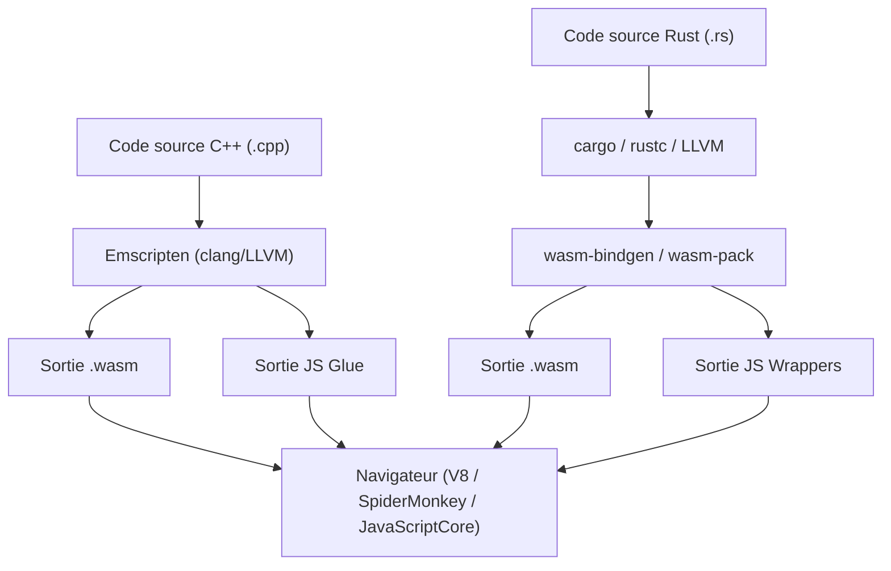
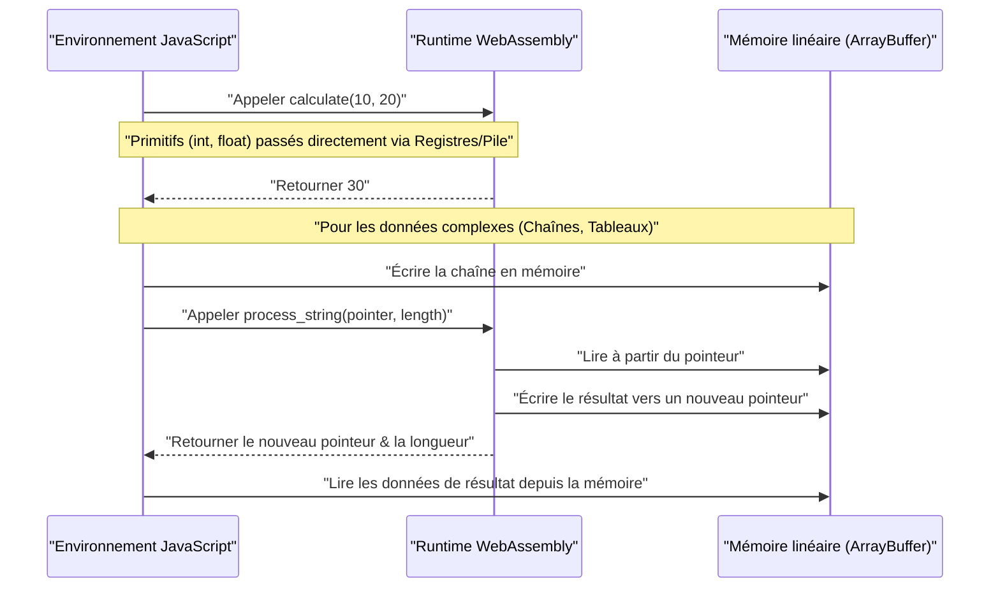
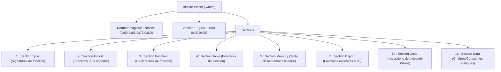

## 1. Introduction

Dans le développement Web moderne, JavaScript (et TypeScript) s'est longtemps imposé comme le seul langage de programmation s'exécutant dans le navigateur. Cependant, ces dernières années, on observe une demande croissante pour des calculs plus avancés directement dans le navigateur, tels que le traitement d'images, l'encodage vidéo, les jeux 3D et les simulations physiques. C'est là qu'intervient **WebAssembly (communément appelé Wasm)**.

Dans cet article, nous allons explorer les bases de WebAssembly, puis détailler les étapes et la structure interne pour générer du Wasm à partir de deux puissants langages de programmation système : C++ (en utilisant Emscripten) et Rust (en utilisant `wasm-pack`), afin de les intégrer à l'environnement JavaScript. De plus, nous approfondirons la gestion des limites de la mémoire, la transmission de données complexes comme les chaînes de caractères et les tableaux, les surcoûts liés aux performances, ainsi que le format binaire Wasm (`.wasm`).

## 2. Vue d'ensemble et architecture de WebAssembly (Wasm)

WebAssembly est un format d'instructions binaire conçu pour une machine virtuelle basée sur une pile. Il a été conçu comme une cible de compilation portable pouvant être compilée à partir de langages tels que C/C++, Rust, Go, Zig, etc., dans le but de s'exécuter à une vitesse proche de la vitesse native dans les navigateurs Web.

Le diagramme suivant illustre le flux général de la chaîne d'outils, depuis la génération de WebAssembly à partir de C++ et Rust jusqu'à son exécution dans le navigateur.



Wasm n'est pas destiné à remplacer JavaScript. Il est conçu pour fonctionner avec JavaScript, en déchargeant les tâches de calcul intensif sur Wasm afin de tirer parti des forces de chacun.

## 3. Défi mathématique : Calcul de l'ensemble de Mandelbrot

Dans cet article, nous utiliserons l'algorithme de rendu de l'ensemble de Mandelbrot, qui impose une forte charge au processeur, et nous l'implémenterons en C++ et en Rust.

L'ensemble de Mandelbrot est défini par la relation de récurrence complexe suivante :

$$ z_{n+1} = z_n^2 + c $$

Ici, $z$ et $c$ sont des nombres complexes, et le calcul commence avec $z_0 = 0$. Pour un nombre complexe donné $c$, l'ensemble de Mandelbrot est l'ensemble des valeurs de $c$ pour lesquelles la valeur absolue de $z_n$ ne diverge pas lorsque le calcul est répété indéfiniment. En général, lors du calcul sur un ordinateur, on considère que la suite diverge si la condition suivante est remplie :

$$ |z_n| > 2 $$

Autrement dit, pour la partie réelle $x$ et la partie imaginaire $y$, nous vérifions si la condition suivante est satisfaite jusqu'à un nombre maximal de boucles (par exemple $N = 1000$).

$$ x^2 + y^2 > 4 $$

## 4. Approche avec C++ et Emscripten

Emscripten est une chaîne d'outils de compilation basée sur LLVM et constitue le standard de facto pour compiler du code C/C++ vers WebAssembly. Il fournit un runtime puissant qui émule les appels système POSIX avec des API de navigateur (Web API).

### Code d'implémentation C++

Le code C++ suivant calcule l'ensemble de Mandelbrot pour une largeur et une hauteur spécifiées, et stocke le résultat (le nombre d'itérations pour chaque pixel) dans un tableau unidimensionnel.

```cpp
#include <emscripten/emscripten.h>
#include <vector>

// Spécifier l'édition de liens C pour pouvoir l'appeler depuis JavaScript
extern "C" {

    // Renvoie un pointeur vers le tampon contenant le résultat du calcul
    EMSCRIPTEN_KEEPALIVE
    int* compute_mandelbrot(int width, int height, int max_iter) {
        // Allouer le tampon en tant que variable statique (pour simplifier)
        static std::vector<int> buffer;
        buffer.resize(width * height);

        for (int row = 0; row < height; ++row) {
            for (int col = 0; col < width; ++col) {
                double c_re = (col - width / 2.0) * 4.0 / width;
                double c_im = (row - height / 2.0) * 4.0 / width;
                double x = 0, y = 0;
                int iteration = 0;
                
                while (x*x + y*y <= 4 && iteration < max_iter) {
                    double x_new = x*x - y*y + c_re;
                    y = 2*x*y + c_im;
                    x = x_new;
                    iteration++;
                }
                buffer[row * width + col] = iteration;
            }
        }
        return buffer.data();
    }

    // Fonction de libération de mémoire (si nécessaire)
    EMSCRIPTEN_KEEPALIVE
    void free_buffer() {
        // ...
    }
}
```

### Compilation et appel depuis JavaScript

Nous utilisons Emscripten pour compiler ce code.

```bash
emcc mandelbrot.cpp -O3 -s WASM=1 -s EXPORTED_FUNCTIONS="['_compute_mandelbrot', '_malloc', '_free']" -s EXPORTED_RUNTIME_METHODS="['ccall', 'cwrap']" -o mandelbrot.js
```

Du côté JavaScript, nous chargeons le code de liaison (`mandelbrot.js`) généré par Emscripten et l'appelons en utilisant l'API WebAssembly comme suit.

```javascript
Module.onRuntimeInitialized = () => {
    const width = 800;
    const height = 600;
    const maxIter = 1000;

    // Appeler la fonction C++ et obtenir le pointeur
    const resultPtr = Module.ccall(
        'compute_mandelbrot', // Nom de la fonction C
        'number',             // Type de valeur de retour (le pointeur est un nombre)
        ['number', 'number', 'number'], // Types des arguments
        [width, height, maxIter]
    );

    // Lire directement les données du tableau depuis la mémoire linéaire (Module.HEAP32)
    const numElements = width * height;
    const resultView = new Int32Array(Module.HEAP32.buffer, resultPtr, numElements);

    console.log("Calcul terminé. Données du premier pixel : " + resultView[0]);
};
```

## 5. Approche avec Rust et `wasm-pack`

Rust offre un support de première classe pour WebAssembly, et l'utilisation des outils `wasm-bindgen` et `wasm-pack` permet une intégration avancée entre JavaScript et Rust. Alors qu'Emscripten adopte une approche consistant à apporter un énorme runtime C/C++ dans le navigateur, `wasm-pack` de Rust adopte une approche consistant à générer uniquement les liaisons (code de liaison JS) strictement nécessaires.

### Code d'implémentation Rust

Créez un projet Cargo et spécifiez `cdylib` et `wasm-bindgen` dans `Cargo.toml`.

```toml
[lib]
crate-type = ["cdylib"]

[dependencies]
wasm-bindgen = "0.2"
```

Ensuite, écrivez l'implémentation dans `src/lib.rs`.

```rust
use wasm_bindgen::prelude::*;

#[wasm_bindgen]
pub fn compute_mandelbrot_rust(width: usize, height: usize, max_iter: u32) -> Vec<i32> {
    let mut buffer = vec![0; width * height];

    for row in 0..height {
        for col in 0..width {
            let c_re = (col as f64 - width as f64 / 2.0) * 4.0 / width as f64;
            let c_im = (row as f64 - height as f64 / 2.0) * 4.0 / width as f64;
            
            let mut x = 0.0;
            let mut y = 0.0;
            let mut iteration = 0;
            
            while x*x + y*y <= 4.0 && iteration < max_iter {
                let x_new = x*x - y*y + c_re;
                y = 2.0 * x * y + c_im;
                x = x_new;
                iteration += 1;
            }
            buffer[row * width + col] = iteration as i32;
        }
    }
    
    buffer
}
```

### Compilation et appel depuis JavaScript

Compilez avec la commande `wasm-pack`.

```bash
wasm-pack build --target web
```

Importez le package généré depuis JavaScript. Grâce à `wasm-bindgen`, le `Vec<i32>` de Rust est automatiquement converti en `Int32Array` de JavaScript (cachant la manipulation des pointeurs).

```javascript
import init, { compute_mandelbrot_rust } from './pkg/mandelbrot_wasm.js';

async function run() {
    await init(); // Initialisation du module WebAssembly

    const width = 800;
    const height = 600;
    const maxIter = 1000;

    // Le résultat peut être reçu directement sous forme de tableau JavaScript
    const resultView = compute_mandelbrot_rust(width, height, maxIter);
    
    console.log("Calcul terminé. Données du premier pixel : " + resultView[0]);
}
run();
```

## 6. Approfondissement : Limites de la mémoire et transmission de types de données

L'un des concepts les plus importants dans WebAssembly est la mémoire linéaire (Linear Memory). Le code Wasm ne peut pas accéder directement à l'espace mémoire de l'hôte (le navigateur) ; à la place, on lui attribue un énorme `ArrayBuffer` isolé. C'est la mémoire linéaire.



### Comment passer des chaînes de caractères et des tableaux

Les nombres entiers et à virgule flottante (`i32`, `i64`, `f32`, `f64`) peuvent être passés directement aux fonctions Wasm en tant que valeurs. Cependant, les types complexes comme les chaînes, les tableaux et les structures ne peuvent pas être passés directement dans la signature de la fonction Wasm.

**Dans le cas d'Emscripten** :
1. Du côté JS, appelez `Module._malloc` pour allouer un espace dans la mémoire linéaire du côté Wasm.
2. Écrivez les données depuis JS à l'adresse mémoire allouée (pointeur) en utilisant, par exemple, `Module.HEAPU8.set()`.
3. Passez le pointeur à la fonction C++.
4. Après le calcul, lisez le résultat depuis le pointeur du côté JS, et appelez enfin `Module._free`.

**Dans le cas de wasm-bindgen (Rust)** :
Le flux complexe de gestion de la mémoire décrit ci-dessus est entièrement masqué dans le code de liaison (enveloppeur JS) généré automatiquement. Lorsque vous passez simplement une `String` ou un `Array` de JS à une fonction Rust, une série d'opérations telles que l'allocation du tampon (équivalent à `malloc`), la copie, le passage de pointeur et la libération de la mémoire sont effectuées automatiquement en arrière-plan.

## 7. Surcharge de performance et optimisation

Bien que WebAssembly puisse s'exécuter à une vitesse proche de la vitesse native, il existe une surcharge (overhead) lors de la communication franchissant la frontière entre JavaScript et WebAssembly (Interop).

* **Surcharge d'appel** : C'est le coût de commutation pour le moteur JavaScript afin d'appeler une fonction Wasm. Bien que cela soit fortement optimisé aujourd'hui, vous devriez éviter une architecture qui appelle des fonctions très légères des dizaines de milliers de fois par image.
* **Coût de copie de mémoire** : Lors du passage de chaînes ou de tableaux à Wasm, les données sont copiées de la mémoire gérée par le ramasse-miettes de JS vers la mémoire linéaire de Wasm (ArrayBuffer). Si vous passez de grandes quantités de données, une conception "zéro copie" est nécessaire, où les données sont construites directement sur la mémoire Wasm dès le départ et accédées du côté JS via des vues TypedArray (comme `Uint8Array`).

Par exemple, dans les moteurs de jeux ou de physique, une architecture courante consiste à conserver tout l'état dans la mémoire linéaire de Wasm, JavaScript n'étant responsable que du déclenchement des mises à jour à chaque image et du rendu de l'écran (appel des API WebGL/WebGPU).

## 8. Anatomie du format binaire WebAssembly (.wasm)

Regardons maintenant la structure interne du fichier `.wasm` produit par le compilateur. Les binaires Wasm sont constitués d'une collection de blocs logiques appelés "sections", mettant l'accent sur l'extensibilité et la vitesse d'analyse.



Le nombre magique du fichier commence toujours par `0x00 0x61 0x73 0x6D` (`\0asm`). Chaque section suivante a un ID.

* **Section Type** : Définit toutes les signatures de fonction utilisées (types des arguments et des valeurs de retour).
* **Section Import** : Une liste des fonctions et de la mémoire fournies à Wasm depuis l'environnement JavaScript. Par exemple, si `console.log` est appelé depuis C++, il sera déclaré ici.
* **Section Code** : Contient les instructions réelles du bytecode (comme `i32.add`, `call`, `loop`). Comme il s'agit d'une machine à pile, les opérandes sont empilés avant d'appeler les instructions d'opération.
* **Section Data** : Les littéraux de chaîne statiques et les données d'initialisation définis dans le code C++ ou Rust sont chargés dans la mémoire linéaire depuis cette section.

Le moteur Wasm du navigateur réalise une accélération spectaculaire du démarrage en compilant ces sections en flux (streaming compilation) - en les compilant en code machine en parallèle pendant leur téléchargement.

## 9. C++ vs Rust : Lequel devriez-vous choisir ?

Lors de la génération de WebAssembly, le choix entre C++ et Rust dépend fortement des exigences du projet et des ressources existantes.

**Cas où vous devriez choisir C++ / Emscripten** :
* Si vous souhaitez porter des bibliothèques C/C++ existantes (FFmpeg, OpenCV, SQLite, etc.) vers le navigateur.
* Les projets de portage de jeux qui souhaitent utiliser les capacités de traduction de l'API graphique (comme OpenGL vers WebGL via la couche d'émulation GL d'Emscripten) telles quelles.
* Lorsqu'une fonctionnalité du système d'exploitation virtualisée est nécessaire, telle que l'émulation du système de fichiers (MEMFS).

**Cas où vous devriez choisir Rust / wasm-pack** :
* Si vous développez de nouveaux modules haute performance à partir de zéro dans le cadre d'une application Web.
* Si vous souhaitez une intégration forte et sûre du point de vue du type avec l'écosystème JavaScript (modules NPM et TypeScript).
* Si vous recherchez une taille de binaire relativement petite et une gestion de mémoire sécurisée (modèle de possession (ownership) de Rust).
* Si vous souhaitez bénéficier d'une chaîne d'outils moderne comme la gestion des dépendances via Cargo.

## 10. Résumé

WebAssembly est une technologie révolutionnaire pour exécuter des calculs intensifs directement dans le navigateur. L'approche de portage complet utilisant C++ et Emscripten, ainsi que l'approche modulaire étroitement couplée à JavaScript utilisant Rust et wasm-bindgen, ont chacune leurs propres avantages.

Dans des calculs comme l'ensemble de Mandelbrot, Wasm peut offrir une amélioration de la vitesse allant de plusieurs fois à plusieurs dizaines de fois par rapport à JavaScript seul. Cependant, vous ne pourrez exploiter ses véritables performances que si vous comprenez correctement le fonctionnement de la frontière de la mémoire entre Wasm et JS, et si vous concevez votre système de manière à éviter les copies de mémoire inutiles.

Nous espérons qu'à travers cet article, vous aurez acquis une compréhension plus approfondie de l'ensemble du processus de génération de Wasm à partir de C++ et Rust et de son exécution dans le navigateur, ainsi que de l'architecture sous-jacente. Dans le développement des applications Web de nouvelle génération, WebAssembly sera sans aucun doute une arme puissante.
