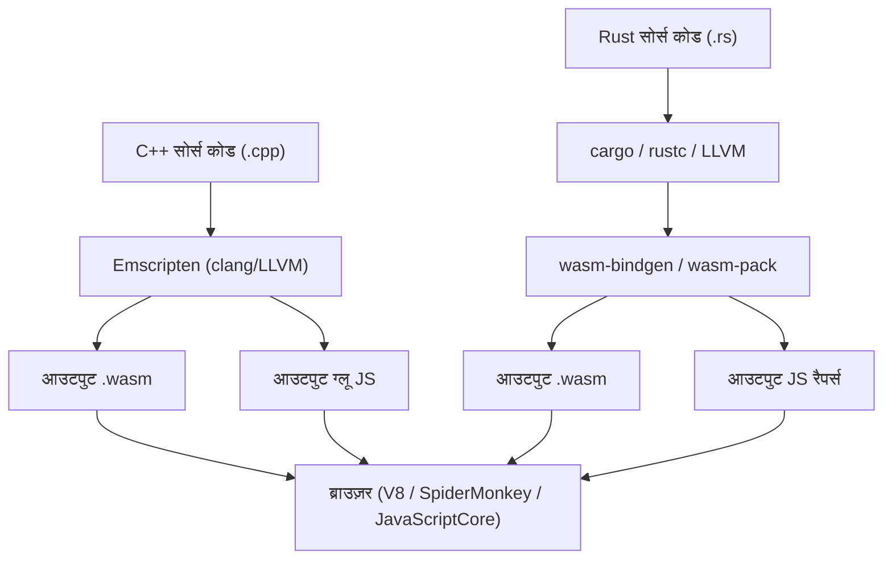
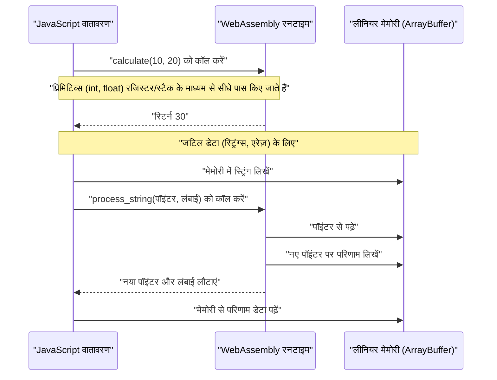
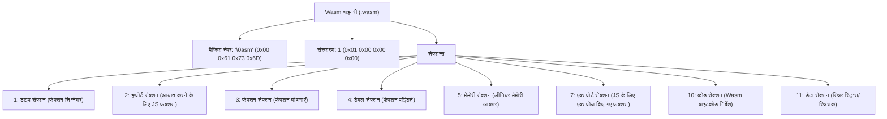

## 1. परिचय

आधुनिक वेब विकास में, JavaScript (और TypeScript) ने लंबे समय तक ब्राउज़र पर चलने वाली एकमात्र प्रोग्रामिंग भाषा के रूप में अपनी स्थिति स्थापित की है। हालाँकि, हाल के वर्षों में, ब्राउज़र पर अधिक उन्नत गणनाएँ, जैसे इमेज प्रोसेसिंग, वीडियो एनकोडिंग, 3D गेम और भौतिकी सिमुलेशन को सीधे ब्राउज़र पर निष्पादित करने की मांग बढ़ रही है। यहीं पर **WebAssembly (जिसे Wasm भी कहा जाता है)** की भूमिका आती है।

इस लेख में, हम WebAssembly की मूल बातों से शुरू करेंगे और दो शक्तिशाली सिस्टम प्रोग्रामिंग भाषाओं - C++ (Emscripten का उपयोग करके) और Rust (`wasm-pack` का उपयोग करके) - से Wasm को आउटपुट करने और इसे JavaScript वातावरण के साथ एकीकृत करने के विस्तृत चरणों और आंतरिक संरचना को समझाएंगे। इसके अलावा, हम मेमोरी बाउंड्री प्रबंधन, स्ट्रिंग्स और एरेज़ जैसे जटिल डेटा को पास करने के तरीके, प्रदर्शन ओवरहेड और Wasm बाइनरी फॉर्मेट (`.wasm`) के बारे में गहराई से जानेंगे।

## 2. WebAssembly (Wasm) का अवलोकन और आर्किटेक्चर

WebAssembly एक स्टैक-आधारित वर्चुअल मशीन के लिए बाइनरी निर्देश प्रारूप है। इसे C/C++, Rust, Go और Zig जैसी भाषाओं से संकलित किए जा सकने वाले "पोर्टेबल कंपाइलेशन टारगेट" के रूप में डिज़ाइन किया गया है, और इसका उद्देश्य वेब ब्राउज़र पर नेटिव के करीब गति से निष्पादित करना है।

नीचे दिया गया आरेख C++ और Rust से WebAssembly उत्पन्न होने और ब्राउज़र के भीतर निष्पादित होने तक के सामान्य टूलचेन प्रवाह को दर्शाता है।



Wasm, JavaScript को बदलने के लिए नहीं है। यह JavaScript के साथ काम करने के लिए डिज़ाइन किया गया है, और कम्प्यूटेशनली भारी कार्यों को Wasm पर ऑफलोड करके एक-दूसरे की ताकतों का लाभ उठाता है।

## 3. गणितीय चुनौती: मैंडेलब्रॉट सेट की गणना

इस लेख में, हम एक ड्राइंग एल्गोरिदम लागू करने के लिए C++ और Rust का उपयोग करेंगे जो CPU पर भारी भार डालता है: "मैंडेलब्रॉट सेट (Mandelbrot set)"।

मैंडेलब्रॉट सेट को निम्नलिखित जटिल पुनरावृत्ति संबंध द्वारा परिभाषित किया गया है:

$$ z_{n+1} = z_n^2 + c $$

यहाँ, $z$ और $c$ सम्मिश्र संख्याएँ (complex numbers) हैं, और गणना $z_0 = 0$ से शुरू होती है। किसी सम्मिश्र संख्या $c$ के लिए, यदि गणना को असीमित रूप से दोहराया जाता है और $z_n$ का पूर्ण मान डाइवर्ज (diverge) नहीं होता है, तो ऐसे $c$ का सेट मैंडेलब्रॉट सेट है। आम तौर पर, कंप्यूटर पर गणना करते समय, यह माना जाता है कि यह निम्नलिखित शर्तों के तहत डाइवर्ज होता है:

$$ |z_n| > 2 $$

अर्थात, वास्तविक भाग $x$ और काल्पनिक भाग $y$ के लिए, हम जांचते हैं कि अधिकतम लूप गणना (उदाहरण के लिए $N = 1000$) तक निम्नलिखित शर्त पूरी होती है या नहीं:

$$ x^2 + y^2 > 4 $$

## 4. C++ और Emscripten के साथ दृष्टिकोण

Emscripten एक LLVM-आधारित कंपाइलर टूलचेन है और C/C++ कोड को WebAssembly में संकलित करने के लिए वास्तविक मानक है। यह एक शक्तिशाली रनटाइम प्रदान करता है जो ब्राउज़र API (Web API) का उपयोग करके POSIX सिस्टम कॉल का अनुकरण (emulate) करता है।

### C++ कार्यान्वयन कोड

निम्नलिखित C++ कोड निर्दिष्ट चौड़ाई और ऊंचाई के मैंडेलब्रॉट सेट की गणना करता है और परिणाम (प्रत्येक पिक्सेल के लिए पुनरावृत्ति गणना) को एक-आयामी सरणी (one-dimensional array) में संग्रहीत करता है।

```cpp
#include <emscripten/emscripten.h>
#include <vector>

// JavaScript से कॉल करने योग्य बनाने के लिए C लिंकेज निर्दिष्ट करें
extern "C" {

    // गणना परिणामों को संग्रहीत करने वाले बफर का पॉइंटर लौटाता है
    EMSCRIPTEN_KEEPALIVE
    int* compute_mandelbrot(int width, int height, int max_iter) {
        // बफर को स्टैटिक वेरिएबल के रूप में आवंटित करें (सरलीकरण के लिए)
        static std::vector<int> buffer;
        buffer.resize(width * height);

        for (int row = 0; row < height; ++row) {
            for (int col = 0; col < width; ++col) {
                double c_re = (col - width / 2.0) * 4.0 / width;
                double c_im = (row - height / 2.0) * 4.0 / width;
                double x = 0, y = 0;
                int iteration = 0;
                
                while (x*x + y*y <= 4 && iteration < max_iter) {
                    double x_new = x*x - y*y + c_re;
                    y = 2*x*y + c_im;
                    x = x_new;
                    iteration++;
                }
                buffer[row * width + col] = iteration;
            }
        }
        return buffer.data();
    }

    // मेमोरी मुक्त करने का फ़ंक्शन (आवश्यकतानुसार)
    EMSCRIPTEN_KEEPALIVE
    void free_buffer() {
        // ...
    }
}
```

### संकलन और JavaScript से कॉल करना

इस कोड को संकलित करने के लिए Emscripten का उपयोग करें।

```bash
emcc mandelbrot.cpp -O3 -s WASM=1 -s EXPORTED_FUNCTIONS="['_compute_mandelbrot', '_malloc', '_free']" -s EXPORTED_RUNTIME_METHODS="['ccall', 'cwrap']" -o mandelbrot.js
```

JavaScript की ओर से, हम Emscripten द्वारा उत्पन्न ग्लू कोड (`mandelbrot.js`) को लोड करते हैं और इसे WebAssembly API का उपयोग करके इस प्रकार कॉल करते हैं:

```javascript
Module.onRuntimeInitialized = () => {
    const width = 800;
    const height = 600;
    const maxIter = 1000;

    // C++ फ़ंक्शन को कॉल करें और पॉइंटर प्राप्त करें
    const resultPtr = Module.ccall(
        'compute_mandelbrot', // C फ़ंक्शन का नाम
        'number',             // रिटर्न प्रकार (पॉइंटर एक संख्या है)
        ['number', 'number', 'number'], // तर्क प्रकार
        [width, height, maxIter]
    );

    // लीनियर मेमोरी (Module.HEAP32) से सीधे एरे डेटा पढ़ें
    const numElements = width * height;
    const resultView = new Int32Array(Module.HEAP32.buffer, resultPtr, numElements);

    console.log("गणना पूर्ण। पहला पिक्सेल डेटा: " + resultView[0]);
};
```

## 5. Rust और `wasm-pack` के साथ दृष्टिकोण

Rust WebAssembly के लिए प्रथम श्रेणी का समर्थन प्रदान करता है, और `wasm-bindgen` और `wasm-pack` टूल का उपयोग करके, JavaScript और Rust के बीच उन्नत एकीकरण संभव है। जबकि Emscripten "ब्राउज़र में C/C++ का विशाल रनटाइम लाने" का दृष्टिकोण अपनाता है, Rust का `wasm-pack` "केवल न्यूनतम आवश्यक बाइंडिंग (JS ग्लू कोड) उत्पन्न करने" का दृष्टिकोण अपनाता है।

### Rust कार्यान्वयन कोड

एक Cargo प्रोजेक्ट बनाएं और `Cargo.toml` में `cdylib` और `wasm-bindgen` निर्दिष्ट करें।

```toml
[lib]
crate-type = ["cdylib"]

[dependencies]
wasm-bindgen = "0.2"
```

इसके बाद, कार्यान्वयन को `src/lib.rs` में लिखें।

```rust
use wasm_bindgen::prelude::*;

#[wasm_bindgen]
pub fn compute_mandelbrot_rust(width: usize, height: usize, max_iter: u32) -> Vec<i32> {
    let mut buffer = vec![0; width * height];

    for row in 0..height {
        for col in 0..width {
            let c_re = (col as f64 - width as f64 / 2.0) * 4.0 / width as f64;
            let c_im = (row as f64 - height as f64 / 2.0) * 4.0 / width as f64;
            
            let mut x = 0.0;
            let mut y = 0.0;
            let mut iteration = 0;
            
            while x*x + y*y <= 4.0 && iteration < max_iter {
                let x_new = x*x - y*y + c_re;
                y = 2.0 * x * y + c_im;
                x = x_new;
                iteration += 1;
            }
            buffer[row * width + col] = iteration as i32;
        }
    }
    
    buffer
}
```

### संकलन और JavaScript से कॉल करना

`wasm-pack` कमांड से बिल्ड करें।

```bash
wasm-pack build --target web
```

उत्पन्न पैकेज को JavaScript से आयात करें। `wasm-bindgen` के लिए धन्यवाद, Rust का `Vec<i32>` स्वचालित रूप से JavaScript के `Int32Array` में परिवर्तित हो जाता है (पॉइंटर संचालन को छिपाना)।

```javascript
import init, { compute_mandelbrot_rust } from './pkg/mandelbrot_wasm.js';

async function run() {
    await init(); // WebAssembly मॉड्यूल का आरंभीकरण

    const width = 800;
    const height = 600;
    const maxIter = 1000;

    // आप परिणाम को सीधे JavaScript एरे के रूप में प्राप्त कर सकते हैं
    const resultView = compute_mandelbrot_rust(width, height, maxIter);
    
    console.log("गणना पूर्ण। पहला पिक्सेल डेटा: " + resultView[0]);
}
run();
```

## 6. गहराई में गोताखोरी: मेमोरी बाउंड्री और डेटा प्रकार पास करना

WebAssembly में सबसे महत्वपूर्ण अवधारणाओं में से एक "लीनियर मेमोरी (Linear Memory)" है। Wasm कोड सीधे होस्ट (ब्राउज़र) मेमोरी स्पेस तक नहीं पहुंच सकता है; इसके बजाय, इसे एक पृथक, विशाल `ArrayBuffer` आवंटित किया जाता है। यही लीनियर मेमोरी है।



### स्ट्रिंग्स और एरेज़ कैसे पास करें

पूर्णांक (Integers) और फ्लोटिंग-पॉइंट संख्याएँ (`i32`, `i64`, `f32`, `f64`) को Wasm फ़ंक्शंस में सीधे मानों के रूप में पास किया जा सकता है। हालाँकि, जटिल प्रकार जैसे स्ट्रिंग, एरे और संरचनाओं को सीधे Wasm फ़ंक्शन सिग्नेचर के रूप में पास नहीं किया जा सकता है।

**Emscripten के मामले में**:
1. JS साइड पर `Module._malloc` को कॉल करें ताकि Wasm साइड पर लीनियर मेमोरी क्षेत्र आवंटित किया जा सके।
2. JS से आवंटित मेमोरी पते (पॉइंटर) पर डेटा लिखें, जैसे `Module.HEAPU8.set()` का उपयोग करके।
3. C++ फ़ंक्शन को पॉइंटर पास करें।
4. गणना के बाद, JS साइड पर पॉइंटर से परिणाम पढ़ें, और अंत में `Module._free` को कॉल करें।

**wasm-bindgen (Rust) के मामले में**:
यह उपर्युक्त बोझिल मेमोरी प्रबंधन प्रवाह को स्वचालित रूप से उत्पन्न ग्लू कोड (JS रैपर) के भीतर पूरी तरह से छुपा देता है। जब आप JS साइड से Rust फ़ंक्शन को एक साधारण `String` या `Array` पास करते हैं, तो पृष्ठभूमि में कार्यों की एक श्रृंखला स्वचालित रूप से की जाती है: बफर आवंटन (`malloc` के बराबर), प्रतिलिपि बनाना, पॉइंटर पास करना और मेमोरी को मुक्त करना।

## 7. प्रदर्शन ओवरहेड और अनुकूलन

WebAssembly को नेटिव-जैसी गति से निष्पादित किया जा सकता है, लेकिन "JavaScript और WebAssembly (Interop) के बीच संचार" में ओवरहेड होता है।

* **कॉलिंग ओवरहेड (Calling Overhead)**: JavaScript इंजन के लिए Wasm फ़ंक्शंस को कॉल करने की स्विचिंग लागत। हालाँकि अब इसे बहुत अधिक अनुकूलित किया गया है, ऐसे डिज़ाइनों से बचा जाना चाहिए जहाँ एक बहुत ही हल्के फ़ंक्शन को प्रति फ्रेम दसियों हज़ार बार कॉल किया जाता है।
* **मेमोरी कॉपी लागत (Memory Copy Cost)**: Wasm में स्ट्रिंग्स या एरेज़ पास करते समय, डेटा को JS गारबेज-कलेक्टेड मेमोरी से Wasm की लीनियर मेमोरी (ArrayBuffer) में कॉपी किया जाता है। बड़ी मात्रा में डेटा पास करते समय, "शून्य-प्रतिलिपि (zero-copy)" डिज़ाइन की आवश्यकता होती है जहाँ डेटा को शुरू से ही Wasm मेमोरी पर बनाया जाता है और JS साइड से TypedArray दृश्य (जैसे `Uint8Array`) के माध्यम से एक्सेस किया जाता है।

उदाहरण के लिए, गेम इंजन और भौतिकी इंजन में, यह आर्किटेक्चर आम है जहाँ सभी अवस्थाओं (states) को Wasm की लीनियर मेमोरी के भीतर रखा जाता है, और JavaScript केवल प्रत्येक फ्रेम को "अपडेट" ट्रिगर करने और स्क्रीन रेंडरिंग (WebGL/WebGPU API कॉलिंग) के लिए ज़िम्मेदार होता है।

## 8. WebAssembly बाइनरी फॉर्मेट (.wasm) की शारीरिक रचना (Anatomy)

अब, आइए कंपाइलर द्वारा आउटपुट की गई `.wasm` फ़ाइल की आंतरिक संरचना पर एक नज़र डालें। Wasm बाइनरी विस्तारशीलता (extensibility) और पार्सिंग गति को महत्व देने के लिए "सेक्शन (sections)" नामक तार्किक ब्लॉकों के संग्रह से बनी होती है।



फ़ाइल का मैजिक नंबर हमेशा `0x00 0x61 0x73 0x6D` (`\0asm`) से शुरू होता है। इसके बाद आने वाले प्रत्येक अनुभाग (section) का अपना ID होता है।

* **टाइप सेक्शन (Type Section)**: उपयोग किए जाने वाले सभी फ़ंक्शन सिग्नेचर (तर्क और रिटर्न मान प्रकार) को परिभाषित करता है।
* **इम्पोर्ट सेक्शन (Import Section)**: JavaScript वातावरण द्वारा Wasm को प्रदान किए गए फ़ंक्शंस और मेमोरी की सूची। उदाहरण के लिए, यदि आप C++ से `console.log` को कॉल करते हैं, तो इसे यहाँ घोषित किया जाएगा।
* **कोड सेक्शन (Code Section)**: वास्तविक बाइटकोड निर्देश (जैसे `i32.add`, `call`, और `loop`) को संग्रहीत करता है। चूँकि यह एक स्टैक मशीन है, प्रारूप स्टैक पर ऑपरेंड को धकेलना और ऑपरेशन निर्देशों को कॉल करना है।
* **डेटा सेक्शन (Data Section)**: C++ या Rust कोड में परिभाषित स्थिर स्ट्रिंग लिटरल और इनिशियलाइज़ेशन डेटा इस सेक्शन से लीनियर मेमोरी में लोड किए जाते हैं।

ब्राउज़र के Wasm इंजन इन अनुभागों को स्ट्रीमिंग संकलन (डाउनलोड करते समय समानांतर में मशीन कोड में संकलित) करके स्टार्टअप में नाटकीय रूप से तेजी लाते हैं।

## 9. C++ बनाम Rust: आपको किसे चुनना चाहिए?

WebAssembly बनाने के लिए C++ या Rust में से किसे चुनना है, यह काफी हद तक आपके प्रोजेक्ट की आवश्यकताओं और मौजूदा संपत्तियों (assets) पर निर्भर करता है।

**C++ / Emscripten कब चुनें**:
* जब आप मौजूदा C/C++ लाइब्रेरी (FFmpeg, OpenCV, SQLite, आदि) को ब्राउज़र में पोर्ट करना चाहते हैं।
* गेम पोर्टिंग प्रोजेक्ट जहाँ आप उन सुविधाओं (Emscripten की GL एमुलेशन लेयर) का उपयोग करना चाहते हैं जो ग्राफ़िक्स API जैसे OpenGL को WebGL में परिवर्तित करते हैं।
* जब वर्चुअलाइज़्ड OS सुविधाओं की आवश्यकता होती है, जैसे फ़ाइल सिस्टम एमुलेशन (MEMFS)।

**Rust / wasm-pack कब चुनें**:
* वेब एप्लिकेशन के हिस्से के रूप में शून्य से नए उच्च-प्रदर्शन मॉड्यूल विकसित करते समय।
* जब आप JavaScript पारिस्थितिकी तंत्र (NPM मॉड्यूल और TypeScript) के साथ मजबूत, प्रकार-सुरक्षित (type-safe) एकीकरण चाहते हैं।
* जब आपको अपेक्षाकृत छोटे बाइनरी आकार और सुरक्षित मेमोरी प्रबंधन (Rust के स्वामित्व मॉडल) की आवश्यकता हो।
* जब आप आधुनिक टूलचेन का आनंद लेना चाहते हैं, जैसे Cargo का उपयोग करके निर्भरता (dependency) प्रबंधन।

## 10. निष्कर्ष

WebAssembly ब्राउज़र के भीतर कम्प्यूटेशनली भारी प्रक्रियाओं को निष्पादित करने के लिए एक अभिनव तकनीक है। C++ और Emscripten का उपयोग करके फुल-स्टैक पोर्टिंग दृष्टिकोण और Rust और wasm-bindgen का उपयोग करके JavaScript के साथ कसकर युग्मित (tightly coupled) मॉड्यूलर दृष्टिकोण, दोनों की अपनी-अपनी ताकतें हैं।

मैंडेलब्रॉट सेट जैसी गणनाओं के लिए, अकेले JavaScript की तुलना में Wasm से गति में कई गुना से लेकर दसियों गुना तक सुधार की उम्मीद की जा सकती है। हालाँकि, आप तब तक वास्तविक प्रदर्शन नहीं निकाल सकते जब तक कि आप Wasm और JS के बीच मेमोरी बाउंड्री तंत्र को सही ढंग से नहीं समझते हैं और अनावश्यक मेमोरी प्रतियों से बचने के लिए इसे डिज़ाइन नहीं करते हैं।

मुझे उम्मीद है कि इस लेख के माध्यम से, आप C++ और Rust से Wasm को आउटपुट करने और इसे ब्राउज़र में निष्पादित करने के प्रवाह, साथ ही इसके पीछे के आर्किटेक्चर को बेहतर ढंग से समझ गए होंगे। अगली पीढ़ी के वेब एप्लिकेशन डेवलपमेंट में WebAssembly निस्संदेह एक शक्तिशाली हथियार होगा।
