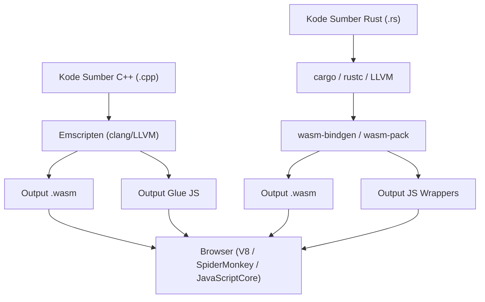
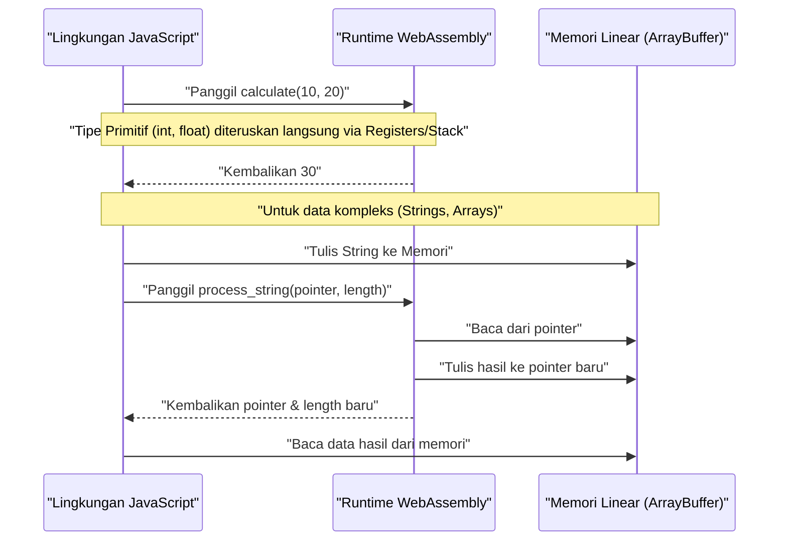
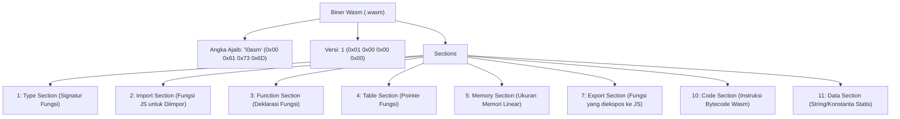

## 1. Pendahuluan

Dalam pengembangan web modern, JavaScript (dan TypeScript) telah lama memantapkan posisinya sebagai satu-satunya bahasa pemrograman yang berjalan di browser. Namun, belakangan ini kebutuhan untuk menjalankan komputasi yang lebih canggih langsung di browser, seperti pemrosesan gambar, encoding video, game 3D, dan simulasi fisika, semakin meningkat. Di sinilah **WebAssembly (biasa disebut Wasm)** muncul.

Artikel ini akan membahas secara mendalam mulai dari dasar-dasar WebAssembly, cara menghasilkan Wasm dari dua bahasa pemrograman sistem yang kuat, yaitu C++ (menggunakan Emscripten) dan Rust (menggunakan `wasm-pack`), hingga langkah-langkah detail dan struktur internal untuk mengintegrasikannya dengan lingkungan JavaScript. Lebih jauh, kita akan mengeksplorasi manajemen batas memori (memory boundaries), cara melewatkan data kompleks seperti string dan array, overhead performa, hingga format biner Wasm (`.wasm`).

## 2. Gambaran Umum dan Arsitektur WebAssembly (Wasm)

WebAssembly adalah format instruksi biner untuk mesin virtual berbasis stack. Ia dirancang sebagai "target kompilasi portabel" yang dapat dikompilasi dari bahasa seperti C/C++, Rust, Go, Zig, dll., dengan tujuan untuk dieksekusi pada kecepatan yang mendekati native di browser web.

Diagram berikut menunjukkan gambaran umum alur toolchain dari pembuatan WebAssembly menggunakan C++ dan Rust, hingga dieksekusi di dalam browser.



Wasm tidak dirancang untuk menggantikan JavaScript. Ia dirancang untuk bekerja bersama JavaScript, memanfaatkan kekuatan masing-masing dengan mengalihkan tugas-tugas komputasi berat ke Wasm.

## 3. Tantangan Matematis: Menghitung Himpunan Mandelbrot

Dalam artikel ini, kita akan mengimplementasikan algoritma penggambaran "Himpunan Mandelbrot (Mandelbrot set)", yang memberikan beban tinggi pada CPU, menggunakan C++ dan Rust.

Himpunan Mandelbrot didefinisikan oleh relasi perulangan kompleks berikut:

$$ z_{n+1} = z_n^2 + c $$

Di sini, $z$ dan $c$ adalah bilangan kompleks, dan komputasi dimulai dari $z_0 = 0$. Untuk suatu bilangan kompleks $c$, himpunan $c$ yang nilai absolut $z_n$-nya tidak menyimpang (divergen) ketika perhitungan diulang tak terhingga kali disebut Himpunan Mandelbrot. Umumnya, saat menghitung di komputer, deret dianggap divergen jika memenuhi kondisi berikut:

$$ |z_n| > 2 $$

Yaitu, untuk bagian real $x$ dan imajiner $y$, kita menentukan apakah kondisi berikut terpenuhi hingga jumlah perulangan maksimum (misalnya $N = 1000$):

$$ x^2 + y^2 > 4 $$

## 4. Pendekatan dengan C++ dan Emscripten

Emscripten adalah toolchain kompilator berbasis LLVM dan merupakan standar de facto untuk mengkompilasi kode C/C++ menjadi WebAssembly. Ia menyediakan runtime yang kuat yang mengemulasi panggilan sistem POSIX dengan API browser (Web API).

### Kode Implementasi C++

Kode C++ di bawah ini menghitung Himpunan Mandelbrot dengan lebar dan tinggi yang ditentukan, lalu menyimpan hasilnya (jumlah iterasi tiap piksel) dalam array satu dimensi.

```cpp
#include <emscripten/emscripten.h>
#include <vector>

// Menentukan linkage C agar dapat dipanggil dari JavaScript
extern "C" {

    // Mengembalikan pointer ke buffer yang menyimpan hasil perhitungan
    EMSCRIPTEN_KEEPALIVE
    int* compute_mandelbrot(int width, int height, int max_iter) {
        // Mengalokasikan buffer sebagai variabel statis (untuk penyederhanaan)
        static std::vector<int> buffer;
        buffer.resize(width * height);

        for (int row = 0; row < height; ++row) {
            for (int col = 0; col < width; ++col) {
                double c_re = (col - width / 2.0) * 4.0 / width;
                double c_im = (row - height / 2.0) * 4.0 / width;
                double x = 0, y = 0;
                int iteration = 0;
                
                while (x*x + y*y <= 4 && iteration < max_iter) {
                    double x_new = x*x - y*y + c_re;
                    y = 2*x*y + c_im;
                    x = x_new;
                    iteration++;
                }
                buffer[row * width + col] = iteration;
            }
        }
        return buffer.data();
    }

    // Fungsi untuk melepaskan memori (jika diperlukan)
    EMSCRIPTEN_KEEPALIVE
    void free_buffer() {
        // ...
    }
}
```

### Kompilasi dan Pemanggilan dari JavaScript

Kita akan mengkompilasi kode ini menggunakan Emscripten.

```bash
emcc mandelbrot.cpp -O3 -s WASM=1 -s EXPORTED_FUNCTIONS="['_compute_mandelbrot', '_malloc', '_free']" -s EXPORTED_RUNTIME_METHODS="['ccall', 'cwrap']" -o mandelbrot.js
```

Di sisi JavaScript, kita memuat glue code yang dihasilkan oleh Emscripten (`mandelbrot.js`) dan memanggilnya menggunakan WebAssembly API seperti berikut.

```javascript
Module.onRuntimeInitialized = () => {
    const width = 800;
    const height = 600;
    const maxIter = 1000;

    // Memanggil fungsi C++ dan mendapatkan pointernya
    const resultPtr = Module.ccall(
        'compute_mandelbrot', // Nama fungsi C
        'number',             // Tipe nilai kembalian (pointer adalah number)
        ['number', 'number', 'number'], // Tipe argumen
        [width, height, maxIter]
    );

    // Membaca data array secara langsung dari linear memory (Module.HEAP32)
    const numElements = width * height;
    const resultView = new Int32Array(Module.HEAP32.buffer, resultPtr, numElements);

    console.log("Perhitungan selesai. Data piksel pertama: " + resultView[0]);
};
```

## 5. Pendekatan dengan Rust dan `wasm-pack`

Rust menyediakan dukungan kelas satu untuk WebAssembly, dan menggunakan alat `wasm-bindgen` serta `wasm-pack` memungkinkan interaksi tingkat tinggi antara JavaScript dan Rust. Sementara pendekatan Emscripten "membawa runtime besar C/C++ ke browser," pendekatan `wasm-pack` dari Rust "hanya menghasilkan binding (JS glue code) minimal yang diperlukan."

### Kode Implementasi Rust

Buat proyek Cargo, dan tentukan `cdylib` dan `wasm-bindgen` di `Cargo.toml`.

```toml
[lib]
crate-type = ["cdylib"]

[dependencies]
wasm-bindgen = "0.2"
```

Selanjutnya, tulis implementasinya di `src/lib.rs`.

```rust
use wasm_bindgen::prelude::*;

#[wasm_bindgen]
pub fn compute_mandelbrot_rust(width: usize, height: usize, max_iter: u32) -> Vec<i32> {
    let mut buffer = vec![0; width * height];

    for row in 0..height {
        for col in 0..width {
            let c_re = (col as f64 - width as f64 / 2.0) * 4.0 / width as f64;
            let c_im = (row as f64 - height as f64 / 2.0) * 4.0 / width as f64;
            
            let mut x = 0.0;
            let mut y = 0.0;
            let mut iteration = 0;
            
            while x*x + y*y <= 4.0 && iteration < max_iter {
                let x_new = x*x - y*y + c_re;
                y = 2.0 * x * y + c_im;
                x = x_new;
                iteration += 1;
            }
            buffer[row * width + col] = iteration as i32;
        }
    }
    
    buffer
}
```

### Kompilasi dan Pemanggilan dari JavaScript

Build menggunakan perintah `wasm-pack`.

```bash
wasm-pack build --target web
```

Impor paket yang dihasilkan dari JavaScript. Berkat `wasm-bindgen`, `Vec<i32>` milik Rust secara otomatis dikonversi menjadi `Int32Array` milik JavaScript (menyembunyikan manipulasi pointer).

```javascript
import init, { compute_mandelbrot_rust } from './pkg/mandelbrot_wasm.js';

async function run() {
    await init(); // Inisialisasi modul WebAssembly

    const width = 800;
    const height = 600;
    const maxIter = 1000;

    // Dapat menerima hasil langsung sebagai array JavaScript
    const resultView = compute_mandelbrot_rust(width, height, maxIter);
    
    console.log("Perhitungan selesai. Data piksel pertama: " + resultView[0]);
}
run();
```

## 6. Lebih Dalam: Batas Memori dan Melewatkan Tipe Data

Salah satu konsep paling penting dalam WebAssembly adalah "Memori Linear (Linear Memory)". Kode Wasm tidak dapat mengakses ruang memori host (browser) secara langsung, melainkan dialokasikan sebuah `ArrayBuffer` raksasa yang terisolasi. Inilah yang disebut memori linear.



### Cara Melewatkan String dan Array

Bilangan bulat dan pecahan (floating point) (`i32`, `i64`, `f32`, `f64`) dapat diteruskan langsung sebagai nilai ke fungsi Wasm. Namun, tipe kompleks seperti string, array, atau struktur data tidak bisa dilewatkan secara langsung pada signatur fungsi Wasm.

**Kasus Emscripten**:
1. Panggil `Module._malloc` di sisi JS untuk mengalokasikan memori linear di sisi Wasm.
2. JS menulis data ke alamat memori yang dialokasikan (pointer) menggunakan `Module.HEAPU8.set()`, dll.
3. Pointer dilewatkan ke fungsi C++.
4. Setelah dihitung, JS membaca hasil dari pointer, dan akhirnya memanggil `Module._free`.

**Kasus wasm-bindgen (Rust)**:
Alur manajemen memori yang rumit di atas disembunyikan sepenuhnya di dalam glue code (JS wrapper) yang dihasilkan secara otomatis. Ketika Anda melewatkan `String` atau `Array` sederhana dari sisi JS ke fungsi Rust, serangkaian proses seperti alokasi buffer (setara dengan `malloc`), penyalinan, pengiriman pointer, dan pelepasan memori akan dilakukan secara otomatis di latar belakang.

## 7. Overhead Performa dan Optimasi

WebAssembly dapat dieksekusi dengan kecepatan mendekati native, tetapi ada overhead pada "komunikasi (Interop) yang melintasi batas antara JavaScript dan WebAssembly".

* **Overhead Pemanggilan**: Biaya peralihan bagi engine JavaScript untuk memanggil fungsi Wasm. Meskipun saat ini telah banyak dioptimalkan, memanggil fungsi yang sangat ringan puluhan ribu kali per frame harus dihindari.
* **Biaya Salin Memori**: Ketika melewatkan string atau array ke Wasm, data disalin dari memori yang dikelola oleh garbage collection JS ke memori linear Wasm (ArrayBuffer). Jika melewatkan data berukuran besar, diperlukan desain "zero-copy" di mana data dibangun dari awal di memori Wasm, dan sisi JS mengaksesnya melalui tampilan TypedArray (seperti `Uint8Array`).

Misalnya, pada engine game atau engine fisika, arsitektur umum yang digunakan adalah menyimpan seluruh status (state) di dalam memori linear Wasm, dan JavaScript hanya menangani pemicu untuk "perbarui" pada tiap frame dan penggambaran layar (pemanggilan WebGL/WebGPU API).

## 8. Anatomi Format Biner WebAssembly (.wasm)

Sekarang, mari kita lihat struktur internal dari file `.wasm` yang dihasilkan oleh kompilator. Biner Wasm terdiri dari kumpulan blok logis yang disebut "section" yang dirancang untuk mementingkan ekstensibilitas dan kecepatan parsing.



Angka ajaib (magic number) file ini selalu dimulai dengan `0x00 0x61 0x73 0x6D` (`\0asm`). Setiap bagian (section) yang mengikutinya memiliki ID masing-masing.

* **Type Section**: Mendefinisikan semua signatur fungsi (tipe argumen dan nilai kembalian) yang digunakan.
* **Import Section**: Daftar fungsi dan memori yang disediakan dari lingkungan JavaScript ke Wasm. Misalnya, jika memanggil `console.log` dari C++, deklarasinya ada di sini.
* **Code Section**: Berisi instruksi bytecode aktual (seperti `i32.add`, `call`, dan `loop`). Karena merupakan stack machine, formatnya adalah dengan menaruh operand di stack lalu memanggil instruksi operasi.
* **Data Section**: Literal string statis dan data inisialisasi yang didefinisikan dalam kode C++ atau Rust dimuat ke dalam memori linear dari bagian (section) ini.

Engine Wasm pada browser dapat mencapai peningkatan kecepatan proses startup yang dramatis dengan mengkompilasi bagian-bagian ini secara streaming (menerjemahkan ke bahasa mesin secara paralel sambil mengunduhnya).

## 9. C++ vs Rust: Mana yang Harus Dipilih?

Dalam pembuatan WebAssembly, memilih antara C++ dan Rust sangat bergantung pada persyaratan proyek dan aset yang sudah ada.

**Kasus memilih C++ / Emscripten**:
* Ingin melakukan porting library C/C++ yang sudah ada (FFmpeg, OpenCV, SQLite, dll.) ke browser.
* Proyek porting game yang ingin menggunakan fungsi yang mengonversi API grafis seperti OpenGL ke WebGL (lapisan emulasi GL Emscripten) apa adanya.
* Membutuhkan fungsi OS yang divirtualisasi, seperti emulasi sistem file (MEMFS).

**Kasus memilih Rust / wasm-pack**:
* Mengembangkan modul baru berperforma tinggi dari nol sebagai bagian dari aplikasi web.
* Menginginkan integrasi yang kuat dan aman tipe (type-safe) dengan ekosistem JavaScript (Modul NPM atau TypeScript).
* Menginginkan ukuran biner yang relatif lebih kecil dan manajemen memori yang aman (model kepemilikan Rust).
* Ingin menikmati toolchain modern seperti manajemen dependensi melalui Cargo.

## 10. Kesimpulan

WebAssembly adalah teknologi inovatif untuk menjalankan pemrosesan berat di dalam browser. Baik pendekatan porting full-stack menggunakan C++ dan Emscripten maupun pendekatan modular yang terikat kuat dengan JavaScript menggunakan Rust dan wasm-bindgen, masing-masing memiliki keunggulannya sendiri.

Untuk perhitungan seperti Himpunan Mandelbrot, Wasm diharapkan dapat meningkatkan kecepatan berkali-kali lipat hingga puluhan kali lipat dibandingkan dengan JavaScript biasa. Namun, performa yang sebenarnya tidak dapat dicapai jika Anda tidak memahami mekanisme batas memori antara Wasm dan JS dengan benar serta merancang sistem untuk menghindari penyalinan memori yang tidak perlu.

Melalui artikel ini, kami harap Anda dapat memahami alur kompilasi Wasm dari C++ dan Rust untuk dijalankan di browser, serta memahami arsitektur di baliknya. Dalam pengembangan aplikasi web generasi berikutnya, WebAssembly pastinya akan menjadi senjata yang sangat ampuh.
