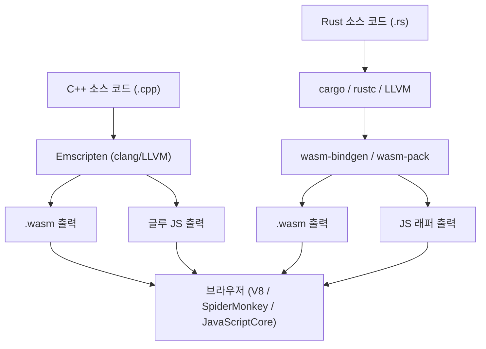
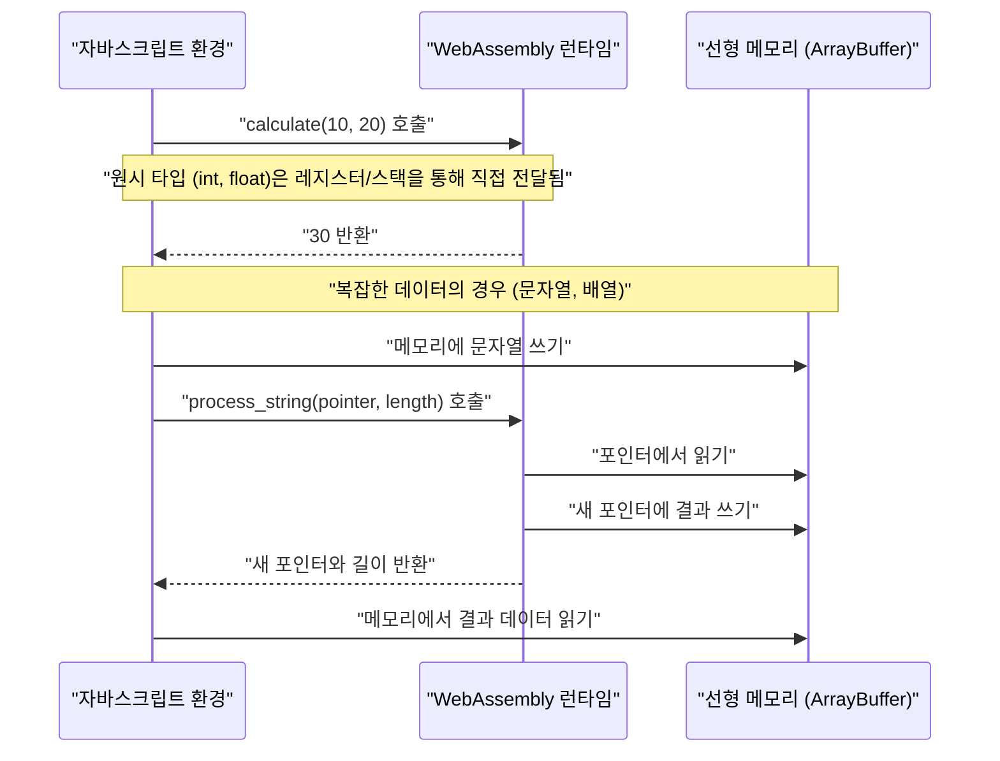
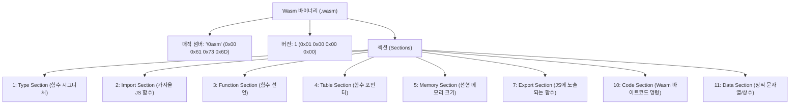

## 1. 소개

모던 웹 개발에서 JavaScript(및 TypeScript)는 오랫동안 브라우저 위에서 동작하는 유일한 프로그래밍 언어로서의 지위를 확립해 왔습니다. 하지만 최근에는 이미지 처리나 동영상 인코딩, 3D 게임, 물리 시뮬레이션 등 보다 고도화된 연산을 브라우저 단독으로 실행하려는 수요가 높아지고 있습니다. 이에 등장한 것이 바로 **WebAssembly (통칭 Wasm)** 입니다.

이 글에서는 WebAssembly의 기초부터 시작하여, C++(Emscripten 사용) 및 Rust(`wasm-pack` 사용)라는 두 가지 강력한 시스템 프로그래밍 언어에서 Wasm을 출력하고, JavaScript 환경과 연동하기 위한 상세한 절차와 내부 구조를 설명합니다. 더 나아가 메모리 경계 관리, 문자열이나 배열과 같은 복잡한 데이터 전달 방법, 성능 오버헤드, 그리고 Wasm의 바이너리 포맷(`.wasm`)에 이르기까지 철저하게 파헤쳐 보겠습니다.

## 2. WebAssembly (Wasm) 개요 및 아키텍처

WebAssembly는 스택 기반 가상 머신을 위한 바이너리 명령 포맷입니다. C/C++, Rust, Go, Zig 등의 언어에서 컴파일 가능한 '이식성 있는 컴파일 타깃'으로 설계되었으며, 웹 브라우저 상에서 네이티브에 가까운 속도로 실행하는 것을 목적으로 합니다.

다음 그림은 C++와 Rust에서 WebAssembly가 생성되어 브라우저 내에서 실행되기까지의 대략적인 툴체인 흐름을 보여줍니다.



Wasm은 JavaScript를 대체하는 것이 아닙니다. JavaScript와 함께 동작하며, 계산 부하가 높은 작업을 Wasm으로 오프로드함으로써 서로의 장점을 살리는 설계로 되어 있습니다.

## 3. 수학적 과제: 망델브로 집합 계산

이 글에서는 CPU에 높은 부하를 주는 '망델브로 집합 (Mandelbrot set)' 렌더링 알고리즘을 사용하여 C++와 Rust로 구현을 진행합니다.

망델브로 집합은 다음의 복소 점화식으로 정의됩니다.

$$ z_{n+1} = z_n^2 + c $$

여기서 $z$와 $c$는 복소수이며, $z_0 = 0$부터 계산을 시작합니다. 특정 복소수 $c$에 대해, 계산을 무한히 반복했을 때 $z_n$의 절댓값이 발산하지 않는 $c$의 집합이 망델브로 집합입니다. 일반적으로 컴퓨터에서 계산할 때는 다음 조건에서 발산했다고 간주합니다.

$$ |z_n| > 2 $$

즉, 실수부 $x$와 허수부 $y$에 대해 다음 조건을 만족하는지 최대 루프 횟수(예: $N = 1000$)까지 판별합니다.

$$ x^2 + y^2 > 4 $$

## 4. C++와 Emscripten을 통한 접근법

Emscripten은 LLVM 기반 컴파일러 툴체인으로, C/C++ 코드를 WebAssembly로 컴파일할 때의 사실상 표준입니다. POSIX 시스템 호출을 브라우저 API(Web API)로 에뮬레이션하는 강력한 런타임을 제공하고 있습니다.

### C++ 구현 코드

다음 C++ 코드는 지정된 너비와 높이의 망델브로 집합을 계산하고, 그 결과(각 픽셀의 반복 횟수)를 1차원 배열에 저장합니다.

```cpp
#include <emscripten/emscripten.h>
#include <vector>

// JavaScript에서 호출할 수 있도록 C 링키지 지정
extern "C" {

    // 계산 결과를 저장할 버퍼의 포인터를 반환
    EMSCRIPTEN_KEEPALIVE
    int* compute_mandelbrot(int width, int height, int max_iter) {
        // 정적 변수로 버퍼 할당 (단순화를 위해)
        static std::vector<int> buffer;
        buffer.resize(width * height);

        for (int row = 0; row < height; ++row) {
            for (int col = 0; col < width; ++col) {
                double c_re = (col - width / 2.0) * 4.0 / width;
                double c_im = (row - height / 2.0) * 4.0 / width;
                double x = 0, y = 0;
                int iteration = 0;
                
                while (x*x + y*y <= 4 && iteration < max_iter) {
                    double x_new = x*x - y*y + c_re;
                    y = 2*x*y + c_im;
                    x = x_new;
                    iteration++;
                }
                buffer[row * width + col] = iteration;
            }
        }
        return buffer.data();
    }

    // 메모리 해제 함수 (필요에 따라)
    EMSCRIPTEN_KEEPALIVE
    void free_buffer() {
        // ...
    }
}
```

### 컴파일 및 JavaScript에서의 호출

Emscripten을 사용하여 이 코드를 컴파일합니다.

```bash
emcc mandelbrot.cpp -O3 -s WASM=1 -s EXPORTED_FUNCTIONS="['_compute_mandelbrot', '_malloc', '_free']" -s EXPORTED_RUNTIME_METHODS="['ccall', 'cwrap']" -o mandelbrot.js
```

JavaScript 측에서는 Emscripten이 생성한 글루 코드 (`mandelbrot.js`)를 불러오고, 아래와 같이 WebAssembly API를 이용하여 호출합니다.

```javascript
Module.onRuntimeInitialized = () => {
    const width = 800;
    const height = 600;
    const maxIter = 1000;

    // C++ 함수를 호출하고 포인터를 획득
    const resultPtr = Module.ccall(
        'compute_mandelbrot', // C 함수명
        'number',             // 반환 타입 (포인터는 number)
        ['number', 'number', 'number'], // 인자 타입
        [width, height, maxIter]
    );

    // 선형 메모리(Module.HEAP32)에서 배열 데이터를 직접 읽기
    const numElements = width * height;
    const resultView = new Int32Array(Module.HEAP32.buffer, resultPtr, numElements);

    console.log("계산 완료. 첫 번째 픽셀 데이터: " + resultView[0]);
};
```

## 5. Rust와 `wasm-pack`을 통한 접근법

Rust는 WebAssembly에 대한 일급 지원(first-class support)을 제공하며, `wasm-bindgen` 및 `wasm-pack` 도구를 사용함으로써 JavaScript와 Rust 간의 고도화된 연동이 가능합니다. Emscripten이 'C/C++의 거대한 런타임을 브라우저로 가져오는' 방식인 반면, Rust의 `wasm-pack`은 '필요 최소한의 바인딩(JS 글루 코드)만을 생성하는' 방식을 취합니다.

### Rust 구현 코드

Cargo 프로젝트를 생성하고, `Cargo.toml`에서 `cdylib`과 `wasm-bindgen`을 지정합니다.

```toml
[lib]
crate-type = ["cdylib"]

[dependencies]
wasm-bindgen = "0.2"
```

다음으로 `src/lib.rs`에 구현을 작성합니다.

```rust
use wasm_bindgen::prelude::*;

#[wasm_bindgen]
pub fn compute_mandelbrot_rust(width: usize, height: usize, max_iter: u32) -> Vec<i32> {
    let mut buffer = vec![0; width * height];

    for row in 0..height {
        for col in 0..width {
            let c_re = (col as f64 - width as f64 / 2.0) * 4.0 / width as f64;
            let c_im = (row as f64 - height as f64 / 2.0) * 4.0 / width as f64;
            
            let mut x = 0.0;
            let mut y = 0.0;
            let mut iteration = 0;
            
            while x*x + y*y <= 4.0 && iteration < max_iter {
                let x_new = x*x - y*y + c_re;
                y = 2.0 * x * y + c_im;
                x = x_new;
                iteration += 1;
            }
            buffer[row * width + col] = iteration as i32;
        }
    }
    
    buffer
}
```

### 컴파일 및 JavaScript에서의 호출

`wasm-pack` 명령어로 빌드합니다.

```bash
wasm-pack build --target web
```

생성된 패키지를 JavaScript에서 임포트합니다. `wasm-bindgen` 덕분에 Rust의 `Vec<i32>`가 자동으로 JavaScript의 `Int32Array`로 변환됩니다(포인터 조작의 은닉화).

```javascript
import init, { compute_mandelbrot_rust } from './pkg/mandelbrot_wasm.js';

async function run() {
    await init(); // WebAssembly 모듈 초기화

    const width = 800;
    const height = 600;
    const maxIter = 1000;

    // JavaScript 배열로 결과를 직접 받을 수 있음
    const resultView = compute_mandelbrot_rust(width, height, maxIter);
    
    console.log("계산 완료. 첫 번째 픽셀 데이터: " + resultView[0]);
}
run();
```

## 6. 심층 분석: 메모리 경계와 데이터 타입 전달

WebAssembly에서 가장 중요한 개념 중 하나가 '선형 메모리(Linear Memory)'입니다. Wasm 코드는 호스트(브라우저)의 메모리 공간에 직접 접근할 수 없으며, 대신 격리된 하나의 거대한 `ArrayBuffer`를 할당받습니다. 이것이 선형 메모리입니다.



### 문자열과 배열을 전달하는 방법

정수나 부동소수점 수(`i32`, `i64`, `f32`, `f64`)는 Wasm 함수에 값으로서 직접 전달할 수 있습니다. 하지만 문자열이나 배열, 구조체 등 복잡한 타입은 Wasm의 함수 시그니처로 직접 전달할 수 없습니다.

**Emscripten의 경우**:
1. JS 측에서 `Module._malloc`을 호출하여 Wasm 측의 선형 메모리 영역을 확보합니다.
2. 확보한 메모리 주소(포인터)에 JS에서 `Module.HEAPU8.set()` 등으로 데이터를 씁니다.
3. 포인터를 C++ 함수에 전달합니다.
4. 계산 후, 포인터로부터 결과를 JS 측에서 읽어 들이고 마지막에 `Module._free`를 호출합니다.

**wasm-bindgen (Rust)의 경우**:
위와 같은 번거로운 메모리 관리 흐름을 자동으로 생성되는 글루 코드(JS 래퍼) 내에 완전히 은닉합니다. JS 측에서 단순한 `String`이나 `Array`를 Rust 함수에 전달하면, 이면에서 버퍼 할당(`malloc`에 해당), 복사, 포인터 전달, 메모리 해제와 같은 일련의 처리가 자동으로 이루어집니다.

## 7. 성능 오버헤드와 최적화

WebAssembly는 네이티브에 가까운 속도로 실행할 수 있지만, 'JavaScript와 WebAssembly의 경계를 넘나드는 통신(Interop)'에는 오버헤드가 존재합니다.

* **호출 오버헤드**: JavaScript 엔진이 Wasm 함수를 호출하기 위한 전환(switching) 비용입니다. 현재는 대폭 최적화되어 있지만, 매우 가벼운 함수를 매 프레임 수만 번 호출하는 설계는 피해야 합니다.
* **메모리 복사 비용**: 문자열이나 배열을 Wasm에 전달할 때, JS의 가비지 컬렉션 관리 하에 있는 메모리에서 Wasm의 선형 메모리(ArrayBuffer)로 데이터를 복사하는 작업이 발생합니다. 대용량 데이터를 전달할 경우에는 처음부터 Wasm 메모리 상에 데이터를 구축하고, JS 측에서는 TypedArray의 뷰(예: `Uint8Array`)를 통해 접근하는 '제로 카피(zero-copy)' 설계가 요구됩니다.

예를 들어, 게임 엔진이나 물리 엔진에서는 모든 상태를 Wasm의 선형 메모리 내에 유지하고, JavaScript는 프레임마다 '업데이트하라'는 트리거와 화면 렌더링(WebGL/WebGPU API 호출)만을 담당하는 아키텍처가 일반적입니다.

## 8. WebAssembly 바이너리 포맷 (.wasm) 해부

여기서 컴파일러가 출력하는 `.wasm` 파일의 내부 구조를 살펴보겠습니다. Wasm 바이너리는 확장성과 파싱 속도를 중시하여 '섹션(Section)'이라고 불리는 논리적 블록의 집합으로 구성되어 있습니다.



파일의 매직 넘버는 항상 `0x00 0x61 0x73 0x6D` (`\0asm`)로 시작합니다. 이에 이어지는 각 섹션은 고유의 ID를 가집니다.

* **Type Section**: 사용되는 모든 함수 시그니처(인자와 반환 타입)를 정의합니다.
* **Import Section**: JavaScript 환경에서 Wasm으로 제공되는 함수나 메모리의 목록입니다. 예를 들어, `console.log`를 C++에서 호출할 경우 여기서 선언됩니다.
* **Code Section**: 실제 바이트코드 명령(`i32.add`나 `call`, `loop` 등)이 저장됩니다. 스택 머신이므로 피연산자(operand)를 스택에 쌓고 연산 명령을 호출하는 형태입니다.
* **Data Section**: C++나 Rust 코드 내에서 정의된 정적 문자열 리터럴이나 초기화 데이터가 이 섹션에서 선형 메모리로 로드됩니다.

브라우저의 Wasm 엔진은 이러한 섹션들을 스트리밍 컴파일(다운로드와 동시에 병렬로 기계어로 컴파일)함으로써 실행의 극적인 고속화를 실현하고 있습니다.

## 9. C++ vs Rust: 어느 것을 선택해야 하는가?

WebAssembly 생성 시 C++와 Rust 중 어느 것을 선택할지는 프로젝트의 요구 사항과 기존 자산에 크게 좌우됩니다.

**C++ / Emscripten을 선택해야 하는 경우**:
* 기존 C/C++ 라이브러리(FFmpeg, OpenCV, SQLite 등)를 브라우저로 이식(porting)하고 싶은 경우.
* OpenGL 등 그래픽스 API를 WebGL로 변환하는 기능(Emscripten의 GL 에뮬레이션 계층)을 그대로 활용하고 싶은 게임 이식 프로젝트.
* 파일 시스템 에뮬레이션(MEMFS) 등 가상화된 OS 기능이 필요한 경우.

**Rust / wasm-pack을 선택해야 하는 경우**:
* 웹 애플리케이션의 일부로서, 처음부터 고성능 모듈을 신규 개발하는 경우.
* JavaScript 생태계(NPM 모듈이나 TypeScript)와의 견고하고 타입 안전한 연동을 원하는 경우.
* 비교적 작은 바이너리 크기와 안전한 메모리 관리(Rust의 소유권 모델)가 요구되는 경우.
* Cargo를 통한 의존성 관리 등 모던 툴체인의 혜택을 누리고 싶은 경우.

## 10. 요약

WebAssembly는 브라우저 내에서 계산량이 많은 처리를 실행하기 위한 혁신적인 기술입니다. C++와 Emscripten을 사용한 풀 스택 포팅 방식과, Rust와 wasm-bindgen을 사용하여 JavaScript와 밀접하게 결합하는 모듈형 방식 모두 각자의 장점이 있습니다.

망델브로 집합과 같은 계산에서 Wasm은 JavaScript 단독으로 실행할 때에 비해 수 배에서 수십 배의 속도 향상을 기대할 수 있습니다. 단, Wasm과 JS 간의 메모리 경계 메커니즘을 올바르게 이해하고 불필요한 메모리 복사를 피하는 설계를 하지 않으면, 진정한 성능을 끌어낼 수 없습니다.

이 글을 통해 C++ 및 Rust에서 Wasm을 출력하여 브라우저에서 실행하는 일련의 흐름, 그리고 그 이면에 있는 아키텍처에 대한 이해가 깊어지기를 바랍니다. 차세대 웹 애플리케이션 개발에서 WebAssembly는 틀림없이 강력한 무기가 될 것입니다.
