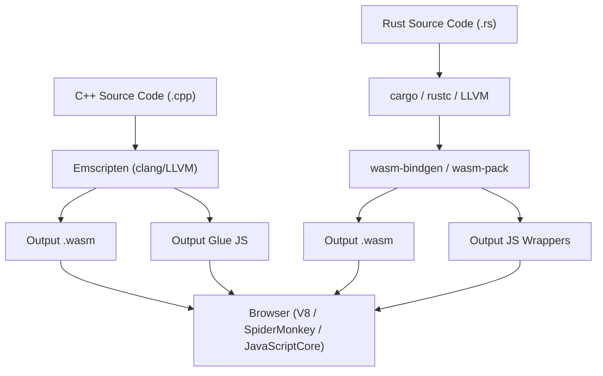
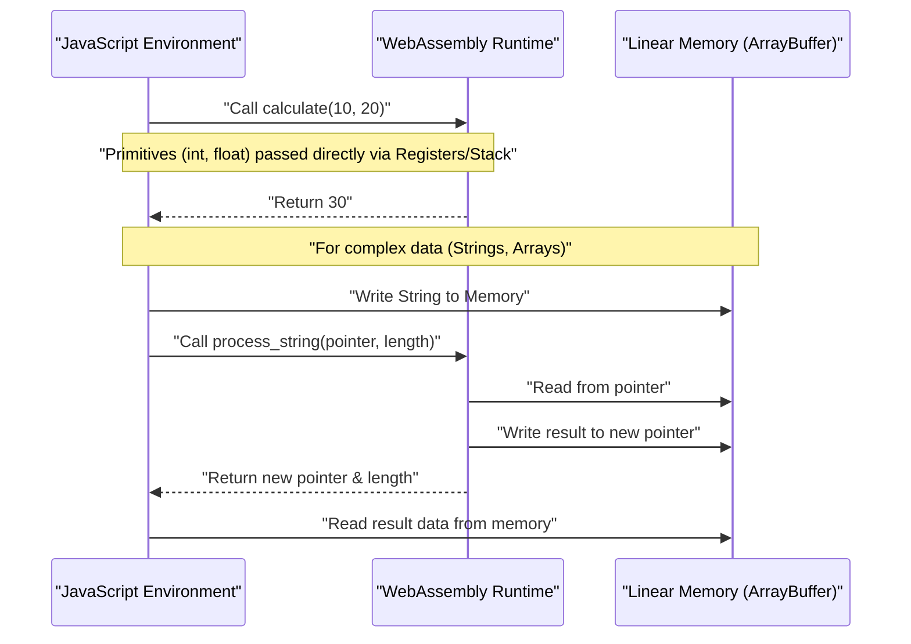
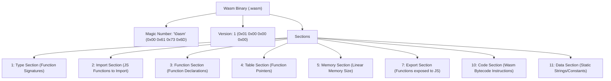

## 1. はじめに

モダンなWeb開発において、JavaScript（およびTypeScript）は長らくブラウザ上で動作する唯一のプログラミング言語としての地位を確立してきました。しかし、近年ではブラウザ上でより高度な計算、例えば画像処理や動画のエンコード、3Dゲーム、物理シミュレーションなどをブラウザ単体で実行する需要が高まっています。そこで登場したのが **WebAssembly (通称 Wasm)** です。

本記事では、WebAssemblyの基礎から始まり、C++（Emscriptenを使用）およびRust（`wasm-pack`を使用）という二つの強力なシステムプログラミング言語からWasmを出力し、JavaScript環境と連携させるための詳細な手順と内部構造を解説します。さらに、メモリ境界の管理、文字列や配列などの複雑なデータの受け渡し方、パフォーマンスにおけるオーバーヘッド、そしてWasmのバイナリフォーマット（`.wasm`）に至るまで、徹底的に深掘りしていきます。

## 2. WebAssembly (Wasm) の概要とアーキテクチャ

WebAssemblyは、スタックベースの仮想マシン用のバイナリ命令フォーマットです。C/C++、Rust、Go、Zigなどの言語からコンパイル可能な「ポータブルなコンパイルターゲット」として設計されており、Webブラウザ上でネイティブに近い速度で実行することを目的としています。

以下の図は、C++とRustからWebAssemblyが生成され、ブラウザ内で実行されるまでの大まかなツールチェインの流れを示しています。



WasmはJavaScriptを置き換えるものではありません。JavaScriptとともに動作し、計算負荷の高いタスクをWasmにオフロードすることで、互いの強みを活かす設計となっています。

## 3. 数学的な課題: マンデルブロ集合の計算

本記事では、CPUに高い負荷をかける「マンデルブロ集合 (Mandelbrot set)」の描画アルゴリズムを用いて、C++およびRustで実装を行います。

マンデルブロ集合は、次の複素漸化式で定義されます。

$$ z_{n+1} = z_n^2 + c $$

ここで、$z$ と $c$ は複素数であり、$z_0 = 0$ から計算を開始します。ある複素数 $c$ に対して、計算を無限に繰り返したときに $z_n$ の絶対値が発散しないような $c$ の集合がマンデルブロ集合です。一般的に、コンピュータ上で計算する場合は以下の条件で発散したとみなします。

$$ |z_n| > 2 $$

すなわち、実部 $x$ と虚部 $y$ に対して、次の条件を満たすかどうかを最大ループ回数（例えば $N = 1000$）まで判定します。

$$ x^2 + y^2 > 4 $$

## 4. C++とEmscriptenによるアプローチ

Emscriptenは、LLVMベースのコンパイラツールチェインであり、C/C++コードをWebAssemblyにコンパイルする際の事実上の標準です。POSIXのシステムコールをブラウザAPI（Web API）でエミュレートする強力なランタイムを提供しています。

### C++ 実装コード

以下のC++コードは、指定された幅と高さのマンデルブロ集合を計算し、その結果（各ピクセルの反復回数）を一次元配列に格納します。

```cpp
#include <emscripten/emscripten.h>
#include <vector>

// JavaScriptから呼び出せるようにCのリンケージを指定
extern "C" {

    // 計算結果を格納するバッファのポインタを返す
    EMSCRIPTEN_KEEPALIVE
    int* compute_mandelbrot(int width, int height, int max_iter) {
        // スタティック変数としてバッファを確保（簡易化のため）
        static std::vector<int> buffer;
        buffer.resize(width * height);

        for (int row = 0; row < height; ++row) {
            for (int col = 0; col < width; ++col) {
                double c_re = (col - width / 2.0) * 4.0 / width;
                double c_im = (row - height / 2.0) * 4.0 / width;
                double x = 0, y = 0;
                int iteration = 0;
                
                while (x*x + y*y <= 4 && iteration < max_iter) {
                    double x_new = x*x - y*y + c_re;
                    y = 2*x*y + c_im;
                    x = x_new;
                    iteration++;
                }
                buffer[row * width + col] = iteration;
            }
        }
        return buffer.data();
    }

    // メモリの解放関数（必要に応じて）
    EMSCRIPTEN_KEEPALIVE
    void free_buffer() {
        // ...
    }
}
```

### コンパイルとJavaScriptからの呼び出し

Emscriptenを用いてこのコードをコンパイルします。

```bash
emcc mandelbrot.cpp -O3 -s WASM=1 -s EXPORTED_FUNCTIONS="['_compute_mandelbrot', '_malloc', '_free']" -s EXPORTED_RUNTIME_METHODS="['ccall', 'cwrap']" -o mandelbrot.js
```

JavaScript側では、Emscriptenが生成したグルーコード (`mandelbrot.js`) を読み込み、以下のようにWebAssembly APIを利用して呼び出します。

```javascript
Module.onRuntimeInitialized = () => {
    const width = 800;
    const height = 600;
    const maxIter = 1000;

    // C++の関数を呼び出し、ポインタを取得
    const resultPtr = Module.ccall(
        'compute_mandelbrot', // C関数名
        'number',             // 戻り値の型 (ポインタはnumber)
        ['number', 'number', 'number'], // 引数の型
        [width, height, maxIter]
    );

    // リニアメモリ(Module.HEAP32)から配列データを直接読み取る
    const numElements = width * height;
    const resultView = new Int32Array(Module.HEAP32.buffer, resultPtr, numElements);

    console.log("計算完了。最初のピクセルデータ: " + resultView[0]);
};
```

## 5. Rustと`wasm-pack`によるアプローチ

RustはWebAssemblyのファーストクラスサポートを提供しており、`wasm-bindgen` および `wasm-pack` ツールを使用することで、JavaScriptとRustの間での高度な連携が可能です。Emscriptenが「C/C++の巨大なランタイムをブラウザに持ち込む」アプローチであるのに対し、Rustの `wasm-pack` は「必要最小限のバインディング（JSグルーコード）のみを生成する」アプローチをとります。

### Rust 実装コード

Cargoプロジェクトを作成し、`Cargo.toml` で `cdylib` と `wasm-bindgen` を指定します。

```toml
[lib]
crate-type = ["cdylib"]

[dependencies]
wasm-bindgen = "0.2"
```

次に、`src/lib.rs` に実装を記述します。

```rust
use wasm_bindgen::prelude::*;

#[wasm_bindgen]
pub fn compute_mandelbrot_rust(width: usize, height: usize, max_iter: u32) -> Vec<i32> {
    let mut buffer = vec![0; width * height];

    for row in 0..height {
        for col in 0..width {
            let c_re = (col as f64 - width as f64 / 2.0) * 4.0 / width as f64;
            let c_im = (row as f64 - height as f64 / 2.0) * 4.0 / width as f64;
            
            let mut x = 0.0;
            let mut y = 0.0;
            let mut iteration = 0;
            
            while x*x + y*y <= 4.0 && iteration < max_iter {
                let x_new = x*x - y*y + c_re;
                y = 2.0 * x * y + c_im;
                x = x_new;
                iteration += 1;
            }
            buffer[row * width + col] = iteration as i32;
        }
    }
    
    buffer
}
```

### コンパイルとJavaScriptからの呼び出し

`wasm-pack` コマンドでビルドします。

```bash
wasm-pack build --target web
```

生成されたパッケージをJavaScriptからインポートします。`wasm-bindgen` のおかげで、Rustの `Vec<i32>` が自動的にJavaScriptの `Int32Array` に変換されます（ポインタ操作の隠蔽）。

```javascript
import init, { compute_mandelbrot_rust } from './pkg/mandelbrot_wasm.js';

async function run() {
    await init(); // WebAssemblyモジュールの初期化

    const width = 800;
    const height = 600;
    const maxIter = 1000;

    // JavaScriptの配列として結果を直接受け取ることができる
    const resultView = compute_mandelbrot_rust(width, height, maxIter);
    
    console.log("計算完了。最初のピクセルデータ: " + resultView[0]);
}
run();
```

## 6. 深堀り: メモリ境界とデータ型の受け渡し

WebAssemblyにおける最も重要な概念の一つが「リニアメモリ (Linear Memory)」です。Wasmコードはホスト（ブラウザ）のメモリ空間に直接アクセスすることはできず、代わりに隔離された一つの巨大な `ArrayBuffer` を割り当てられます。これがリニアメモリです。



### 文字列と配列の渡し方

整数や浮動小数点数（`i32`, `i64`, `f32`, `f64`）はWasm関数に値として直接渡すことができます。しかし、文字列や配列、構造体などの複雑な型はWasmの関数シグネチャとしては直接渡せません。

**Emscriptenの場合**:
1. JS側で `Module._malloc` を呼び出し、Wasm側のリニアメモリ領域を確保する。
2. 確保したメモリアドレス（ポインタ）に JSから `Module.HEAPU8.set()` などでデータを書き込む。
3. ポインタをC++の関数に渡す。
4. 計算後、ポインタから結果をJS側で読み取り、最後に `Module._free` を呼ぶ。

**wasm-bindgen (Rust) の場合**:
上記の煩雑なメモリ管理のフローを、自動生成されるグルーコード（JSラッパー）内に完全に隠蔽します。JS側から単なる `String` や `Array` をRustの関数に渡すと、裏側でバッファの確保（`malloc`相当）、コピー、ポインタ渡し、メモリ解放といった一連の処理が自動的に行われます。

## 7. パフォーマンスのオーバーヘッドと最適化

WebAssemblyはネイティブに近い速度で実行できますが、「JavaScriptとWebAssemblyの境界を越える通信（Interop）」にはオーバーヘッドが存在します。

* **呼び出しオーバーヘッド**: JavaScriptエンジンがWasm関数を呼び出すためのスイッチングコストです。現在では大幅に最適化されていますが、非常に軽い関数を毎フレーム数万回呼び出すような設計は避けるべきです。
* **メモリコピーコスト**: 文字列や配列をWasmに渡す際、JSのガベージコレクション管理下のメモリから、Wasmのリニアメモリ（ArrayBuffer）へのデータのコピーが発生します。大容量のデータを渡す場合は、初めからWasmメモリ上でデータを構築し、JS側からはTypedArrayのビュー（`Uint8Array`など）を通してアクセスする「ゼロコピー」な設計が求められます。

例えば、ゲームエンジンや物理演算エンジンでは、すべての状態をWasmのリニアメモリ内に保持し、JavaScriptはフレームごとに「更新しろ」というトリガーと、画面描画（WebGL/WebGPU APIの呼び出し）のみを担当するというアーキテクチャが一般的です。

## 8. WebAssembly バイナリフォーマット (.wasm) の解剖

ここで、コンパイラが出力する `.wasm` ファイルの内部構造を見てみましょう。Wasmのバイナリは、拡張性とパース速度を重視して「セクション」と呼ばれる論理的なブロックの集合で構成されています。



ファイルのマジックナンバーは常に `0x00 0x61 0x73 0x6D` (`\0asm`) から始まります。これに続く各セクションはそれぞれIDを持ちます。

* **Type Section**: 使用されるすべての関数シグネチャ（引数と戻り値の型）を定義します。
* **Import Section**: JavaScript環境からWasmに提供される関数やメモリのリストです。例えば、`console.log` をC++から呼ぶ場合、ここで宣言されます。
* **Code Section**: 実際のバイトコード命令（`i32.add` や `call`、`loop` など）が格納されます。スタックマシンであるため、オペランドをスタックに積んで演算命令を呼ぶ形式です。
* **Data Section**: C++やRustのコード内で定義された静的な文字列リテラルや初期化データが、このセクションからリニアメモリにロードされます。

ブラウザのWasmエンジンは、これらのセクションをストリーミングコンパイル（ダウンロードしながら並行して機械語にコンパイル）することで、起動の劇的な高速化を実現しています。

## 9. C++ vs Rust: どちらを選ぶべきか？

WebAssemblyの生成において、C++とRustのどちらを選ぶかは、プロジェクトの要件と既存の資産に大きく依存します。

**C++ / Emscripten を選ぶべきケース**:
* 既存のC/C++ライブラリ（FFmpeg, OpenCV, SQLiteなど）をブラウザに移植したい場合。
* OpenGL等のグラフィックスAPIをWebGLに変換する機能（EmscriptenのGLエミュレーション層）をそのまま活用したいゲーム移植プロジェクト。
* ファイルシステムのエミュレーション（MEMFS）など、仮想化されたOS機能が必要な場合。

**Rust / wasm-pack を選ぶべきケース**:
* Webアプリケーションの一部として、ゼロから高パフォーマンスなモジュールを新規開発する場合。
* JavaScriptのエコシステム（NPMモジュールやTypeScript）との強固で型安全な連携が欲しい場合。
* 比較的小さなバイナリサイズと、セキュアなメモリ管理（Rustの所有権モデル）を求める場合。
* Cargoによる依存関係管理などのモダンなツールチェインを享受したい場合。

## 10. まとめ

WebAssemblyは、ブラウザの中で計算量の多い処理を実行するための革新的な技術です。C++とEmscriptenを用いたフルスタックなポーティングアプローチと、Rustとwasm-bindgenを用いたJavaScriptと密結合するモジュラーなアプローチの双方には、それぞれの強みがあります。

マンデルブロ集合のような計算において、WasmはJavaScript単体と比較して数倍から数十倍の速度向上が期待できます。ただし、WasmとJS間のメモリ境界の仕組みを正しく理解し、不要なメモリコピーを避ける設計を行わなければ、真のパフォーマンスを引き出すことはできません。

本記事を通じて、C++およびRustからWasmを出力しブラウザで実行する一連のフロー、そしてその背後にあるアーキテクチャの理解が深まれば幸いです。次世代のWebアプリケーション開発において、WebAssemblyは間違いなく強力な武器となるでしょう。
