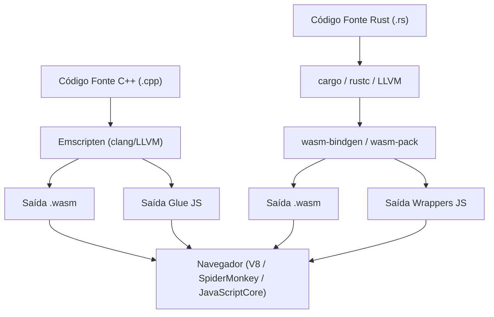
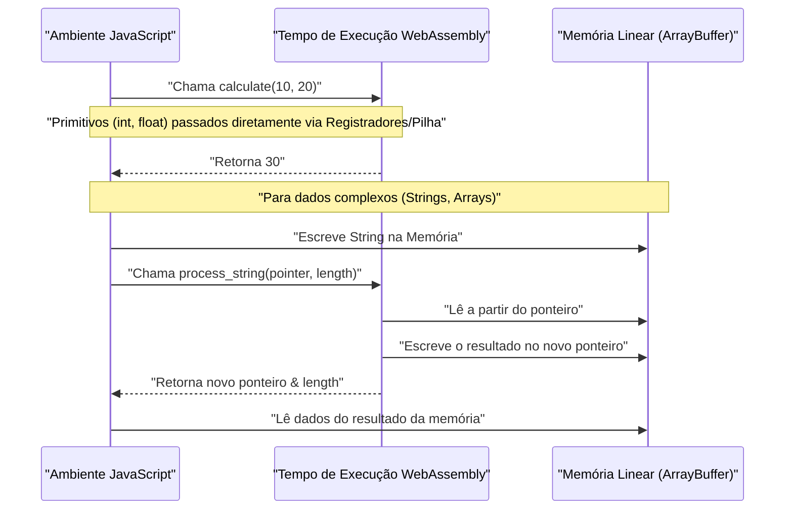
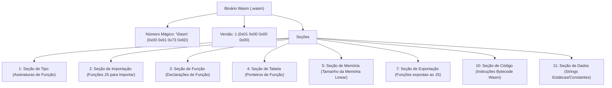

## 1. Introdução

No desenvolvimento Web moderno, o JavaScript (e TypeScript) há muito estabeleceu sua posição como a única linguagem de programação executada no navegador. No entanto, nos últimos anos, houve uma demanda crescente por cálculos mais avançados no navegador, como processamento de imagem, codificação de vídeo, jogos 3D e simulações físicas sendo executados apenas no navegador. É aí que entra o **WebAssembly (comumente conhecido como Wasm)**.

Neste artigo, começando com os fundamentos do WebAssembly, explicaremos a estrutura interna e os procedimentos detalhados para gerar Wasm a partir de duas poderosas linguagens de programação de sistemas: C++ (usando Emscripten) e Rust (usando `wasm-pack`), e integrá-lo ao ambiente JavaScript. Além disso, nos aprofundaremos no gerenciamento de limites de memória, como passar dados complexos como strings e arrays, sobrecarga de desempenho e o formato binário Wasm (`.wasm`).

## 2. Visão Geral e Arquitetura do WebAssembly (Wasm)

O WebAssembly é um formato de instrução binária para uma máquina virtual baseada em pilha. Ele foi projetado como um "alvo de compilação portátil" que pode ser compilado a partir de linguagens como C/C++, Rust, Go, Zig, etc., e tem como objetivo ser executado em velocidades quase nativas em navegadores da Web.

A figura abaixo mostra o fluxo geral da cadeia de ferramentas desde a geração do WebAssembly a partir de C++ e Rust até sua execução no navegador.



Wasm não é um substituto para o JavaScript. Ele foi projetado para trabalhar junto com o JavaScript, aproveitando os pontos fortes de ambos, transferindo tarefas de computação pesada para o Wasm.

## 3. Desafio Matemático: Cálculo do Conjunto de Mandelbrot

Neste artigo, usaremos o algoritmo de renderização do "Conjunto de Mandelbrot", que impõe uma carga pesada na CPU, e o implementaremos em C++ e Rust.

O conjunto de Mandelbrot é definido pela seguinte relação de recorrência complexa:

$$ z_{n+1} = z_n^2 + c $$

Aqui, $z$ e $c$ são números complexos, e o cálculo começa com $z_0 = 0$. O conjunto de Mandelbrot é o conjunto de números complexos $c$ para os quais o valor absoluto de $z_n$ não diverge quando o cálculo é repetido infinitamente. Geralmente, ao calcular em um computador, considera-se que divergirá nas seguintes condições:

$$ |z_n| > 2 $$

Ou seja, para as partes real $x$ e imaginária $y$, é determinado se a seguinte condição é atendida até um número máximo de loops (por exemplo, $N = 1000$):

$$ x^2 + y^2 > 4 $$

## 4. Abordagem com C++ e Emscripten

O Emscripten é uma cadeia de ferramentas de compilação baseada em LLVM e o padrão de fato para compilar código C/C++ em WebAssembly. Ele fornece um ambiente de execução poderoso que emula chamadas do sistema POSIX com APIs de navegador (Web APIs).

### Código de Implementação C++

O seguinte código C++ calcula o conjunto de Mandelbrot para uma largura e altura especificadas e armazena o resultado (a contagem de iteração para cada pixel) em um array unidimensional.

```cpp
#include <emscripten/emscripten.h>
#include <vector>

// Especifica a ligação C para que possa ser chamado a partir do JavaScript
extern "C" {

    // Retorna um ponteiro para o buffer armazenando o resultado do cálculo
    EMSCRIPTEN_KEEPALIVE
    int* compute_mandelbrot(int width, int height, int max_iter) {
        // Aloca o buffer como uma variável estática (para simplificação)
        static std::vector<int> buffer;
        buffer.resize(width * height);

        for (int row = 0; row < height; ++row) {
            for (int col = 0; col < width; ++col) {
                double c_re = (col - width / 2.0) * 4.0 / width;
                double c_im = (row - height / 2.0) * 4.0 / width;
                double x = 0, y = 0;
                int iteration = 0;
                
                while (x*x + y*y <= 4 && iteration < max_iter) {
                    double x_new = x*x - y*y + c_re;
                    y = 2*x*y + c_im;
                    x = x_new;
                    iteration++;
                }
                buffer[row * width + col] = iteration;
            }
        }
        return buffer.data();
    }

    // Função para liberar a memória (se necessário)
    EMSCRIPTEN_KEEPALIVE
    void free_buffer() {
        // ...
    }
}
```

### Compilação e Chamada a partir do JavaScript

Vamos compilar este código usando o Emscripten.

```bash
emcc mandelbrot.cpp -O3 -s WASM=1 -s EXPORTED_FUNCTIONS="['_compute_mandelbrot', '_malloc', '_free']" -s EXPORTED_RUNTIME_METHODS="['ccall', 'cwrap']" -o mandelbrot.js
```

No lado do JavaScript, nós carregamos o código glue gerado pelo Emscripten (`mandelbrot.js`) e o chamamos usando a API do WebAssembly da seguinte forma.

```javascript
Module.onRuntimeInitialized = () => {
    const width = 800;
    const height = 600;
    const maxIter = 1000;

    // Chama a função C++ e obtém o ponteiro
    const resultPtr = Module.ccall(
        'compute_mandelbrot', // Nome da função C
        'number',             // Tipo de retorno (ponteiro é número)
        ['number', 'number', 'number'], // Tipos dos argumentos
        [width, height, maxIter]
    );

    // Lê os dados do array diretamente da memória linear (Module.HEAP32)
    const numElements = width * height;
    const resultView = new Int32Array(Module.HEAP32.buffer, resultPtr, numElements);

    console.log("Cálculo concluído. Dados do primeiro pixel: " + resultView[0]);
};
```

## 5. Abordagem com Rust e `wasm-pack`

O Rust oferece suporte de primeira classe ao WebAssembly, e utilizando ferramentas como `wasm-bindgen` e `wasm-pack`, é possível obter uma integração avançada entre JavaScript e Rust. Enquanto o Emscripten adota a abordagem de "trazer o enorme ambiente de execução C/C++ para o navegador", o `wasm-pack` do Rust segue a abordagem de "gerar apenas o mínimo necessário de bindings (código glue JS)".

### Código de Implementação Rust

Crie um projeto Cargo e especifique `cdylib` e `wasm-bindgen` no `Cargo.toml`.

```toml
[lib]
crate-type = ["cdylib"]

[dependencies]
wasm-bindgen = "0.2"
```

Em seguida, escreva a implementação no `src/lib.rs`.

```rust
use wasm_bindgen::prelude::*;

#[wasm_bindgen]
pub fn compute_mandelbrot_rust(width: usize, height: usize, max_iter: u32) -> Vec<i32> {
    let mut buffer = vec![0; width * height];

    for row in 0..height {
        for col in 0..width {
            let c_re = (col as f64 - width as f64 / 2.0) * 4.0 / width as f64;
            let c_im = (row as f64 - height as f64 / 2.0) * 4.0 / width as f64;
            
            let mut x = 0.0;
            let mut y = 0.0;
            let mut iteration = 0;
            
            while x*x + y*y <= 4.0 && iteration < max_iter {
                let x_new = x*x - y*y + c_re;
                y = 2.0 * x * y + c_im;
                x = x_new;
                iteration += 1;
            }
            buffer[row * width + col] = iteration as i32;
        }
    }
    
    buffer
}
```

### Compilação e Chamada a partir do JavaScript

Compile com o comando `wasm-pack`.

```bash
wasm-pack build --target web
```

Importe o pacote gerado pelo JavaScript. Graças ao `wasm-bindgen`, o `Vec<i32>` do Rust é automaticamente convertido em `Int32Array` do JavaScript (ocultando a manipulação de ponteiros).

```javascript
import init, { compute_mandelbrot_rust } from './pkg/mandelbrot_wasm.js';

async function run() {
    await init(); // Inicialização do módulo WebAssembly

    const width = 800;
    const height = 600;
    const maxIter = 1000;

    // Pode receber o resultado diretamente como um array JavaScript
    const resultView = compute_mandelbrot_rust(width, height, maxIter);
    
    console.log("Cálculo concluído. Dados do primeiro pixel: " + resultView[0]);
}
run();
```

## 6. Aprofundamento: Limites de Memória e Passagem de Tipos de Dados

Um dos conceitos mais importantes no WebAssembly é a "Memória Linear" (Linear Memory). O código Wasm não pode acessar diretamente o espaço de memória do hospedeiro (navegador); em vez disso, a ele é alocado um único e enorme `ArrayBuffer` isolado. Esta é a memória linear.



### Como passar Strings e Arrays

Números inteiros e de ponto flutuante (`i32`, `i64`, `f32`, `f64`) podem ser passados diretamente como valores para funções Wasm. No entanto, tipos complexos como strings, arrays e estruturas não podem ser passados diretamente como parte da assinatura da função Wasm.

**No caso do Emscripten**:
1. Chama-se `Module._malloc` do lado do JS para alocar uma área de memória linear no lado do Wasm.
2. Escreve-se dados no endereço de memória (ponteiro) alocado do JS usando `Module.HEAPU8.set()`, etc.
3. Passa-se o ponteiro para a função C++.
4. Após o cálculo, lê-se o resultado a partir do ponteiro no lado JS e, finalmente, chama-se `Module._free`.

**No caso do wasm-bindgen (Rust)**:
Oculta completamente o fluxo tedioso de gerenciamento de memória acima no código glue (wrapper JS) gerado automaticamente. Ao passar um simples `String` ou `Array` do lado JS para a função Rust, uma série de operações, como alocação de buffer (equivalente ao `malloc`), cópia, passagem de ponteiros e liberação de memória são realizadas automaticamente nos bastidores.

## 7. Sobrecarga de Desempenho e Otimização

O WebAssembly pode ser executado em velocidades quase nativas, mas há uma sobrecarga na "comunicação (Interop) que cruza o limite entre o JavaScript e o WebAssembly".

* **Sobrecarga de chamada**: Este é o custo de comutação para a engine JavaScript chamar funções Wasm. Embora seja amplamente otimizado agora, deve-se evitar projetos que chamam funções extremamente leves dezenas de milhares de vezes por quadro.
* **Custo de cópia de memória**: Ao passar strings ou arrays para o Wasm, há a cópia de dados da memória gerenciada pela coleta de lixo (garbage collection) do JS para a memória linear (ArrayBuffer) do Wasm. Ao passar grandes quantidades de dados, é necessária uma abordagem de "cópia zero" em que os dados são construídos na memória Wasm desde o início e acessados por meio de uma visão TypedArray (como `Uint8Array`) do lado JS.

Por exemplo, em engines de jogos ou de cálculo físico, é comum uma arquitetura em que todo o estado é mantido dentro da memória linear do Wasm, e o JavaScript é responsável apenas por um gatilho de "atualização" a cada quadro e pelo desenho da tela (chamando APIs WebGL/WebGPU).

## 8. Anatomia do Formato Binário WebAssembly (.wasm)

Aqui, vamos dar uma olhada na estrutura interna do arquivo `.wasm` gerado pelo compilador. Os binários Wasm consistem em uma coleção de blocos lógicos chamados "Seções", que priorizam a extensibilidade e a velocidade de análise.



O número mágico do arquivo sempre começa com `0x00 0x61 0x73 0x6D` (`\0asm`). Cada seção a seguir tem seu próprio ID.

* **Seção de Tipo**: Define as assinaturas de todas as funções utilizadas (tipos de argumentos e valores de retorno).
* **Seção de Importação**: Uma lista de funções e memórias fornecidas pelo ambiente JavaScript para o Wasm. Por exemplo, ao chamar o `console.log` a partir do C++, ele é declarado aqui.
* **Seção de Código**: Armazena as instruções reais do bytecode (como `i32.add`, `call`, `loop`, etc.). Sendo uma máquina de pilha, tem o formato de empurrar os operandos para a pilha e chamar as instruções operacionais.
* **Seção de Dados**: Literais de strings estáticas e dados de inicialização definidos dentro do código C++ ou Rust são carregados nesta seção na memória linear.

A engine Wasm do navegador alcança uma velocidade de inicialização drasticamente acelerada pela compilação em fluxo (streaming compilation) destas seções (compilando em código de máquina paralelamente enquanto faz o download).

## 9. C++ vs Rust: Qual escolher?

Na geração do WebAssembly, a escolha entre C++ ou Rust depende fortemente dos requisitos do projeto e dos ativos existentes.

**Casos em que você deve escolher C++ / Emscripten**:
* Quando deseja portar bibliotecas C/C++ existentes (FFmpeg, OpenCV, SQLite, etc.) para o navegador.
* Projetos de portabilidade de jogos em que deseja usar diretamente a funcionalidade de conversão de APIs gráficas como o OpenGL para o WebGL (a camada de emulação GL do Emscripten).
* Quando são necessárias funcionalidades de SO virtualizadas, como emulação do sistema de arquivos (MEMFS).

**Casos em que você deve escolher Rust / wasm-pack**:
* Ao desenvolver módulos novos de alto desempenho do zero como parte de uma aplicação Web.
* Quando deseja uma integração forte e com segurança de tipos com o ecossistema JavaScript (módulos NPM e TypeScript).
* Ao procurar um tamanho de binário relativamente pequeno e gerenciamento de memória seguro (modelo de propriedade do Rust).
* Quando deseja desfrutar de uma cadeia de ferramentas moderna, como gerenciamento de dependências através do Cargo.

## 10. Conclusão

O WebAssembly é uma tecnologia inovadora para executar processos com uso intenso de cálculos dentro do navegador. A abordagem de portabilidade full-stack usando C++ e Emscripten e a abordagem modular estritamente acoplada ao JavaScript usando Rust e wasm-bindgen, cada uma tem seus próprios pontos fortes.

Em cálculos como o conjunto de Mandelbrot, o Wasm pode esperar melhorias de velocidade de várias a dezenas de vezes em comparação ao JavaScript puro. No entanto, o verdadeiro desempenho não pode ser extraído a menos que a mecânica dos limites de memória entre Wasm e JS seja corretamente compreendida e o sistema seja projetado para evitar cópias desnecessárias de memória.

Através deste artigo, esperamos que você compreenda melhor todo o fluxo de produção de Wasm a partir de C++ e Rust e sua execução no navegador, bem como a arquitetura por trás disso. No desenvolvimento de aplicações Web de próxima geração, o WebAssembly será sem dúvida uma arma poderosa.
