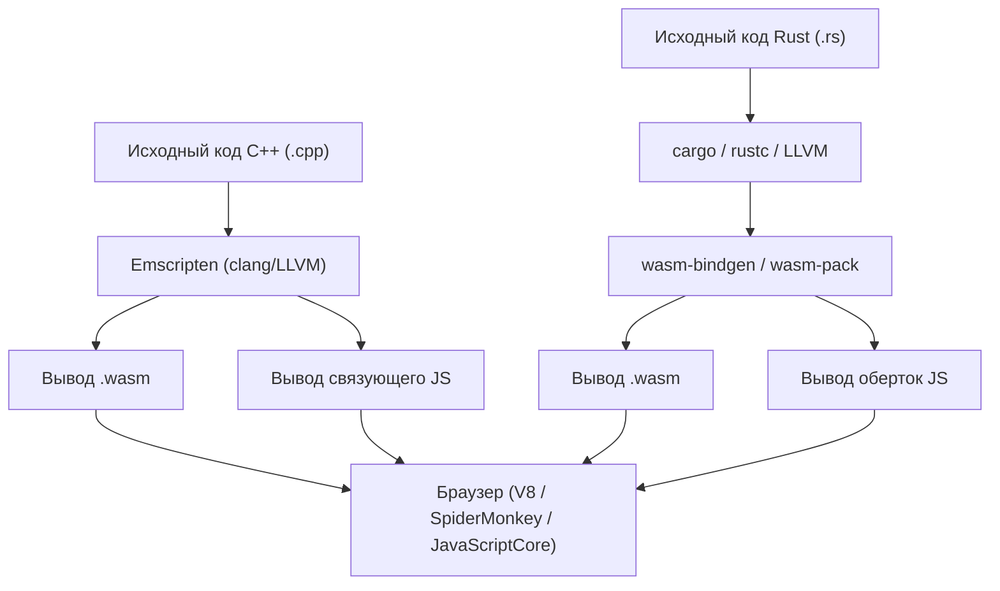
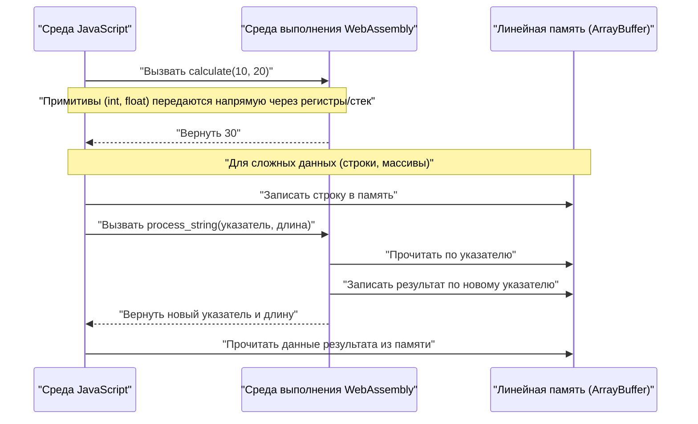
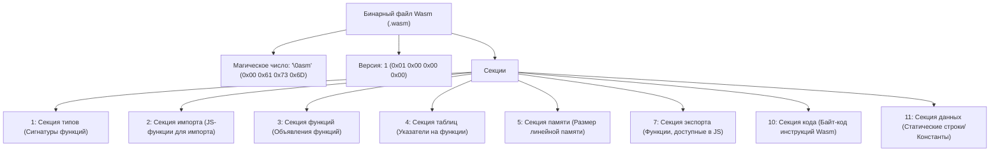

## 1. Введение

В современной веб-разработке JavaScript (и TypeScript) долгое время удерживал позицию единственного языка программирования, работающего в браузере. Однако в последние годы растет потребность в выполнении более сложных вычислений, таких как обработка изображений, кодирование видео, 3D-игры и физические симуляции, непосредственно в самом браузере. Именно здесь на сцену выходит **WebAssembly (сокращенно Wasm)**.

В этой статье мы начнем с основ WebAssembly и подробно объясним внутреннюю структуру и шаги для компиляции Wasm из двух мощных языков системного программирования: C++ (с использованием Emscripten) и Rust (с использованием `wasm-pack`), а также их интеграцию со средой JavaScript. Кроме того, мы глубоко погрузимся в управление границами памяти, передачу сложных данных (таких как строки и массивы), накладные расходы на производительность и бинарный формат Wasm (`.wasm`).

## 2. Обзор и архитектура WebAssembly (Wasm)

WebAssembly — это бинарный формат инструкций для виртуальной машины на основе стека. Он разработан как «переносимая цель компиляции» для таких языков, как C/C++, Rust, Go и Zig, и предназначен для выполнения в веб-браузерах со скоростью, близкой к нативной.

На следующей диаграмме показан общий процесс цепочки инструментов от исходного кода на C++ и Rust до генерации WebAssembly и его выполнения в браузере.



Wasm не заменяет JavaScript. Он разработан для работы вместе с JavaScript, позволяя переносить ресурсоемкие задачи на Wasm и тем самым использовать сильные стороны каждой из технологий.

## 3. Математическая задача: Вычисление множества Мандельброта

В этой статье мы используем алгоритм отрисовки «множества Мандельброта (Mandelbrot set)», создающий высокую нагрузку на CPU, и реализуем его на C++ и Rust.

Множество Мандельброта определяется следующим рекуррентным соотношением для комплексных чисел:

$$ z_{n+1} = z_n^2 + c $$

Здесь $z$ и $c$ — комплексные числа, вычисление начинается с $z_0 = 0$. Множество Мандельброта — это множество таких комплексных чисел $c$, для которых при бесконечном повторении вычислений абсолютное значение $z_n$ не стремится к бесконечности. Обычно при вычислениях на компьютере считается, что значение стремится к бесконечности при выполнении следующего условия:

$$ |z_n| > 2 $$

То есть для действительной части $x$ и мнимой части $y$ мы проверяем выполнение следующего условия до достижения максимального числа итераций (например, $N = 1000$):

$$ x^2 + y^2 > 4 $$

## 4. Подход с использованием C++ и Emscripten

Emscripten — это набор инструментов компилятора на базе LLVM, де-факто являющийся стандартом для компиляции кода C/C++ в WebAssembly. Он предоставляет мощную среду выполнения, которая эмулирует системные вызовы POSIX с помощью браузерных API (Web API).

### Реализация кода на C++

Следующий код на C++ вычисляет множество Мандельброта заданной ширины и высоты и сохраняет результаты (количество итераций для каждого пикселя) в одномерный массив.

```cpp
#include <emscripten/emscripten.h>
#include <vector>

// Указываем C-связывание, чтобы функцию можно было вызвать из JavaScript
extern "C" {

    // Возвращает указатель на буфер, в котором сохраняются результаты вычислений
    EMSCRIPTEN_KEEPALIVE
    int* compute_mandelbrot(int width, int height, int max_iter) {
        // Выделение буфера как статической переменной (для упрощения)
        static std::vector<int> buffer;
        buffer.resize(width * height);

        for (int row = 0; row < height; ++row) {
            for (int col = 0; col < width; ++col) {
                double c_re = (col - width / 2.0) * 4.0 / width;
                double c_im = (row - height / 2.0) * 4.0 / width;
                double x = 0, y = 0;
                int iteration = 0;
                
                while (x*x + y*y <= 4 && iteration < max_iter) {
                    double x_new = x*x - y*y + c_re;
                    y = 2*x*y + c_im;
                    x = x_new;
                    iteration++;
                }
                buffer[row * width + col] = iteration;
            }
        }
        return buffer.data();
    }

    // Функция освобождения памяти (при необходимости)
    EMSCRIPTEN_KEEPALIVE
    void free_buffer() {
        // ...
    }
}
```

### Компиляция и вызов из JavaScript

Скомпилируем этот код с помощью Emscripten.

```bash
emcc mandelbrot.cpp -O3 -s WASM=1 -s EXPORTED_FUNCTIONS="['_compute_mandelbrot', '_malloc', '_free']" -s EXPORTED_RUNTIME_METHODS="['ccall', 'cwrap']" -o mandelbrot.js
```

На стороне JavaScript мы загружаем связующий код (`mandelbrot.js`), сгенерированный Emscripten, и используем API WebAssembly для вызова функции, как показано ниже:

```javascript
Module.onRuntimeInitialized = () => {
    const width = 800;
    const height = 600;
    const maxIter = 1000;

    // Вызываем функцию C++ и получаем указатель
    const resultPtr = Module.ccall(
        'compute_mandelbrot', // Имя функции C
        'number',             // Тип возвращаемого значения (указатель — это number)
        ['number', 'number', 'number'], // Типы аргументов
        [width, height, maxIter]
    );

    // Считываем данные массива напрямую из линейной памяти (Module.HEAP32)
    const numElements = width * height;
    const resultView = new Int32Array(Module.HEAP32.buffer, resultPtr, numElements);

    console.log("Вычисление завершено. Данные первого пикселя: " + resultView[0]);
};
```

## 5. Подход с использованием Rust и `wasm-pack`

Rust предлагает первоклассную поддержку WebAssembly, а инструменты `wasm-bindgen` и `wasm-pack` обеспечивают глубокую интеграцию между JavaScript и Rust. В то время как Emscripten использует подход «привнесения огромной среды выполнения C/C++ в браузер», Rust с `wasm-pack` использует подход «генерации только необходимого минимума привязок (связующего JS-кода)».

### Реализация кода на Rust

Создайте проект Cargo и укажите `cdylib` и `wasm-bindgen` в `Cargo.toml`.

```toml
[lib]
crate-type = ["cdylib"]

[dependencies]
wasm-bindgen = "0.2"
```

Затем напишите реализацию в `src/lib.rs`.

```rust
use wasm_bindgen::prelude::*;

#[wasm_bindgen]
pub fn compute_mandelbrot_rust(width: usize, height: usize, max_iter: u32) -> Vec<i32> {
    let mut buffer = vec![0; width * height];

    for row in 0..height {
        for col in 0..width {
            let c_re = (col as f64 - width as f64 / 2.0) * 4.0 / width as f64;
            let c_im = (row as f64 - height as f64 / 2.0) * 4.0 / width as f64;
            
            let mut x = 0.0;
            let mut y = 0.0;
            let mut iteration = 0;
            
            while x*x + y*y <= 4.0 && iteration < max_iter {
                let x_new = x*x - y*y + c_re;
                y = 2.0 * x * y + c_im;
                x = x_new;
                iteration += 1;
            }
            buffer[row * width + col] = iteration as i32;
        }
    }
    
    buffer
}
```

### Компиляция и вызов из JavaScript

Соберите проект с помощью команды `wasm-pack`.

```bash
wasm-pack build --target web
```

Импортируйте сгенерированный пакет из JavaScript. Благодаря `wasm-bindgen`, тип Rust `Vec<i32>` автоматически конвертируется в JavaScript `Int32Array` (скрывая операции с указателями).

```javascript
import init, { compute_mandelbrot_rust } from './pkg/mandelbrot_wasm.js';

async function run() {
    await init(); // Инициализация модуля WebAssembly

    const width = 800;
    const height = 600;
    const maxIter = 1000;

    // Результат можно получить напрямую в виде массива JavaScript
    const resultView = compute_mandelbrot_rust(width, height, maxIter);
    
    console.log("Вычисление завершено. Данные первого пикселя: " + resultView[0]);
}
run();
```

## 6. Глубокое погружение: Границы памяти и передача типов данных

Одна из самых важных концепций в WebAssembly — это «линейная память (Linear Memory)». Код Wasm не может напрямую обращаться к адресному пространству хоста (браузера); вместо этого ему выделяется один огромный изолированный `ArrayBuffer`. Это и есть линейная память.



### Как передавать строки и массивы

Целые числа и числа с плавающей запятой (`i32`, `i64`, `f32`, `f64`) можно напрямую передавать в функции Wasm как значения. Однако сложные типы, такие как строки, массивы или структуры, не могут быть напрямую переданы в качестве сигнатуры функции Wasm.

**В случае Emscripten**:
1. Вызовите `Module._malloc` на стороне JS, чтобы выделить область линейной памяти Wasm.
2. Запишите данные по выделенному адресу памяти (указателю) из JS, например, используя `Module.HEAPU8.set()`.
3. Передайте указатель в функцию C++.
4. После вычисления прочитайте результат по указателю на стороне JS и, наконец, вызовите `Module._free`.

**В случае wasm-bindgen (Rust)**:
Сложный процесс управления памятью, описанный выше, полностью скрыт в автоматически сгенерированном связующем коде (обертке JS). Если передать простой объект `String` или `Array` со стороны JS в функцию Rust, за кулисами автоматически выполняются выделение буфера (эквивалент `malloc`), копирование, передача указателей и освобождение памяти.

## 7. Накладные расходы производительности и оптимизация

WebAssembly может выполняться со скоростью, близкой к нативной, но существует накладной расход на «пересечение границы между JavaScript и WebAssembly (Interop)».

* **Накладные расходы вызова**: Затраты на переключение, когда движок JavaScript вызывает функцию Wasm. Хотя сейчас это значительно оптимизировано, следует избегать архитектуры, в которой очень легкие функции вызываются десятки тысяч раз за кадр.
* **Затраты на копирование памяти**: При передаче строк или массивов в Wasm происходит копирование данных из памяти, управляемой сборщиком мусора JS, в линейную память Wasm (ArrayBuffer). При передаче больших объемов данных требуется проектирование «zero-copy», при котором данные изначально создаются в памяти Wasm, а доступ к ним со стороны JS осуществляется через представления TypedArray (например, `Uint8Array`).

Например, в игровых движках и движках физических расчетов распространена архитектура, в которой все состояния хранятся в линейной памяти Wasm, а JavaScript отвечает только за триггер обновления («обновить на каждом кадре») и за отрисовку экрана (вызов API WebGL/WebGPU).

## 8. Анатомия бинарного формата WebAssembly (.wasm)

Здесь мы рассмотрим внутреннюю структуру файла `.wasm`, генерируемого компилятором. Бинарный файл Wasm состоит из набора логических блоков, называемых «секциями» (sections), с упором на расширяемость и скорость парсинга.



Магическое число файла всегда начинается с `0x00 0x61 0x73 0x6D` (`\0asm`). За ним следуют секции, каждая из которых имеет свой ID.

* **Type Section (Секция типов)**: Определяет все используемые сигнатуры функций (типы аргументов и возвращаемых значений).
* **Import Section (Секция импорта)**: Список функций и памяти, предоставляемых среде Wasm из JavaScript. Например, если вы вызываете `console.log` из C++, это объявляется здесь.
* **Code Section (Секция кода)**: Содержит фактические инструкции байт-кода (такие как `i32.add`, `call`, `loop` и т.д.). Поскольку это стековая машина, операции выполняются путем помещения операндов в стек и вызова инструкций.
* **Data Section (Секция данных)**: Статические строковые литералы и данные инициализации, определенные в коде C++ или Rust, загружаются из этой секции в линейную память.

Движки Wasm в браузерах реализуют потоковую компиляцию этих секций (компиляция в машинный код параллельно с загрузкой), что обеспечивает невероятно быстрый запуск.

## 9. C++ против Rust: что выбрать?

Выбор между C++ и Rust для генерации WebAssembly во многом зависит от требований проекта и существующих активов.

**Случаи, когда следует выбрать C++ / Emscripten**:
* Если вы хотите перенести в браузер существующие библиотеки C/C++ (такие как FFmpeg, OpenCV, SQLite).
* Проекты портирования игр, где вы хотите использовать слои эмуляции графических API, например OpenGL в WebGL (слой эмуляции GL в Emscripten).
* Если необходимы виртуализированные функции ОС, такие как эмуляция файловой системы (MEMFS).

**Случаи, когда следует выбрать Rust / wasm-pack**:
* Если вы разрабатываете с нуля новые высокопроизводительные модули как часть веб-приложения.
* Если вам нужна прочная, типобезопасная интеграция с экосистемой JavaScript (NPM модули и TypeScript).
* Если вам нужен сравнительно небольшой размер бинарного файла и безопасное управление памятью (модель владения Rust).
* Если вы хотите использовать преимущества современных наборов инструментов, таких как управление зависимостями через Cargo.

## 10. Заключение

WebAssembly — это инновационная технология для выполнения ресурсоемких задач в браузере. Как full-stack подход с портированием с использованием C++ и Emscripten, так и модульный подход, тесно связанный с JavaScript с использованием Rust и wasm-bindgen, имеют свои сильные стороны.

Для таких вычислений, как множество Мандельброта, можно ожидать, что Wasm обеспечит ускорение от нескольких раз до десятков раз по сравнению с использованием только JavaScript. Однако истинной производительности можно добиться только при правильном понимании механизма границ памяти между Wasm и JS и проектировании архитектуры, избегающей ненужных копирований памяти.

Надеемся, что эта статья помогла вам глубже понять весь процесс компиляции и запуска Wasm из C++ и Rust в браузере, а также стоящую за этим архитектуру. При разработке веб-приложений следующего поколения WebAssembly несомненно станет мощным инструментом.
