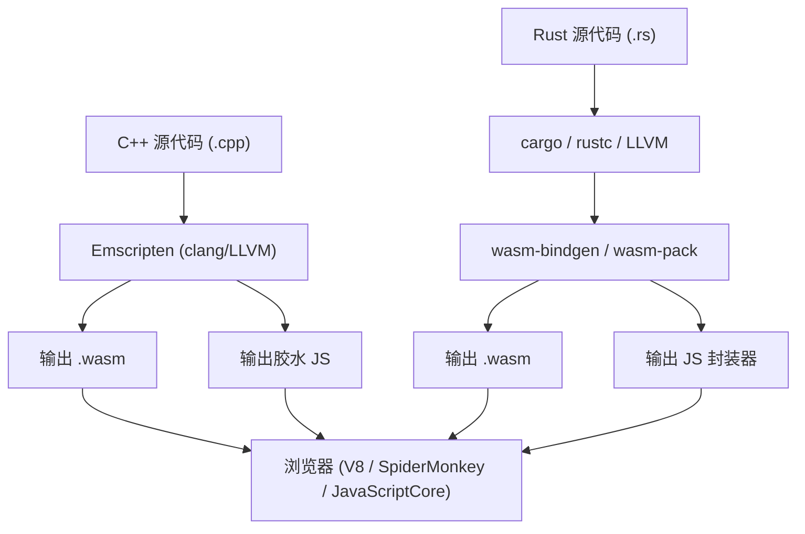
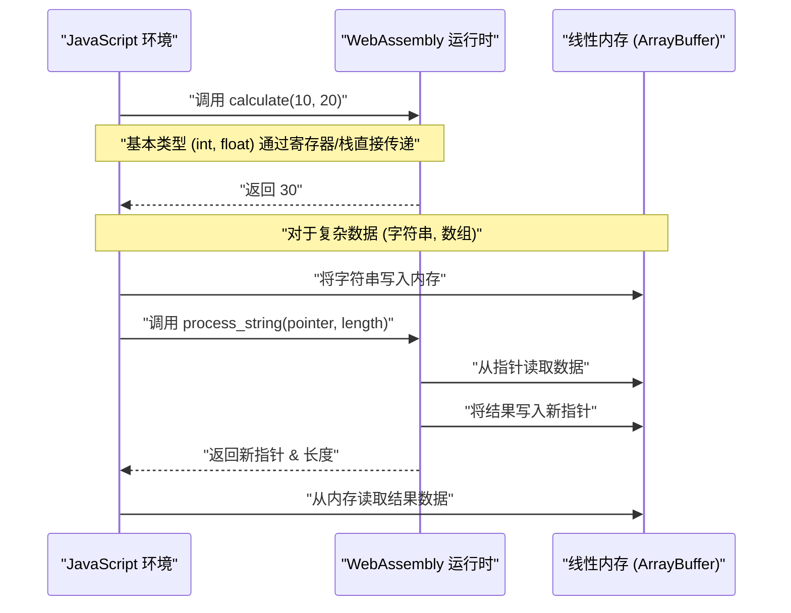
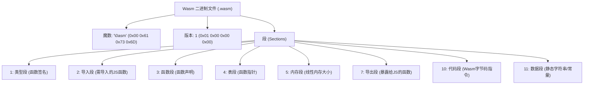

## 1. 简介

在现代Web开发中，JavaScript（和TypeScript）长期确立了作为在浏览器上运行的唯一编程语言的地位。然而，近年来，直接在浏览器上执行更高级的计算需求不断增加，例如图像处理、视频编码、3D游戏和物理模拟等。因此，**WebAssembly (简称 Wasm)** 应运而生。

本文将从WebAssembly的基础讲起，详细解说如何通过C++（使用Emscripten）和Rust（使用`wasm-pack`）这两种强大的系统编程语言导出Wasm，并与JavaScript环境进行集成的具体步骤和内部结构。此外，我们还将深入探讨内存边界管理、字符串和数组等复杂数据的传递方式、性能开销以及Wasm的二进制格式（`.wasm`）。

## 2. WebAssembly (Wasm) 的概述与架构

WebAssembly 是一种基于栈式虚拟机的二进制指令格式。它被设计为可从 C/C++、Rust、Go、Zig 等语言编译的“可移植编译目标”，旨在以接近原生的速度在Web浏览器中执行。

下图展示了从C++和Rust生成WebAssembly并在浏览器中运行的大致工具链流程。



Wasm并不是要取代JavaScript。它被设计为与JavaScript协同工作，通过将计算密集型任务卸载给Wasm，从而发挥各自的优势。

## 3. 数学挑战：计算曼德博集合（Mandelbrot set）

在本文中，我们将使用对CPU负载较高的“曼德博集合”的绘制算法，分别用C++和Rust进行实现。

曼德博集合由以下复数递推公式定义：

$$ z_{n+1} = z_n^2 + c $$

这里，$z$ 和 $c$ 是复数，从 $z_0 = 0$ 开始计算。对于某个复数 $c$，当计算无限重复时，$z_n$ 的绝对值不发散的 $c$ 的集合就是曼德博集合。通常，在计算机上进行计算时，如果满足以下条件，则认为其已经发散：

$$ |z_n| > 2 $$

即对于实部 $x$ 和虚部 $y$，判断其是否在最大循环次数（例如 $N = 1000$）内满足以下条件：

$$ x^2 + y^2 > 4 $$

## 4. 基于C++和Emscripten的方法

Emscripten是一个基于LLVM的编译器工具链，是将C/C++代码编译为WebAssembly的事实上的标准。它提供了一个强大的运行时，可以使用浏览器API（Web API）模拟POSIX系统调用。

### C++ 实现代码

以下C++代码将计算指定宽度和高度的曼德博集合，并将结果（每个像素的迭代次数）存储在一个一维数组中。

```cpp
#include <emscripten/emscripten.h>
#include <vector>

// 指定C链接，以便能够从JavaScript调用
extern "C" {

    // 返回存储计算结果的缓冲区的指针
    EMSCRIPTEN_KEEPALIVE
    int* compute_mandelbrot(int width, int height, int max_iter) {
        // 作为静态变量分配缓冲区（为了简化）
        static std::vector<int> buffer;
        buffer.resize(width * height);

        for (int row = 0; row < height; ++row) {
            for (int col = 0; col < width; ++col) {
                double c_re = (col - width / 2.0) * 4.0 / width;
                double c_im = (row - height / 2.0) * 4.0 / width;
                double x = 0, y = 0;
                int iteration = 0;
                
                while (x*x + y*y <= 4 && iteration < max_iter) {
                    double x_new = x*x - y*y + c_re;
                    y = 2*x*y + c_im;
                    x = x_new;
                    iteration++;
                }
                buffer[row * width + col] = iteration;
            }
        }
        return buffer.data();
    }

    // 释放内存的函数（根据需要）
    EMSCRIPTEN_KEEPALIVE
    void free_buffer() {
        // ...
    }
}
```

### 编译及从JavaScript调用

使用Emscripten编译此代码。

```bash
emcc mandelbrot.cpp -O3 -s WASM=1 -s EXPORTED_FUNCTIONS="['_compute_mandelbrot', '_malloc', '_free']" -s EXPORTED_RUNTIME_METHODS="['ccall', 'cwrap']" -o mandelbrot.js
```

在JavaScript端，加载Emscripten生成的胶水代码（`mandelbrot.js`），并按如下方式使用WebAssembly API进行调用。

```javascript
Module.onRuntimeInitialized = () => {
    const width = 800;
    const height = 600;
    const maxIter = 1000;

    // 调用C++函数，获取指针
    const resultPtr = Module.ccall(
        'compute_mandelbrot', // C函数名
        'number',             // 返回值类型 (指针是number)
        ['number', 'number', 'number'], // 参数类型
        [width, height, maxIter]
    );

    // 从线性内存(Module.HEAP32)中直接读取数组数据
    const numElements = width * height;
    const resultView = new Int32Array(Module.HEAP32.buffer, resultPtr, numElements);

    console.log("计算完成。第一个像素的数据: " + resultView[0]);
};
```

## 5. 基于Rust和`wasm-pack`的方法

Rust为WebAssembly提供了第一方支持，通过使用`wasm-bindgen`和`wasm-pack`工具，可以实现JavaScript和Rust之间的高度协同。Emscripten采用了“将庞大的C/C++运行时带入浏览器”的方法，而Rust的`wasm-pack`则采用了“只生成最低限度绑定的（JS胶水代码）”的方法。

### Rust 实现代码

创建一个Cargo项目，并在`Cargo.toml`中指定`cdylib`和`wasm-bindgen`。

```toml
[lib]
crate-type = ["cdylib"]

[dependencies]
wasm-bindgen = "0.2"
```

接下来，在`src/lib.rs`中编写实现。

```rust
use wasm_bindgen::prelude::*;

#[wasm_bindgen]
pub fn compute_mandelbrot_rust(width: usize, height: usize, max_iter: u32) -> Vec<i32> {
    let mut buffer = vec![0; width * height];

    for row in 0..height {
        for col in 0..width {
            let c_re = (col as f64 - width as f64 / 2.0) * 4.0 / width as f64;
            let c_im = (row as f64 - height as f64 / 2.0) * 4.0 / width as f64;
            
            let mut x = 0.0;
            let mut y = 0.0;
            let mut iteration = 0;
            
            while x*x + y*y <= 4.0 && iteration < max_iter {
                let x_new = x*x - y*y + c_re;
                y = 2.0 * x * y + c_im;
                x = x_new;
                iteration += 1;
            }
            buffer[row * width + col] = iteration as i32;
        }
    }
    
    buffer
}
```

### 编译及从JavaScript调用

使用`wasm-pack`命令进行构建。

```bash
wasm-pack build --target web
```

从JavaScript中导入生成的包。得益于`wasm-bindgen`，Rust的`Vec<i32>`会自动转换为JavaScript的`Int32Array`（隐藏了指针操作）。

```javascript
import init, { compute_mandelbrot_rust } from './pkg/mandelbrot_wasm.js';

async function run() {
    await init(); // 初始化WebAssembly模块

    const width = 800;
    const height = 600;
    const maxIter = 1000;

    // 作为JavaScript的数组直接接收结果
    const resultView = compute_mandelbrot_rust(width, height, maxIter);
    
    console.log("计算完成。第一个像素的数据: " + resultView[0]);
}
run();
```

## 6. 深入探讨：内存边界与数据类型的传递

WebAssembly中最重要的概念之一是“线性内存 (Linear Memory)”。Wasm代码无法直接访问主机（浏览器）的内存空间，取而代之的是为其分配了一个隔离的、巨大的`ArrayBuffer`。这就是线性内存。



### 字符串与数组的传递方式

整数和浮点数（`i32`、`i64`、`f32`、`f64`）可以作为值直接传递给Wasm函数。然而，字符串、数组和结构体等复杂类型不能直接通过Wasm的函数签名传递。

**在Emscripten中**：
1. 在JS端调用`Module._malloc`，分配Wasm端的线性内存区域。
2. JS通过`Module.HEAPU8.set()`等方法将数据写入分配好的内存地址（指针）。
3. 将指针传递给C++函数。
4. 计算完成后，在JS端从指针读取结果，最后调用`Module._free`。

**在wasm-bindgen (Rust) 中**：
上述繁琐的内存管理流程被完全隐藏在自动生成的胶水代码（JS封装器）中。只要从JS端简单地将`String`或`Array`传递给Rust函数，背后就会自动执行缓冲区分配（相当于`malloc`）、复制、指针传递和内存释放等一系列处理。

## 7. 性能开销与优化

尽管WebAssembly能够以接近原生的速度运行，但“跨越JavaScript与WebAssembly边界的通信（互操作Interop）”仍存在开销。

* **调用开销**：这是JavaScript引擎调用Wasm函数的切换成本。虽然目前已经进行了大幅优化，但仍应避免在每帧中数万次调用极小的函数这种设计。
* **内存复制成本**：在将字符串或数组传递给Wasm时，会发生数据从JS的垃圾回收机制管理的内存复制到Wasm的线性内存（ArrayBuffer）的过程。当传递大量数据时，需要采用“零拷贝（Zero-copy）”设计，即从一开始就在Wasm内存中构建数据，然后JS端通过TypedArray的视图（如`Uint8Array`）进行访问。

例如，在游戏引擎或物理引擎中，通常的架构是将所有状态保存在Wasm的线性内存中，JavaScript仅负责每帧发送“更新”触发器以及画面渲染（调用WebGL/WebGPU API）。

## 8. WebAssembly 二进制格式 (.wasm) 剖析

现在，让我们看看编译器输出的`.wasm`文件的内部结构。Wasm二进制文件注重扩展性和解析速度，由称为“段（Section）”的逻辑块集合组成。



文件的魔数（Magic Number）始终以 `0x00 0x61 0x73 0x6D` (`\0asm`) 开头。随后的每个段都有各自的ID。

* **Type Section (类型段)**：定义所有使用到的函数签名（参数与返回值的类型）。
* **Import Section (导入段)**：JavaScript环境提供给Wasm的函数和内存的列表。例如，如果从C++调用 `console.log`，就会在这里声明。
* **Code Section (代码段)**：存储实际的字节码指令（如 `i32.add`、`call`、`loop` 等）。因为是基于栈的虚拟机，所以采用将操作数压入栈然后调用运算指令的形式。
* **Data Section (数据段)**：将在C++或Rust代码中定义的静态字符串字面量或初始化数据，从该段加载到线性内存中。

浏览器的Wasm引擎通过对这些段进行流式编译（在下载的同时并行编译为机器码），实现了启动速度的极大提升。

## 9. C++ vs Rust：应该选择哪一个？

在生成WebAssembly时，选择C++还是Rust很大程度上取决于项目的要求和现有的资产。

**应该选择 C++ / Emscripten 的情况**：
* 想要将现有的C/C++库（如FFmpeg、OpenCV、SQLite等）移植到浏览器中时。
* 想要直接利用将OpenGL等图形API转换为WebGL的功能（Emscripten的GL仿真层）的游戏移植项目。
* 需要文件系统仿真（MEMFS）等虚拟化的OS功能时。

**应该选择 Rust / wasm-pack 的情况**：
* 作为Web应用程序的一部分，从零开始全新开发高性能模块时。
* 想要与JavaScript生态系统（NPM模块和TypeScript）进行强类型、安全的整合时。
* 追求相对较小的二进制大小和安全的内存管理（Rust的所有权模型）时。
* 想要享受由Cargo进行依赖管理等现代工具链带来的便利时。

## 10. 总结

WebAssembly是一项创新技术，用于在浏览器中执行计算量大的任务。使用C++和Emscripten的全栈移植方法，以及使用Rust和wasm-bindgen与JavaScript紧密结合的模块化方法，这二者各有其优势。

在诸如曼德博集合等计算中，与单独使用JavaScript相比，Wasm有望实现数倍至数十倍的速度提升。然而，如果不正确理解Wasm与JS之间内存边界的机制并设计出避免不必要内存复制的方案，就无法发挥出其真正的性能。

希望通过本文，您能深入理解从C++和Rust导出Wasm并在浏览器中运行的一系列流程及其背后的架构。在下一代Web应用的开发中，WebAssembly无疑将成为一件强大的武器。
