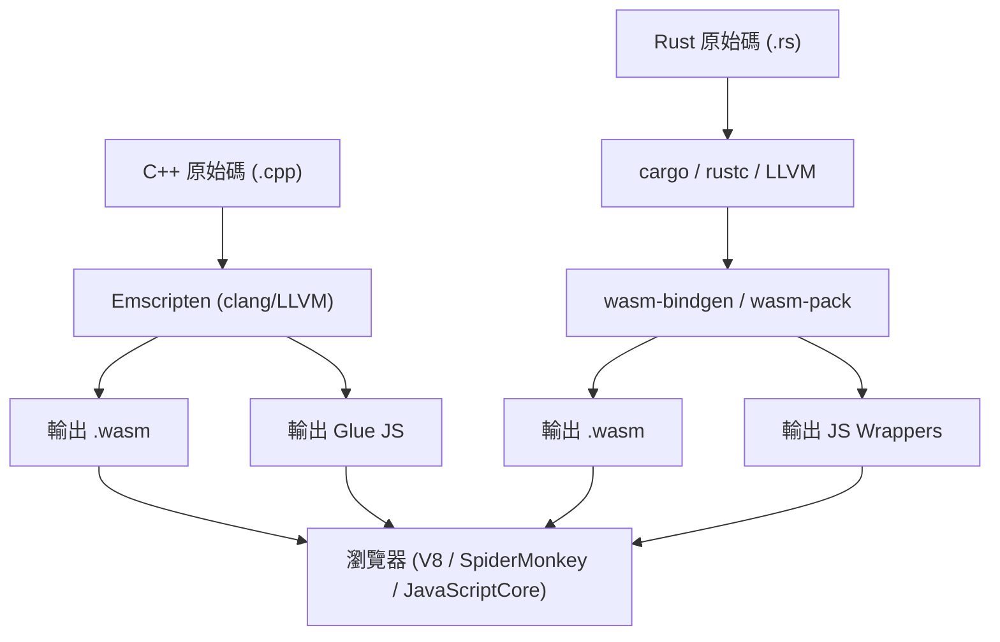
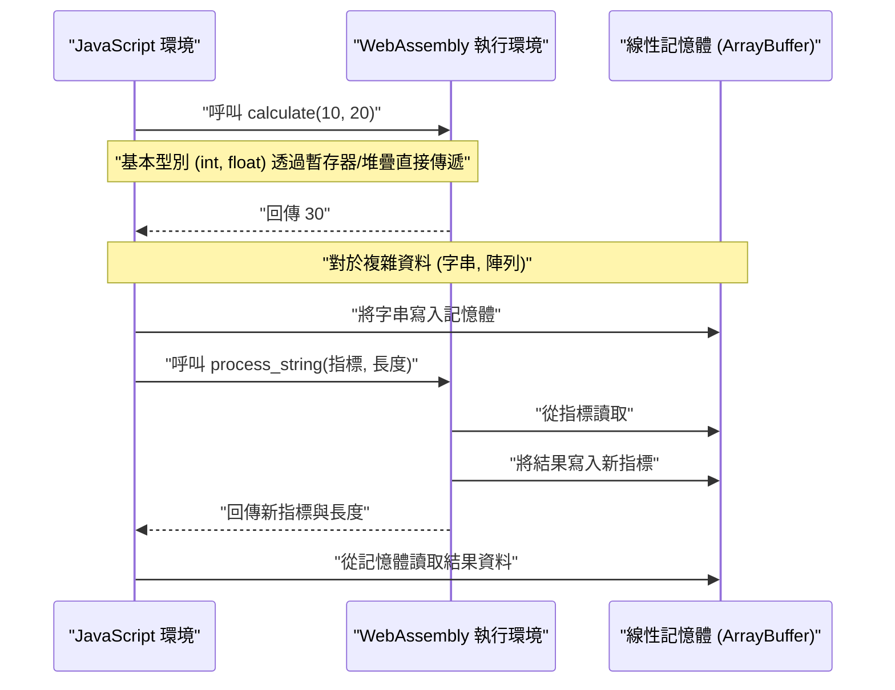
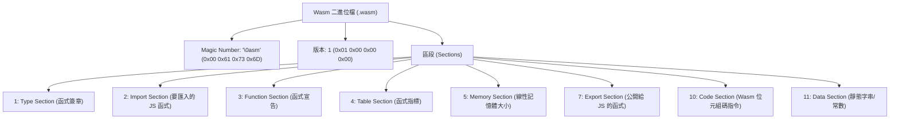

## 1. 簡介

在現代的 Web 開發中，JavaScript（以及 TypeScript）長期以來確立了作為在瀏覽器上運行的唯一程式語言的地位。然而，近年來在瀏覽器上進行更高度運算的需求不斷增加，例如影像處理、影片編碼、3D 遊戲、物理模擬等，希望能單獨在瀏覽器內執行。因此，**WebAssembly（通稱 Wasm）** 應運而生。

本文將從 WebAssembly 的基礎開始，詳細解說從 C++（使用 Emscripten）與 Rust（使用 `wasm-pack`）這兩種強大的系統程式語言匯出 Wasm，並與 JavaScript 環境進行整合的步驟與內部架構。此外，我們也會深入探討記憶體邊界的管理、字串與陣列等複雜資料的傳遞方式、效能上的開銷（Overhead），以及 Wasm 的二進位格式（`.wasm`）。

## 2. WebAssembly (Wasm) 概要與架構

WebAssembly 是一種針對堆疊式虛擬機（Stack-based Virtual Machine）的二進位指令格式。它被設計為一種「可移植的編譯目標（Portable Compilation Target）」，可由 C/C++、Rust、Go、Zig 等語言編譯而成，目的是在網頁瀏覽器上以接近原生的速度執行。

下圖展示了從 C++ 與 Rust 產生 WebAssembly，直到在瀏覽器中執行的工具鏈大致流程。



Wasm 並不是用來取代 JavaScript 的。它是與 JavaScript 共同運作，藉由將運算負載高的任務卸載（Offload）給 Wasm 來發揮各自的優勢。

## 3. 數學上的課題：曼德博集合的計算

本文將使用會對 CPU 造成高負載的「曼德博集合（Mandelbrot set）」繪圖演算法，並以 C++ 和 Rust 來進行實作。

曼德博集合定義為以下的複數遞迴數列：

$$ z_{n+1} = z_n^2 + c $$

在這裡，$z$ 與 $c$ 為複數，且從 $z_0 = 0$ 開始計算。對於某個複數 $c$，當我們無限次重複計算時，$z_n$ 的絕對值不會發散的 $c$ 的集合就是曼德博集合。一般來說，在電腦上進行計算時，會以下列條件視為已經發散：

$$ |z_n| > 2 $$

也就是說，對於實部 $x$ 與虛部 $y$，我們會判斷在最大迴圈次數（例如 $N = 1000$）內，是否滿足以下條件：

$$ x^2 + y^2 > 4 $$

## 4. 使用 C++ 與 Emscripten 的方法

Emscripten 是一個基於 LLVM 的編譯器工具鏈，是將 C/C++ 程式碼編譯為 WebAssembly 的實質標準。它提供了一個強大的執行環境（Runtime），能透過瀏覽器 API（Web API）來模擬 POSIX 的系統呼叫。

### C++ 實作程式碼

以下的 C++ 程式碼會計算指定寬度與高度的曼德博集合，並將結果（每個像素的迭代次數）儲存於一維陣列中。

```cpp
#include <emscripten/emscripten.h>
#include <vector>

// 指定 C 的連結性，以便能從 JavaScript 呼叫
extern "C" {

    // 回傳存放計算結果之緩衝區的指標
    EMSCRIPTEN_KEEPALIVE
    int* compute_mandelbrot(int width, int height, int max_iter) {
        // 使用靜態變數來確保緩衝區空間（為了簡化說明）
        static std::vector<int> buffer;
        buffer.resize(width * height);

        for (int row = 0; row < height; ++row) {
            for (int col = 0; col < width; ++col) {
                double c_re = (col - width / 2.0) * 4.0 / width;
                double c_im = (row - height / 2.0) * 4.0 / width;
                double x = 0, y = 0;
                int iteration = 0;
                
                while (x*x + y*y <= 4 && iteration < max_iter) {
                    double x_new = x*x - y*y + c_re;
                    y = 2*x*y + c_im;
                    x = x_new;
                    iteration++;
                }
                buffer[row * width + col] = iteration;
            }
        }
        return buffer.data();
    }

    // 釋放記憶體的函式（視需求使用）
    EMSCRIPTEN_KEEPALIVE
    void free_buffer() {
        // ...
    }
}
```

### 編譯與從 JavaScript 呼叫

我們使用 Emscripten 來編譯這段程式碼。

```bash
emcc mandelbrot.cpp -O3 -s WASM=1 -s EXPORTED_FUNCTIONS="['_compute_mandelbrot', '_malloc', '_free']" -s EXPORTED_RUNTIME_METHODS="['ccall', 'cwrap']" -o mandelbrot.js
```

在 JavaScript 端，我們會載入 Emscripten 產生的膠水程式碼（Glue Code, `mandelbrot.js`），並如下方所示使用 WebAssembly API 進行呼叫。

```javascript
Module.onRuntimeInitialized = () => {
    const width = 800;
    const height = 600;
    const maxIter = 1000;

    // 呼叫 C++ 的函式並取得指標
    const resultPtr = Module.ccall(
        'compute_mandelbrot', // C 函式名稱
        'number',             // 回傳值型別（指標為 number）
        ['number', 'number', 'number'], // 參數型別
        [width, height, maxIter]
    );

    // 從線性記憶體（Module.HEAP32）直接讀取陣列資料
    const numElements = width * height;
    const resultView = new Int32Array(Module.HEAP32.buffer, resultPtr, numElements);

    console.log("計算完成。第一個像素資料: " + resultView[0]);
};
```

## 5. 使用 Rust 與 `wasm-pack` 的方法

Rust 提供了對 WebAssembly 的一級（First-class）支援，透過使用 `wasm-bindgen` 與 `wasm-pack` 工具，可以實現 JavaScript 與 Rust 之間的高度整合。相對於 Emscripten 採用「將 C/C++ 龐大的 Runtime 帶入瀏覽器」的方法，Rust 的 `wasm-pack` 則是採用「只產生必要最小限度的綁定（JS 膠水程式碼）」的方法。

### Rust 實作程式碼

建立 Cargo 專案，並在 `Cargo.toml` 中指定 `cdylib` 與 `wasm-bindgen`。

```toml
[lib]
crate-type = ["cdylib"]

[dependencies]
wasm-bindgen = "0.2"
```

接著，在 `src/lib.rs` 中撰寫實作。

```rust
use wasm_bindgen::prelude::*;

#[wasm_bindgen]
pub fn compute_mandelbrot_rust(width: usize, height: usize, max_iter: u32) -> Vec<i32> {
    let mut buffer = vec![0; width * height];

    for row in 0..height {
        for col in 0..width {
            let c_re = (col as f64 - width as f64 / 2.0) * 4.0 / width as f64;
            let c_im = (row as f64 - height as f64 / 2.0) * 4.0 / width as f64;
            
            let mut x = 0.0;
            let mut y = 0.0;
            let mut iteration = 0;
            
            while x*x + y*y <= 4.0 && iteration < max_iter {
                let x_new = x*x - y*y + c_re;
                y = 2.0 * x * y + c_im;
                x = x_new;
                iteration += 1;
            }
            buffer[row * width + col] = iteration as i32;
        }
    }
    
    buffer
}
```

### 編譯與從 JavaScript 呼叫

使用 `wasm-pack` 指令進行建置。

```bash
wasm-pack build --target web
```

從 JavaScript 匯入產生出的套件。多虧了 `wasm-bindgen`，Rust 的 `Vec<i32>` 會自動轉換為 JavaScript 的 `Int32Array`（隱藏了指標操作）。

```javascript
import init, { compute_mandelbrot_rust } from './pkg/mandelbrot_wasm.js';

async function run() {
    await init(); // 初始化 WebAssembly 模組

    const width = 800;
    const height = 600;
    const maxIter = 1000;

    // 可以直接以 JavaScript 的陣列形式接收結果
    const resultView = compute_mandelbrot_rust(width, height, maxIter);
    
    console.log("計算完成。第一個像素資料: " + resultView[0]);
}
run();
```

## 6. 深入探討：記憶體邊界與資料型別的傳遞

WebAssembly 中最重要的概念之一就是「線性記憶體（Linear Memory）」。Wasm 程式碼無法直接存取宿主（瀏覽器）的記憶體空間，取而代之的是被分配到一個被隔離的巨大 `ArrayBuffer`。這就是線性記憶體。



### 傳遞字串與陣列的方法

整數或浮點數（`i32`, `i64`, `f32`, `f64`）可以作為值直接傳遞給 Wasm 函式。然而，字串、陣列或結構體等複雜型別，則無法直接作為 Wasm 的函式簽章來傳遞。

**在 Emscripten 的情況**：
1. 在 JS 端呼叫 `Module._malloc`，確保 Wasm 端的線性記憶體區域。
2. 從 JS 使用 `Module.HEAPU8.set()` 等方法，將資料寫入確保好的記憶體位址（指標）。
3. 將指標傳遞給 C++ 的函式。
4. 計算結束後，在 JS 端從該指標讀取結果，最後呼叫 `Module._free`。

**在 wasm-bindgen (Rust) 的情況**：
上述繁雜的記憶體管理流程，會完全隱藏在自動產生的膠水程式碼（JS 封裝）內。從 JS 端只需單純地將 `String` 或 `Array` 傳遞給 Rust 函式，背後就會自動執行確保緩衝區（相當於 `malloc`）、複製、傳遞指標、記憶體釋放等一系列處理。

## 7. 效能開銷與最佳化

雖然 WebAssembly 能以接近原生的速度執行，但「跨越 JavaScript 與 WebAssembly 邊界的通訊（Interop）」是存在開銷的。

* **呼叫開銷（Call Overhead）**：這是 JavaScript 引擎呼叫 Wasm 函式的切換成本。雖然現在已經大幅最佳化，但仍應避免在每一幀呼叫極輕量的函式數萬次這樣的設計。
* **記憶體複製成本**：當傳遞字串或陣列給 Wasm 時，會發生將資料從 JS 的垃圾回收（Garbage Collection）管理的記憶體中，複製到 Wasm 線性記憶體（ArrayBuffer）的動作。當傳遞大容量資料時，會需要一種「零拷貝（Zero-copy）」的設計，也就是一開始就在 Wasm 記憶體上建構資料，而 JS 端則透過 TypedArray 的視圖（例如 `Uint8Array`）來進行存取。

例如，在遊戲引擎或物理運算引擎中，一般的架構會將所有狀態保存在 Wasm 的線性記憶體內，而 JavaScript 僅負責每幀發出「更新」的觸發訊號，以及畫面渲染（呼叫 WebGL/WebGPU API）。

## 8. 剖析 WebAssembly 二進位格式 (.wasm)

在此，我們來看看編譯器輸出的 `.wasm` 檔案的內部結構。Wasm 的二進位檔案為了重視擴充性與解析速度，是由被稱為「區段（Section）」的邏輯區塊集合所構成。



檔案的魔術數字（Magic Number）一定會由 `0x00 0x61 0x73 0x6D` (`\0asm`) 開始。接下來的每個區段各自擁有其 ID。

* **Type Section**：定義所有使用到的函式簽章（參數與回傳值型別）。
* **Import Section**：從 JavaScript 環境提供給 Wasm 的函式或記憶體列表。例如，如果要從 C++ 呼叫 `console.log`，就會在這裡宣告。
* **Code Section**：存放實際的位元組碼指令（例如 `i32.add`、`call` 或 `loop` 等）。由於是堆疊機器的架構，形式上是將運算元推入堆疊中再呼叫運算指令。
* **Data Section**：在 C++ 或 Rust 程式碼內定義的靜態字串字面量或初始化資料，會從這個區段載入到線性記憶體。

瀏覽器的 Wasm 引擎會透過串流編譯（Streaming Compilation，邊下載邊平行編譯為機器碼）這些區段，來實現啟動速度的劇烈提升。

## 9. C++ 與 Rust：該選擇哪一個？

在產生 WebAssembly 時，該選擇 C++ 還是 Rust，很大程度上取決於專案需求與既有資產。

**應該選擇 C++ / Emscripten 的情況**：
* 想要將既有的 C/C++ 函式庫（FFmpeg、OpenCV、SQLite 等）移植到瀏覽器時。
* 遊戲移植專案，希望直接沿用將 OpenGL 等圖形 API 轉換為 WebGL 的功能（Emscripten 的 GL 模擬層）。
* 需要模擬檔案系統（MEMFS）等虛擬化作業系統功能時。

**應該選擇 Rust / wasm-pack 的情況**：
* 作為 Web 應用程式的一部分，要從零開始全新開發一個高效能模組時。
* 期望與 JavaScript 生態系（NPM 模組或 TypeScript）有著強固且型別安全的整合時。
* 追求相對較小的二進位大小，以及安全的記憶體管理（Rust 的所有權模型）時。
* 想要享受如 Cargo 的依賴關係管理等現代工具鏈時。

## 10. 總結

WebAssembly 是為了在瀏覽器中執行高運算量處理的一項革新技術。使用 C++ 與 Emscripten 的全端移植方法，以及使用 Rust 與 wasm-bindgen 與 JavaScript 緊密結合的模組化方法，雙方都各有其優勢。

在諸如曼德博集合等計算中，相較於單純使用 JavaScript，Wasm 有望帶來數倍至數十倍的速度提升。然而，如果沒有正確理解 Wasm 與 JS 之間的記憶體邊界機制，並設計出避免不必要之記憶體拷貝的架構，就無法發揮其真正的效能。

希望透過本文，能幫助大家加深對於從 C++ 與 Rust 匯出 Wasm 並在瀏覽器中執行的一連串流程，以及其背後架構的理解。在次世代的 Web 應用程式開發中，WebAssembly 無疑將成為強大的武器。
