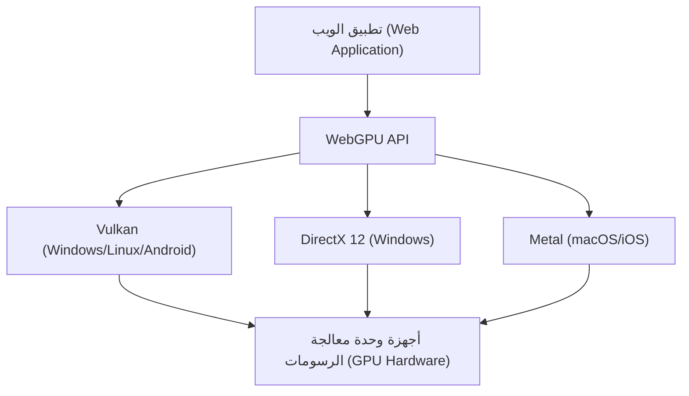

شهدت التقنيات التي تتيح رسومات ثلاثية الأبعاد غنية وحسابات متوازية متقدمة في متصفحات الويب تطوراً ملحوظاً على مدى العقد الماضي أو نحو ذلك. كان WebGL في قلب هذا التطور، ولكننا نشهد الآن تحولاً كبيراً في النماذج. هذا التحول هو ظهور "WebGPU". في هذا المقال، سنتعمق في تاريخ WebGL وقيوده، وكيف يقوم WebGPU بإطلاق العنان للقوة الحقيقية لوحدات معالجة الرسومات الحديثة في المتصفح من منظور البنية الهندسية وفلسفة التصميم.

## 1. إنجازات WebGL والقيود التي ظهرت

أحدث WebGL، الذي تم إصداره في عام 2011، ثورة من خلال جلب رسومات ثلاثية الأبعاد مسرّعة بواسطة الأجهزة إلى المتصفحات دون الحاجة إلى مكونات إضافية (plugins). يعتمد في أساسه على "OpenGL ES"، الذي تم تصميمه للأجهزة المحمولة والمدمجة.

### العبء الإضافي بسبب آلة الحالة الضخمة (State Machine Overhead)

يكمن التحدي الأكبر لـ WebGL (و OpenGL) في حقيقة أن بنيته مصممة كـ "آلة حالة عالمية ضخمة". عند إجراء الرسم، يقوم المطورون بإصدار أوامر الرسم (Draw Calls) مع تغيير الحالة الحالية خطوة بخطوة (مثل الأنسجة المقيدة، وبرامج التظليل، وأنماط المزج).

```javascript
// أوامر الرسم وتغيير الحالة النموذجية في WebGL
gl.useProgram(program);
gl.bindBuffer(gl.ARRAY_BUFFER, positionBuffer);
gl.enableVertexAttribArray(positionLocation);
gl.vertexAttribPointer(positionLocation, 3, gl.FLOAT, false, 0, 0);
gl.drawArrays(gl.TRIANGLES, 0, 3);
```

يبدو هذا النهج بديهيًا للوهلة الأولى، ولكنه يخلق عنق زجاجة قاتل في بيئات المعالجات متعددة النواة (Multi-core CPUs) الحديثة. ولأن تغيير الحالة ينطوي على عمليات تحقق (Validation) ثقيلة على وحدة المعالجة المركزية (CPU)، فكلما زادت أوامر الرسم، أصبحت وحدة المعالجة المركزية عنق الزجاجة في معالجة برامج تشغيل الرسومات، مما يترك وحدة معالجة الرسومات (GPU) في حالة خمول (وقت انتظار). ويُعرف هذا باسم "تقييد وحدة المعالجة المركزية" (CPU Bound).

### قيود النموذج أحادي الخيط (Single-Threaded Model)

علاوة على ذلك، يعمل WebGL بطبيعته على خيط واحد (Single-thread). تمت إضافة حيل لإجراء المعالجة في خيوط منفصلة باستخدام Web Workers لاحقًا (مثل OffscreenCanvas)، ولكن نظرًا لأن تصميم واجهة برمجة التطبيقات (API) نفسه لا يفترض بناء الأوامر في خيوط متعددة، كان من الصعب جدًا توزيع إعداد الرسم للمشاهد المعقدة عبر أنوية معالجة متعددة.

## 2. بنية وحدات معالجة الرسومات الحديثة وظهور WebGPU

في منتصف العقد الأول من القرن الحادي والعشرين (2010s)، ولسد الفجوة بين تطور الأجهزة وواجهات برمجة التطبيقات، وُلدت واجهات برمجة تطبيقات رسومات جديدة واحدة تلو الأخرى في العالم الأصلي (Native World). وهي "Metal" من Apple، و"DirectX 12" من Microsoft، و"Vulkan" من Khronos Group. تُعرف هذه باسم "واجهات برمجة تطبيقات الرسومات الحديثة"، وتهدف إلى تقليل العبء الإضافي لبرنامج التشغيل إلى الحد الأدنى وإرسال الأوامر بكفاءة من وحدات المعالجة المركزية متعددة النواة إلى وحدة معالجة الرسومات.

تم تصميم WebGPU لجلب أفكار واجهات برمجة التطبيقات الحديثة هذه إلى بيئة وضع الحماية (Sandbox) الآمنة للويب. وهو ليس مجرد غلاف (Wrapper) لواجهة برمجة تطبيقات أصلية محددة، ولكنه يدمج القاسم المشترك الأكبر لميزات Vulkan و Metal و DirectX 12، مع توحيده القياسي للويب.



## 3. ابتكارات WebGPU: كائنات خط الأنابيب ومخازن الأوامر

دعونا نلقي نظرة على الآليات المحددة لكيفية حل WebGPU لمشكلة العبء الإضافي في WebGL.

### التجميع المسبق لخط أنابيب التصيير (Render Pipeline Pre-compilation)

في WebGPU، بدلاً من تغيير الحالة بدقة قبل الرسم مباشرة كما في WebGL، يتم تعريفها مسبقًا كـ "كائن حالة خط الأنابيب (Pipeline State Object: PSO)". يتم دمج كود التظليل، وتخطيط الرؤوس، وإعدادات المزج، وغيرها في كائن واحد غير قابل للتغيير.

```javascript
// إنشاء خط أنابيب WebGPU (كود زائف)
const pipeline = device.createRenderPipeline({
  layout: 'auto',
  vertex: {
    module: vertexShaderModule,
    entryPoint: 'main',
    buffers: [vertexLayout]
  },
  fragment: {
    module: fragmentShaderModule,
    entryPoint: 'main',
    targets: [{ format: presentationFormat }]
  }
});
```

يسمح هذا لبرنامج تشغيل وحدة معالجة الرسومات بإكمال تجميع المظلل والتحقق من صحة الحالة قبل بدء حلقة الرسم. داخل حلقة الرسم، كل ما عليك فعله هو ربط خط الأنابيب الذي تم إنشاؤه مسبقًا، مما يقلل بشكل كبير من العبء على وحدة المعالجة المركزية.

### مخازن الأوامر وتعدد الخيوط

تعتمد WebGPU مفهوم "مخزن الأوامر (Command Buffer)". بدلاً من إرسال أوامر الرسم مباشرة إلى وحدة معالجة الرسومات، يتم تسجيل الأوامر (تشفيرها) في مخزن مؤقت في الذاكرة أولاً، ثم يتم إرسالها دفعة واحدة إلى قائمة انتظار وحدة معالجة الرسومات في النهاية.

تتمثل أكبر ميزة لهذه الآلية في إمكانية تسجيل الأوامر بالتوازي عبر خيوط Web Worker متعددة. حتى في المشاهد المعقدة مثل ألعاب العالم المفتوح الشاسعة، من الممكن بناء أوامر الرسم للتضاريس والشخصيات والمؤثرات بشكل متوازٍ على أنوية منفصلة، وفي النهاية دمجها في الخيط الرئيسي وإرسالها إلى وحدة معالجة الرسومات.

## 4. خط أنابيب الحوسبة (Compute Pipeline) وتحرير GPGPU

أكبر تغيير في قواعد اللعبة يقدمه WebGPU هو إدخال "خط أنابيب الحوسبة (Compute Pipeline)" المستقل عن الرسومات (الرسم).

حتى في WebGL، تم استخدام تقنية غير رسمية (Hack) لإجراء GPGPU (الحوسبة العامة على وحدات معالجة الرسومات) عن طريق كتابة البيانات في الأنسجة وإجراء العمليات الحسابية في Fragment Shader. ومع ذلك، كان هذا مجرد استخدام قسري لخط أنابيب الرسومات للحساب، وكانت عمليات الإدخال والإخراج للبيانات غير فعالة، ولم يكن بالإمكان الوصول إلى ميزات متقدمة مثل الذاكرة المشتركة التي تمتلكها وحدة معالجة الرسومات.

### التعلم الآلي والمحاكاة الفيزيائية في المتصفح

تم تصميم Compute Shader في WebGPU لتنفيذ المهام الحسابية البحتة بالتوازي الفائق على الآلاف من الأنوية في وحدة معالجة الرسومات.

* **تسريع استدلال التعلم الآلي**: تدعم مكتبات مثل TensorFlow.js الواجهة الخلفية لـ WebGPU، وتحقق تحسينات في الأداء تتراوح من عدة أضعاف إلى عشرات الأضعاف مقارنة بالواجهة الخلفية لـ WebGL. تصبح نماذج اللغات الكبيرة (LLMs) وتحليل الفيديو في الوقت الفعلي التي تعمل في المتصفح على مستوى عملي ويمكن تطبيقها.
* **الجسيمات المعقدة والمحاكاة الفيزيائية**: يمكن إكمال محاكاة مئات الآلاف من الجسيمات، وديناميكيات الموائع، ومحاكاة القماش التي لا تستطيع وحدة المعالجة المركزية التعامل معها بالكامل على وحدة معالجة الرسومات، ويمكن تمرير النتائج مباشرة إلى Render Pipeline للرسم. نظرًا لعدم وجود نقل للبيانات بين وحدة المعالجة المركزية ووحدة معالجة الرسومات، فإنها تقدم أداءً مذهلاً.

## 5. WGSL: لغة تظليل جديدة للويب

مع تقديم WebGPU، تم تجديد لغة التظليل من GLSL إلى "WGSL (WebGPU Shading Language)". تتمتع WGSL ببناء جملة حديث مشابه لـ Rust، مع نظام كتابة أكثر صرامة وأمانًا.

```wgsl
// مثال بسيط على Compute Shader باستخدام WGSL
@group(0) @binding(0) var<storage, read_write> data: array<f32>;

@compute @workgroup_size(64)
fn main(@builtin(global_invocation_id) global_id: vec3<u32>) {
    let index = global_id.x;
    data[index] = data[index] * 2.0; // حساب متوازي لمضاعفة كل عنصر في المصفوفة
}
```

تم تصميم WGSL في تطبيقات المتصفح ليتم ترجمتها بأمان وبسرعة إلى لغات التظليل المطلوبة بواسطة واجهات برمجة التطبيقات الأصلية للواجهة الخلفية، مثل SPIR-V لـ Vulkan، و MSL لـ Metal، و HLSL لـ DirectX.

## الخلاصة: آفاق جديدة لمنصة الويب

إن الانتقال من WebGL إلى WebGPU ليس مجرد تحديث لواجهة برمجة التطبيقات، بل يعني أن منصة الويب قد اكتسبت قدرات حسابية لا تقل عن التطبيقات الأصلية. من خلال التحرر من لعنة آلة الحالة الضخمة واكتساب إدارة حديثة لخطوط الأنابيب وقدرات حوسبة عامة، ستلعب متصفحات الويب المستقبلية دورًا كبيئات تشغيل لألعاب ثلاثية الأبعاد أكثر تقدمًا، وأدوات إبداعية احترافية، والذكاء الاصطناعي على الحافة (Edge AI).

قد يكون منحنى التعلم للمطورين أكثر حدة من WebGL، ولكن فوائد الأداء التي تكمن وراءه لا تُحصى. عصر WebGPU قد بدأ للتو.
