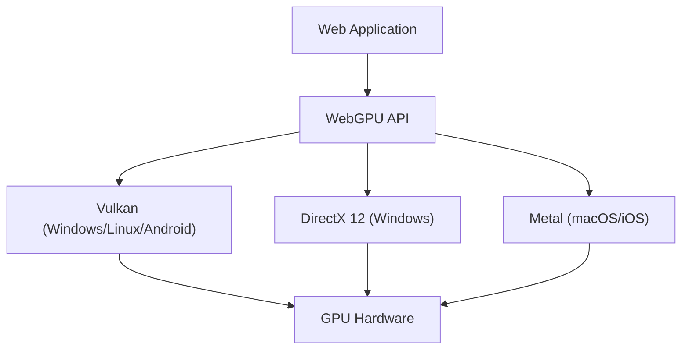

Die Technologie zur Realisierung von reichhaltiger 3D-Grafik und fortschrittlichen parallelen Berechnungen im Webbrowser hat sich in den letzten zehn Jahren bemerkenswert weiterentwickelt. Das Herzstück davon war WebGL, aber derzeit befinden wir uns inmitten eines großen Paradigmenwechsels: dem Aufkommen von "WebGPU". In diesem Artikel werden wir die Geschichte und die Grenzen von WebGL sowie die Art und Weise, wie WebGPU die wahre Kraft moderner GPUs im Browser freisetzt, aus der Perspektive von Architektur und Designphilosophie eingehend untersuchen.

## 1. Die Errungenschaften von WebGL und die sichtbar gewordenen Grenzen

WebGL, das 2011 eingeführt wurde, revolutionierte den Browser, indem es hardwarebeschleunigte 3D-Grafiken ohne Plugins ermöglichte. Es basiert auf "OpenGL ES", das für mobile und eingebettete Geräte entwickelt wurde.

### Overhead durch eine riesige Zustandsmaschine

Die größte Herausforderung von WebGL (und OpenGL) besteht darin, dass seine Architektur als "riesige globale Zustandsmaschine" (State Machine) konzipiert ist. Beim Zeichnen geben Entwickler Draw-Calls (Zeichenbefehle) aus, während sie den aktuellen Zustand (gebundene Texturen, Shader-Programme, Blend-Modi usw.) Schritt für Schritt ändern.

```javascript
// Typische Zustandsänderung und Zeichnung in WebGL
gl.useProgram(program);
gl.bindBuffer(gl.ARRAY_BUFFER, positionBuffer);
gl.enableVertexAttribArray(positionLocation);
gl.vertexAttribPointer(positionLocation, 3, gl.FLOAT, false, 0, 0);
gl.drawArrays(gl.TRIANGLES, 0, 3);
```

Dieser Ansatz erscheint auf den ersten Blick intuitiv, führt aber in modernen Multi-Core-CPU-Umgebungen zu einem fatalen Engpass. Da Zustandsänderungen mit schwerer Validierung (Überprüfung) auf der CPU einhergehen, wird die CPU bei steigender Anzahl von Draw-Calls zum Engpass für die Grafiktreiberverarbeitung, und die GPU gerät in einen Leerlauf (Wartezustand). Dies wird als "CPU-bound" bezeichnet.

### Die Grenzen des Single-Thread-Modells

Darüber hinaus arbeitet WebGL von Natur aus Single-Threaded. Obwohl später Techniken zur Ausführung von Berechnungen in einem separaten Thread mithilfe von Web Workern (wie OffscreenCanvas) hinzugefügt wurden, war es sehr schwierig, die Vorbereitung zum Zeichnen komplexer Szenen auf mehrere CPU-Kerne zu verteilen, da das API-Design selbst nicht für die Erstellung von Befehlen in einer Multi-Thread-Umgebung ausgelegt war.

## 2. Moderne GPU-Architektur und die Geburt von WebGPU

Mitte der 2010er Jahre entstanden in der nativen Welt nacheinander neue Grafik-APIs, um die Lücke zwischen der Hardwareentwicklung und den APIs zu schließen. Dazu gehören "Metal" von Apple, "DirectX 12" von Microsoft und "Vulkan" von der Khronos Group. Diese werden als "moderne Grafik-APIs" bezeichnet und zielen darauf ab, den Treiber-Overhead auf ein Minimum zu reduzieren und Befehle effizient von Multi-Core-CPUs an die GPU zu senden.

WebGPU wurde entwickelt, um die Philosophie dieser modernen APIs in die sichere Sandbox-Umgebung des Webs zu bringen. Es ist kein einfacher Wrapper für eine bestimmte native API, sondern wurde für das Web standardisiert, wobei die besten gemeinsamen Funktionen von Vulkan, Metal und DirectX 12 übernommen wurden.



## 3. Die Innovation von WebGPU: Pipeline-Objekte und Command Buffer

Lassen Sie uns einen Blick auf die spezifischen Mechanismen werfen, wie WebGPU den Overhead von WebGL löst.

### Vorkompilierung der Render Pipeline

In WebGPU werden die Zustände nicht wie in WebGL kurz vor dem Zeichnen detailliert geändert, sondern im Voraus als "Pipeline State Object (PSO)" definiert. Shader-Code, Vertex-Layout, Blend-Einstellungen usw. werden in einem einzigen unveränderlichen Objekt zusammengefasst.

```javascript
// Erstellung einer WebGPU-Pipeline (Pseudocode)
const pipeline = device.createRenderPipeline({
  layout: 'auto',
  vertex: {
    module: vertexShaderModule,
    entryPoint: 'main',
    buffers: [vertexLayout]
  },
  fragment: {
    module: fragmentShaderModule,
    entryPoint: 'main',
    targets: [{ format: presentationFormat }]
  }
});
```

Dadurch kann der Grafiktreiber die Shader-Kompilierung und die Validierung des Zustands abschließen, bevor die Rendering-Schleife beginnt. Innerhalb der Rendering-Schleife muss nur noch die im Voraus erstellte Pipeline gebunden werden, was die CPU-Auslastung drastisch reduziert.

### Command Buffer und Multi-Threading

WebGPU führt das Konzept der "Command Buffer" ein. Anstatt Zeichenbefehle direkt an die GPU zu senden, werden die Befehle zunächst in einem Puffer im Speicher aufgezeichnet (encodiert) und am Ende gesammelt an die Warteschlange der GPU gesendet.

Der größte Vorteil dieses Mechanismus besteht darin, dass die Aufzeichnung von Befehlen parallel in mehreren Web Worker-Threads erfolgen kann. Selbst in komplexen Szenen wie Open-World-Spielen können die Zeichenbefehle für Gelände, Charaktere und Effekte parallel auf verschiedenen Kernen erstellt und schließlich im Haupt-Thread kombiniert und an die GPU gesendet werden.

## 4. Compute Pipeline und die Freigabe von GPGPU

Der größte Game-Changer, den WebGPU mit sich bringt, ist die Einführung der "Compute Pipeline", die unabhängig von der Grafik (Zeichnung) ist.

Auch in WebGL wurde GPGPU (General-Purpose Computing on Graphics Processing Units) durch einen Hack-Ansatz durchgeführt, bei dem Daten in Texturen geschrieben und Berechnungen im Fragment-Shader durchgeführt wurden. Dies war jedoch nur eine zweckentfremdete Nutzung der Grafik-Pipeline für Berechnungen; die Dateneingabe und -ausgabe war ineffizient, und es bestand kein Zugriff auf erweiterte Funktionen wie den Shared Memory der GPU.

### Maschinelles Lernen und physikalische Simulationen im Browser

Die Compute-Shader von WebGPU sind darauf ausgelegt, reine Rechenaufgaben hochgradig parallel auf den Tausenden von Kernen der GPU auszuführen.

* **Beschleunigung der Inferenz für maschinelles Lernen**: Bibliotheken wie TensorFlow.js unterstützen das WebGPU-Backend und erzielen im Vergleich zum WebGL-Backend eine Leistungssteigerung um das Mehrfache bis Zehnfache. Im Browser ausgeführte LLMs (Large Language Models) und Echtzeit-Videoanalysen werden auf einem praktischen Niveau nutzbar.
* **Komplexe Partikel- und physikalische Berechnungen**: Die Simulation von Hunderttausenden von Partikeln, die von der CPU nicht bewältigt werden können, sowie Strömungsmechanik und Stoffsimulationen können vollständig auf der GPU durchgeführt und die Ergebnisse direkt an die Render Pipeline zur Zeichnung übergeben werden. Da kein Datentransfer zwischen CPU und GPU (Rücklesen vom VRAM in den Systemspeicher) stattfindet, wird eine unglaubliche Leistung erzielt.

## 5. WGSL: Eine neue Shader-Sprache für das Web

Mit der Einführung von WebGPU wurde auch die Shader-Sprache von GLSL auf "WGSL (WebGPU Shading Language)" aktualisiert. WGSL hat eine moderne Syntax ähnlich wie Rust und verfügt über ein strengeres Typsystem und mehr Sicherheit.

```wgsl
// Beispiel für einen einfachen Compute-Shader in WGSL
@group(0) @binding(0) var<storage, read_write> data: array<f32>;

@compute @workgroup_size(64)
fn main(@builtin(global_invocation_id) global_id: vec3<u32>) {
    let index = global_id.x;
    data[index] = data[index] * 2.0; // Parallele Berechnung zur Verdopplung jedes Elements im Array
}
```

WGSL wurde so konzipiert, dass es bei der Browser-Implementierung sicher und schnell in die Shader-Sprache konvertiert werden kann, die von der zugrunde liegenden nativen API benötigt wird, z. B. SPIR-V für Vulkan, MSL für Metal oder HLSL für DirectX.

## Fazit: Ein neuer Horizont für die Web-Plattform

Der Übergang von WebGL zu WebGPU ist nicht nur ein API-Update, sondern bedeutet, dass die Web-Plattform eine Rechenleistung erlangt hat, die mit nativen Anwendungen vergleichbar ist. Durch die Befreiung vom Fluch der riesigen Zustandsmaschine und den Erhalt von modernem Pipeline-Management sowie Allzweck-Rechenleistung wird der Webbrowser künftig die Rolle einer Ausführungsumgebung für fortschrittlichere 3D-Spiele, professionelle Kreativ-Tools und Edge-KI übernehmen.

Die Lernkurve mag für Entwickler steiler sein als bei WebGL, aber die Leistungsvorteile, die jenseits davon liegen, sind unermesslich. Die Ära von WebGPU hat gerade erst begonnen.
