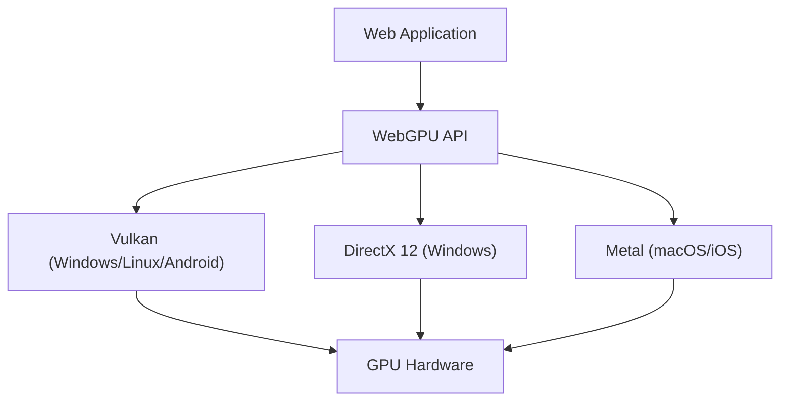

Technologies for realizing rich 3D graphics and advanced parallel computing on web browsers have evolved remarkably over the past decade or so. WebGL has been at the center of this, but we are currently in the midst of a major paradigm shift. This is the emergence of "WebGPU". In this article, we will thoroughly explore the history and limitations of WebGL, and how WebGPU unleashes the true power of modern GPUs to the browser from the perspective of architecture and design philosophy.

## 1. WebGL's Achievements and Visible Limitations

Introduced in 2011, WebGL revolutionized the browser by bringing hardware-accelerated 3D graphics without plugins. It is based on "OpenGL ES", which was designed for mobile and embedded devices.

### Overhead of a Massive State Machine
The biggest challenge with WebGL (and OpenGL) is that its architecture is designed as a "massive global state machine". When drawing, developers issue draw calls (rendering commands) while changing the current state (bound textures, shader programs, blend modes, etc.) one by one.

```javascript
// Typical state changes and drawing in WebGL
gl.useProgram(program);
gl.bindBuffer(gl.ARRAY_BUFFER, positionBuffer);
gl.enableVertexAttribArray(positionLocation);
gl.vertexAttribPointer(positionLocation, 3, gl.FLOAT, false, 0, 0);
gl.drawArrays(gl.TRIANGLES, 0, 3);
```

This approach seems intuitive at first glance, but it creates a fatal bottleneck in modern multi-core CPU environments. State changes involve heavy validation on the CPU, so as draw calls increase, the CPU becomes a bottleneck in processing graphics drivers, and the GPU goes into an idle (waiting) state. This is called "CPU bound".

### Limitations of the Single-Threaded Model
Furthermore, WebGL inherently runs single-threaded. Workarounds such as using Web Workers to perform processing on separate threads (like OffscreenCanvas) were added later, but since the API itself is not designed around building commands on multiple threads, it was extremely difficult to distribute the rendering preparation of complex scenes across multiple CPU cores.

## 2. Modern GPU Architecture and the Birth of WebGPU

In the mid-2010s, new graphics APIs emerged one after another in the native world to bridge the gap between hardware evolution and APIs. These include Apple's "Metal", Microsoft's "DirectX 12", and Khronos Group's "Vulkan". These are called "modern graphics APIs", and they aim to drastically reduce driver overhead and send commands from multi-core CPUs to GPUs efficiently.

WebGPU was designed to bring the philosophy of these modern APIs into the safe sandbox environment of the web. It is not merely a wrapper for specific native APIs, but is standardized for the web while incorporating the lowest common denominator features of Vulkan, Metal, and DirectX 12.



## 3. WebGPU's Innovation: Pipeline Objects and Command Buffers

Let's look at the specific mechanisms of how WebGPU solves the overhead of WebGL.

### Pre-compiling the Render Pipeline
In WebGPU, instead of making granular state changes right before drawing like in WebGL, states are defined in advance as "Pipeline State Objects (PSO)". Shader code, vertex layouts, blend settings, etc., are bundled into a single immutable object.

```javascript
// Creating a pipeline in WebGPU (Pseudo-code)
const pipeline = device.createRenderPipeline({
  layout: 'auto',
  vertex: {
    module: vertexShaderModule,
    entryPoint: 'main',
    buffers: [vertexLayout]
  },
  fragment: {
    module: fragmentShaderModule,
    entryPoint: 'main',
    targets: [{ format: presentationFormat }]
  }
});
```

This allows the GPU driver to complete shader compilation and state validation before the rendering loop begins. Inside the drawing loop, you simply bind the pre-created pipeline, drastically reducing CPU load.

### Command Buffers and Multithreading
WebGPU adopts the concept of "command buffers". Instead of sending rendering commands directly to the GPU, commands are first recorded (encoded) into a buffer in memory and finally sent to the GPU's queue all at once.

The biggest advantage of this mechanism is that command recording can be done in parallel across multiple Web Worker threads. Even for complex scenes like vast open-world games, drawing commands for terrain, characters, and effects can be built concurrently on separate cores and ultimately combined on the main thread to be sent to the GPU.

## 4. Compute Pipeline and Unlocking GPGPU

The biggest game changer brought by WebGPU is the introduction of the "Compute Pipeline", which is independent of graphics (rendering).

Even in WebGL, GPGPU (General-Purpose computing on Graphics Processing Units) was performed using a hacky technique of writing data to textures and calculating them with fragment shaders. However, this was merely forcing the graphics pipeline to be used for calculation, which resulted in inefficient data input/output and the inability to access advanced GPU features like Shared Memory.

### Machine Learning and Physical Simulations on the Browser
WebGPU compute shaders are designed to execute pure computational tasks massively parallel on thousands of GPU cores.

* **Accelerating Machine Learning Inference**: Libraries like TensorFlow.js support the WebGPU backend, achieving performance improvements of several to dozens of times compared to the WebGL backend. Running LLMs (Large Language Models) and real-time video analysis in the browser becomes practical.
* **Complex Particles and Physics Calculations**: It allows hundreds of thousands of particle simulations, fluid dynamics, cloth simulations, etc., which CPUs cannot fully process, to be completed on the GPU and their results passed directly to the Render Pipeline for drawing. Since there is no data transfer between the CPU and GPU (readback from VRAM to system memory), it delivers incredible performance.

## 5. WGSL: A New Shader Language for the Web

Along with the introduction of WebGPU, the shader language has also been revamped from GLSL to "WGSL (WebGPU Shading Language)". WGSL has a modern syntax similar to Rust, and features a stricter type system and better safety.

```wgsl
// Example of a simple compute shader in WGSL
@group(0) @binding(0) var<storage, read_write> data: array<f32>;

@compute @workgroup_size(64)
fn main(@builtin(global_invocation_id) global_id: vec3<u32>) {
    let index = global_id.x;
    data[index] = data[index] * 2.0; // Parallel computation to double each element of the array
}
```

WGSL is designed to be safely and quickly translated into the shader languages required by the backend native APIs, such as Vulkan's SPIR-V, Metal's MSL, and DirectX's HLSL, in browser implementations.

## Conclusion: A New Horizon for the Web Platform

The transition from WebGL to WebGPU is not just an API update; it means that the web platform has acquired computing power comparable to native applications. By breaking free from the curse of the massive state machine and gaining modern pipeline management and general-purpose compute capabilities, future web browsers will take on the role of an execution environment for more advanced 3D games, professional creative tools, and edge AI.

For developers, the learning curve may be steeper than WebGL, but the performance benefits that lie ahead are immeasurable. The era of WebGPU has only just begun.
