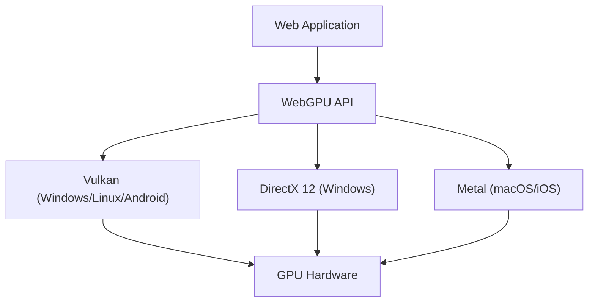

Las tecnologías para lograr gráficos 3D ricos y cálculos paralelos avanzados en el navegador web han evolucionado notablemente en los últimos diez años. En el centro de esto estaba WebGL, pero actualmente nos encontramos en medio de un gran cambio de paradigma. Esa es la aparición de "WebGPU". En este artículo, profundizaremos en la historia y los límites de WebGL, y cómo WebGPU libera la verdadera potencia de las GPU modernas en el navegador desde la perspectiva de la arquitectura y la filosofía de diseño.

## 1. Los logros de WebGL y sus límites evidentes

Lanzado en 2011, WebGL revolucionó al traer gráficos 3D acelerados por hardware al navegador sin necesidad de plugins. Su base es "OpenGL ES", diseñado para dispositivos móviles e integrados.

### La sobrecarga de una máquina de estados gigante
El mayor desafío de WebGL (y OpenGL) radica en que su arquitectura está diseñada como una "máquina de estados global gigante". Al realizar el renderizado, los desarrolladores emiten llamadas de dibujo (draw calls) cambiando los estados actuales (texturas vinculadas, programas de sombreadores, modos de fusión, etc.) uno por uno.

```javascript
// Cambio de estado típico y renderizado en WebGL
gl.useProgram(program);
gl.bindBuffer(gl.ARRAY_BUFFER, positionBuffer);
gl.enableVertexAttribArray(positionLocation);
gl.vertexAttribPointer(positionLocation, 3, gl.FLOAT, false, 0, 0);
gl.drawArrays(gl.TRIANGLES, 0, 3);
```

Este enfoque parece intuitivo a primera vista, pero crea un cuello de botella fatal en los entornos de CPU de múltiples núcleos modernos. Dado que los cambios de estado implican una fuerte validación en la CPU, cuantas más llamadas de dibujo haya, más se convierte la CPU en un cuello de botella para el procesamiento del controlador de gráficos, dejando a la GPU inactiva (en estado de espera). A esto se le llama "limitado por la CPU" (CPU bound).

### Los límites del modelo de un solo hilo (Single-thread)
Además, WebGL funciona intrínsecamente en un solo hilo. Más tarde se añadieron ingenios para realizar el procesamiento en otros hilos utilizando Web Workers (como OffscreenCanvas), pero dado que el diseño de la API en sí no asume la construcción de comandos en múltiples hilos, era extremadamente difícil distribuir la preparación del renderizado de escenas complejas en varios núcleos de la CPU.

## 2. La arquitectura de las GPU modernas y el nacimiento de WebGPU

A mediados de la década de 2010, para cerrar la brecha entre la evolución del hardware y las API, surgieron nuevas API de gráficos en el mundo nativo una tras otra. Estas son "Metal" de Apple, "DirectX 12" de Microsoft y "Vulkan" del Khronos Group. Se denominan "API de gráficos modernas" y tienen como objetivo reducir la sobrecarga del controlador al límite y enviar comandos de manera eficiente desde CPU de múltiples núcleos a la GPU.

WebGPU fue diseñado para llevar la filosofía de estas API modernas al entorno seguro de la caja de arena (sandbox) de la web. No es un simple envoltorio (wrapper) para una API nativa específica, sino que se estandariza para la web adoptando las funciones del mínimo común múltiplo de Vulkan, Metal y DirectX 12.



## 3. La innovación de WebGPU: Objetos de estado de canalización y búferes de comandos

Veamos los mecanismos específicos de cómo WebGPU resuelve la sobrecarga de WebGL.

### Precompilación de la canalización de renderizado (Render Pipeline)
En WebGPU, en lugar de cambiar finamente el estado justo antes de dibujar como en WebGL, se define por adelantado como un "Objeto de estado de canalización (Pipeline State Object: PSO)". El código del sombreador, el diseño de vértices, la configuración de fusión, etc., se combinan en un único objeto inmutable.

```javascript
// Creación de una canalización en WebGPU (pseudocódigo)
const pipeline = device.createRenderPipeline({
  layout: 'auto',
  vertex: {
    module: vertexShaderModule,
    entryPoint: 'main',
    buffers: [vertexLayout]
  },
  fragment: {
    module: fragmentShaderModule,
    entryPoint: 'main',
    targets: [{ format: presentationFormat }]
  }
});
```

Esto permite al controlador de la GPU completar la compilación de sombreadores y la validación del estado antes de que comience el bucle de renderizado. En el bucle de renderizado, solo es necesario vincular la canalización creada previamente, lo que reduce drásticamente la carga en la CPU.

### Búfer de comandos y subprocesos múltiples (Multithreading)
WebGPU adopta el concepto de "búfer de comandos". En lugar de enviar comandos de dibujo directamente a la GPU, los comandos se registran (codifican) primero en un búfer en la memoria y finalmente se envían juntos a la cola de la GPU.

La mayor ventaja de este mecanismo es que el registro de comandos se puede realizar en paralelo mediante múltiples hilos de Web Worker. Incluso en escenas complejas como los juegos de mundo abierto, es posible construir los comandos de renderizado para el terreno, los personajes y los efectos en paralelo en diferentes núcleos, y finalmente combinarlos en el hilo principal y enviarlos a la GPU.

## 4. Compute Pipeline y la liberación de GPGPU

El mayor cambio que trae WebGPU es la introducción del "Compute Pipeline" (Canalización de cálculo), que es independiente de los gráficos (renderizado).

En WebGL, el GPGPU (Cálculo de propósito general en GPU) también se lograba mediante técnicas ingeniosas de escritura de datos en texturas y cálculos en sombreadores de fragmentos. Sin embargo, esto no era más que forzar el uso de la canalización de gráficos para cálculos, lo que hacía que la entrada y salida de datos fuera ineficiente y no permitía acceder a las funciones avanzadas como la memoria compartida (Shared Memory) de la GPU.

### Aprendizaje automático y simulaciones físicas en el navegador
Los sombreadores de cálculo de WebGPU están diseñados para ejecutar tareas de cálculo puro de manera masivamente paralela en miles de núcleos de GPU.

* **Aceleración de la inferencia del aprendizaje automático**: Bibliotecas como TensorFlow.js admiten el backend WebGPU y logran mejoras de rendimiento desde varias veces hasta docenas de veces en comparación con el backend WebGL. Los LLM (Modelos de lenguaje grande) y el análisis de video en tiempo real que se ejecutan en el navegador se vuelven viables a un nivel práctico.
* **Partículas complejas y cálculos físicos**: Se pueden completar en la GPU simulaciones de cientos de miles de partículas que la CPU no puede procesar, así como dinámica de fluidos y simulaciones de telas, y los resultados pueden pasarse directamente a la canalización de renderizado para dibujarlos. Dado que no hay transferencia de datos entre la CPU y la GPU (lectura desde la VRAM a la memoria del sistema), ofrece un rendimiento increíble.

## 5. WGSL: Un nuevo lenguaje de sombreadores para la web

Con la introducción de WebGPU, el lenguaje de sombreadores también se ha renovado de GLSL a "WGSL (WebGPU Shading Language)". WGSL tiene una sintaxis moderna similar a Rust y viene con un sistema de tipos más estricto y seguridad.

```wgsl
// Ejemplo de un sombreador de cálculo simple en WGSL
@group(0) @binding(0) var<storage, read_write> data: array<f32>;

@compute @workgroup_size(64)
fn main(@builtin(global_invocation_id) global_id: vec3<u32>) {
    let index = global_id.x;
    data[index] = data[index] * 2.0; // Cálculo paralelo que duplica cada elemento del arreglo
}
```

WGSL está diseñado para ser convertido de forma segura y rápida al lenguaje de sombreadores requerido por la API nativa de backend en las implementaciones de los navegadores, como SPIR-V de Vulkan, MSL de Metal o HLSL de DirectX.

## Resumen: Un nuevo horizonte para la plataforma web

La transición de WebGL a WebGPU no es solo una actualización de API; significa que la plataforma web ha adquirido una potencia de cálculo comparable a las aplicaciones nativas. Liberados de la maldición de la máquina de estados gigante, y con una gestión de canalización moderna y capacidades de cálculo de propósito general, los navegadores web del futuro desempeñarán un papel como entornos de ejecución para juegos 3D más avanzados, herramientas creativas profesionales y Edge AI.

Para los desarrolladores, la curva de aprendizaje puede ser más pronunciada que con WebGL, pero los beneficios de rendimiento más allá de eso son inmensos. La era de WebGPU apenas comienza.
