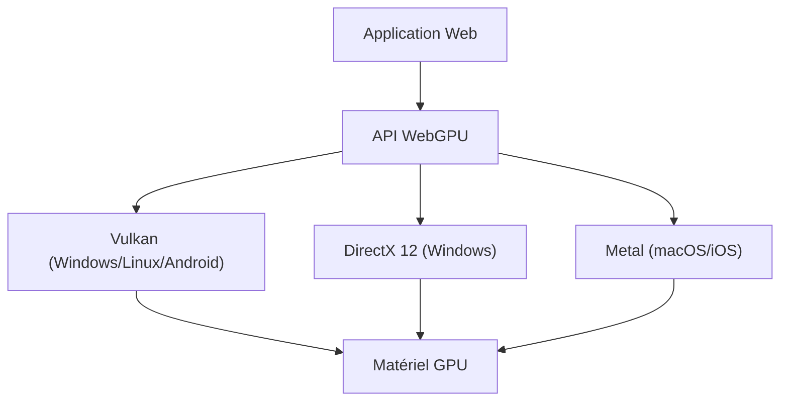

Les technologies permettant d'afficher des graphiques 3D riches et d'effectuer des calculs parallèles avancés sur les navigateurs web ont connu une évolution remarquable au cours de la dernière décennie. Au cœur de cette évolution se trouvait WebGL, mais nous sommes actuellement au milieu d'un changement de paradigme majeur avec l'arrivée de "WebGPU". Dans cet article, nous explorerons en profondeur l'histoire et les limites de WebGL, et comment WebGPU libère la véritable puissance des GPU modernes dans les navigateurs, du point de vue de l'architecture et de la philosophie de conception.

## 1. Les réalisations de WebGL et l'apparition de ses limites

Apparu en 2011, WebGL a révolutionné le web en apportant des graphiques 3D accélérés par le matériel aux navigateurs sans aucun plugin. Il est basé sur "OpenGL ES", conçu pour les appareils mobiles et embarqués.

### Surcharge due à une machine à états globale
Le plus grand défi de WebGL (et d'OpenGL) est que son architecture est conçue comme une "machine à états globale massive". Lors du dessin, les développeurs émettent des appels de dessin (draw calls) tout en modifiant individuellement l'état actuel (textures liées, programmes de shaders, modes de fusion, etc.).

```javascript
// Changements d'état et dessin typiques de WebGL
gl.useProgram(program);
gl.bindBuffer(gl.ARRAY_BUFFER, positionBuffer);
gl.enableVertexAttribArray(positionLocation);
gl.vertexAttribPointer(positionLocation, 3, gl.FLOAT, false, 0, 0);
gl.drawArrays(gl.TRIANGLES, 0, 3);
```

Bien que cette approche semble intuitive, elle crée un goulot d'étranglement fatal dans les environnements CPU multicœurs modernes. Les changements d'état s'accompagnent d'une validation lourde sur le CPU. Ainsi, plus le nombre d'appels de dessin augmente, plus le CPU devient un goulot d'étranglement dans le traitement du pilote graphique, laissant le GPU inactif (en attente). C'est ce qu'on appelle être "limité par le CPU" (CPU bound).

### Les limites du modèle mono-thread
De plus, WebGL fonctionne intrinsèquement sur un seul thread. Bien que des astuces utilisant les Web Workers pour traiter sur d'autres threads (comme OffscreenCanvas) aient été ajoutées plus tard, la conception de l'API elle-même ne suppose pas la construction de commandes en multi-thread. Il était donc très difficile de répartir la préparation du dessin de scènes complexes sur plusieurs cœurs de CPU.

## 2. L'architecture des GPU modernes et la naissance de WebGPU

Au milieu des années 2010, pour combler le fossé entre l'évolution du matériel et les API, de nouvelles API graphiques sont apparues les unes après les autres dans le monde natif : "Metal" d'Apple, "DirectX 12" de Microsoft et "Vulkan" du Khronos Group. Appelées "API graphiques modernes", elles visent à réduire au minimum la surcharge du pilote et à envoyer efficacement des commandes depuis les CPU multicœurs vers le GPU.

WebGPU a été conçu pour introduire la philosophie de ces API modernes dans l'environnement de bac à sable (sandbox) sécurisé du web. Ce n'est pas un simple wrapper d'une API native spécifique, mais une standardisation pour le web qui intègre le plus grand dénominateur commun des fonctionnalités de Vulkan, Metal et DirectX 12.



## 3. L'innovation de WebGPU : Objets de pipeline et tampons de commandes

Voyons les mécanismes spécifiques par lesquels WebGPU résout la surcharge de WebGL.

### Pré-compilation du Render Pipeline
Dans WebGPU, au lieu de modifier finement l'état juste avant de dessiner comme dans WebGL, on le définit à l'avance sous forme d'un "état de pipeline" (Pipeline State Object : PSO). Le code des shaders, la disposition des sommets (vertex layout) et les paramètres de fusion (blend settings) sont regroupés en un seul objet immuable.

```javascript
// Création d'un pipeline WebGPU (pseudo-code)
const pipeline = device.createRenderPipeline({
  layout: 'auto',
  vertex: {
    module: vertexShaderModule,
    entryPoint: 'main',
    buffers: [vertexLayout]
  },
  fragment: {
    module: fragmentShaderModule,
    entryPoint: 'main',
    targets: [{ format: presentationFormat }]
  }
});
```

Ainsi, le pilote du GPU peut terminer la compilation des shaders et la validation de l'état avant même le début de la boucle de rendu. Dans la boucle de rendu, il suffit de lier (bind) le pipeline créé à l'avance, ce qui réduit considérablement la charge sur le CPU.

### Tampons de commandes et multithreading
WebGPU adopte le concept de "tampons de commandes" (command buffers). Au lieu d'envoyer directement les commandes de dessin au GPU, elles sont d'abord enregistrées (encodées) dans un tampon en mémoire, puis envoyées en lot à la file d'attente du GPU à la fin.

Le plus grand avantage de ce système est que l'enregistrement des commandes peut être effectué en parallèle par plusieurs threads Web Worker. Même pour des scènes complexes comme un vaste jeu en monde ouvert, les commandes de dessin pour le terrain, les personnages et les effets peuvent être construites en parallèle sur des cœurs séparés, pour finalement être combinées dans le thread principal et envoyées au GPU.

## 4. Compute Pipeline et libération du GPGPU

Le plus grand changement apporté par WebGPU est l'introduction du "Compute Pipeline" (pipeline de calcul), indépendant des graphiques (dessin).

Avec WebGL, le GPGPU (calcul général sur GPU) était effectué via des hacks, comme l'écriture de données dans des textures et le calcul dans les fragment shaders. Cependant, cela forçait le pipeline graphique à faire des calculs, rendant l'entrée/sortie des données inefficace et empêchant l'accès aux fonctionnalités avancées telles que la mémoire partagée du GPU (Shared Memory).

### Apprentissage automatique et simulation physique dans le navigateur
Les compute shaders de WebGPU sont conçus pour exécuter des tâches de calcul pures de manière massivement parallèle sur des milliers de cœurs GPU.

* **Accélération de l'inférence de l'apprentissage automatique** : Les bibliothèques comme TensorFlow.js prennent en charge le backend WebGPU, obtenant des performances plusieurs à des dizaines de fois supérieures à celles du backend WebGL. L'exécution de LLM (grands modèles de langage) ou l'analyse vidéo en temps réel dans le navigateur atteint un niveau de viabilité pratique.
* **Particules complexes et calculs physiques** : Des simulations impliquant des centaines de milliers de particules, la dynamique des fluides ou la simulation de tissus, qui dépasseraient la capacité du CPU, peuvent être entièrement réalisées sur le GPU, et leurs résultats peuvent être transmis directement au Render Pipeline pour le dessin. Comme il n'y a pas de transfert de données entre le CPU et le GPU (relecture de la VRAM vers la mémoire système), les performances sont incroyables.

## 5. WGSL : Un nouveau langage de shaders pour le web

Avec l'introduction de WebGPU, le langage de shaders a également été mis à jour de GLSL vers "WGSL (WebGPU Shading Language)". WGSL possède une syntaxe moderne similaire à Rust, avec un système de types plus strict et une sécurité accrue.

```wgsl
// Exemple d'un simple compute shader en WGSL
@group(0) @binding(0) var<storage, read_write> data: array<f32>;

@compute @workgroup_size(64)
fn main(@builtin(global_invocation_id) global_id: vec3<u32>) {
    let index = global_id.x;
    data[index] = data[index] * 2.0; // Calcul parallèle pour doubler chaque élément du tableau
}
```

WGSL est conçu pour être traduit de manière sûre et rapide lors de l'implémentation du navigateur vers le langage de shaders requis par l'API native backend, tel que SPIR-V (Vulkan), MSL (Metal) ou HLSL (DirectX).

## Conclusion : Un nouvel horizon pour la plateforme web

La transition de WebGL à WebGPU ne représente pas seulement une mise à jour d'API ; elle signifie que la plateforme web a acquis des capacités de calcul comparables à celles des applications natives. Libérés des contraintes de la machine à états globale, et dotés d'une gestion moderne du pipeline et de capacités de calcul généralistes, les navigateurs web du futur joueront un rôle en tant qu'environnements d'exécution pour des jeux 3D plus avancés, des outils créatifs professionnels et l'Edge AI.

Pour les développeurs, la courbe d'apprentissage peut être plus abrupte que pour WebGL, mais les avantages en termes de performances qui les attendent sont incommensurables. L'ère de WebGPU ne fait que commencer.
