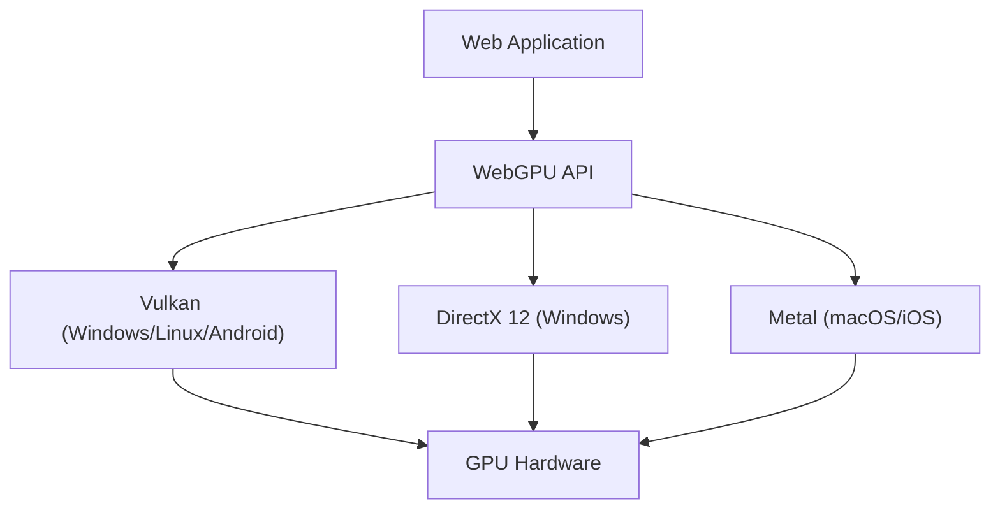

वेब ब्राउज़र पर रिच 3D ग्राफ़िक्स और उन्नत समानांतर गणना (parallel computing) प्राप्त करने की तकनीक ने पिछले दशक में उल्लेखनीय रूप से विकास किया है। इसके केंद्र में WebGL था, लेकिन वर्तमान में, हम एक बड़े प्रतिमान बदलाव (paradigm shift) के बीच में हैं। वह है "WebGPU" का आगमन। इस लेख में, हम WebGL के इतिहास और सीमाओं, और वास्तुकला और डिज़ाइन दर्शन के दृष्टिकोण से WebGPU कैसे आधुनिक GPU की वास्तविक शक्ति को ब्राउज़र में लाता है, इसका गहराई से पता लगाएंगे।

## 1. WebGL की उपलब्धियां और उभरती सीमाएं

2011 में पेश किए गए WebGL ने ब्राउज़र में प्लग-इन के बिना हार्डवेयर-त्वरित 3D ग्राफ़िक्स लाकर एक क्रांति ला दी। यह "OpenGL ES" पर आधारित है, जिसे मोबाइल और एम्बेडेड डिवाइस के लिए डिज़ाइन किया गया था।

### विशाल स्टेट मशीन के कारण ओवरहेड
WebGL (और OpenGL) के साथ सबसे बड़ी समस्या यह है कि इसकी वास्तुकला को "विशाल ग्लोबल स्टेट मशीन" के रूप में डिज़ाइन किया गया है। ड्राइंग करते समय, डेवलपर्स वर्तमान स्थिति (बाउंड टेक्सचर, शेडर प्रोग्राम, ब्लेंड मोड आदि) को एक-एक करके बदलते हुए ड्रॉ कॉल (ड्राइंग कमांड) जारी करते हैं।

```javascript
// WebGL का विशिष्ट स्टेट परिवर्तन और ड्राइंग
gl.useProgram(program);
gl.bindBuffer(gl.ARRAY_BUFFER, positionBuffer);
gl.enableVertexAttribArray(positionLocation);
gl.vertexAttribPointer(positionLocation, 3, gl.FLOAT, false, 0, 0);
gl.drawArrays(gl.TRIANGLES, 0, 3);
```

यह दृष्टिकोण पहली नज़र में सहज लग सकता है, लेकिन आधुनिक मल्टी-कोर CPU वातावरण में एक घातक बॉटलनेक बनाता है। स्टेट परिवर्तन में CPU पर भारी मान्यता (validation) शामिल होती है, इसलिए जितने अधिक ड्रॉ कॉल होते हैं, CPU ग्राफ़िक्स ड्राइवर के प्रसंस्करण के लिए उतना ही बड़ा बॉटलनेक बन जाता है, और GPU निष्क्रिय (प्रतीक्षा) अवस्था में चला जाता है। इसे "CPU बाउंड" कहा जाता है।

### सिंगल-थ्रेड मॉडल की सीमाएं
इसके अलावा, WebGL मूल रूप से सिंगल थ्रेड पर काम करता है। हालांकि Web Workers का उपयोग करके अलग थ्रेड में प्रोसेस करने के तरीके (जैसे OffscreenCanvas) बाद में जोड़े गए, लेकिन API का डिज़ाइन स्वयं मल्टी-थ्रेडेड कमांड निर्माण को नहीं मानता है, जिससे कई CPU कोर में जटिल दृश्य चित्र की तैयारी को वितरित करना बहुत मुश्किल हो गया।

## 2. आधुनिक GPU आर्किटेक्चर और WebGPU का जन्म

2010 के दशक के मध्य में, हार्डवेयर विकास और API के बीच की खाई को पाटने के लिए, नेटिव दुनिया में एक के बाद एक नए ग्राफ़िक्स API उभरे। Apple का "Metal", Microsoft का "DirectX 12", और Khronos Group का "Vulkan"। इन्हें "आधुनिक ग्राफ़िक्स API" कहा जाता है और इनका उद्देश्य ड्राइवर ओवरहेड को कम करना और मल्टी-कोर CPU से GPU में कमांड को कुशलतापूर्वक भेजना है।

WebGPU को इन आधुनिक APIs के दर्शन को वेब के सुरक्षित सैंडबॉक्स वातावरण में लाने के लिए डिज़ाइन किया गया था। किसी विशिष्ट नेटिव API का केवल एक रैपर होने के बजाय, इसे Vulkan, Metal और DirectX 12 की सबसे सामान्य विशेषताओं को शामिल करते हुए वेब के लिए मानकीकृत किया जा रहा है।



## 3. WebGPU का नवाचार: पाइपलाइन ऑब्जेक्ट्स और कमांड बफ़र्स

आइए विशिष्ट तंत्र पर एक नज़र डालें कि कैसे WebGPU, WebGL के ओवरहेड को हल करता है।

### Render Pipeline का प्री-कंपाइलेशन
WebGPU में, ड्राइंग से ठीक पहले स्टेट को बारीक रूप से बदलने के बजाय जैसा कि WebGL में होता है, इसे "पाइपलाइन स्टेट ऑब्जेक्ट (PSO)" के रूप में पहले से परिभाषित किया जाता है। शेडर कोड, वर्टेक्स लेआउट और ब्लेंड सेटिंग्स सभी को एक अपरिवर्तनीय ऑब्जेक्ट में जोड़ा जाता है।

```javascript
// WebGPU पाइपलाइन निर्माण (स्यूडो कोड)
const pipeline = device.createRenderPipeline({
  layout: 'auto',
  vertex: {
    module: vertexShaderModule,
    entryPoint: 'main',
    buffers: [vertexLayout]
  },
  fragment: {
    module: fragmentShaderModule,
    entryPoint: 'main',
    targets: [{ format: presentationFormat }]
  }
});
```

यह GPU ड्राइवर को ड्राइंग लूप शुरू होने से पहले शेडर संकलन (compilation) और स्टेट मान्यता (validation) पूरा करने की अनुमति देता है। ड्राइंग लूप के भीतर, आपको केवल पहले से बनाई गई पाइपलाइन को बाइंड करने की आवश्यकता है, जो CPU पर लोड को काफी कम कर देता है।

### कमांड बफ़र और मल्टी-थ्रेडिंग
WebGPU "कमांड बफ़र" की अवधारणा को अपनाता है। GPU को सीधे ड्राइंग कमांड भेजने के बजाय, कमांड को अस्थायी रूप से मेमोरी में बफ़र में रिकॉर्ड (एनकोड) किया जाता है, और अंत में उन्हें एक साथ GPU कतार में भेजा जाता है।

इस तंत्र का सबसे बड़ा लाभ यह है कि कमांड रिकॉर्डिंग समानांतर में कई Web Worker थ्रेड्स पर की जा सकती है। यहां तक कि एक विस्तृत ओपन-वर्ल्ड गेम जैसे जटिल दृश्य के लिए भी, इलाके, पात्रों और प्रभावों के लिए ड्राइंग कमांड को समानांतर में अलग-अलग कोर पर बनाया जा सकता है, और अंततः मुख्य थ्रेड पर संयुक्त होकर GPU को भेजा जा सकता है।

## 4. Compute Pipeline और GPGPU की मुक्ति

WebGPU द्वारा लाया गया सबसे बड़ा गेम-चेंजर ग्राफ़िक्स (ड्राइंग) से स्वतंत्र "Compute Pipeline" की शुरूआत है।

WebGL में, GPGPU (GPU का उपयोग करके सामान्य प्रयोजन कंप्यूटिंग) एक हैक पद्धति के माध्यम से किया गया था जिसमें टेक्सचर में डेटा लिखा जाता था और गणना फ्रैगमेंट शेडर के साथ की जाती थी। हालांकि, यह केवल गणना के लिए ग्राफ़िक्स पाइपलाइन को बाध्य करने का एक तरीका था, डेटा इनपुट और आउटपुट अक्षम थे, और GPU की साझा मेमोरी (Shared Memory) जैसी उन्नत सुविधाओं तक नहीं पहुंचा जा सकता था।

### ब्राउज़र पर मशीन लर्निंग और भौतिकी सिमुलेशन
WebGPU के कंप्यूट शेडर को GPU के हजारों कोर पर शुद्ध कम्प्यूटेशनल कार्यों को बड़े पैमाने पर समानांतर में निष्पादित करने के लिए डिज़ाइन किया गया है।

* **मशीन लर्निंग इनफेरेंस का त्वरण**: TensorFlow.js जैसी लाइब्रेरी WebGPU बैकएंड का समर्थन करती हैं, जो WebGL बैकएंड की तुलना में कई गुना से लेकर दसियों गुना तक बेहतर प्रदर्शन प्राप्त करती हैं। ब्राउज़र में चलने वाले LLM (बड़े भाषा मॉडल) और रियल-टाइम वीडियो विश्लेषण व्यावहारिक स्तर पर बन जाते हैं।
* **जटिल कण (Particles) और भौतिकी गणना**: सैकड़ों-हजारों कण सिमुलेशन, द्रव गतिशीलता, कपड़े के सिमुलेशन आदि जिन्हें CPU द्वारा नियंत्रित नहीं किया जा सकता है, GPU पर पूरे किए जा सकते हैं, और परिणाम सीधे ड्राइंग के लिए Render Pipeline में पास किए जा सकते हैं। CPU और GPU के बीच डेटा ट्रांसफर (VRAM से सिस्टम मेमोरी में रीडबैक) नहीं होता है, इसलिए यह अद्भुत प्रदर्शन प्रदान करता है।

## 5. WGSL: वेब के लिए एक नई शेडर भाषा

WebGPU की शुरूआत के साथ, शेडर भाषा को भी GLSL से "WGSL (WebGPU Shading Language)" में अपडेट किया गया। WGSL में Rust के समान एक आधुनिक सिंटैक्स है, और एक अधिक सख्त प्रकार की प्रणाली और सुरक्षा प्रदान करता है।

```wgsl
// WGSL का उपयोग करके एक सरल कंप्यूट शेडर का उदाहरण
@group(0) @binding(0) var<storage, read_write> data: array<f32>;

@compute @workgroup_size(64)
fn main(@builtin(global_invocation_id) global_id: vec3<u32>) {
    let index = global_id.x;
    data[index] = data[index] * 2.0; // सरणी के प्रत्येक तत्व को दोगुना करने के लिए समानांतर गणना
}
```

WGSL को सुरक्षित और तेजी से बैकएंड के नेटिव API द्वारा आवश्यक शेडर भाषाओं, जैसे Vulkan के SPIR-V, Metal के MSL, और DirectX के HLSL में ब्राउज़र कार्यान्वयन के भीतर परिवर्तित करने के लिए डिज़ाइन किया गया है।

## निष्कर्ष: वेब प्लेटफॉर्म का एक नया क्षितिज

WebGL से WebGPU में संक्रमण केवल एक API अपडेट नहीं है, इसका मतलब है कि वेब प्लेटफॉर्म ने नेटिव एप्लिकेशन के बराबर कम्प्यूटेशनल शक्ति प्राप्त कर ली है। विशाल स्टेट मशीन के अभिशाप से मुक्त होकर, आधुनिक पाइपलाइन प्रबंधन और सामान्य-प्रयोजन कंप्यूटिंग क्षमताओं को प्राप्त करके, भविष्य के वेब ब्राउज़र अधिक उन्नत 3D गेम, पेशेवर रचनात्मक टूल और एज AI निष्पादन वातावरण के रूप में भूमिका निभाएंगे।

डेवलपर्स के लिए सीखने की अवस्था WebGL की तुलना में अधिक तीव्र हो सकती है, लेकिन इसके आगे प्रदर्शन लाभ अथाह हैं। WebGPU का युग अभी शुरू हुआ है।
