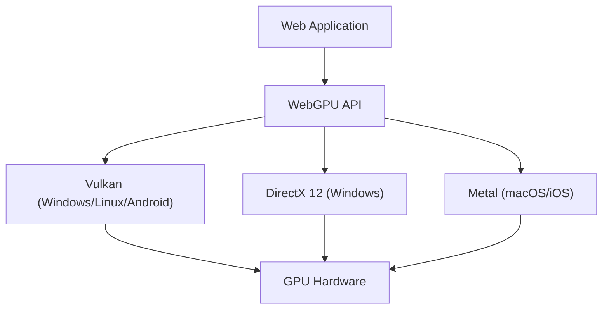

Teknologi untuk mewujudkan grafis 3D yang kaya dan komputasi paralel tingkat lanjut di browser web telah mengalami evolusi luar biasa selama belasan tahun terakhir. Di pusat perkembangan tersebut adalah WebGL, tetapi saat ini kita berada di tengah pergeseran paradigma besar. Itulah kemunculan "WebGPU". Dalam artikel ini, kita akan menggali lebih dalam tentang sejarah dan keterbatasan WebGL, serta bagaimana WebGPU melepaskan kekuatan sebenarnya dari GPU modern ke dalam browser, dari perspektif arsitektur dan filosofi desain.

## 1. Pencapaian WebGL dan Keterbatasan yang Mulai Terlihat

WebGL, yang diluncurkan pada tahun 2011, memicu revolusi dengan membawa grafis 3D yang diakselerasi perangkat keras ke browser tanpa memerlukan plugin. Berbasis pada "OpenGL ES", yang dirancang untuk perangkat seluler dan sistem tertanam.

### Overhead Akibat State Machine Raksasa
Tantangan terbesar dari WebGL (dan OpenGL) adalah arsitekturnya yang dirancang sebagai "global state machine raksasa". Saat melakukan rendering, pengembang harus menerbitkan draw call (perintah menggambar) sambil terus-menerus mengubah state saat ini (seperti tekstur yang diikat, program shader, mode blend, dll.).

```javascript
// Contoh perubahan state dan rendering khas di WebGL
gl.useProgram(program);
gl.bindBuffer(gl.ARRAY_BUFFER, positionBuffer);
gl.enableVertexAttribArray(positionLocation);
gl.vertexAttribPointer(positionLocation, 3, gl.FLOAT, false, 0, 0);
gl.drawArrays(gl.TRIANGLES, 0, 3);
```

Pendekatan ini sekilas tampak intuitif, tetapi pada lingkungan CPU multi-core modern, hal ini menciptakan bottleneck yang fatal. Perubahan state melibatkan validasi yang berat di CPU, sehingga semakin banyak draw call yang ada, CPU menjadi bottleneck dalam memproses driver grafis, dan GPU akan berakhir dalam kondisi idle (menunggu). Ini disebut "CPU bound".

### Keterbatasan Model Single-Thread
Lebih jauh lagi, WebGL pada dasarnya beroperasi pada satu thread (single-threaded). Meskipun ada berbagai upaya yang ditambahkan kemudian seperti menggunakan Web Worker untuk melakukan pemrosesan di thread terpisah (misalnya OffscreenCanvas), desain API itu sendiri tidak mengasumsikan penyusunan perintah dengan multi-threading, sehingga sangat sulit untuk mendistribusikan persiapan rendering adegan yang kompleks ke beberapa inti CPU.

## 2. Arsitektur GPU Modern dan Kelahiran WebGPU

Pada pertengahan 2010-an, untuk menjembatani kesenjangan antara evolusi perangkat keras dan API, API grafis baru bermunculan satu demi satu di dunia native. Di antaranya adalah "Metal" dari Apple, "DirectX 12" dari Microsoft, dan "Vulkan" dari Khronos Group. Ini disebut "API Grafis Modern", yang bertujuan meminimalkan overhead driver dan mengirimkan perintah ke GPU secara efisien dari CPU multi-core.

WebGPU dirancang untuk membawa filosofi API modern ini ke dalam lingkungan sandbox web yang aman. Alih-alih hanya sekadar pembungkus (wrapper) API native tertentu, WebGPU distandarisasi untuk web dengan mengadopsi fungsi dasar (greatest common divisor) dari Vulkan, Metal, dan DirectX 12.



## 3. Inovasi WebGPU: Objek Pipeline dan Command Buffer

Mari kita lihat mekanisme spesifik tentang bagaimana WebGPU mengatasi overhead WebGL.

### Pra-kompilasi Render Pipeline
Di WebGPU, daripada mengubah state secara rinci tepat sebelum proses rendering seperti pada WebGL, state tersebut didefinisikan sebelumnya sebagai "Pipeline State Object (PSO)". Kode shader, tata letak vertex, pengaturan blend, dan lainnya digabungkan ke dalam satu objek yang tidak dapat diubah (immutable).

```javascript
// Pembuatan pipeline di WebGPU (kode semu)
const pipeline = device.createRenderPipeline({
  layout: 'auto',
  vertex: {
    module: vertexShaderModule,
    entryPoint: 'main',
    buffers: [vertexLayout]
  },
  fragment: {
    module: fragmentShaderModule,
    entryPoint: 'main',
    targets: [{ format: presentationFormat }]
  }
});
```

Dengan ini, driver GPU dapat menyelesaikan kompilasi shader dan validasi state sebelum loop render dimulai. Di dalam loop rendering, CPU hanya perlu mengikat (bind) pipeline yang telah dibuat sebelumnya, sehingga beban CPU berkurang secara drastis.

### Command Buffer dan Multi-Threading
WebGPU mengadopsi konsep "Command Buffer". Daripada mengirimkan perintah gambar langsung ke GPU, perintah tersebut pertama-tama dicatat (di-encode) ke dalam buffer memori, dan terakhir dikirim sekaligus ke antrean (queue) GPU.

Keuntungan terbesar dari mekanisme ini adalah pencatatan perintah dapat dilakukan secara paralel menggunakan beberapa thread Web Worker. Bahkan dalam adegan kompleks seperti game open-world yang luas, perintah rendering untuk medan, karakter, dan efek dapat disusun secara bersamaan di core yang berbeda dan pada akhirnya digabungkan di main thread untuk dikirim ke GPU.

## 4. Compute Pipeline dan Pembebasan GPGPU

Pencapaian terbesar yang dibawa oleh WebGPU adalah pengenalan "Compute Pipeline" yang independen dari grafis (rendering).

Di WebGL, GPGPU (General-Purpose computing on Graphics Processing Units) dilakukan melalui trik semacam menulis data ke tekstur dan menghitungnya menggunakan fragment shader. Namun, ini hanyalah penyalahgunaan pipeline grafis untuk komputasi; input/output datanya tidak efisien dan tidak bisa mengakses fitur lanjutan seperti memori bersama (Shared Memory) yang dimiliki GPU.

### Machine Learning dan Simulasi Fisika di Browser
Compute shader pada WebGPU dirancang murni untuk menjalankan tugas komputasi secara paralel masif di ribuan core GPU.

* **Akselerasi Inferensi Machine Learning**: Pustaka seperti TensorFlow.js telah mendukung backend WebGPU, mencapai peningkatan performa beberapa hingga puluhan kali lipat dibandingkan dengan backend WebGL. LLM (Large Language Model) atau analisis video real-time yang berjalan di browser sekarang menjadi praktis dan realistis.
* **Partikel Kompleks dan Komputasi Fisika**: Simulasi ratusan ribu partikel yang tidak dapat ditangani CPU, serta dinamika fluida, simulasi kain, dll., dapat diselesaikan di dalam GPU, dan hasilnya langsung diteruskan ke Render Pipeline untuk digambar. Ini menghasilkan kinerja luar biasa karena menghindari transfer data antara CPU dan GPU (pembacaan kembali dari VRAM ke memori sistem).

## 5. WGSL: Bahasa Shader Baru untuk Web

Seiring dengan pengenalan WebGPU, bahasa shader juga disegarkan dari GLSL menjadi "WGSL (WebGPU Shading Language)". WGSL memiliki sintaks modern yang mirip dengan Rust, dengan sistem tipe dan keamanan yang lebih ketat.

```wgsl
// Contoh compute shader sederhana menggunakan WGSL
@group(0) @binding(0) var<storage, read_write> data: array<f32>;

@compute @workgroup_size(64)
fn main(@builtin(global_invocation_id) global_id: vec3<u32>) {
    let index = global_id.x;
    data[index] = data[index] * 2.0; // Komputasi paralel yang mengalikan setiap elemen array dengan 2
}
```

Dalam implementasi browser, WGSL dirancang agar dapat dikonversi dengan aman dan cepat ke bahasa shader yang diperlukan oleh API native backend, seperti SPIR-V dari Vulkan, MSL dari Metal, dan HLSL dari DirectX.

## Kesimpulan: Horizon Baru untuk Platform Web

Transisi dari WebGL ke WebGPU bukanlah sekadar pembaruan API, melainkan menandakan bahwa platform web telah memperoleh kemampuan komputasi yang setara dengan aplikasi native. Dengan terbebas dari batasan state machine raksasa dan mendapatkan manajemen pipeline modern serta kemampuan komputasi tujuan umum, browser web masa depan akan mengambil peran sebagai lingkungan runtime untuk game 3D tingkat lanjut, alat kreatif profesional, dan Edge AI.

Meskipun kurva pembelajarannya mungkin lebih curam bagi pengembang dibandingkan WebGL, manfaat kinerja yang didapat tidak terukur. Era WebGPU baru saja dimulai.
