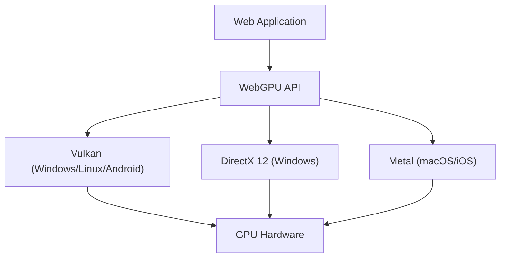

웹 브라우저 상에서 풍부한 3D 그래픽스나 고도의 병렬 계산을 구현하기 위한 기술은 지난 십여 년에 걸쳐 눈부신 진화를 이루어왔습니다. 그 중심에 있던 것이 WebGL입니다만, 현재 우리는 큰 패러다임 시프트의 한가운데에 있습니다. 그것이 바로 'WebGPU'의 등장입니다. 본 기사에서는 WebGL의 역사와 한계, 그리고 WebGPU가 어떻게 모던 GPU의 진정한 힘을 브라우저에 해방시키는지를 아키텍처와 설계 사상의 관점에서 철저하게 파헤쳐봅니다.

## 1. WebGL의 공로와 드러난 한계

2011년에 등장한 WebGL은 브라우저에 플러그인 없이 하드웨어 가속을 활용한 3D 그래픽스를 가져다주었다는 혁명을 일으켰습니다. 기반이 되는 것은 모바일이나 임베디드 디바이스를 위해 설계된 'OpenGL ES'입니다.

### 거대한 상태 머신(State Machine)에 의한 오버헤드
WebGL(그리고 OpenGL)의 최대 과제는 그 아키텍처가 '거대한 글로벌 상태 머신'으로 설계되어 있다는 점에 있습니다. 렌더링을 할 때 개발자는 현재의 상태(바인딩된 텍스처, 셰이더 프로그램, 블렌드 모드 등)를 일일이 변경하면서 드로우 콜(렌더링 명령)을 발행합니다.

```javascript
// WebGL의 전형적인 상태 변경 및 렌더링
gl.useProgram(program);
gl.bindBuffer(gl.ARRAY_BUFFER, positionBuffer);
gl.enableVertexAttribArray(positionLocation);
gl.vertexAttribPointer(positionLocation, 3, gl.FLOAT, false, 0, 0);
gl.drawArrays(gl.TRIANGLES, 0, 3);
```

이 접근 방식은 언뜻 직관적이지만, 현대의 멀티 코어 CPU 환경에서는 치명적인 병목 현상을 낳습니다. 상태 변경은 CPU 상에서 무거운 유효성 검사(Validation)를 동반하기 때문에, 드로우 콜이 늘어날수록 CPU가 그래픽스 드라이버 처리에서 병목이 되고, GPU가 유휴 상태(대기 상태)가 되어버립니다. 이를 'CPU 바운드(CPU Bound)'라고 부릅니다.

### 싱글 스레드 모델의 한계
게다가 WebGL은 본질적으로 싱글 스레드로 동작합니다. Web Worker를 사용하여 별도의 스레드에서 처리를 수행하는 기법(OffscreenCanvas 등)도 나중에 추가되었지만, API 자체의 설계가 멀티 스레드에서의 명령 구축을 전제로 하고 있지 않기 때문에, 복잡한 씬의 렌더링 준비를 여러 CPU 코어에 분산시키는 것이 매우 어려웠습니다.

## 2. 모던 GPU 아키텍처와 WebGPU의 탄생

2010년대 중반, 하드웨어의 진화와 API의 괴리를 메우기 위해 네이티브 세계에서 새로운 그래픽스 API가 차례로 탄생했습니다. Apple의 'Metal', Microsoft의 'DirectX 12', 그리고 Khronos Group의 'Vulkan'입니다. 이들은 '모던 그래픽스 API'라고 불리며, 드라이버의 오버헤드를 극한까지 줄이고 멀티 코어 CPU에서 효율적으로 GPU에 명령을 보내는 것을 목적으로 합니다.

WebGPU는 이러한 모던 API의 사상을 웹의 안전한 샌드박스 환경으로 가져오기 위해 설계되었습니다. 특정 네이티브 API의 단순한 래퍼(Wrapper)가 아니라, Vulkan, Metal, DirectX 12의 최대 공약수적인 기능을 수용하면서 웹을 위한 표준화가 이루어졌습니다.



## 3. WebGPU의 혁신: 파이프라인 오브젝트와 커맨드 버퍼

WebGPU가 WebGL의 오버헤드를 어떻게 해결하고 있는지, 구체적인 메커니즘을 살펴보겠습니다.

### Render Pipeline의 사전 컴파일
WebGPU에서는 WebGL처럼 렌더링 직전에 상태를 세세하게 변경하는 것이 아니라, '파이프라인 상태(Pipeline State Object: PSO)'로서 사전에 정의합니다. 셰이더 코드, 정점 레이아웃, 블렌드 설정 등을 하나의 불변 객체로 묶는 것입니다.

```javascript
// WebGPU의 파이프라인 생성 (의사 코드)
const pipeline = device.createRenderPipeline({
  layout: 'auto',
  vertex: {
    module: vertexShaderModule,
    entryPoint: 'main',
    buffers: [vertexLayout]
  },
  fragment: {
    module: fragmentShaderModule,
    entryPoint: 'main',
    targets: [{ format: presentationFormat }]
  }
});
```

이로써 GPU 드라이버는 렌더링 루프가 시작되기 전에 셰이더 컴파일이나 상태의 유효성 검증을 완료할 수 있습니다. 렌더링 루프 내에서는 미리 생성한 파이프라인을 바인딩하기만 하면 되므로, CPU의 부하가 극적으로 낮아집니다.

### 커맨드 버퍼와 멀티 스레드
WebGPU는 '커맨드 버퍼(Command Buffer)'라는 개념을 채택하고 있습니다. 렌더링 명령을 직접 GPU에 보내는 것이 아니라, 일단 메모리 상의 버퍼에 명령을 기록(인코딩)하고, 마지막에 한꺼번에 GPU의 큐(Queue)로 전송합니다.

이 구조의 최대 장점은 명령 기록을 여러 Web Worker 스레드에서 병렬로 수행할 수 있다는 점입니다. 광활한 오픈 월드 게임과 같은 복잡한 씬에서도 지형, 캐릭터, 이펙트의 렌더링 명령을 별도의 코어에서 병행하여 구축하고, 최종적으로 메인 스레드에서 결합하여 GPU로 보낼 수 있게 됩니다.

## 4. Compute Pipeline과 GPGPU의 해방

WebGPU가 가져오는 가장 큰 게임 체인저는 그래픽스(렌더링)와는 독립적인 '컴퓨트 파이프라인(Compute Pipeline)'의 도입입니다.

WebGL에서도 텍스처에 데이터를 기록하고 프래그먼트 셰이더에서 계산을 수행하는 꼼수 같은 방법으로 GPGPU(GPU에 의한 범용 계산)를 수행하고 있었습니다. 하지만 이것은 어디까지나 그래픽스 파이프라인을 억지로 계산에 유용하는 것일 뿐이며, 데이터의 입출력이 비효율적이고 GPU가 가진 공유 메모리(Shared Memory) 등의 고급 기능에 접근할 수 없었습니다.

### 브라우저 상에서의 머신러닝과 물리 시뮬레이션
WebGPU의 컴퓨트 셰이더는 순수한 계산 작업을 GPU의 수천 개의 코어에서 초병렬로 실행하기 위해 설계되었습니다.

* **머신러닝 추론의 고속화**: TensorFlow.js 등의 라이브러리는 WebGPU 백엔드를 지원하고 있으며, WebGL 백엔드와 비교하여 수배에서 수십 배의 성능 향상을 달성하고 있습니다. 브라우저 상에서 동작하는 LLM(대규모 언어 모델)이나 실시간 영상 분석이 실용적인 수준이 됩니다.
* **복잡한 파티클과 물리 연산**: CPU로는 다 처리할 수 없는 수십만 개의 파티클 시뮬레이션이나 유체 역학, 옷감 시뮬레이션 등을 GPU 상에서 완결 짓고, 그 결과를 직접 Render Pipeline으로 전달하여 렌더링할 수 있습니다. CPU와 GPU 간의 데이터 전송(VRAM에서 시스템 메모리로의 리드백)이 발생하지 않기 때문에 경이로운 성능을 발휘합니다.

## 5. WGSL: 웹을 위한 새로운 셰이더 언어

WebGPU의 도입과 함께 셰이더 언어도 GLSL에서 'WGSL(WebGPU Shading Language)'로 쇄신되었습니다. WGSL은 Rust와 유사한 모던한 구문을 가지며, 더욱 엄격한 타입 시스템과 안전성을 갖추고 있습니다.

```wgsl
// WGSL을 이용한 간단한 컴퓨트 셰이더의 예
@group(0) @binding(0) var<storage, read_write> data: array<f32>;

@compute @workgroup_size(64)
fn main(@builtin(global_invocation_id) global_id: vec3<u32>) {
    let index = global_id.x;
    data[index] = data[index] * 2.0; // 배열의 각 요소를 2배로 만드는 병렬 계산
}
```

WGSL은 브라우저 구현에 있어서 Vulkan의 SPIR-V, Metal의 MSL, DirectX의 HLSL 등 백엔드의 네이티브 API가 요구하는 셰이더 언어로 안전하고 빠르게 변환되도록 설계되어 있습니다.

## 요약: 웹 플랫폼의 새로운 지평

WebGL에서 WebGPU로의 전환은 단순한 API의 업데이트가 아니라, 웹이라는 플랫폼이 네이티브 애플리케이션과 손색없는 연산 능력을 손에 넣었음을 의미합니다. 거대한 상태 머신의 주술에서 해방되어 모던한 파이프라인 관리와 범용 계산 능력을 얻음으로써, 향후 웹 브라우저는 더욱 고도화된 3D 게임, 전문가용 크리에이티브 툴, 그리고 엣지 AI의 실행 환경으로서의 역할을 담당하게 될 것입니다.

개발자에게 있어 학습 곡선은 WebGL보다 가파를 수 있지만, 그 끝에 있는 성능의 혜택은 헤아릴 수 없습니다. WebGPU의 시대는 이제 막 시작되었습니다.
