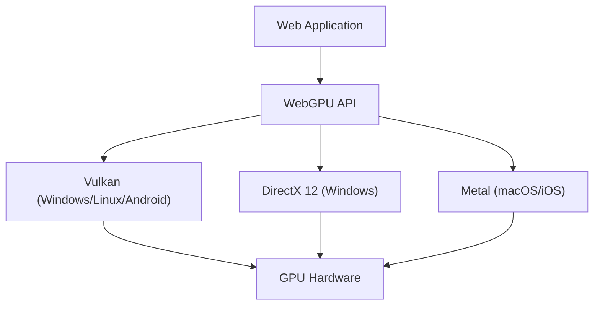

ウェブブラウザ上でリッチな3Dグラフィックスや高度な並列計算を実現するための技術は、過去十数年にわたり目覚ましい進化を遂げてきました。その中心にあったのがWebGLですが、現在、私たちは大きなパラダイムシフトの最中にあります。それが「WebGPU」の登場です。本記事では、WebGLの歴史と限界、そしてWebGPUがどのようにしてモダンGPUの真の力をブラウザに解き放つのかを、アーキテクチャや設計思想の観点から徹底的に掘り下げます。

## 1. WebGLの功績と、見えてきた限界

2011年に登場したWebGLは、ブラウザにプラグインなしでハードウェアアクセラレーションを活用した3Dグラフィックスをもたらすという革命を起こしました。ベースとなっているのは、モバイルや組み込みデバイス向けに設計された「OpenGL ES」です。

### 巨大なステートマシンによるオーバーヘッド
WebGL（およびOpenGL）の最大の課題は、そのアーキテクチャが「巨大なグローバルステートマシン」として設計されている点にあります。描画を行う際、開発者は現在のステート（バインドされているテクスチャ、シェーダープログラム、ブレンドモードなど）を逐一変更しながらドローコール（描画命令）を発行します。

```javascript
// WebGLの典型的なステート変更と描画
gl.useProgram(program);
gl.bindBuffer(gl.ARRAY_BUFFER, positionBuffer);
gl.enableVertexAttribArray(positionLocation);
gl.vertexAttribPointer(positionLocation, 3, gl.FLOAT, false, 0, 0);
gl.drawArrays(gl.TRIANGLES, 0, 3);
```

このアプローチは一見直感的ですが、現代のマルチコアCPU環境においては致命的なボトルネックを生み出します。ステートの変更はCPU上で重いバリデーション（検証）を伴うため、ドローコールが増えるほどCPUがグラフィックスドライバの処理でボトルネックとなり、GPUがアイドル状態（待ち状態）になってしまうのです。これを「CPUバウンド」と呼びます。

### シングルスレッドモデルの限界
さらに、WebGLは本質的にシングルスレッドで動作します。Web Workerを使用して別スレッドで処理を行う工夫（OffscreenCanvasなど）も後から追加されましたが、API自体の設計がマルチスレッドでのコマンド構築を前提としていないため、複雑なシーンの描画準備を複数のCPUコアに分散させることが非常に困難でした。

## 2. モダンGPUアーキテクチャとWebGPUの誕生

2010年代半ば、ハードウェアの進化とAPIの乖離を埋めるため、ネイティブの世界で新たなグラフィックスAPIが次々と誕生しました。Appleの「Metal」、Microsoftの「DirectX 12」、そしてKhronos Groupの「Vulkan」です。これらは「モダングラフィックスAPI」と呼ばれ、ドライバのオーバーヘッドを極限まで減らし、マルチコアCPUから効率的にGPUへコマンドを送ることを目的としています。

WebGPUは、これらモダンAPIの思想をウェブの安全なサンドボックス環境に持ち込むために設計されました。特定のネイティブAPIの単なるラッパーではなく、Vulkan、Metal、DirectX 12の最大公約数的な機能を取り入れつつ、ウェブのための標準化が行われています。



## 3. WebGPUの革新：パイプラインオブジェクトとコマンドバッファ

WebGPUがWebGLのオーバーヘッドをどのように解決しているのか、具体的なメカニズムを見ていきましょう。

### Render Pipelineの事前コンパイル
WebGPUでは、WebGLのように描画の直前にステートを細かく変更するのではなく、「パイプライン状態（Pipeline State Object: PSO）」として事前に定義します。シェーダーコード、頂点レイアウト、ブレンド設定などを1つの不変なオブジェクトにまとめるのです。

```javascript
// WebGPUのパイプライン作成（擬似コード）
const pipeline = device.createRenderPipeline({
  layout: 'auto',
  vertex: {
    module: vertexShaderModule,
    entryPoint: 'main',
    buffers: [vertexLayout]
  },
  fragment: {
    module: fragmentShaderModule,
    entryPoint: 'main',
    targets: [{ format: presentationFormat }]
  }
});
```

これにより、GPUドライバは描画ループが始まる前にシェーダーのコンパイルやステートの妥当性検証を完了させることができます。描画ループ内では、あらかじめ作成したパイプラインをバインドするだけになり、CPUの負荷が劇的に低下します。

### コマンドバッファとマルチスレッド
WebGPUは「コマンドバッファ」という概念を採用しています。描画命令を直接GPUに送るのではなく、一旦メモリ上のバッファにコマンドを記録（エンコード）し、最後にまとめてGPUのキューに送信します。

この仕組みの最大の利点は、コマンドの記録を複数のWeb Workerスレッドで並列に行える点です。広大なオープンワールドゲームのような複雑なシーンでも、地形、キャラクター、エフェクトの描画コマンドを別々のコアで並行して構築し、最終的にメインスレッドで結合してGPUに送ることが可能になります。

## 4. Compute PipelineとGPGPUの解放

WebGPUがもたらす最大のゲームチェンジャーは、グラフィックス（描画）とは独立した「Compute Pipeline（コンピュートパイプライン）」の導入です。

WebGLでも、テクスチャにデータを書き込んでフラグメントシェーダーで計算を行うというハック的な手法でGPGPU（GPUによる汎用計算）が行われていました。しかし、これはあくまでグラフィックスパイプラインを無理やり計算に流用しているだけであり、データの入出力が非効率で、GPUの持つ共有メモリ（Shared Memory）などの高度な機能にアクセスできませんでした。

### ブラウザ上での機械学習と物理シミュレーション
WebGPUのコンピュートシェーダーは、純粋な計算タスクをGPUの何千ものコアで超並列に実行するために設計されています。

* **機械学習推論の高速化**: TensorFlow.jsなどのライブラリはWebGPUバックエンドをサポートしており、WebGLバックエンドと比較して数倍から数十倍のパフォーマンス向上を達成しています。ブラウザ上で動作するLLM（大規模言語モデル）やリアルタイムの映像解析が実用的なレベルになります。
* **複雑なパーティクルと物理演算**: CPUでは処理しきれない数十万のパーティクルシミュレーションや、流体力学、布のシミュレーションなどをGPU上で完結させ、その結果を直接Render Pipelineに渡して描画することができます。CPUとGPU間のデータ転送（VRAMからシステムメモリへのリードバック）が発生しないため、驚異的なパフォーマンスを発揮します。

## 5. WGSL: ウェブのための新しいシェーダー言語

WebGPUの導入に伴い、シェーダー言語もGLSLから「WGSL (WebGPU Shading Language)」へと刷新されました。WGSLはRustに似たモダンな構文を持ち、より厳密な型システムと安全性を備えています。

```wgsl
// WGSLによるシンプルなコンピュートシェーダーの例
@group(0) @binding(0) var<storage, read_write> data: array<f32>;

@compute @workgroup_size(64)
fn main(@builtin(global_invocation_id) global_id: vec3<u32>) {
    let index = global_id.x;
    data[index] = data[index] * 2.0; // 配列の各要素を2倍にする並列計算
}
```

WGSLは、ブラウザの実装において、VulkanのSPIR-V、MetalのMSL、DirectXのHLSLなど、バックエンドのネイティブAPIが要求するシェーダー言語に安全かつ高速に変換されるように設計されています。

## まとめ：ウェブプラットフォームの新たな地平

WebGLからWebGPUへの移行は、単なるAPIのアップデートではなく、ウェブというプラットフォームがネイティブアプリケーションと遜色のない演算能力を手に入れたことを意味します。巨大なステートマシンの呪縛から解放され、モダンなパイプライン管理と汎用計算の能力を得たことで、今後のウェブブラウザは、より高度な3Dゲーム、プロフェッショナルなクリエイティブツール、そしてエッジAIの実行環境としての役割を担っていくことでしょう。

開発者にとって学習曲線はWebGLよりも急かもしれませんが、その先にあるパフォーマンスの恩恵は計り知れません。WebGPUの時代は、まだ始まったばかりです。
