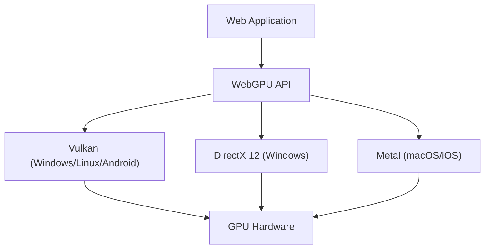

A tecnologia para realizar gráficos 3D ricos e computação paralela avançada em navegadores web passou por uma evolução notável nos últimos dez anos. No centro disso estava o WebGL, mas atualmente estamos no meio de uma grande mudança de paradigma. Essa é a chegada do "WebGPU". Neste artigo, exploraremos a fundo a história e as limitações do WebGL, e como o WebGPU libera o verdadeiro poder das GPUs modernas no navegador, a partir de uma perspectiva de arquitetura e filosofia de design.

## 1. As Conquistas do WebGL e Suas Limitações Visíveis

Lançado em 2011, o WebGL causou uma revolução ao trazer gráficos 3D acelerados por hardware para os navegadores sem a necessidade de plugins. É baseado no "OpenGL ES", projetado para dispositivos móveis e embarcados.

### O Sobrecusto (Overhead) de uma Máquina de Estado Gigante
O maior desafio do WebGL (e do OpenGL) reside no fato de sua arquitetura ser projetada como uma "máquina de estado global gigante". Ao realizar a renderização, os desenvolvedores emitem chamadas de desenho (draw calls) enquanto mudam os estados atuais um por um (texturas vinculadas, programas de shader, modos de mistura, etc.).

```javascript
// Mudança de estado típica e renderização no WebGL
gl.useProgram(program);
gl.bindBuffer(gl.ARRAY_BUFFER, positionBuffer);
gl.enableVertexAttribArray(positionLocation);
gl.vertexAttribPointer(positionLocation, 3, gl.FLOAT, false, 0, 0);
gl.drawArrays(gl.TRIANGLES, 0, 3);
```

Essa abordagem parece intuitiva à primeira vista, mas cria um gargalo fatal em ambientes modernos de CPU multi-core. Mudanças de estado envolvem validações pesadas na CPU, de modo que à medida que as chamadas de desenho aumentam, a CPU se torna o gargalo devido ao processamento dos drivers de gráficos, deixando a GPU ociosa (esperando). Isso é chamado de "CPU bound" (limitado pela CPU).

### As Limitações do Modelo Single-Thread
Além disso, o WebGL opera fundamentalmente em uma única thread. Soluções alternativas usando Web Workers para processamento em outras threads (como OffscreenCanvas) foram adicionadas posteriormente, mas como o design da própria API não pressupõe a construção de comandos em multithreading, tornou-se extremamente difícil distribuir a preparação da renderização de cenas complexas por vários núcleos da CPU.

## 2. A Arquitetura Moderna de GPU e o Nascimento do WebGPU

Em meados da década de 2010, novas APIs de gráficos nasceram sucessivamente no mundo nativo para preencher a lacuna entre a evolução do hardware e a API. Estas são o "Metal" da Apple, o "DirectX 12" da Microsoft e o "Vulkan" do Khronos Group. Estas são chamadas de "APIs de gráficos modernas" e visam minimizar o sobrecusto (overhead) dos drivers e enviar comandos de CPUs multi-core para a GPU de forma eficiente.

O WebGPU foi projetado para trazer a filosofia dessas APIs modernas para o ambiente seguro (sandbox) da web. Em vez de ser um mero wrapper de uma API nativa específica, ele incorpora o mínimo múltiplo comum de funcionalidades do Vulkan, Metal e DirectX 12, padronizando-as para a web.



## 3. A Inovação do WebGPU: Objetos de Pipeline e Buffers de Comando

Vamos dar uma olhada no mecanismo específico de como o WebGPU resolve o sobrecusto (overhead) do WebGL.

### Pré-compilação do Render Pipeline (Pipeline de Renderização)
No WebGPU, em vez de mudar o estado detalhadamente pouco antes da renderização como no WebGL, define-se com antecedência como um "Estado de Pipeline (Pipeline State Object: PSO)". O código do shader, o layout de vértices e as configurações de mistura são combinados em um único objeto imutável.

```javascript
// Criação de pipeline no WebGPU (pseudocódigo)
const pipeline = device.createRenderPipeline({
  layout: 'auto',
  vertex: {
    module: vertexShaderModule,
    entryPoint: 'main',
    buffers: [vertexLayout]
  },
  fragment: {
    module: fragmentShaderModule,
    entryPoint: 'main',
    targets: [{ format: presentationFormat }]
  }
});
```

Isso permite que o driver da GPU complete a compilação do shader e a validação do estado antes que o loop de renderização comece. Dentro do loop de renderização, ele apenas vincula o pipeline criado antecipadamente, reduzindo drasticamente a carga na CPU.

### Buffers de Comando e Multithreading
O WebGPU adota o conceito de "Buffer de Comando". Em vez de enviar comandos de desenho diretamente para a GPU, os comandos são primeiramente registrados (codificados) em um buffer na memória, para depois serem enviados em conjunto para a fila da GPU.

A maior vantagem desse mecanismo é que o registro de comandos pode ser feito paralelamente em múltiplas threads de Web Worker. Mesmo em cenas complexas, como jogos de mundo aberto imensos, os comandos de renderização para terreno, personagens e efeitos podem ser construídos paralelamente em diferentes núcleos e, finalmente, combinados na thread principal para serem enviados à GPU.

## 4. O Compute Pipeline e a Libertação do GPGPU

A maior revolução trazida pelo WebGPU é a introdução do "Compute Pipeline" (Pipeline de Computação), que é independente dos gráficos (renderização).

Mesmo no WebGL, o GPGPU (computação de propósito geral em GPUs) era realizado através de um método de "hack" onde dados eram escritos em texturas e calculados com shaders de fragmento (fragment shaders). No entanto, isso estava apenas forçando o uso do pipeline de gráficos para cálculos, a entrada e saída de dados eram ineficientes, e os recursos avançados da GPU, como a Memória Compartilhada (Shared Memory), não podiam ser acessados.

### Aprendizado de Máquina e Simulações Físicas no Navegador
Os shaders de computação do WebGPU são projetados para executar tarefas puramente computacionais de forma massivamente paralela em milhares de núcleos de GPU.

* **Aceleração da Inferência de Aprendizado de Máquina**: Bibliotecas como o TensorFlow.js suportam um backend WebGPU e conseguiram melhorias de desempenho de várias vezes a dezenas de vezes em comparação com o backend WebGL. A execução de LLMs (Grandes Modelos de Linguagem) e análise de vídeo em tempo real no navegador atingiram um nível prático.
* **Partículas Complexas e Cálculos Físicos**: Simulações de centenas de milhares de partículas que não podem ser processadas pela CPU, fluidodinâmica, simulações de tecido, etc., podem ser concluídas inteiramente na GPU, passando seus resultados diretamente para o Render Pipeline para desenhá-los. Como não há transferência de dados entre a CPU e a GPU (readback da VRAM para a memória do sistema), o desempenho é incrível.

## 5. WGSL: Uma Nova Linguagem de Shader para a Web

Junto com a introdução do WebGPU, a linguagem de shader também foi atualizada do GLSL para o "WGSL (WebGPU Shading Language)". O WGSL possui uma sintaxe moderna semelhante ao Rust, apresentando um sistema de tipos mais rigoroso e segurança.

```wgsl
// Exemplo de um shader de computação simples em WGSL
@group(0) @binding(0) var<storage, read_write> data: array<f32>;

@compute @workgroup_size(64)
fn main(@builtin(global_invocation_id) global_id: vec3<u32>) {
    let index = global_id.x;
    data[index] = data[index] * 2.0; // Cálculo paralelo que dobra cada elemento do array
}
```

O WGSL foi projetado para ser traduzido de forma segura e rápida na implementação do navegador para a linguagem de shader exigida pelas APIs nativas de backend, como SPIR-V do Vulkan, MSL do Metal e HLSL do DirectX.

## Conclusão: Um Novo Horizonte para a Plataforma Web

A transição do WebGL para o WebGPU não é apenas uma atualização de API, mas significa que a plataforma web obteve capacidades computacionais comparáveis às de aplicações nativas. Libertos da maldição da máquina de estado gigante e tendo ganhado gerenciamento moderno de pipeline e capacidades de computação geral, os navegadores web futuros desempenharão um papel como ambientes de execução para jogos 3D mais avançados, ferramentas criativas profissionais e Edge AI.

Para os desenvolvedores, a curva de aprendizado pode ser mais íngreme do que com o WebGL, mas os benefícios de desempenho futuros são imensuráveis. A era do WebGPU apenas começou.
