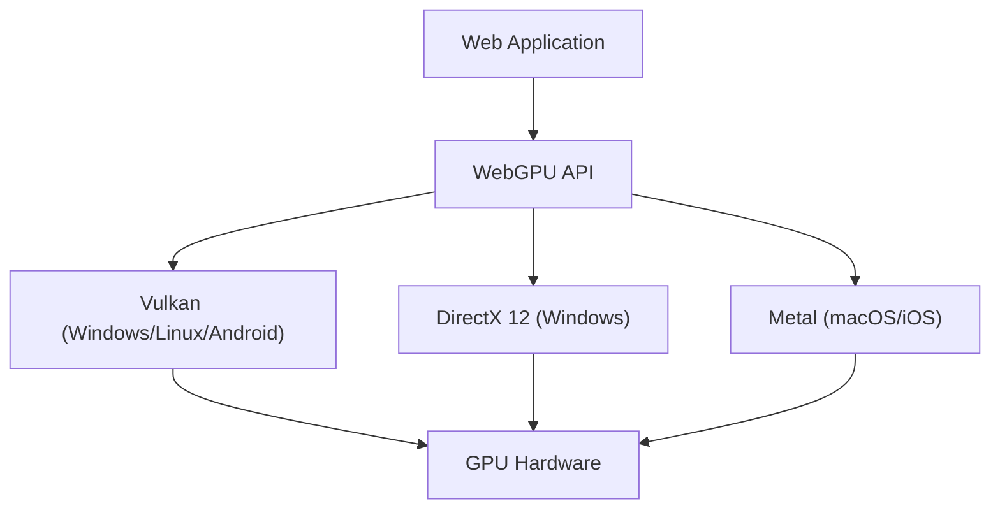

Технологии для создания богатой 3D-графики и сложных параллельных вычислений в веб-браузерах претерпели впечатляющую эволюцию за последние десять с лишним лет. В центре этого процесса находился WebGL, но сегодня мы переживаем масштабный сдвиг парадигмы, связанный с появлением «WebGPU». В этой статье мы подробно рассмотрим историю и ограничения WebGL, а также то, как WebGPU раскрывает истинную мощь современных видеокарт (GPU) в браузере с точки зрения архитектуры и философии проектирования.

## 1. Достижения WebGL и выявленные ограничения

Появившийся в 2011 году WebGL произвел революцию, обеспечив аппаратное ускорение 3D-графики в браузере без использования плагинов. В его основе лежит «OpenGL ES», разработанный для мобильных и встраиваемых устройств.

### Накладные расходы гигантской машины состояний
Самая большая проблема WebGL (как и OpenGL) заключается в том, что его архитектура спроектирована как «гигантская глобальная машина состояний». При отрисовке разработчик пошагово изменяет текущее состояние (привязанные текстуры, шейдерные программы, режимы наложения и т.д.) и вызывает команды отрисовки (draw calls).

```javascript
// Типичное изменение состояния и отрисовка в WebGL
gl.useProgram(program);
gl.bindBuffer(gl.ARRAY_BUFFER, positionBuffer);
gl.enableVertexAttribArray(positionLocation);
gl.vertexAttribPointer(positionLocation, 3, gl.FLOAT, false, 0, 0);
gl.drawArrays(gl.TRIANGLES, 0, 3);
```

На первый взгляд этот подход интуитивно понятен, но в современных многоядерных процессорных средах он создает фатальное «узкое горлышко». Изменение состояния сопровождается тяжелой валидацией (проверкой) на процессоре (CPU), поэтому по мере увеличения количества вызовов отрисовки CPU становится узким местом при обработке графическим драйвером, а GPU простаивает (находится в режиме ожидания). Это называется «ограничением по процессору» (CPU-bound).

### Ограничения однопоточной модели
Кроме того, WebGL по своей сути работает в одном потоке. И хотя позже были добавлены ухищрения для выполнения обработки в отдельных потоках с использованием Web Workers (например, OffscreenCanvas), сама архитектура API не была рассчитана на создание команд в многопоточном режиме, что делало крайне сложным распределение подготовки сложных сцен для отрисовки между несколькими ядрами CPU.

## 2. Современные архитектуры GPU и появление WebGPU

В середине 2010-х годов, чтобы сократить разрыв между развитием оборудования и API, в нативном мире один за другим появлялись новые графические интерфейсы: «Metal» от Apple, «DirectX 12» от Microsoft и «Vulkan» от Khronos Group. Они называются «современными графическими API» и нацелены на максимальное снижение накладных расходов драйверов и эффективную передачу команд от многоядерных процессоров к GPU.

WebGPU был спроектирован для того, чтобы перенести принципы этих современных API в безопасную изолированную среду («песочницу») веба. Это не просто оболочка для конкретного нативного API; он стандартизирован для веба, перенимая общие функциональные возможности Vulkan, Metal и DirectX 12.



## 3. Инновации WebGPU: объекты конвейера и буферы команд

Давайте разберемся в конкретных механизмах того, как WebGPU решает проблему накладных расходов WebGL.

### Предварительная компиляция Render Pipeline
В WebGPU вместо детального изменения состояний непосредственно перед отрисовкой, как в WebGL, они заранее определяются как «объект состояния конвейера» (Pipeline State Object, PSO). Шейдерный код, разметка вершин, настройки смешивания (blend) и прочее объединяются в один неизменяемый объект.

```javascript
// Создание конвейера WebGPU (псевдокод)
const pipeline = device.createRenderPipeline({
  layout: 'auto',
  vertex: {
    module: vertexShaderModule,
    entryPoint: 'main',
    buffers: [vertexLayout]
  },
  fragment: {
    module: fragmentShaderModule,
    entryPoint: 'main',
    targets: [{ format: presentationFormat }]
  }
});
```

Благодаря этому драйвер GPU может завершить компиляцию шейдеров и валидацию состояний еще до начала цикла отрисовки. В самом цикле отрисовки остается только привязать заранее созданный конвейер, что кардинально снижает нагрузку на CPU.

### Буферы команд и многопоточность
WebGPU использует концепцию «буферов команд». Вместо того чтобы напрямую отправлять команды отрисовки на GPU, они сначала записываются (кодируются) в буфер в памяти, а затем разом отправляются в очередь GPU.

Главное преимущество этого механизма в том, что запись команд может выполняться параллельно в нескольких потоках Web Worker. Даже в сложных сценах, таких как огромные игры с открытым миром, команды отрисовки ландшафта, персонажей и эффектов могут параллельно формироваться на разных ядрах, а затем объединяться в основном потоке для отправки на GPU.

## 4. Compute Pipeline и раскрытие потенциала GPGPU

Самый большой прорыв, который приносит WebGPU, — это внедрение «вычислительного конвейера» (Compute Pipeline), независимого от графики (отрисовки).

В WebGL также применялись методы GPGPU (вычисления общего назначения на GPU), но это делалось хакерским путем: запись данных в текстуры и выполнение вычислений с помощью фрагментных шейдеров. Однако это было лишь принудительным использованием графического конвейера для вычислений, ввод и вывод данных были неэффективными, а доступ к продвинутым функциям, таким как общая память (Shared Memory) GPU, отсутствовал.

### Машинное обучение и физические симуляции в браузере
Вычислительные шейдеры WebGPU созданы для сверхпараллельного выполнения чисто вычислительных задач на тысячах ядер GPU.

* **Ускорение вывода машинного обучения**: Библиотеки, такие как TensorFlow.js, поддерживают бэкенд WebGPU, достигая увеличения производительности от нескольких до десятков раз по сравнению с бэкендом WebGL. Запуск больших языковых моделей (LLM) и анализ видео в реальном времени в браузере становятся практически реализуемыми.
* **Сложные системы частиц и физические вычисления**: Симуляции сотен тысяч частиц, гидродинамика, симуляция тканей и другие задачи, с которыми не справляется CPU, могут быть полностью выполнены на GPU, а их результаты переданы напрямую в Render Pipeline для отрисовки. Отсутствие необходимости передачи данных между CPU и GPU (readback из VRAM в системную память) обеспечивает потрясающую производительность.

## 5. WGSL: новый шейдерный язык для веба

С внедрением WebGPU шейдерный язык также был обновлен с GLSL на «WGSL (WebGPU Shading Language)». WGSL имеет современный синтаксис, похожий на Rust, и обладает более строгой системой типов и повышенной безопасностью.

```wgsl
// Пример простого вычислительного шейдера на WGSL
@group(0) @binding(0) var<storage, read_write> data: array<f32>;

@compute @workgroup_size(64)
fn main(@builtin(global_invocation_id) global_id: vec3<u32>) {
    let index = global_id.x;
    data[index] = data[index] * 2.0; // Параллельное вычисление, удваивающее каждый элемент массива
}
```

WGSL разработан так, чтобы при реализации в браузере безопасно и быстро транслироваться в шейдерные языки, требуемые нативными API бэкенда, такие как SPIR-V (Vulkan), MSL (Metal) и HLSL (DirectX).

## Заключение: новые горизонты веб-платформы

Переход от WebGL к WebGPU — это не просто обновление API, это означает, что веб-платформа получила вычислительную мощность, не уступающую нативным приложениям. Освободившись от оков гигантской машины состояний и получив современное управление конвейером и возможности вычислений общего назначения, будущие веб-браузеры возьмут на себя роль среды для запуска еще более сложных 3D-игр, профессиональных творческих инструментов и краевого ИИ (Edge AI).

Для разработчиков кривая обучения может оказаться круче, чем у WebGL, но преимущества в производительности, которые ждут впереди, неизмеримы. Эра WebGPU только начинается.
